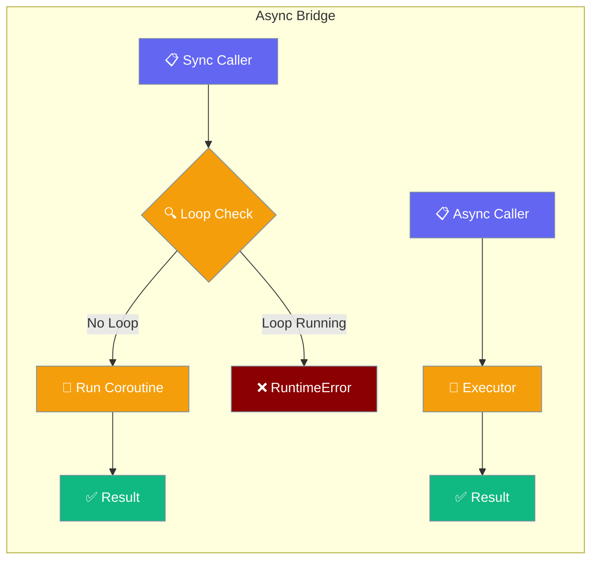
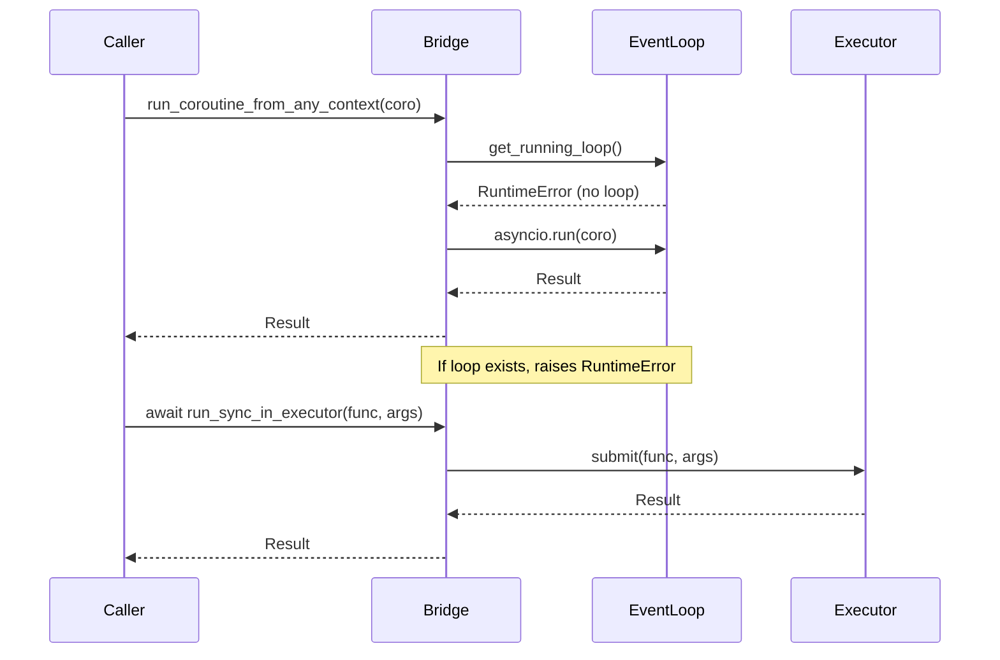

The async bridge lets your tools and callbacks move between sync and async without crashing the event loop.

<Note>
This page covers the **SDK-level** async bridge (`praisonaiagents.utils.async_bridge`) used inside tools and callbacks. PraisonAI also ships a **wrapper-level** async bridge (`praisonai._async_bridge`) used internally by long-running servers (gateway, a2u, mcp_server). They are different modules — see the [CLI Dispatcher](/features/cli-dispatcher) and [Gateway](/features/gateway#graceful-shutdown) pages for the wrapper bridge.
</Note>



## Quick Start

<Steps>
<Step title="From a sync tool">
Use `run_coroutine_from_any_context` to call async code from a sync tool:

```python
from praisonaiagents import Agent
from praisonaiagents.utils.async_bridge import run_coroutine_from_any_context
import httpx

async def _fetch(url: str) -> str:
    async with httpx.AsyncClient() as client:
        return (await client.get(url)).text[:500]

def fetch_sync(url: str) -> str:
    """Sync tool that safely reuses an async HTTP client."""
    return run_coroutine_from_any_context(_fetch(url))

agent = Agent(
    name="Researcher",
    instructions="Fetch and summarise web pages",
    tools=[fetch_sync],
)
agent.start("Summarise https://example.com")
```
</Step>

<Step title="From an async tool">
Use `run_sync_in_executor` to call blocking code from an async tool without blocking the event loop:

```python
from praisonaiagents import Agent
from praisonaiagents.utils.async_bridge import run_sync_in_executor
import time

def blocking_task(duration: int) -> str:
    time.sleep(duration)
    return f"Completed after {duration} seconds"

async def async_tool(duration: int) -> str:
    """Async tool that offloads blocking work."""
    return await run_sync_in_executor(blocking_task, duration)

agent = Agent(
    name="Worker",
    instructions="Handle blocking tasks efficiently",
    tools=[async_tool],
)
```
</Step>

<Step title="Detecting the context">
Use `is_async_context` to create dual-mode helpers:

```python
from praisonaiagents.utils.async_bridge import is_async_context, run_coroutine_from_any_context
import httpx

async def _async_fetch(url: str) -> str:
    async with httpx.AsyncClient() as client:
        return (await client.get(url)).text

def smart_fetch(url: str) -> str:
    """Context-aware fetch that works in both sync and async."""
    if is_async_context():
        raise RuntimeError("Use await smart_fetch_async(url) in async context")
    return run_coroutine_from_any_context(_async_fetch(url))

async def smart_fetch_async(url: str) -> str:
    """Async version for use in async contexts."""
    return await _async_fetch(url)
```
</Step>
</Steps>

---

## How It Works



The bridge probes for a running event loop using `asyncio.get_running_loop()`. If no loop exists, it safely creates one with `asyncio.run()`. If a loop is already running, it raises `RuntimeError` to prevent deadlocks.

---

## Configuration Options

| Option | Type | Default | Description |
|--------|------|---------|-------------|
| `timeout` | `float` | `300` | Maximum seconds to wait for coroutine completion |

---

## Common Patterns

### Reusing async SDKs from sync tools

```python
from praisonaiagents import Agent
from praisonaiagents.utils.async_bridge import run_coroutine_from_any_context
import aiofiles

async def _read_file_async(path: str) -> str:
    async with aiofiles.open(path) as f:
        return await f.read()

def read_file(path: str) -> str:
    """Sync wrapper for async file operations."""
    return run_coroutine_from_any_context(_read_file_async(path))

agent = Agent(
    name="FileReader",
    instructions="Process files efficiently",
    tools=[read_file],
)
```

### Offloading blocking calls from async tools

```python
import subprocess
from praisonaiagents.utils.async_bridge import run_sync_in_executor

async def run_command(cmd: str) -> str:
    """Run shell command without blocking the event loop."""
    def _run():
        return subprocess.check_output(cmd, shell=True, text=True)
    
    return await run_sync_in_executor(_run)
```

### Context-aware dual-mode helper

```python
from praisonaiagents.utils.async_bridge import is_async_context, run_coroutine_from_any_context

def universal_helper(data):
    """Works in both sync and async contexts."""
    if is_async_context():
        raise RuntimeError("Use await universal_helper_async(data) in async context")
    
    async def _process():
        # async processing logic
        await asyncio.sleep(0.1)
        return f"Processed: {data}"
    
    return run_coroutine_from_any_context(_process())
```

---

## Best Practices

<AccordionGroup>
<Accordion title="Prefer await when you're already async">
Calling `run_coroutine_from_any_context` inside an `async def` raises `RuntimeError` by design. If you're in a coroutine, use `await` instead:

```python
# Good
async def my_async_tool():
    result = await my_coroutine()
    
# Bad - will raise RuntimeError
async def my_async_tool():
    result = run_coroutine_from_any_context(my_coroutine())
```
</Accordion>

<Accordion title="Don't wrap everything">
Only wrap at the true sync/async boundary. Avoid creating unnecessary bridge calls in the middle of your call stack:

```python
# Good - bridge at the boundary
def sync_tool():
    return run_coroutine_from_any_context(async_logic())

# Bad - unnecessary nesting
def sync_tool():
    def inner():
        return run_coroutine_from_any_context(async_logic())
    return inner()
```
</Accordion>

<Accordion title="Set a sensible timeout">
The default 300 seconds is large for most use cases. Tighten for latency-critical tools:

```python
# Good for quick operations
result = run_coroutine_from_any_context(quick_api_call(), timeout=10)

# Good for long operations
result = run_coroutine_from_any_context(model_training(), timeout=3600)
```
</Accordion>

<Accordion title="Check is_async_context() for dual-mode helpers">
When building utilities that work in both sync and async contexts, check the context first:

```python
def smart_helper():
    if is_async_context():
        raise RuntimeError("Use await smart_helper_async() in async context")
    return run_coroutine_from_any_context(async_implementation())

async def smart_helper_async():
    return await async_implementation()
```
</Accordion>
</AccordionGroup>

---

## Troubleshooting

### RuntimeError: run_coroutine_from_any_context() cannot be called from async context

You're trying to use the bridge inside a coroutine. Use `await` instead:

```python
# Bad
async def my_coroutine():
    return run_coroutine_from_any_context(other_coroutine())

# Good
async def my_coroutine():
    return await other_coroutine()
```

### asyncio.run() cannot be called from a running event loop

This error used to leak from SDK internals before the async bridge was implemented. If you see this on current versions, upgrade to the latest release.

### PermissionError in approval system

The approval system now fails fast in async contexts. Configure a non-console backend:

```python
from praisonaiagents.approval import get_approval_registry, WebhookBackend

# Configure for async compatibility
get_approval_registry().set_backend(WebhookBackend(url="http://localhost:8080/approve"))
```

---

## Related

<CardGroup cols={2}>
<Card icon="clock" href="/features/async">
Async Agents Guide
</Card>
<Card icon="lock" href="/features/thread-safety">
Thread Safety & Concurrency
</Card>
</CardGroup>