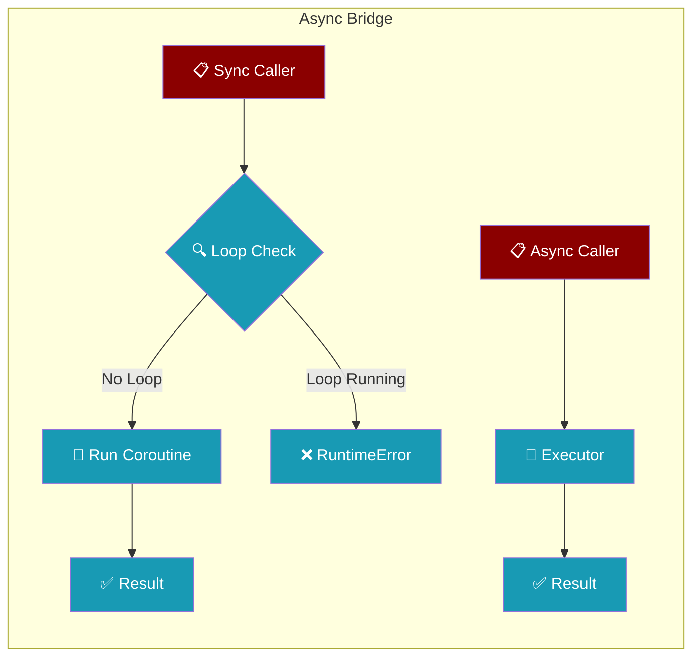
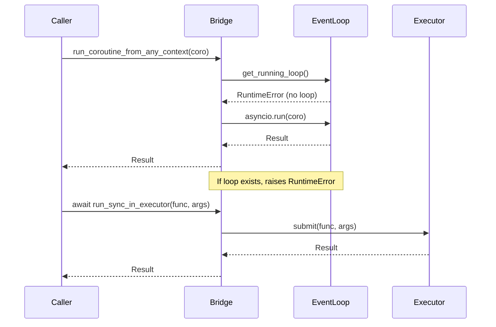
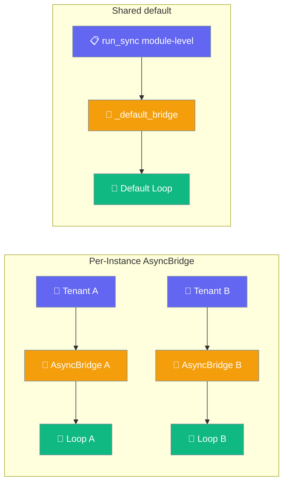
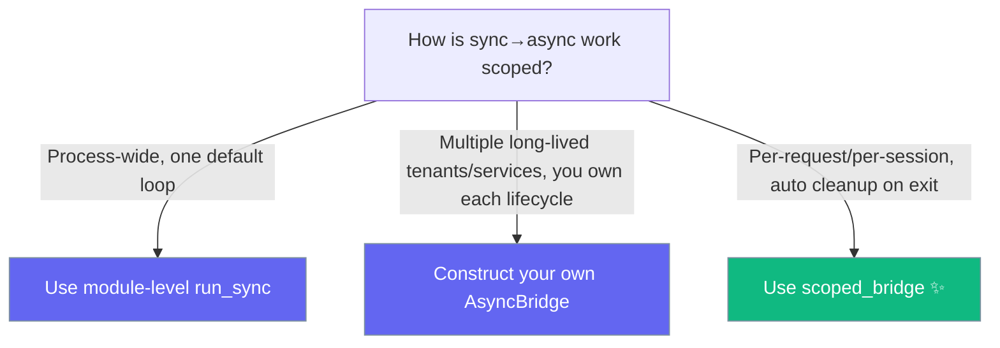

The async bridge lets your tools and callbacks move between sync and async without crashing the event loop.



## Quick Start

<Steps>
<Step title="From a sync tool">
Use `run_coroutine_from_any_context` to call async code from a sync tool:

```python
from praisonaiagents import Agent
from praisonaiagents.utils.async_bridge import run_coroutine_from_any_context
import httpx

async def _fetch(url: str) -> str:
    async with httpx.AsyncClient() as client:
        return (await client.get(url)).text[:500]

def fetch_sync(url: str) -> str:
    """Sync tool that safely reuses an async HTTP client."""
    return run_coroutine_from_any_context(_fetch(url))

agent = Agent(
    name="Researcher",
    instructions="Fetch and summarise web pages",
    tools=[fetch_sync],
)
agent.start("Summarise https://example.com")
```
</Step>

<Step title="From an async tool">
Use `run_sync_in_executor` to call blocking code from an async tool without blocking the event loop:

```python
from praisonaiagents import Agent
from praisonaiagents.utils.async_bridge import run_sync_in_executor
import time

def blocking_task(duration: int) -> str:
    time.sleep(duration)
    return f"Completed after {duration} seconds"

async def async_tool(duration: int) -> str:
    """Async tool that offloads blocking work."""
    return await run_sync_in_executor(blocking_task, duration)

agent = Agent(
    name="Worker",
    instructions="Handle blocking tasks efficiently",
    tools=[async_tool],
)
```
</Step>

<Step title="Detecting the context">
Use `is_async_context` to create dual-mode helpers:

```python
from praisonaiagents.utils.async_bridge import is_async_context, run_coroutine_from_any_context
import httpx

async def _async_fetch(url: str) -> str:
    async with httpx.AsyncClient() as client:
        return (await client.get(url)).text

def smart_fetch(url: str) -> str:
    """Context-aware fetch that works in both sync and async."""
    if is_async_context():
        raise RuntimeError("Use await smart_fetch_async(url) in async context")
    return run_coroutine_from_any_context(_async_fetch(url))

async def smart_fetch_async(url: str) -> str:
    """Async version for use in async contexts."""
    return await _async_fetch(url)
```
</Step>
</Steps>

---

## How It Works



The bridge probes for a running event loop using `asyncio.get_running_loop()`. If no loop exists, it safely creates one with `asyncio.run()`. If a loop is already running, it raises `RuntimeError` to prevent deadlocks.

---

## Configuration Options

| Option | Type | Default | Description |
|--------|------|---------|-------------|
| `timeout` | `float` | `300` | Maximum seconds to wait for coroutine completion |

---

## Common Patterns

### Reusing async SDKs from sync tools

```python
from praisonaiagents import Agent
from praisonaiagents.utils.async_bridge import run_coroutine_from_any_context
import aiofiles

async def _read_file_async(path: str) -> str:
    async with aiofiles.open(path) as f:
        return await f.read()

def read_file(path: str) -> str:
    """Sync wrapper for async file operations."""
    return run_coroutine_from_any_context(_read_file_async(path))

agent = Agent(
    name="FileReader",
    instructions="Process files efficiently",
    tools=[read_file],
)
```

### Offloading blocking calls from async tools

```python
import subprocess
from praisonaiagents.utils.async_bridge import run_sync_in_executor

async def run_command(cmd: str) -> str:
    """Run shell command without blocking the event loop."""
    def _run():
        return subprocess.check_output(cmd, shell=True, text=True)
    
    return await run_sync_in_executor(_run)
```

### Context-aware dual-mode helper

```python
from praisonaiagents.utils.async_bridge import is_async_context, run_coroutine_from_any_context

def universal_helper(data):
    """Works in both sync and async contexts."""
    if is_async_context():
        raise RuntimeError("Use await universal_helper_async(data) in async context")
    
    async def _process():
        # async processing logic
        await asyncio.sleep(0.1)
        return f"Processed: {data}"
    
    return run_coroutine_from_any_context(_process())
```

---

## Best Practices

<AccordionGroup>
<Accordion title="Prefer await when you're already async">
Calling `run_coroutine_from_any_context` inside an `async def` raises `RuntimeError` by design. If you're in a coroutine, use `await` instead:

```python
# Good
async def my_async_tool():
    result = await my_coroutine()
    
# Bad - will raise RuntimeError
async def my_async_tool():
    result = run_coroutine_from_any_context(my_coroutine())
```
</Accordion>

<Accordion title="Don't wrap everything">
Only wrap at the true sync/async boundary. Avoid creating unnecessary bridge calls in the middle of your call stack:

```python
# Good - bridge at the boundary
def sync_tool():
    return run_coroutine_from_any_context(async_logic())

# Bad - unnecessary nesting
def sync_tool():
    def inner():
        return run_coroutine_from_any_context(async_logic())
    return inner()
```
</Accordion>

<Accordion title="Set a sensible timeout">
The default 300 seconds is large for most use cases. Tighten for latency-critical tools:

```python
# Good for quick operations
result = run_coroutine_from_any_context(quick_api_call(), timeout=10)

# Good for long operations
result = run_coroutine_from_any_context(model_training(), timeout=3600)
```
</Accordion>

<Accordion title="Check is_async_context() for dual-mode helpers">
When building utilities that work in both sync and async contexts, check the context first:

```python
def smart_helper():
    if is_async_context():
        raise RuntimeError("Use await smart_helper_async() in async context")
    return run_coroutine_from_any_context(async_implementation())

async def smart_helper_async():
    return await async_implementation()
```
</Accordion>
</AccordionGroup>

---

## Used by

The following synchronous APIs route through `run_sync()` and therefore honour `PRAISONAI_RUN_SYNC_TIMEOUT` consistently:

- `praisonai.bots.WebhookApproval.request_approval_sync()`
- `praisonai.bots.HTTPApproval.request_approval_sync()`
- `praisonai.integrations.get_available_integrations()`
- `praisonai._run_praisonai` (added PR #1681) — boots the InteractiveRuntime on the persistent background loop. If you call `PraisonAI.run()` from inside a running event loop, you now get a clear `RuntimeError` instead of a silent deadlock.
- All ~77 wrapper-side `run_sync` call sites (gateway, a2u, mcp_server, scheduler) — see PR #1583 for the full list.

<Warning>
These sync wrappers now raise `RuntimeError("run_sync() cannot be called from a running event loop; await the coroutine directly instead.")` when called from inside an active asyncio loop. Previously they would silently spawn a worker thread. **If you call any of these from async code, switch to `await request_approval(...)` (or the equivalent async method) directly.** This is a deliberate fail-fast change — the silent thread spawn was masking architectural bugs in multi-agent setups.

**PR #1692 — cancellation on timeout (May 2026).** When a `run_sync()` call hits its timeout (default 300 s, or whatever `PRAISONAI_RUN_SYNC_TIMEOUT` is set to), the underlying coroutine is now actively cancelled on the background loop. The bridge waits up to 1 s for cancellation to propagate before re-raising `TimeoutError`. This means slow DB queries (SurrealDB, async MySQL), HTTP calls, and subprocess waits now **release their connection / socket / pipe** instead of leaking. Cancellation also fires on `KeyboardInterrupt`, `SystemExit`, and `GeneratorExit`.
</Warning>

<Note>
The wrapper-layer bridge (`praisonai._async_bridge`) creates its
background loop lazily on the first `run_sync()` call. Pure imports
do not allocate a loop or thread. Calling the module-level `shutdown()` before any
`run_sync()` is a safe no-op — it only affects the shared default bridge, not any `AsyncBridge()` instances you create yourself.
</Note>

---

## Troubleshooting

### RuntimeError: run_coroutine_from_any_context() cannot be called from async context

You're trying to use the bridge inside a coroutine. Use `await` instead:

```python
# Bad
async def my_coroutine():
    return run_coroutine_from_any_context(other_coroutine())

# Good
async def my_coroutine():
    return await other_coroutine()
```

### asyncio.run() cannot be called from a running event loop

This error used to leak from SDK internals before the async bridge was implemented. If you see this on current versions, upgrade to the latest release.

| Symptom | Cause | Resolution |
|---------|-------|-----------|
| `TimeoutError` raised but you also see your coroutine's `finally:` block run after the exception | Expected: cancellation propagated, cleanup ran. | No action needed; this is the new PR #1692 behaviour. |

**Test reference:** `praisonai/tests/unit/test_async_bridge.py::TestBridgeIntegration::test_timeout_cancels_coroutine_and_runs_finally` — quote this in the page so users can verify the behaviour locally.

### PermissionError in approval system

The approval system now fails fast in async contexts. Configure a non-console backend:

```python
from praisonaiagents.approval import get_approval_registry, WebhookBackend

# Configure for async compatibility
get_approval_registry().set_backend(WebhookBackend(url="http://localhost:8080/approve"))
```

---

## Wrapper Bridge (`praisonai._async_bridge`)

The wrapper layer provides a module-level `run_sync()` for CLI scripts and single-tenant servers, plus a public `AsyncBridge` class when you need an isolated loop per tenant or service.

<Tabs>
<Tab title="Module-level (default)">

```python
from praisonai._async_bridge import run_sync, shutdown

async def async_helper(data: str) -> str:
    await asyncio.sleep(0.1)
    return f"Processed: {data}"

def sync_entry_point(data: str) -> str:
    return run_sync(async_helper(data), timeout=60)

import atexit
atexit.register(shutdown)  # shuts down ONLY the shared default bridge
```

</Tab>

<Tab title="Per-instance AsyncBridge">

```python
from praisonai._async_bridge import AsyncBridge

bridge = AsyncBridge()  # per-tenant / per-service instance

async def fetch(url: str) -> str:
    ...

result = bridge.run_sync(fetch("https://example.com"), timeout=10)
bridge.shutdown()  # only this bridge — not the shared default
```

</Tab>
</Tabs>



### Per-Session Isolation with `scoped_bridge()`

A stuck coroutine in one session can park the shared default loop for every other session. `scoped_bridge()` binds a fresh, per-session bridge for the duration of a `with` block so the blast radius is contained.

```python
from praisonaiagents import Agent
from praisonai._async_bridge import scoped_bridge, run_sync

async def _fetch_session_data(session_id: str) -> dict:
    ...

def handle_session(session_id: str, prompt: str) -> str:
    # Each session gets its own loop+thread; a hung fetch in one
    # session cannot block any other session's sync→async work.
    with scoped_bridge() as bridge:
        data = run_sync(_fetch_session_data(session_id))
        agent = Agent(name="Assistant", instructions=f"Use: {data}")
        return agent.start(prompt)
```

<Tabs>
<Tab title="Scope-owned bridge (auto shutdown)">

```python
from praisonai._async_bridge import scoped_bridge, run_sync

with scoped_bridge() as bridge:
    # A fresh bridge is created for this block.
    # run_sync() routes through it, not the shared default.
    result = run_sync(some_coro())
    bridge.submit(other_coro())  # fire-and-forget
# bridge is shut down with permanent=True on exit —
# the scope owns the lifecycle.
```

</Tab>
<Tab title="Bring your own bridge">

```python
from praisonai._async_bridge import AsyncBridge, scoped_bridge, run_sync

my_bridge = AsyncBridge()
with scoped_bridge(my_bridge):
    # run_sync() routes through my_bridge inside the block.
    result = run_sync(some_coro())
# my_bridge stays alive — you are responsible for my_bridge.shutdown().
my_bridge.shutdown()
```

</Tab>
</Tabs>

`current_bridge()` returns the scoped bridge anywhere inside the `with` block — including in transitive call chains — without any code changes to the callee:

```python
from praisonai._async_bridge import current_bridge, scoped_bridge

with scoped_bridge() as session_bridge:
    # Anywhere inside the block, current_bridge() resolves to session_bridge.
    assert current_bridge() is session_bridge
```

The override propagates through `contextvars`, so internal callers of `run_sync` inside the block see the scoped bridge automatically.

<Warning>
Bridges created by `scoped_bridge()` (the no-arg form) are shut down with `permanent=True` on exit. If a context copied inside the block tries to `run_sync` on the bridge afterward, it raises:

```
RuntimeError: AsyncBridge has been shut down and cannot be reused;
this usually means a context outlived its scoped_bridge() block
```

This is intentional — it prevents an orphaned loop+thread from outliving the scope that owned it.
</Warning>




### When to use a per-instance bridge

| Situation | Module-level `run_sync()` | Your own `AsyncBridge()` | `scoped_bridge()` |
|-----------|:-------------------------:|:------------------------:|:-----------------:|
| CLI script / one-shot job | ✅ | — | — |
| Single-tenant server | ✅ | — | — |
| Multi-tenant gateway (loop scoped to tenant lifecycle) | — | ✅ | — |
| Embedding PraisonAI inside another async framework | — | ✅ | — |
| Tests needing clean shutdown without affecting others | — | ✅ | — |
| Per-request / per-session isolation in a server | — | ✅ (if you also manage the ContextVar yourself) | ✅ preferred — automatic ContextVar + auto-shutdown |

**API Reference:**

| Class / Function | Signature | Description |
|------------------|-----------|-------------|
| `AsyncBridge` | `class AsyncBridge` | Per-instance async runner; create one per tenant or service. |
| `AsyncBridge.run_sync` | `(self, coro, *, timeout=300) -> T` | Run a coroutine on this bridge's background loop. |
| `AsyncBridge.shutdown` | `(self, timeout: float = 5.0, *, permanent: bool = False) -> None` | Cancel pending tasks and stop this bridge's loop. New `permanent` kwarg: when `True`, the bridge cannot be reused; later `run_sync`/`submit` raises `RuntimeError`. Used by `scoped_bridge()` for scope-owned bridges. Default `False` preserves existing behaviour. PR #2122: releases the bridge lock before awaiting cancellation and excludes the current task — safe to call from within an async tool on the bridge's loop. |
| `AsyncBridge.submit` | `(self, coro) -> concurrent.futures.Future` | Submit without waiting; returns a `concurrent.futures.Future`. |
| `AsyncBridge.get` | `(self) -> asyncio.AbstractEventLoop` | Get (lazily spawn) the bridge's event loop. |
| `run_sync` (module-level) | `(coro, *, timeout=300) -> T` | Routes through the shared default `AsyncBridge`. Behaviour unchanged. |
| `shutdown` (module-level) | `() -> None` | Shuts down **only** the shared default bridge. User-owned instances are untouched. |
| `current_bridge` (module-level) | `() -> AsyncBridge` | Returns the bridge bound by an enclosing `scoped_bridge()` block, or the shared process-wide default when no scope is active. Prefer this over importing `_BG`. |
| `scoped_bridge` (module-level) | `(bridge: Optional[AsyncBridge] = None) -> Iterator[AsyncBridge]` | Context manager. Binds a per-scope bridge via a `ContextVar`. With `None`, creates and owns a fresh bridge (shut down with `permanent=True` on exit). With a caller-provided bridge, the caller retains lifecycle ownership. |

**Environment:** 
- `PRAISONAI_RUN_SYNC_TIMEOUT`: Default timeout in seconds (300)

<Warning>
Do **not** call `run_sync` from inside `async def` — use `await` instead. The function raises `RuntimeError` if called from within a running event loop to prevent deadlocks.

The module-level `shutdown()` only stops the shared default bridge. Per-instance `AsyncBridge` objects must be shut down via `bridge.shutdown()` on each instance.
</Warning>

**Used by:**
- CLI approval protocol (ACP/LSP tools)
- Interactive runtime start/stop operations 
- Deployment scheduler
- Gateway operations
- Per-session loop isolation in servers (`praisonai serve`, gateway, managed agents) — see `scoped_bridge()` above.

See also: [Approval Protocol](/docs/features/approval-protocol) and [Gateway](/docs/features/gateway).

---

## Related

<CardGroup cols={2}>
<Card icon="clock" href="/docs/features/async">
Async Agents Guide
</Card>
<Card icon="lock" href="/docs/features/thread-safety">
Thread Safety & Concurrency
</Card>
</CardGroup>