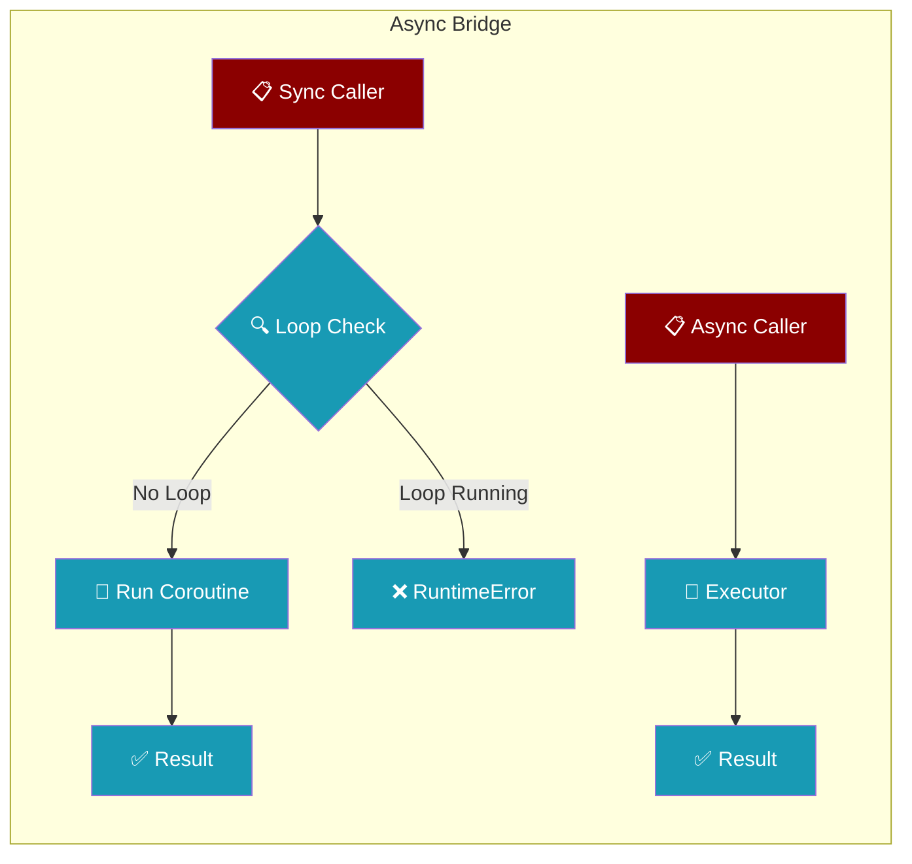
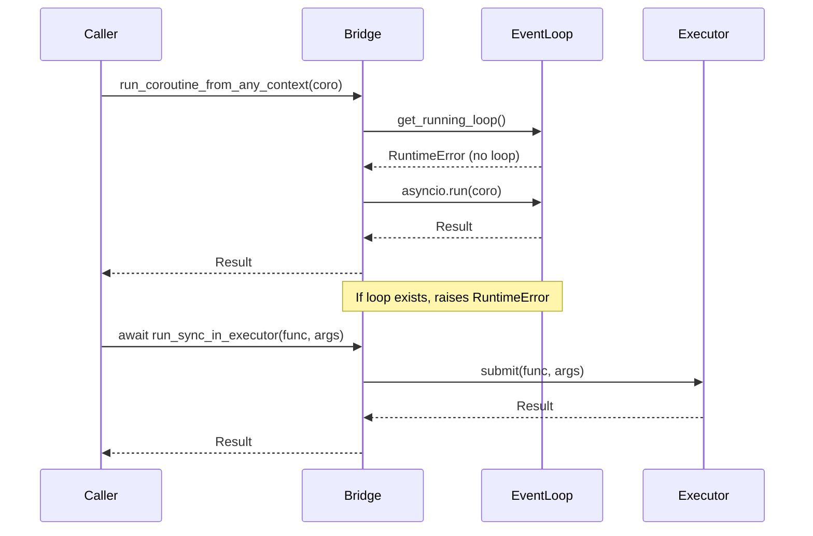
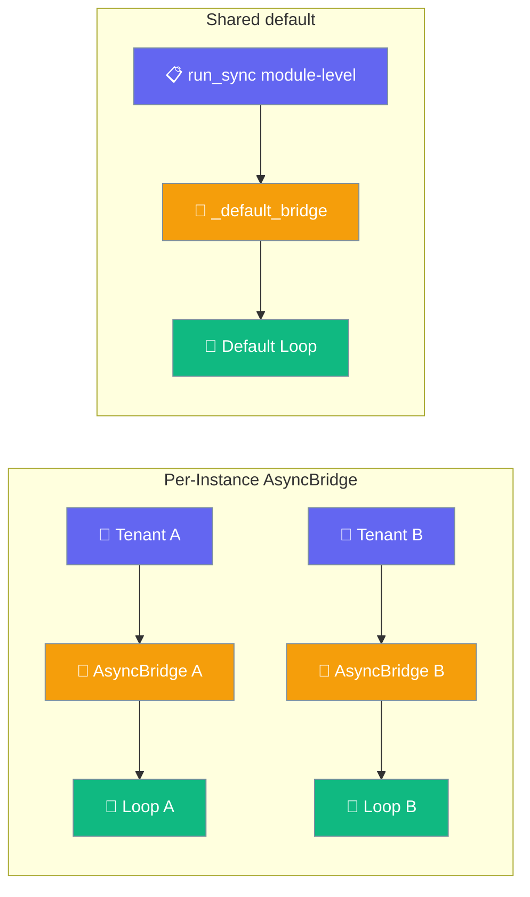
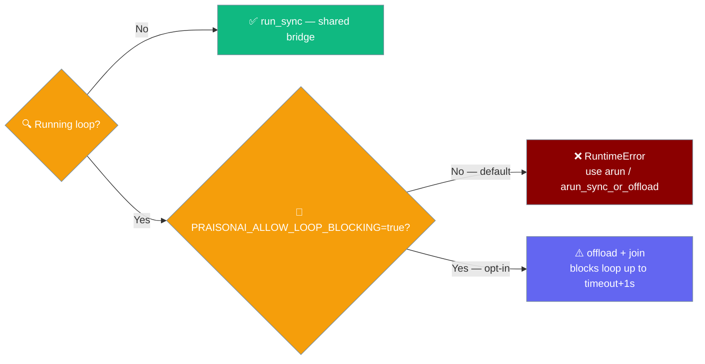
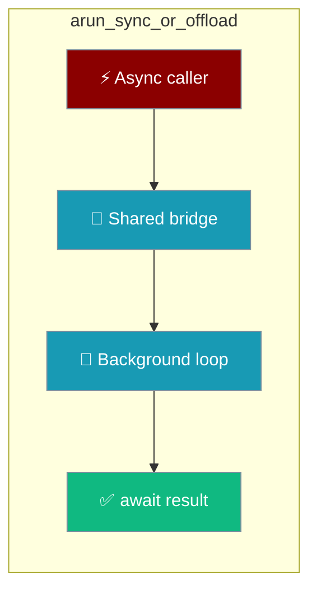
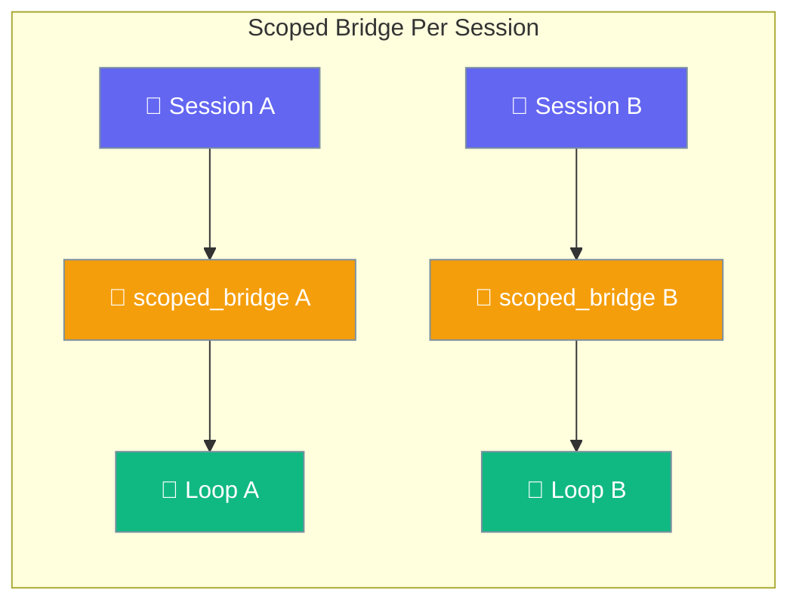

The async bridge lets your tools and callbacks move between sync and async without crashing the event loop.

```python
from praisonaiagents import Agent

agent = Agent(name="fetcher", instructions="Fetch URLs safely from sync or async tools.")
agent.start("Summarise https://example.com")
```

The user calls a sync tool that needs async I/O; the bridge runs the coroutine safely or surfaces a clear error if called from a running loop.


```mermaid
graph LR
    subgraph "Async Bridge"
        A[📋 Sync Caller] --> B{🔍 Loop Check}
        B -->|No Loop| C[🚀 Run Coroutine]
        B -->|Loop Running| D[❌ RuntimeError]
        C --> E[✅ Result]
        
        F[📋 Async Caller] --> G[🧵 Executor]
        G --> H[✅ Result]
    end
    
    classDef agent fill:#8B0000,color:#fff
    classDef tool fill:#189AB4,color:#fff
    
    class A,F agent
    class B,C,D,E,G,H tool
```

## Quick Start

<Steps>
<Step title="From a sync tool">
Use `run_coroutine_from_any_context` to call async code from a sync tool:

```python
from praisonaiagents import Agent
from praisonaiagents.utils.async_bridge import run_coroutine_from_any_context
import httpx

async def _fetch(url: str) -> str:
    async with httpx.AsyncClient() as client:
        return (await client.get(url)).text[:500]

def fetch_sync(url: str) -> str:
    """Sync tool that safely reuses an async HTTP client."""
    return run_coroutine_from_any_context(_fetch(url))

agent = Agent(
    name="Researcher",
    instructions="Fetch and summarise web pages",
    tools=[fetch_sync],
)
agent.start("Summarise https://example.com")
```

The user runs sync code that needs async I/O; the bridge executes coroutines without nested event loops.
</Step>

<Step title="From an async tool">
Use `run_sync_in_executor` to call blocking code from an async tool without blocking the event loop:

```python
from praisonaiagents import Agent
from praisonaiagents.utils.async_bridge import run_sync_in_executor
import time

def blocking_task(duration: int) -> str:
    time.sleep(duration)
    return f"Completed after {duration} seconds"

async def async_tool(duration: int) -> str:
    """Async tool that offloads blocking work."""
    return await run_sync_in_executor(blocking_task, duration)

agent = Agent(
    name="Worker",
    instructions="Handle blocking tasks efficiently",
    tools=[async_tool],
)
```
</Step>

<Step title="Detecting the context">
Use `is_async_context` to create dual-mode helpers:

```python
from praisonaiagents.utils.async_bridge import is_async_context, run_coroutine_from_any_context
import httpx

async def _async_fetch(url: str) -> str:
    async with httpx.AsyncClient() as client:
        return (await client.get(url)).text

def smart_fetch(url: str) -> str:
    """Context-aware fetch that works in both sync and async."""
    if is_async_context():
        raise RuntimeError("Use await smart_fetch_async(url) in async context")
    return run_coroutine_from_any_context(_async_fetch(url))

async def smart_fetch_async(url: str) -> str:
    """Async version for use in async contexts."""
    return await _async_fetch(url)
```
</Step>
</Steps>

---

## How It Works


```mermaid
sequenceDiagram
    participant Caller
    participant Bridge
    participant EventLoop
    participant Executor
    
    Caller->>Bridge: run_coroutine_from_any_context(coro)
    Bridge->>EventLoop: get_running_loop()
    EventLoop-->>Bridge: RuntimeError (no loop)
    Bridge->>EventLoop: asyncio.run(coro)
    EventLoop-->>Bridge: Result
    Bridge-->>Caller: Result
    
    Note over Bridge,EventLoop: If loop exists, raises RuntimeError
    
    Caller->>Bridge: await run_sync_in_executor(func, args)
    Bridge->>Executor: submit(func, args)
    Executor-->>Bridge: Result
    Bridge-->>Caller: Result
```

The bridge probes for a running event loop using `asyncio.get_running_loop()`. If no loop exists, it safely creates one with `asyncio.run()`. If a loop is already running, it raises `RuntimeError` to prevent deadlocks.

---

## Configuration Options

| Option | Type | Default | Description |
|--------|------|---------|-------------|
| `timeout` | `float` | `300` | Maximum seconds to wait for coroutine completion |

---

## Common Patterns

### Reusing async SDKs from sync tools

```python
from praisonaiagents import Agent
from praisonaiagents.utils.async_bridge import run_coroutine_from_any_context
import aiofiles

async def _read_file_async(path: str) -> str:
    async with aiofiles.open(path) as f:
        return await f.read()

def read_file(path: str) -> str:
    """Sync wrapper for async file operations."""
    return run_coroutine_from_any_context(_read_file_async(path))

agent = Agent(
    name="FileReader",
    instructions="Process files efficiently",
    tools=[read_file],
)
```

### Offloading blocking calls from async tools

```python
import subprocess
from praisonaiagents.utils.async_bridge import run_sync_in_executor

async def run_command(cmd: str) -> str:
    """Run shell command without blocking the event loop."""
    def _run():
        return subprocess.check_output(cmd, shell=True, text=True)
    
    return await run_sync_in_executor(_run)
```

### Context-aware dual-mode helper

```python
from praisonaiagents.utils.async_bridge import is_async_context, run_coroutine_from_any_context

def universal_helper(data):
    """Works in both sync and async contexts."""
    if is_async_context():
        raise RuntimeError("Use await universal_helper_async(data) in async context")
    
    async def _process():
        # async processing logic
        await asyncio.sleep(0.1)
        return f"Processed: {data}"
    
    return run_coroutine_from_any_context(_process())
```

---

## Best Practices

<AccordionGroup>
<Accordion title="Prefer await when you're already async">
Calling `run_coroutine_from_any_context` inside an `async def` raises `RuntimeError` by design. If you're in a coroutine, use `await` instead:

```python
# Good
async def my_async_tool():
    result = await my_coroutine()
    
# Bad - will raise RuntimeError
async def my_async_tool():
    result = run_coroutine_from_any_context(my_coroutine())
```
</Accordion>

<Accordion title="Don't wrap everything">
Only wrap at the true sync/async boundary. Avoid creating unnecessary bridge calls in the middle of your call stack:

```python
# Good - bridge at the boundary
def sync_tool():
    return run_coroutine_from_any_context(async_logic())

# Bad - unnecessary nesting
def sync_tool():
    def inner():
        return run_coroutine_from_any_context(async_logic())
    return inner()
```
</Accordion>

<Accordion title="Set a sensible timeout">
The default 300 seconds is large for most use cases. Tighten for latency-critical tools:

```python
# Good for quick operations
result = run_coroutine_from_any_context(quick_api_call(), timeout=10)

# Good for long operations
result = run_coroutine_from_any_context(model_training(), timeout=3600)
```
</Accordion>

<Accordion title="Check is_async_context() for dual-mode helpers">
When building utilities that work in both sync and async contexts, check the context first:

```python
def smart_helper():
    if is_async_context():
        raise RuntimeError("Use await smart_helper_async() in async context")
    return run_coroutine_from_any_context(async_implementation())

async def smart_helper_async():
    return await async_implementation()
```
</Accordion>
</AccordionGroup>

---

## Used by

The following synchronous APIs route through `run_sync()` and therefore honour `PRAISONAI_RUN_SYNC_TIMEOUT` consistently:

- `praisonai.bots.WebhookApproval.request_approval_sync()`
- `praisonai.bots.HTTPApproval.request_approval_sync()`
- `praisonai.integrations.get_available_integrations()`
- `praisonai._run_praisonai` (added PR #1681) — boots the InteractiveRuntime on the persistent background loop. If you call `PraisonAI.run()` from inside a running event loop, you now get a clear `RuntimeError` instead of a silent deadlock.
- All ~77 wrapper-side `run_sync` call sites (gateway, a2u, mcp_server, scheduler) — see PR #1583 for the full list.
- `praisonai.auto.BaseAutoGenerator._structured_completion` / `_run_coro_sync` runner threads (added in the fix for [#3340](https://github.com/MervinPraison/PraisonAI/issues/3340)) — inherit the caller's `scoped_bridge()` via `contextvars.copy_context()`.
- `praisonai_code.cli.features.agent_tools._run_sync` (added via PR [#3361](https://github.com/MervinPraison/PraisonAI/pull/3361)) — a **separate**, module-local bridge in the Tier-2 `praisonai-code` package that ACP/LSP agent-centric tools route through. Does **not** import `praisonai._async_bridge` (C7 gate), but reads the **same** `PRAISONAI_RUN_SYNC_TIMEOUT` env var and enforces the same 300 s default. Safe under a running loop (offloads to a `ThreadPoolExecutor`), and returns promptly on timeout without waiting for the abandoned worker.

<Warning>
These sync wrappers now raise `RuntimeError("run_sync() cannot be called from a running event loop; await the coroutine directly instead.")` when called from inside an active asyncio loop. Previously they would silently spawn a worker thread. **If you call any of these from async code, switch to `await request_approval(...)` (or the equivalent async method) directly.** This is a deliberate fail-fast change — the silent thread spawn was masking architectural bugs in multi-agent setups.

**PR #1692 — cancellation on timeout (May 2026).** When a `run_sync()` call hits its timeout (default 300 s, or whatever `PRAISONAI_RUN_SYNC_TIMEOUT` is set to), the underlying coroutine is now actively cancelled on the background loop. The bridge waits up to 1 s for cancellation to propagate before re-raising `TimeoutError`. This means slow DB queries (SurrealDB, async MySQL), HTTP calls, and subprocess waits now **release their connection / socket / pipe** instead of leaking. Cancellation also fires on `KeyboardInterrupt`, `SystemExit`, and `GeneratorExit`.
</Warning>

<Note>
The wrapper-layer bridge (`praisonai._async_bridge`) creates its
background loop lazily on the first `run_sync()` call. Pure imports
do not allocate a loop or thread. Calling the module-level `shutdown()` before any
`run_sync()` is a safe no-op — it only affects the shared default bridge, not any `AsyncBridge()` instances you create yourself.
</Note>

---

## Troubleshooting

### RuntimeError: run_coroutine_from_any_context() cannot be called from async context

You're trying to use the bridge inside a coroutine. Use `await` instead:

```python
# Bad
async def my_coroutine():
    return run_coroutine_from_any_context(other_coroutine())

# Good
async def my_coroutine():
    return await other_coroutine()
```

### asyncio.run() cannot be called from a running event loop

This error used to leak from SDK internals before the async bridge was implemented. If you see this on current versions, upgrade to the latest release.

| Symptom | Cause | Resolution |
|---------|-------|-----------|
| `TimeoutError` raised but you also see your coroutine's `finally:` block run after the exception | Expected: cancellation propagated, cleanup ran. | No action needed; this is the new PR #1692 behaviour. |

**Test reference:** `praisonai/tests/unit/test_async_bridge.py::TestBridgeIntegration::test_timeout_cancels_coroutine_and_runs_finally` — quote this in the page so users can verify the behaviour locally.

### TimeoutError: run_sync_or_offload() worker did not complete within {N}s

This timeout branch is only reachable when the caller is inside a running loop **and** has opted into `PRAISONAI_ALLOW_LOOP_BLOCKING=true` (the offload path). A plain-sync caller still hits the same `TimeoutError` via `run_sync`. The offloaded coroutine did not finish inside `timeout + 1s` — check for blocking I/O or a missing `await`, or raise `PRAISONAI_RUN_SYNC_TIMEOUT` if the work is legitimately long-running. Prefer migrating to `await arun_sync_or_offload(...)` / `await praisonai.arun(...)` so the loop is never blocked.

### PermissionError in approval system

The approval system now fails fast in async contexts. Configure a non-console backend:

```python
from praisonaiagents.approval import get_approval_registry, WebhookBackend

# Configure for async compatibility
get_approval_registry().set_backend(WebhookBackend(url="http://localhost:8080/approve"))
```

---

## Wrapper Bridge (`praisonai._async_bridge`)

The wrapper layer provides a module-level `run_sync()` for CLI scripts and single-tenant servers, plus a public `AsyncBridge` class when you need an isolated loop per tenant or service.

<Tabs>
<Tab title="Module-level (default)">

```python
from praisonai._async_bridge import run_sync, shutdown

async def async_helper(data: str) -> str:
    await asyncio.sleep(0.1)
    return f"Processed: {data}"

def sync_entry_point(data: str) -> str:
    return run_sync(async_helper(data), timeout=60)

import atexit
atexit.register(shutdown)  # shuts down ONLY the shared default bridge
```

</Tab>

<Tab title="Per-instance AsyncBridge">

```python
from praisonai._async_bridge import AsyncBridge

bridge = AsyncBridge()  # per-tenant / per-service instance

async def fetch(url: str) -> str:
    ...

result = bridge.run_sync(fetch("https://example.com"), timeout=10)
bridge.shutdown()  # only this bridge — not the shared default
```

</Tab>
</Tabs>


```mermaid
graph LR
    subgraph "Per-Instance AsyncBridge"
        TA[👤 Tenant A] --> BA[🌉 AsyncBridge A]
        TB[👤 Tenant B] --> BB[🌉 AsyncBridge B]
        BA --> LA[🔁 Loop A]
        BB --> LB[🔁 Loop B]
    end

    subgraph "Shared default"
        S[📋 run_sync module-level] --> SD[🌉 _default_bridge]
        SD --> SL[🔁 Default Loop]
    end

    classDef tenant fill:#6366F1,stroke:#7C90A0,color:#fff
    classDef bridge fill:#F59E0B,stroke:#7C90A0,color:#fff
    classDef loop fill:#10B981,stroke:#7C90A0,color:#fff

    class TA,TB,S tenant
    class BA,BB,SD bridge
    class LA,LB,SL loop
```

### When to use a per-instance bridge

| Situation | Module-level `run_sync()` | Your own `AsyncBridge()` |
|-----------|:-------------------------:|:------------------------:|
| CLI script / one-shot job | ✅ | — |
| Single-tenant server | ✅ | — |
| Multi-tenant gateway (loop scoped to tenant lifecycle) | — | ✅ |
| Embedding PraisonAI inside another async framework | — | ✅ |
| Tests needing clean shutdown without affecting others | — | ✅ |

**API Reference:**

| Class / Function | Signature | Description |
|------------------|-----------|-------------|
| `AsyncBridge` | `class AsyncBridge` | Per-instance async runner; create one per tenant or service. |
| `AsyncBridge.run_sync` | `(self, coro, *, timeout=300) -> T` | Run a coroutine on this bridge's background loop. |
| `AsyncBridge.shutdown` | `(self, timeout=5.0, *, permanent=False) -> None` | Cancel pending tasks and stop this bridge's loop. With `permanent=True`, the bridge cannot be reused; later `run_sync`/`submit` raise `RuntimeError`. `scoped_bridge()` uses `permanent=True` for scope-owned bridges. PR #2122: releases the bridge lock before awaiting cancellation. |
| `AsyncBridge.submit` | `(self, coro) -> concurrent.futures.Future` | Submit without waiting; returns a `concurrent.futures.Future`. |
| `AsyncBridge.get` | `(self) -> asyncio.AbstractEventLoop` | Get (lazily spawn) the bridge's event loop. |
| `run_sync` (module-level) | `(coro, *, timeout=300) -> T` | Routes through the shared default `AsyncBridge`. Behaviour unchanged. |
| `shutdown` (module-level) | `() -> None` | Shuts down **only** the shared default bridge. User-owned instances are untouched. |

**Environment:** 
- `PRAISONAI_RUN_SYNC_TIMEOUT`: Default timeout in seconds (300). Read by **both** `praisonai._async_bridge` (this page) and `praisonai_code.cli.features.agent_tools._run_sync` (see [Agent-Centric Tools → Timeouts & Cancellation](/cli/agent-tools#timeouts-cancellation)).

<Warning>
Do **not** call `run_sync` from inside `async def` — use `await` instead. The function raises `RuntimeError` if called from within a running event loop to prevent deadlocks.

The module-level `shutdown()` only stops the shared default bridge. Per-instance `AsyncBridge` objects must be shut down via `bridge.shutdown()` on each instance.
</Warning>

**Used by:**
- CLI approval protocol (ACP/LSP tools)
- Interactive runtime start/stop operations 
- Deployment scheduler
- Gateway operations

See also: [Approval Protocol](/features/approval-protocol) and [Gateway](/features/gateway).

---

## `run_sync_or_offload` — strict inside a running loop

Use `run_sync_or_offload()` on a code path that can be reached from a plain script **or** from inside a running event loop (FastAPI, Jupyter, async tests). On a plain-sync caller it dispatches to `run_sync`. Inside a running loop it now **raises `RuntimeError` by default** ([PR #4261](https://github.com/MervinPraison/PraisonAI/pull/4261)) and steers you to the awaitable siblings — it never silently pins the loop.


```mermaid
graph LR
    A{🔍 Running loop?} -->|No| B[✅ run_sync — shared bridge]
    A -->|Yes| C{🔧 PRAISONAI_ALLOW_LOOP_BLOCKING=true?}
    C -->|No — default| D[❌ RuntimeError<br/>use arun / arun_sync_or_offload]
    C -->|Yes — opt-in| E[⚠️ offload + join<br/>blocks loop up to timeout+1s]

    classDef decision fill:#F59E0B,stroke:#7C90A0,color:#fff
    classDef ok fill:#10B981,stroke:#7C90A0,color:#fff
    classDef error fill:#8B0000,stroke:#7C90A0,color:#fff
    classDef warn fill:#6366F1,stroke:#7C90A0,color:#fff

    class A,C decision
    class B ok
    class D error
    class E warn
```

<Steps>
<Step title="Plain sync caller — works">
```python
from praisonai._async_bridge import run_sync_or_offload

async def fetch(): return 42

value = run_sync_or_offload(fetch())  # no running loop → run_sync
```
</Step>

<Step title="Inside a FastAPI handler — await instead">
A sync call inside a running loop now raises `RuntimeError`. Make the handler `async` and `await` the coroutine directly:

```python
@app.post("/run")
async def run(prompt: str):
    return {"answer": await agent.astart(prompt)}
```

For an existing sync entry point you cannot convert to `async def`, `await` the awaitable sibling:

```python
from praisonai._async_bridge import arun_sync_or_offload

@app.post("/run")
async def run(prompt: str):
    return {"answer": await arun_sync_or_offload(agent.astart(prompt))}
    # or: await praisonai.arun(...)
```
</Step>
</Steps>

### Configuration Options

| Option | Type | Default | Description |
|--------|------|---------|-------------|
| `coro` | `Awaitable[T]` | — | The coroutine to run. Refused inside a loop (strict mode) — it is `.close()`'d so it does not leak as a "coroutine was never awaited" warning. |
| `timeout` | `float \| None` | `PRAISONAI_RUN_SYNC_TIMEOUT` (300s) | Same env var as `run_sync`. |
| `thread_name` | `str` | `"praisonai-sync-offload"` | Name of the offload worker thread (only used under the `PRAISONAI_ALLOW_LOOP_BLOCKING` opt-in). |

Called from a plain sync caller, it dispatches to the active `AsyncBridge` via `run_sync`, sharing its background loop and connection pools. Called from inside a running loop **with `PRAISONAI_ALLOW_LOOP_BLOCKING=true`**, it copies the caller's ContextVars onto a worker thread that hands the coroutine to the **same** bridge — never a fresh `asyncio.new_event_loop()` — so a caller-installed `scoped_bridge()` binding still wins and LiteLLM/HTTPX per-loop connection pools are preserved. Exceptions re-raise on the caller thread.

### The strict `RuntimeError`

In the default (strict) mode, a call from inside a running loop raises with this message — grep for it in a traceback:

```text
run_sync_or_offload() would block the running event loop for up to 300s. From an async context, await one of:
  - praisonai.arun(...)
  - adapter.arun(...)
  - praisonai._async_bridge.arun_sync_or_offload(coro)
Set PRAISONAI_ALLOW_LOOP_BLOCKING=true to opt into the legacy blocking behaviour.
```

### How it differs from `run_sync`

| Helper | Plain sync caller | Inside a running loop (default) | Inside a running loop (`PRAISONAI_ALLOW_LOOP_BLOCKING=true`) |
|--------|-------------------|---------------------------------|--------------------------------------------------------------|
| `run_sync` | ✅ works | ❌ `RuntimeError` | ❌ `RuntimeError` |
| `run_sync_or_offload` | ✅ works | ❌ `RuntimeError` (points at awaitable siblings) | ⚠️ offloads onto a worker thread + joins (blocks the loop for up to `timeout+1s`) |
| `arun_sync_or_offload` | — (must be awaited) | ✅ **non-blocking** await; the loop stays responsive | ✅ **non-blocking** await |

<Note>
Under the `PRAISONAI_ALLOW_LOOP_BLOCKING` opt-in, `run_sync_or_offload()` bounds `thread.join()` at `timeout + 1.0s`. If the worker is still alive it cancels the in-flight future and raises `TimeoutError("run_sync_or_offload() worker did not complete within {timeout}s")`. The extra second covers thread hand-off/teardown so the join does not spuriously time out before the worker records its own error.
</Note>

### Migration

Any caller that today relies on offload-inside-a-loop must either (a) migrate to the awaitable sibling (`await praisonai.arun(...)`, `await adapter.arun(...)`, or `await arun_sync_or_offload(...)`), or (b) set `PRAISONAI_ALLOW_LOOP_BLOCKING=true` as an interim measure. See [PR #4261](https://github.com/MervinPraison/PraisonAI/pull/4261).

### Best Practices

<AccordionGroup>
<Accordion title="Prefer arun / arun_sync_or_offload inside a loop">
Inside a running loop, `await` the awaitable sibling so the loop stays responsive. The sync helper now raises `RuntimeError` by design rather than parking the loop.

```python
# Good — loop stays responsive
answer = await arun_sync_or_offload(agent.astart(prompt))

# Raises RuntimeError inside a running loop (strict default)
answer = run_sync_or_offload(agent.astart(prompt))
```
</Accordion>

<Accordion title="Keep run_sync_or_offload for plain-sync surfaces">
On a CLI or plain-script entry point there is no running loop, so `run_sync_or_offload` dispatches to `run_sync` and reuses the shared bridge and its connection pools.

```python
from praisonai._async_bridge import run_sync_or_offload

def surface_entry(prompt: str) -> str:
    return run_sync_or_offload(agent.astart(prompt))
```
</Accordion>

<Accordion title="Set PRAISONAI_ALLOW_LOOP_BLOCKING=true only for controlled migration windows">
The opt-in restores the pre-#4261 offload-and-join behaviour, which blocks the caller's event loop for up to `timeout + 1s`. Use it only as a bounded interim measure while migrating a known-safe path to the awaitable sibling — never as a long-term default.
</Accordion>
</AccordionGroup>

This helper landed in [PraisonAI #3492](https://github.com/MervinPraison/PraisonAI/pull/3492); the strict-inside-a-loop default landed in [PR #4261](https://github.com/MervinPraison/PraisonAI/pull/4261). Its callers (`praisonai.auto`, `persistence.orchestrator`, `api.agent_invoke`) are migrated onto it.

### Related

<CardGroup cols={2}>
<Card title="run_sync" icon="arrows-left-right" href="/features/async-bridge#wrapper-bridge-praisonai-_async_bridge">
Module-level runner for sync-only paths.
</Card>
<Card title="scoped_bridge" icon="lock" href="/features/async-bridge#per-session-scoped-bridge">
Per-session bridge preserved across the offload hop when `PRAISONAI_ALLOW_LOOP_BLOCKING=true`.
</Card>
<Card title="Agent-Centric Tools" icon="wrench" href="/cli/agent-tools#timeouts-cancellation">
The Tier-2 `_run_sync` (PR #3361) mirrors the same design.
</Card>
</CardGroup>

---

## `arun_sync_or_offload` — await from an async context

Use `arun_sync_or_offload()` from async callers (FastAPI/Starlette handlers, Jupyter cells, async tests) — `await` it instead of parking the loop thread with the sync helper.


```mermaid
graph LR
    subgraph "arun_sync_or_offload"
        A[⚡ Async caller] --> B[🌉 Shared bridge]
        B --> C[🔁 Background loop]
        C --> D[✅ await result]
    end

    classDef caller fill:#8B0000,stroke:#7C90A0,color:#fff
    classDef process fill:#189AB4,stroke:#7C90A0,color:#fff
    classDef result fill:#10B981,stroke:#7C90A0,color:#fff

    class A caller
    class B,C process
    class D result
```

<Steps>
<Step title="Import and await">
```python
from praisonai._async_bridge import arun_sync_or_offload

async def fetch(): return 42

async def handler():
    value = await arun_sync_or_offload(fetch())
    return value
```
</Step>

<Step title="Inside a FastAPI handler">
`await`, don't park — the loop stays responsive while the agent runs:

```python
from fastapi import FastAPI
from praisonaiagents import Agent
from praisonai._async_bridge import arun_sync_or_offload

app = FastAPI()
agent = Agent(name="Analyst", instructions="Answer briefly")

@app.post("/ask")
async def ask(q: str):
    answer = await arun_sync_or_offload(agent.astart(q))
    return {"answer": answer}
```
</Step>
</Steps>

The user calls an async endpoint; the agent's coroutine runs on the shared background bridge while the request loop stays free to serve other traffic.

### Configuration Options

| Option | Type | Default | Description |
|--------|------|---------|-------------|
| `coro` | `Awaitable[T]` | — | The coroutine to await. |
| `timeout` | `float \| None` | `PRAISONAI_RUN_SYNC_TIMEOUT` (300 s) | Same env var as `run_sync`. On expiry the in-flight future is cancelled (`fut.cancel()`) and `asyncio.TimeoutError` re-raises. |

Unlike `run_sync_or_offload`, this variant does **not** park the running loop thread. It submits `coro` to the active `AsyncBridge` and awaits the result, so the loop keeps serving other work. The coroutine runs on the shared background bridge loop — never a fresh `asyncio.new_event_loop()` — so a caller-installed `scoped_bridge()` binding still wins and per-loop LiteLLM/HTTPX connection pools are preserved. On timeout or cancellation, the in-flight future is cancelled before the exception re-raises.

### Best Practices

<AccordionGroup>
<Accordion title="Await it from async handlers, not run_sync_or_offload">
Inside a running loop, `run_sync_or_offload` raises `RuntimeError` by default (and only offloads-and-blocks under `PRAISONAI_ALLOW_LOOP_BLOCKING=true`). `arun_sync_or_offload` awaits instead, so the loop keeps serving other requests.

```python
# Good — loop stays responsive
answer = await arun_sync_or_offload(agent.astart(q))

# Raises RuntimeError inside a running loop (strict default)
answer = run_sync_or_offload(agent.astart(q))
```
</Accordion>

<Accordion title="Keep the sync helper for sync-only paths">
Plain scripts and CLI entry points can't `await`. Use `run_sync_or_offload` (or `run_sync`) there and reserve `arun_sync_or_offload` for code already inside a coroutine.
</Accordion>
</AccordionGroup>

### Related

<CardGroup cols={2}>
<Card title="run_sync_or_offload" icon="arrows-left-right" href="/features/async-bridge#run-sync-or-offload-strict-inside-a-running-loop">
Sync sibling for non-async callers.
</Card>
<Card title="scoped_bridge" icon="lock" href="/features/async-bridge#per-session-scoped-bridge">
Per-session bridge preserved across the await.
</Card>
</CardGroup>

---

## Per-Session Scoped Bridge

Servers and gateways that handle multiple concurrent sessions need each session to run on its own loop+thread binding. `current_bridge()` and `scoped_bridge()` provide `ContextVar`-backed per-session isolation so sessions never share a bridge accidentally.


```mermaid
graph LR
    subgraph "Scoped Bridge Per Session"
        S1[👤 Session A] --> SB1[🌉 scoped_bridge A]
        S2[👤 Session B] --> SB2[🌉 scoped_bridge B]
        SB1 --> L1[🔁 Loop A]
        SB2 --> L2[🔁 Loop B]
    end

    classDef session fill:#6366F1,stroke:#7C90A0,color:#fff
    classDef bridge fill:#F59E0B,stroke:#7C90A0,color:#fff
    classDef loop fill:#10B981,stroke:#7C90A0,color:#fff

    class S1,S2 session
    class SB1,SB2 bridge
    class L1,L2 loop
```

### When to use scoped bridges

Use `scoped_bridge()` inside any request handler that may run concurrently with other handlers — for example a FastAPI endpoint, a Starlette WebSocket handler, or a custom bot session dispatcher.

The isolation now extends into sync-completion runner threads used by `AutoGenerator.generate()` — a `scoped_bridge()` set on the caller is honoured inside the worker thread via `contextvars.copy_context()`.

```python
from praisonai._async_bridge import AsyncBridge, scoped_bridge, current_bridge

async def handle_request(session_id: str, message: str) -> str:
    """Each concurrent request gets its own isolated bridge."""
    bridge = AsyncBridge()

    async with scoped_bridge(bridge):
        # All code in this block sees `current_bridge()` as `bridge`
        result = bridge.run_sync(process_message(session_id, message))
        return result
```

### `scoped_bridge()` context manager

```python
from praisonai._async_bridge import scoped_bridge, AsyncBridge

bridge = AsyncBridge()

async with scoped_bridge(bridge):
    # current_bridge() returns `bridge` inside this block
    ...

# Outside: current_bridge() returns None (or the enclosing scope's bridge)
```

The context manager uses a `ContextVar` so nested scopes work correctly in async tasks and threads — each concurrent task sees only its own bridge.

<Warning>
When `scoped_bridge()` creates the bridge for you (no argument), it shuts down with `permanent=True` on exit. If code tries to call `run_sync` or `submit` on that bridge afterward, you get:

`RuntimeError: AsyncBridge has been shut down and cannot be reused; this usually means a context outlived its scoped_bridge() block`

That guard stops an orphaned loop and thread from outliving the scope that owned them. The shared default bridge always shuts down with `permanent=False`.
</Warning>


### Scope-owned bridge (preferred)

```python
from praisonaiagents import Agent
from praisonai._async_bridge import scoped_bridge, run_sync

def handle_session(session_id: str, prompt: str) -> str:
    with scoped_bridge() as bridge:
        data = run_sync(fetch_session_data(session_id))
        agent = Agent(name="Assistant", instructions=f"Context: {data}")
        return agent.start(prompt)
    # bridge.shutdown(permanent=True) ran automatically — do not reuse `bridge` here
```

With no argument, `scoped_bridge()` creates a fresh bridge and tears it down with `permanent=True` when the `with` block ends. Internal code that calls module-level `run_sync()` inside the block uses the scoped bridge via `contextvars` — no import changes required.


### `current_bridge()` for introspection

`current_bridge()` returns the bridge bound to the current async task, or `None` when no scope is active. Use it to inspect which bridge is in use without passing it explicitly through call stacks.

```python
from praisonai._async_bridge import current_bridge

def my_util():
    bridge = current_bridge()
    if bridge is None:
        raise RuntimeError("No scoped bridge active — wrap with scoped_bridge()")
    return bridge.run_sync(some_coroutine())
```

### Multi-session server example

```python
import asyncio
from praisonaiagents import Agent
from praisonai._async_bridge import AsyncBridge, scoped_bridge

agent = Agent(name="server-agent", instructions="Respond to requests.")

async def handle_session(session_id: str, user_message: str) -> str:
    bridge = AsyncBridge()
    async with scoped_bridge(bridge):
        result = bridge.run_sync(agent.achat(user_message))
        bridge.shutdown()
    return result

async def main():
    sessions = [
        handle_session("user-1", "Hello from session 1"),
        handle_session("user-2", "Hello from session 2"),
    ]
    results = await asyncio.gather(*sessions)
    for r in results:
        print(r)

asyncio.run(main())
```

### API Reference

| Symbol | Signature | Description |
|--------|-----------|-------------|
| `scoped_bridge` | `(bridge: Optional[AsyncBridge] = None) -> Iterator[AsyncBridge]` | Context manager. Binds a per-scope bridge via `ContextVar`. With `None`, creates and owns a fresh bridge (shut down with `permanent=True` on exit). With a caller-provided bridge, the caller retains lifecycle ownership. |
| `current_bridge` | `() -> AsyncBridge` | Returns the bridge bound by an enclosing `scoped_bridge()` block, else the shared default. |

---

## Related

<CardGroup cols={2}>
<Card icon="clock" href="/features/async">
Async Agents Guide
</Card>
<Card icon="lock" href="/features/thread-safety">
Thread Safety & Concurrency
</Card>
</CardGroup>