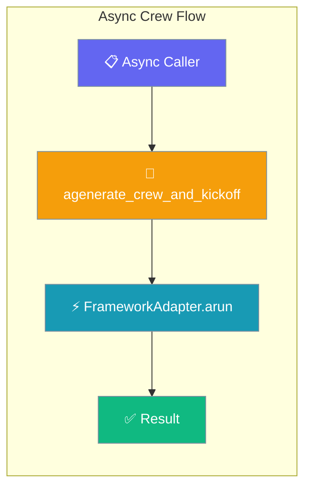
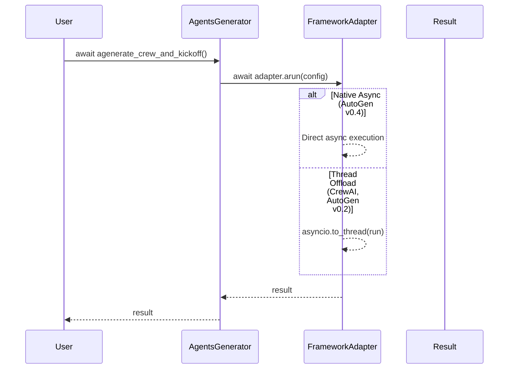
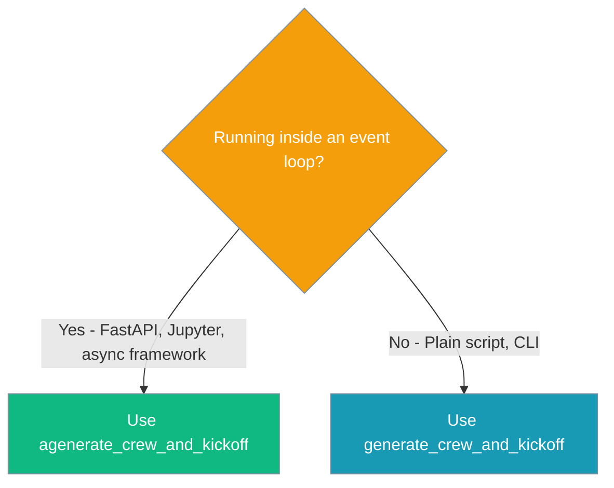

Run a PraisonAI crew from inside a running event loop — FastAPI, Jupyter, Discord bots — without `asyncio.run()`.



## Quick Start

<Steps>
<Step title="FastAPI Route">
The headline use case — running crews inside FastAPI routes without blocking the event loop:

```python
from fastapi import FastAPI
from praisonai import PraisonAI

app = FastAPI()

@app.post("/run")
async def run_crew(topic: str):
    praison = PraisonAI(agent_file="agents.yaml")
    result = await praison.agenerate_crew_and_kickoff()
    return {"result": result}
```
</Step>

<Step title="Jupyter Notebook">
Works in Jupyter cells where `asyncio.run()` would fail:

```python
from praisonai import PraisonAI

praison = PraisonAI(agent_file="agents.yaml")
result = await praison.agenerate_crew_and_kickoff()
print(result)
```
</Step>
</Steps>

---

## How It Works



| Path | Method | When Used |
|------|--------|-----------|
| **Sync** | `generate_crew_and_kickoff()` | Plain scripts, CLI usage |
| **Async** | `agenerate_crew_and_kickoff()` | FastAPI, Jupyter, event loop contexts |

---

## When to use which



---

## Common Patterns

### FastAPI Background Task

```python
from fastapi import FastAPI, BackgroundTasks
from praisonai import PraisonAI

app = FastAPI()

async def run_crew_background(topic: str):
    praison = PraisonAI(agent_file="agents.yaml")
    result = await praison.agenerate_crew_and_kickoff()
    # Store result in database, send notification, etc.

@app.post("/start-crew")
async def start_crew(topic: str, background_tasks: BackgroundTasks):
    background_tasks.add_task(run_crew_background, topic)
    return {"message": "Crew started"}
```

### Concurrent Crew Execution

```python
import asyncio
from praisonai import PraisonAI

async def run_multiple_crews():
    crews = [
        PraisonAI(agent_file="research.yaml"),
        PraisonAI(agent_file="analysis.yaml"),
        PraisonAI(agent_file="summary.yaml")
    ]
    
    # Run all crews concurrently
    results = await asyncio.gather(*[
        crew.agenerate_crew_and_kickoff() for crew in crews
    ])
    
    return results
```

---

## Best Practices

<AccordionGroup>
<Accordion title="Prefer async entry point over wrapping sync">
Use `agenerate_crew_and_kickoff()` instead of wrapping the sync version:

```python
# ✅ Good
result = await praison.agenerate_crew_and_kickoff()

# ❌ Avoid
result = await asyncio.run(praison.generate_crew_and_kickoff())
```
</Accordion>

<Accordion title="Use asyncio.gather for concurrent crews">
When running multiple crews, use `asyncio.gather` for parallel execution:

```python
# ✅ Concurrent execution
results = await asyncio.gather(*[
    crew1.agenerate_crew_and_kickoff(),
    crew2.agenerate_crew_and_kickoff()
])

# ❌ Sequential execution
result1 = await crew1.agenerate_crew_and_kickoff()
result2 = await crew2.agenerate_crew_and_kickoff()
```
</Accordion>

<Accordion title="Async-native frameworks skip thread offload automatically">
AutoGen v0.4 runs natively async with no configuration needed:

```python
# Works with any framework - AutoGen v0.4 is async-native,
# CrewAI/AutoGen v0.2 use thread offload transparently
praison = PraisonAI(agent_file="agents.yaml", framework="autogen_v4")
result = await praison.agenerate_crew_and_kickoff()
```
</Accordion>

<Accordion title="Handle errors gracefully in async contexts">
Wrap async crew execution in try-catch blocks:

```python
try:
    result = await praison.agenerate_crew_and_kickoff()
except Exception as e:
    logger.error(f"Crew execution failed: {e}")
    return {"error": str(e)}
```
</Accordion>
</AccordionGroup>

---

## Related

<CardGroup cols={2}>
<Card title="Async Bridge" icon="link" href="/docs/features/async-bridge">
  Lower-level async utilities and bridging functions
</Card>
<Card title="Framework Adapter Plugins" icon="puzzle-piece" href="/docs/features/framework-adapter-plugins">
  Custom framework adapters with async support
</Card>
</CardGroup>