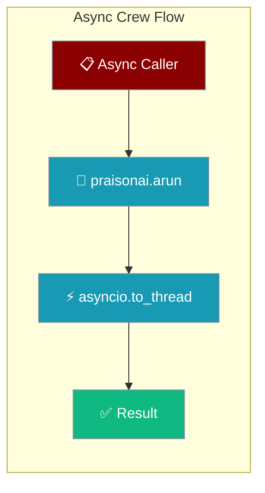
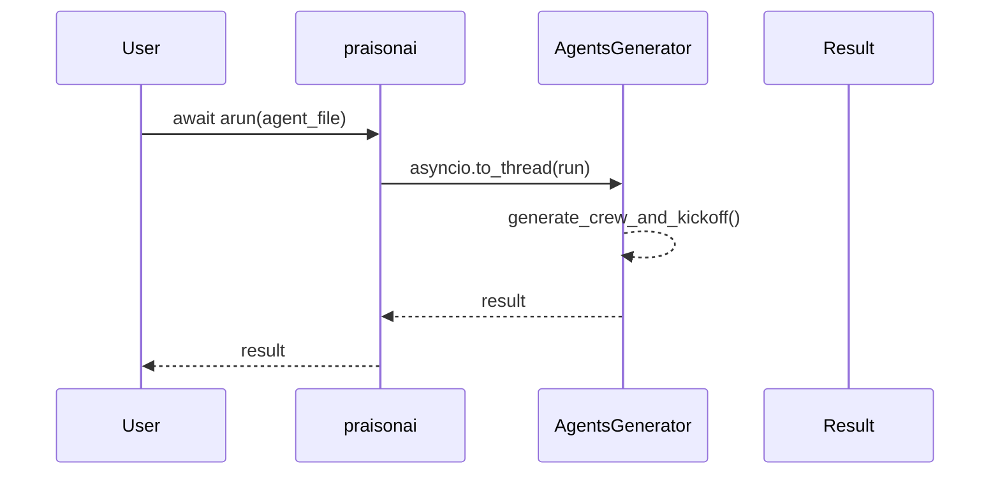
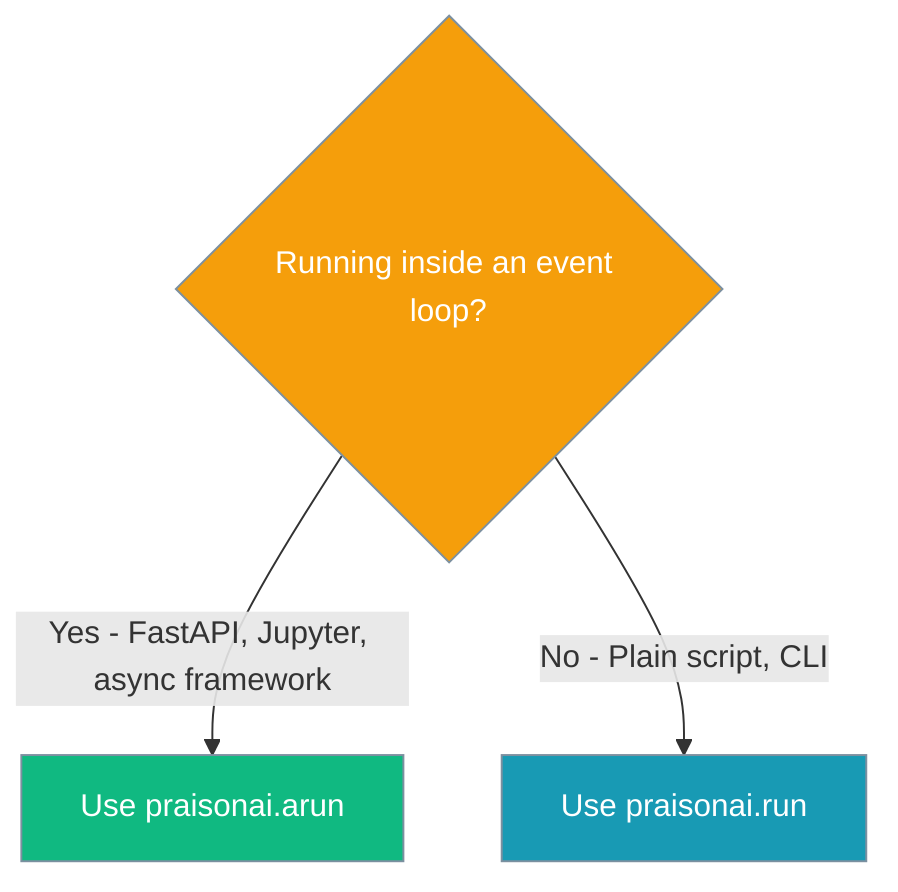

Run a PraisonAI crew from inside a running event loop — FastAPI, Jupyter, Discord bots — without `asyncio.run()`.



## Quick Start

<Steps>
<Step title="FastAPI Route">
The headline use case — running crews inside FastAPI routes without blocking the event loop:

```python
from fastapi import FastAPI
import praisonai

app = FastAPI()

@app.post("/run")
async def run_crew():
    result = await praisonai.arun(agent_file="agents.yaml")
    return {"result": result}
```
</Step>

<Step title="Jupyter Notebook">
Works in Jupyter cells where `asyncio.run()` would fail:

```python
import praisonai

result = await praisonai.arun(agent_file="agents.yaml")
print(result)
```
</Step>
</Steps>

---

## How It Works



| Function | Method | When Used |
|----------|--------|-----------|
| **Sync** | `praisonai.run()` | Plain scripts, CLI usage |
| **Async** | `praisonai.arun()` | FastAPI, Jupyter, event loop contexts |

---

## Configuration Options

| Option | Type | Default | Description |
|--------|------|---------|-------------|
| `agent_file` | `str` | Required | Path to the agent YAML file |
| `framework` | `str` | `None` | Framework to use (auto-detected if None) |
| `tools` | `list` | `None` | Additional tools to make available |
| `agent_yaml` | `str` | `None` | Direct YAML content as string |
| `cli_config` | `dict` | `None` | CLI configuration overrides |

---

## When to use which



---

## Common Patterns

### FastAPI Background Task

```python
import asyncio
import praisonai
from fastapi import FastAPI, BackgroundTasks

app = FastAPI()

async def run_crew_background():
    result = await praisonai.arun(agent_file="agents.yaml")
    # Store result in database, send notification, etc.
    print(f"Background crew completed: {result}")

@app.post("/start-crew")
async def start_crew(background_tasks: BackgroundTasks):
    background_tasks.add_task(run_crew_background)
    return {"message": "Crew started"}
```

### Concurrent Crew Execution

```python
import asyncio
import praisonai

async def run_multiple_crews():
    # Run all crews concurrently
    results = await asyncio.gather(
        praisonai.arun(agent_file="research.yaml"),
        praisonai.arun(agent_file="analysis.yaml"),
        praisonai.arun(agent_file="summary.yaml")
    )
    
    return results
```

---

## Best Practices

<AccordionGroup>
<Accordion title="Prefer async entry point over wrapping sync">
Use `praisonai.arun()` instead of wrapping the sync version:

```python
import asyncio
import praisonai

# ✅ Good - proper async entry point
result = await praisonai.arun(agent_file="agents.yaml")

# ❌ Avoid - wrapping sync call (this won't work inside event loop)
# result = asyncio.run(praisonai.run(agent_file="agents.yaml"))
```
</Accordion>

<Accordion title="Use asyncio.gather for concurrent crews">
When running multiple crews, use `asyncio.gather` for parallel execution:

```python
import asyncio
import praisonai

# ✅ Concurrent execution
crew1_task = praisonai.arun(agent_file="crew1.yaml")
crew2_task = praisonai.arun(agent_file="crew2.yaml")
results = await asyncio.gather(crew1_task, crew2_task)

# ❌ Sequential execution (slower)
result1 = await praisonai.arun(agent_file="crew1.yaml")
result2 = await praisonai.arun(agent_file="crew2.yaml")
```
</Accordion>

<Accordion title="Framework auto-detection works in async mode">
All supported frameworks work transparently with async execution:

```python
import praisonai

# Works with any framework - auto-detected or explicit
result = await praisonai.arun(agent_file="agents.yaml", framework="crewai")
```
</Accordion>

<Accordion title="Handle errors gracefully in async contexts">
Wrap async crew execution in try-catch blocks:

```python
import asyncio
import logging
import praisonai

logging.basicConfig(level=logging.INFO)
logger = logging.getLogger(__name__)

async def safe_crew_run():
    try:
        result = await praisonai.arun(agent_file="agents.yaml")
        return {"success": True, "result": result}
    except Exception as e:
        logger.error(f"Crew execution failed: {e}")
        return {"success": False, "error": str(e)}
```
</Accordion>
</AccordionGroup>

---

## Related

<CardGroup cols={2}>
<Card title="Async Bridge" icon="link" href="/docs/features/async-bridge">
  Lower-level async utilities and bridging functions
</Card>
<Card title="Framework Adapter Plugins" icon="puzzle-piece" href="/docs/features/framework-adapter-plugins">
  Custom framework adapters with async support
</Card>
</CardGroup>