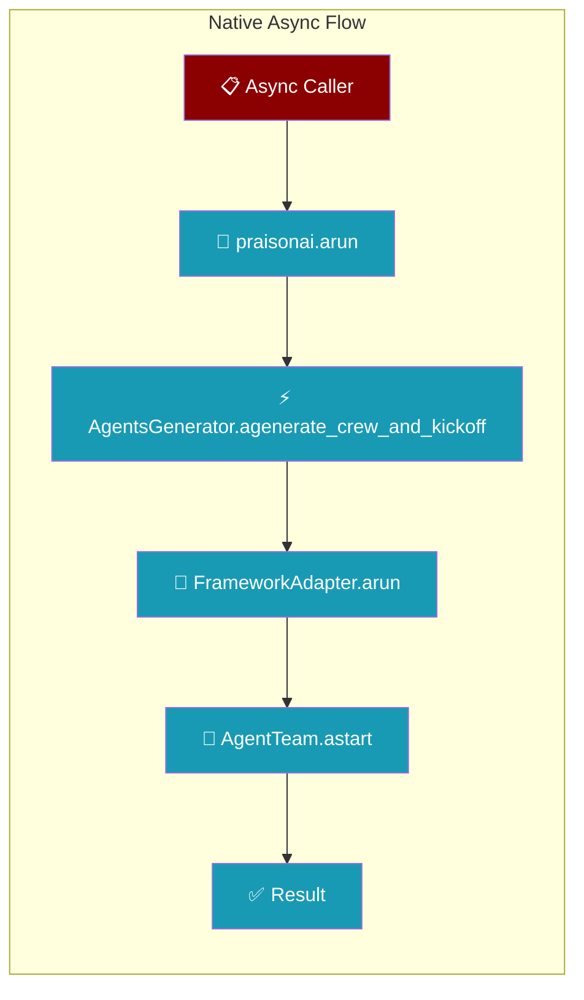
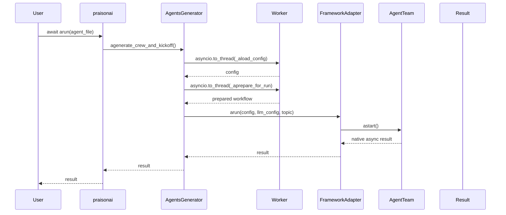

```python
from praisonaiagents import Agent
import asyncio

agent = Agent(name="async-agent", instructions="Process tasks asynchronously.")

async def main():
    result = await agent.astart("Run this task asynchronously.")
    print(result)

asyncio.run(main())
```


Run PraisonAI crews with native async execution from FastAPI, Jupyter, Discord bots, and other event loop contexts.
The user awaits `agent.astart()` from an async app; the crew kickoff runs natively on the event loop without thread offload.




## Quick Start

<Steps>
<Step title="FastAPI Route">
Native async execution — no worker threads, true cooperative multitasking:

```python
from fastapi import FastAPI
import praisonai

app = FastAPI()

@app.post("/run")
async def run_crew():
    result = await praisonai.arun(agent_file="agents.yaml")
    return {"result": result}
```
</Step>

<Step title="Jupyter Notebook">
Works directly in async cells without blocking:

```python
import praisonai

result = await praisonai.arun(agent_file="agents.yaml")
print(result)
```
</Step>
</Steps>

---

## How It Works



### Non-blocking startup

Config loading, adapter setup, and workflow preparation run in a worker thread via `asyncio.to_thread`, so a slow disk read or heavy adapter import never stalls the event loop.

The `_aload_config` and `_aprepare_for_run` helpers wrap the blocking `open()` / `yaml.safe_load` / adapter setup calls, keeping the loop free to serve other requests while startup work runs off-thread.

<Info>
**Sync/Async Parity:** As of PR #1870, sync and async kickoff paths share the same prep logic (AutoGen version selection, AgentOps init, cli_backend validation), so behavior is identical between `generate_crew_and_kickoff()` and `agenerate_crew_and_kickoff()`.
</Info>

<Info>
**Extended in [PR #2738](https://github.com/MervinPraison/PraisonAI/pull/2738):** Config validation, merge, and dump logic live in a single `_build_yaml_workflow` builder shared by both paths, so sync and async behavior can no longer drift apart.
</Info>

### What's actually async

| Adapter | Async path | Notes |
|---------|------------|-------|
| `praisonai` (praisonaiagents) | Native — `AgentTeam.astart()` | True cooperative async |
| `crewai` | Thread offload (default fallback) | Until CrewAI exposes async |
| `autogen` / `ag2` | Thread offload (default fallback) | Adapter-specific implementation |

### Workflow mode

YAML files with `process: workflow` also run natively async via `YAMLWorkflowParser` + `workflow.astart()` — no extra configuration needed.

---

## Configuration Options

| Option | Type | Default | Description |
|--------|------|---------|-------------|
| `agent_file` | `str` | Required | Path to the agent YAML file |
| `framework` | `str` | `None` | Framework to use (auto-detected if None) |
| `tools` | `list` | `None` | Additional tools to make available |
| `agent_yaml` | `str` | `None` | Direct YAML content as string |
| `cli_config` | `dict` | `None` | CLI configuration overrides |

---

## Common Patterns

### FastAPI Background Task

```python
import asyncio
import praisonai
from fastapi import FastAPI, BackgroundTasks

app = FastAPI()

async def run_crew_background():
    result = await praisonai.arun(agent_file="agents.yaml")
    # Store result in database, send notification, etc.
    print(f"Background crew completed: {result}")

@app.post("/start-crew")
async def start_crew(background_tasks: BackgroundTasks):
    background_tasks.add_task(run_crew_background)
    return {"message": "Crew started"}
```

### Concurrent Crew Execution

```python
import asyncio
import praisonai

async def run_multiple_crews():
    # Run all crews concurrently with true async
    results = await asyncio.gather(
        praisonai.arun(agent_file="research.yaml"),
        praisonai.arun(agent_file="analysis.yaml"),
        praisonai.arun(agent_file="summary.yaml")
    )
    
    return results
```

---

## Best Practices

<AccordionGroup>
<Accordion title="Cancellation and timeouts propagate">
Under native async, `asyncio.CancelledError` and `asyncio.wait_for` now actually cancel SDK work instead of being trapped behind a worker thread:

```python
import asyncio
import praisonai

async def cancelable_crew():
    try:
        # This will properly cancel if timeout is reached
        result = await asyncio.wait_for(
            praisonai.arun(agent_file="agents.yaml"),
            timeout=30.0
        )
        return result
    except asyncio.TimeoutError:
        print("Crew execution timed out and was cancelled")
        return None
```
</Accordion>

<Accordion title="Use asyncio.gather for concurrent crews">
When running multiple crews, use `asyncio.gather` for parallel execution:

```python
import asyncio
import praisonai

# ✅ Concurrent execution with native async
crew1_task = praisonai.arun(agent_file="crew1.yaml")
crew2_task = praisonai.arun(agent_file="crew2.yaml")
results = await asyncio.gather(crew1_task, crew2_task)

# ❌ Sequential execution (slower)
result1 = await praisonai.arun(agent_file="crew1.yaml")
result2 = await praisonai.arun(agent_file="crew2.yaml")
```
</Accordion>

<Accordion title="Framework detection works transparently">
All supported frameworks work with async execution — praisonai-native uses true async, others fall back to thread offload automatically:

```python
import praisonai

# Native async for praisonai, thread offload for crewai
result = await praisonai.arun(agent_file="agents.yaml", framework="praisonai")
```
</Accordion>

<Accordion title="Handle errors gracefully in async contexts">
Wrap async crew execution in try-catch blocks:

```python
import asyncio
import logging
import praisonai

logging.basicConfig(level=logging.INFO)
logger = logging.getLogger(__name__)

async def safe_crew_run():
    try:
        result = await praisonai.arun(agent_file="agents.yaml")
        return {"success": True, "result": result}
    except Exception as e:
        logger.error(f"Crew execution failed: {e}")
        return {"success": False, "error": str(e)}
```
</Accordion>
</AccordionGroup>

---

## Related

<CardGroup cols={2}>
<Card title="YAML Template Variables" icon="code" href="/docs/features/yaml-template-variables">
  Use {topic} placeholders safely alongside JSON literals
</Card>
<Card title="Framework Adapter Plugins" icon="puzzle-piece" href="/docs/features/framework-adapter-plugins">
  Custom framework adapters with async support
</Card>
</CardGroup>