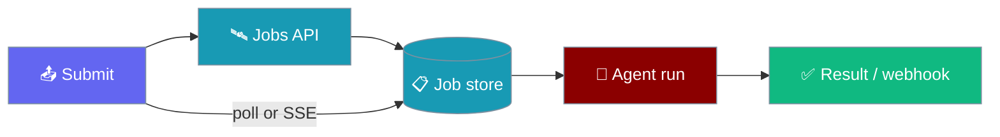

```python
from praisonaiagents import Agent
import asyncio

agent = Agent(name="job-agent", instructions="Run background jobs asynchronously.")

async def main():
    job = await agent.astart("Start a long-running background job.")
    print(job)

asyncio.run(main())
```


Submit long-running agent tasks and recipes, then retrieve results asynchronously via a jobs server.

The user submits a long job; the agent runs asynchronously and returns when the job completes.



## Quick Start

<Steps>
<Step title="Submit via recipe helper">

```python
from praisonai import recipe

job = recipe.submit_job(
    "my-recipe",
    input={"query": "What is AI?"},
    config={"max_tokens": 1000},
    session_id="session_123",
    timeout_sec=3600,
    api_url="http://127.0.0.1:8005",
)

print(f"Job ID: {job.job_id}")
result = job.wait(poll_interval=5, timeout=300)
print(f"Result: {result}")
```

</Step>
<Step title="Submit via HTTP API">

```python
import httpx

API_URL = "http://127.0.0.1:8005"
response = httpx.post(f"{API_URL}/api/v1/runs", json={"prompt": "Analyze data"})
job_id = response.json()["job_id"]
status = httpx.get(f"{API_URL}/api/v1/runs/{job_id}").json()
result = httpx.get(f"{API_URL}/api/v1/runs/{job_id}/result").json()
```

</Step>
</Steps>

## Start Server

```bash
python -m uvicorn praisonai.jobs.server:create_app --port 8005 --factory
```

## Submit Job

```python
import httpx

response = httpx.post(
    "http://127.0.0.1:8005/api/v1/runs",
    json={"prompt": "Your task here"}
)
job_id = response.json()["job_id"]
```

## Idempotency

```python
response = httpx.post(
    "http://127.0.0.1:8005/api/v1/runs",
    json={"prompt": "Task"},
    headers={"Idempotency-Key": "unique-key-123"}
)
```

<Note>
Since [PR #1673](https://github.com/MervinPraison/PraisonAI/pull/1673), the in-process store is safe to read concurrently with writes. You can safely share a single `InMemoryJobStore` instance between the FastAPI app and background tasks that periodically read stats.
</Note>

## Polling

```python
import time

def wait_for_completion(job_id):
    while True:
        status = httpx.get(f"http://127.0.0.1:8005/api/v1/runs/{job_id}").json()
        if status["status"] in ("succeeded", "failed", "cancelled"):
            return status
        time.sleep(status.get("retry_after", 2))
```

## SSE Streaming

```python
with httpx.stream("GET", f"http://127.0.0.1:8005/api/v1/runs/{job_id}/stream") as r:
    for line in r.iter_lines():
        if line.startswith("data:"):
            print(line[5:])
```

## Webhook Callback

```python
response = httpx.post(
    "http://127.0.0.1:8005/api/v1/runs",
    json={
        "prompt": "Task",
        "webhook_url": "https://example.com/callback"
    }
)
```

## Session Grouping

```python
for task in tasks:
    httpx.post(
        "http://127.0.0.1:8005/api/v1/runs",
        json={"prompt": task, "session_id": "project-alpha"}
    )
```

## Cancel Job

```python
httpx.post(f"http://127.0.0.1:8005/api/v1/runs/{job_id}/cancel")
```

## List Jobs

```python
jobs = httpx.get("http://127.0.0.1:8005/api/v1/runs").json()
```

## Complete Example

```python
import httpx
import time

API_URL = "http://127.0.0.1:8005"

def submit_and_wait(prompt):
    # Submit
    response = httpx.post(f"{API_URL}/api/v1/runs", json={"prompt": prompt})
    job_id = response.json()["job_id"]
    
    # Wait
    while True:
        status = httpx.get(f"{API_URL}/api/v1/runs/{job_id}").json()
        if status["status"] == "succeeded":
            return httpx.get(f"{API_URL}/api/v1/runs/{job_id}/result").json()
        elif status["status"] in ("failed", "cancelled"):
            raise Exception(f"Job {status['status']}")
        time.sleep(2)

result = submit_and_wait("What is 2+2?")
print(result["result"])
```

## CLI Usage

```bash
# Start the jobs server
python -m uvicorn praisonai.jobs.server:create_app --port 8005 --factory

# Submit a job
praisonai run submit "Analyze this data"

# Submit a recipe as job
praisonai run submit "Analyze AI trends" --recipe news-analyzer

# With recipe config
praisonai run submit "Analyze" --recipe analyzer --recipe-config '{"format": "json"}'

# Wait for completion
praisonai run submit "Quick task" --wait

# Stream progress
praisonai run submit "Long task" --stream

# Check status
praisonai run status <job_id>

# Get result
praisonai run result <job_id>

# List jobs
praisonai run list

# Cancel job
praisonai run cancel <job_id>
```

---

## Best Practices

<AccordionGroup>
  <Accordion title="Use idempotency keys for retries">
    Pass `Idempotency-Key` (HTTP) or `idempotency_key=` (recipe helper) so duplicate submits return the same job instead of duplicating work.
  </Accordion>
  <Accordion title="Prefer webhooks for long jobs">
    For runs over a few minutes, set `webhook_url` and let your service react to completion instead of holding an open poll loop.
  </Accordion>
  <Accordion title="Group related jobs with session_id">
    Use a shared `session_id` per project so list/filter endpoints stay organised in dashboards.
  </Accordion>
  <Accordion title="Start the jobs server before integration tests">
    `python -m uvicorn praisonai.jobs.server:create_app --port 8005 --factory` — the in-process store is safe for concurrent reads after PR #1673.
  </Accordion>
</AccordionGroup>

---

## Related

<CardGroup cols={2}>
  <Card icon="clock" href="/features/background-tasks" title="Background Tasks">
    Run agent work in-process without a separate jobs server.
  </Card>
  <Card icon="terminal" href="/docs/cli/async-jobs" title="Async Jobs CLI">
    Submit, stream, and cancel jobs from the terminal.
  </Card>
</CardGroup>
