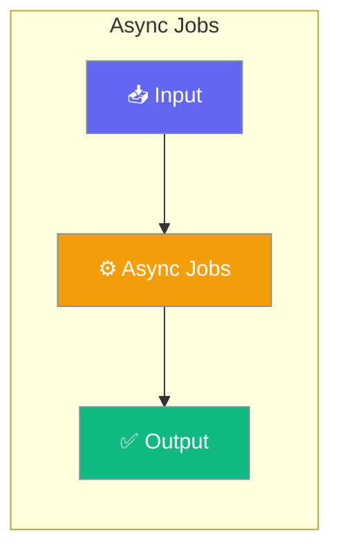

Submit long-running agent tasks and recipes, then retrieve results asynchronously via a jobs server.




## Quick Start


<Steps>
<Step title="Simple Usage">
### Using Recipe Operations

```python
from praisonai import recipe

# Submit recipe as async job
job = recipe.submit_job(
    "my-recipe",
    input={"query": "What is AI?"},
    config={"max_tokens": 1000},
    session_id="session_123",
    timeout_sec=3600,
    webhook_url="https://example.com/webhook",
    idempotency_key="unique-key-123",
    api_url="http://127.0.0.1:8005",
)

print(f"Job ID: {job.job_id}")
print(f"Status: {job.status}")

# Wait for completion
result = job.wait(poll_interval=5, timeout=300)
print(f"Result: {result}")
```
</Step>

<Step title="With Configuration">
### Using HTTP API Directly

```python
import httpx

API_URL = "http://127.0.0.1:8005"

# Submit job
response = httpx.post(f"{API_URL}/api/v1/runs", json={"prompt": "Analyze data"})
job = response.json()
job_id = job["job_id"]

# Check status
status = httpx.get(f"{API_URL}/api/v1/runs/{job_id}").json()

# Get result
result = httpx.get(f"{API_URL}/api/v1/runs/{job_id}/result").json()
```
</Step>
</Steps>


## Best Practices

<AccordionGroup>
  <Accordion title="Start simple">
    Enable the feature with a single parameter before adding configuration. Verify it works, then layer in options.
  </Accordion>
  <Accordion title="Use environment variables for secrets">
    Never hardcode API keys or tokens. Use `os.getenv("KEY_NAME")` to read from environment variables.
  </Accordion>
  <Accordion title="Test with minimal examples first">
    Copy the Quick Start example, run it, then extend it. This confirms your environment is set up correctly.
  </Accordion>
  <Accordion title="Check the logs">
    Set `verbose=True` on your agent to see detailed execution logs when debugging unexpected behavior.
  </Accordion>
</AccordionGroup>

## Related

<CardGroup cols={2}>
  <Card title="Features Overview" icon="grid-2" href="/docs/features">
    Browse all PraisonAI features
  </Card>
  <Card title="Quick Start" icon="rocket" href="/docs/introduction">
    Get started with PraisonAI agents
  </Card>
</CardGroup>
