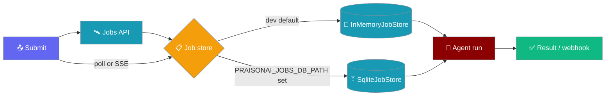
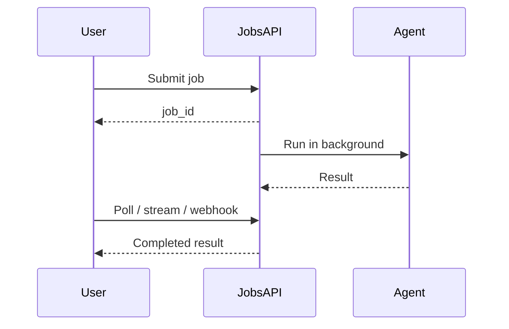
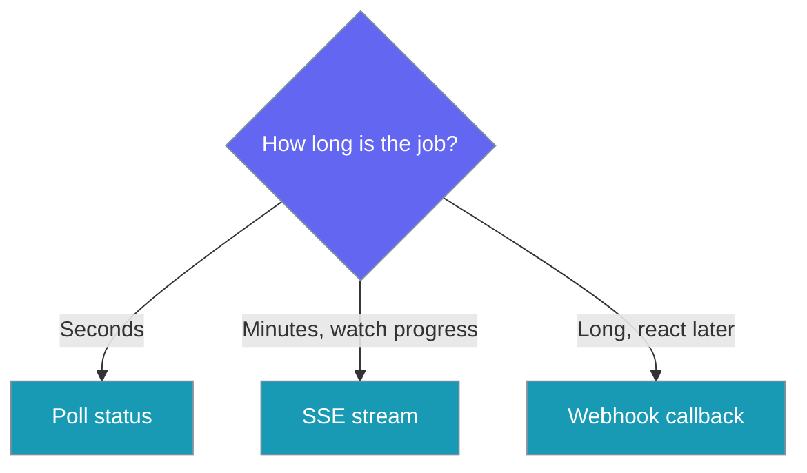
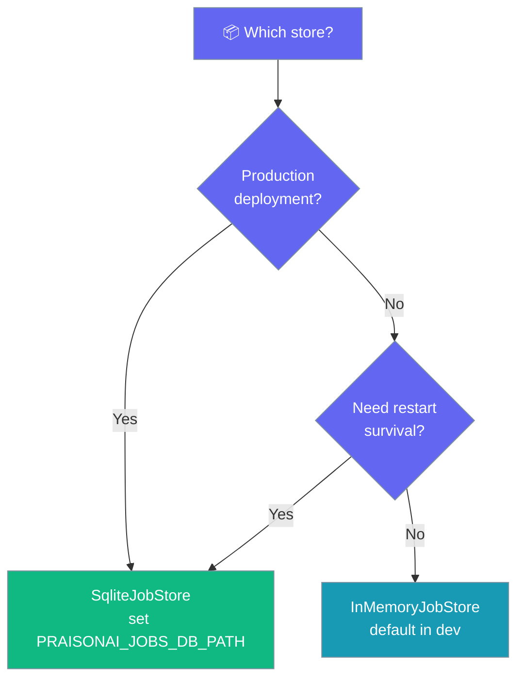
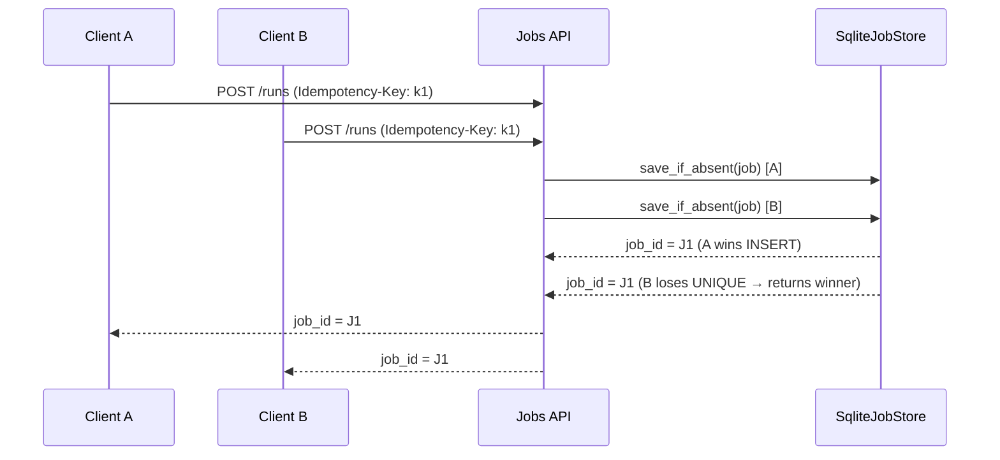
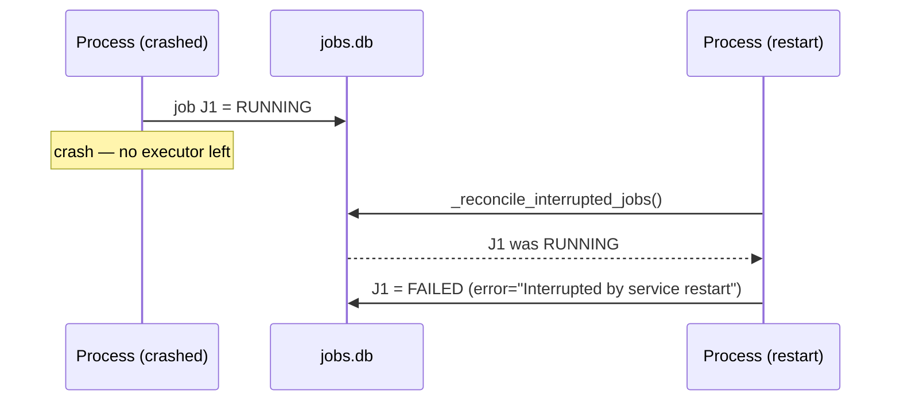

```python
from praisonaiagents import Agent
import asyncio

agent = Agent(name="job-agent", instructions="Run background jobs asynchronously.")

async def main():
    job = await agent.astart("Start a long-running background job.")
    print(job)

asyncio.run(main())
```


Submit long-running agent tasks and recipes, then retrieve results asynchronously via a jobs server.

The user submits a long job; the agent runs asynchronously and returns when the job completes.


```mermaid
graph LR
    Client[📤 Submit] --> API[🛰️ Jobs API]
    API --> Store{📋 Job store}
    Store -->|dev default| Mem[(🧪 InMemoryJobStore)]
    Store -->|PRAISONAI_JOBS_DB_PATH set| SQL[(🗄️ SqliteJobStore)]
    Mem --> Worker[🤖 Agent run]
    SQL --> Worker
    Worker --> Result[✅ Result / webhook]
    Client -->|poll or SSE| Store

    classDef agent fill:#8B0000,stroke:#7C90A0,color:#fff
    classDef tool fill:#189AB4,stroke:#7C90A0,color:#fff
    classDef ok fill:#10B981,stroke:#7C90A0,color:#fff
    classDef input fill:#6366F1,stroke:#7C90A0,color:#fff
    classDef warn fill:#F59E0B,stroke:#7C90A0,color:#fff
    class Worker agent
    class API,Mem,SQL tool
    class Store warn
    class Result ok
    class Client input

```

## How It Works

The user submits a job, the server runs it in the background, and the result comes back on completion.


```mermaid
sequenceDiagram
    participant User
    participant JobsAPI
    participant Agent

    User->>JobsAPI: Submit job
    JobsAPI-->>User: job_id
    JobsAPI->>Agent: Run in background
    Agent-->>JobsAPI: Result
    User->>JobsAPI: Poll / stream / webhook
    JobsAPI-->>User: Completed result
```

## Choose a Result Mode

Pick how the result is delivered once the job finishes.


```mermaid
graph TB
    Q{How long is the job?} -->|Seconds| P[Poll status]
    Q -->|Minutes, watch progress| S[SSE stream]
    Q -->|Long, react later| W[Webhook callback]

    classDef config fill:#6366F1,stroke:#7C90A0,color:#fff
    classDef tool fill:#189AB4,stroke:#7C90A0,color:#fff

    class Q config
    class P,S,W tool
```

## Quick Start

<Steps>
<Step title="Submit via recipe helper">

```python
from praisonai import recipe

job = recipe.submit_job(
    "my-recipe",
    input={"query": "What is AI?"},
    config={"max_tokens": 1000},
    session_id="session_123",
    timeout_sec=3600,
    api_url="http://127.0.0.1:8005",
)

print(f"Job ID: {job.job_id}")
result = job.wait(poll_interval=5, timeout=300)
print(f"Result: {result}")
```

</Step>
<Step title="Submit via HTTP API">

```python
import httpx

API_URL = "http://127.0.0.1:8005"
response = httpx.post(f"{API_URL}/api/v1/runs", json={"prompt": "Analyze data"})
job_id = response.json()["job_id"]
status = httpx.get(f"{API_URL}/api/v1/runs/{job_id}").json()
result = httpx.get(f"{API_URL}/api/v1/runs/{job_id}/result").json()
```

</Step>
</Steps>

## Persistent Store

Point the Jobs API at a SQLite file so job state and idempotency keys survive restarts — no code change, just one env var.

```python
from praisonaiagents import Agent

agent = Agent(
    name="job-agent",
    instructions="Answer research questions.",
)
# Run under a persistent Jobs API — no code change needed.
# export PRAISONAI_JOBS_DB_PATH=/var/lib/praisonai/jobs.db
# praisonai serve --port 8005
```

Construct the store yourself when you want explicit control:

```python
from praisonai.jobs import SqliteJobStore, create_app

app = create_app(store=SqliteJobStore(path="/var/lib/praisonai/jobs.db"))
```

`SqliteJobStore` and `create_app` are both exported from `praisonai.jobs`. `_build_default_store()` in `praisonai/jobs/server.py` selects the backend from the environment:

| Env var | Default | Effect |
|---|---|---|
| `PRAISONAI_JOBS_DB_PATH` | *(unset)* | When set, boot the Jobs API on `SqliteJobStore(path=...)`. When unset, fall back to `InMemoryJobStore` unless `ENVIRONMENT=production`. |
| `ENVIRONMENT` | *(unset)* | If `production` **and** `PRAISONAI_JOBS_DB_PATH` is unset, `create_app()` refuses to start (raises `RuntimeError`). |
| `PRAISONAI_MAX_CONCURRENT_JOBS` | `10` | Executor concurrency cap. |
| `PRAISONAI_JOB_TIMEOUT` | `3600` | Default per-job timeout, seconds. |
| `PRAISONAI_JOBS_API_KEY` | *(unset)* | Required when binding to a non-loopback host. |
| `PRAISONAI_JOBS_BIND_HOST` | `127.0.0.1` | Listen address. |

### Which store should I use?


```mermaid
graph TB
    Start[📦 Which store?] --> Prod{Production<br/>deployment?}
    Prod -->|Yes| SQL[SqliteJobStore<br/>set PRAISONAI_JOBS_DB_PATH]
    Prod -->|No| Dev{Need restart<br/>survival?}
    Dev -->|Yes| SQL
    Dev -->|No| Mem[InMemoryJobStore<br/>default in dev]

    classDef question fill:#6366F1,stroke:#7C90A0,color:#fff
    classDef answer fill:#10B981,stroke:#7C90A0,color:#fff
    classDef store fill:#189AB4,stroke:#7C90A0,color:#fff

    class Start,Prod,Dev question
    class SQL answer
    class Mem store
```

<Warning>
In production the Jobs API refuses to boot on the in-memory store. `_build_default_store()` raises `RuntimeError` with this message:

> Jobs API refused to start with the in-memory store in production. Set PRAISONAI_JOBS_DB_PATH (e.g. /var/lib/praisonai/jobs.db) to persist jobs and idempotency keys across restarts, or explicitly pass store=InMemoryJobStore() to create_app().

The check fires only when `ENVIRONMENT=production` **and** `PRAISONAI_JOBS_DB_PATH` is unset. Passing `store=InMemoryJobStore()` explicitly to `create_app()` bypasses the guard — the documented escape hatch for ephemeral production workloads that accept losing job state on restart.
</Warning>

### Atomic Idempotency

`JobStore` exposes `save_if_absent(job)` so a duplicate submit resolves to a single job and side effects run exactly once.

- The default `InMemoryJobStore` implementation is a best-effort check-then-save: it looks up the idempotency key, then inserts if absent.
- `SqliteJobStore` overrides `save_if_absent()` to be **truly atomic** via a `UNIQUE` index on `idempotency_key`. Two concurrent submits with the same key race on the `INSERT`; the loser catches `IntegrityError` and returns the winning job, so both callers receive the same `job_id`.
- NULL idempotency keys are exempt from SQLite's `UNIQUE` constraint, so keyless jobs are never de-duplicated against each other.


```mermaid
sequenceDiagram
    participant ClientA as Client A
    participant ClientB as Client B
    participant API as Jobs API
    participant Store as SqliteJobStore

    ClientA->>API: POST /runs (Idempotency-Key: k1)
    ClientB->>API: POST /runs (Idempotency-Key: k1)
    API->>Store: save_if_absent(job) [A]
    API->>Store: save_if_absent(job) [B]
    Store-->>API: job_id = J1 (A wins INSERT)
    Store-->>API: job_id = J1 (B loses UNIQUE → returns winner)
    API-->>ClientA: job_id = J1
    API-->>ClientB: job_id = J1
```

### Restart Recovery

On `SqliteJobStore` startup, `_reconcile_interrupted_jobs()` marks any row still in `QUEUED` or `RUNNING` as `FAILED`, with `error="Interrupted by service restart"` and `completed_at=now`.

A crashed executor leaves no worker to resume its in-flight jobs, so those rows would otherwise poll forever and pin an idempotency key to a job that can never complete. Terminal reconciliation gives callers — and idempotent retries — a definitive outcome.


```mermaid
sequenceDiagram
    participant Old as Process (crashed)
    participant DB as jobs.db
    participant New as Process (restart)

    Old->>DB: job J1 = RUNNING
    Note over Old: crash — no executor left
    New->>DB: _reconcile_interrupted_jobs()
    DB-->>New: J1 was RUNNING
    New->>DB: J1 = FAILED (error="Interrupted by service restart")
```

## Start Server

```bash
python -m uvicorn praisonai.jobs.server:create_app --port 8005 --factory
```

## Submit Job

```python
import httpx

response = httpx.post(
    "http://127.0.0.1:8005/api/v1/runs",
    json={"prompt": "Your task here"}
)
job_id = response.json()["job_id"]
```

## Idempotency

```python
response = httpx.post(
    "http://127.0.0.1:8005/api/v1/runs",
    json={"prompt": "Task"},
    headers={"Idempotency-Key": "unique-key-123"}
)
```

<Note>
Since [PR #1673](https://github.com/MervinPraison/PraisonAI/pull/1673), the in-process store is safe to read concurrently with writes. You can safely share a single `InMemoryJobStore` instance between the FastAPI app and background tasks that periodically read stats.
</Note>

## Polling

```python
import time

def wait_for_completion(job_id):
    while True:
        status = httpx.get(f"http://127.0.0.1:8005/api/v1/runs/{job_id}").json()
        if status["status"] in ("succeeded", "failed", "cancelled"):
            return status
        time.sleep(status.get("retry_after", 2))
```

## SSE Streaming

```python
with httpx.stream("GET", f"http://127.0.0.1:8005/api/v1/runs/{job_id}/stream") as r:
    for line in r.iter_lines():
        if line.startswith("data:"):
            print(line[5:])
```

## Webhook Callback

```python
response = httpx.post(
    "http://127.0.0.1:8005/api/v1/runs",
    json={
        "prompt": "Task",
        "webhook_url": "https://example.com/callback"
    }
)
```

## Session Grouping

```python
for task in tasks:
    httpx.post(
        "http://127.0.0.1:8005/api/v1/runs",
        json={"prompt": task, "session_id": "project-alpha"}
    )
```

## Cancel Job

```python
httpx.post(f"http://127.0.0.1:8005/api/v1/runs/{job_id}/cancel")
```

## List Jobs

```python
jobs = httpx.get("http://127.0.0.1:8005/api/v1/runs").json()
```

## Complete Example

```python
import httpx
import time

API_URL = "http://127.0.0.1:8005"

def submit_and_wait(prompt):
    # Submit
    response = httpx.post(f"{API_URL}/api/v1/runs", json={"prompt": prompt})
    job_id = response.json()["job_id"]
    
    # Wait
    while True:
        status = httpx.get(f"{API_URL}/api/v1/runs/{job_id}").json()
        if status["status"] == "succeeded":
            return httpx.get(f"{API_URL}/api/v1/runs/{job_id}/result").json()
        elif status["status"] in ("failed", "cancelled"):
            raise Exception(f"Job {status['status']}")
        time.sleep(2)

result = submit_and_wait("What is 2+2?")
print(result["result"])
```

## CLI Usage

```bash
# Start the jobs server
python -m uvicorn praisonai.jobs.server:create_app --port 8005 --factory

# Submit a job
praisonai run submit "Analyze this data"

# Submit a recipe as job
praisonai run submit "Analyze AI trends" --recipe news-analyzer

# With recipe config
praisonai run submit "Analyze" --recipe analyzer --recipe-config '{"format": "json"}'

# Wait for completion
praisonai run submit "Quick task" --wait

# Stream progress
praisonai run submit "Long task" --stream

# Check status
praisonai run status <job_id>

# Get result
praisonai run result <job_id>

# List jobs
praisonai run list

# Cancel job
praisonai run cancel <job_id>
```

---

## Best Practices

<AccordionGroup>
  <Accordion title="Use idempotency keys for retries">
    Pass `Idempotency-Key` (HTTP) or `idempotency_key=` (recipe helper) so duplicate submits return the same job instead of duplicating work.
  </Accordion>
  <Accordion title="Prefer webhooks for long jobs">
    For runs over a few minutes, set `webhook_url` and let your service react to completion instead of holding an open poll loop.
  </Accordion>
  <Accordion title="Group related jobs with session_id">
    Use a shared `session_id` per project so list/filter endpoints stay organised in dashboards.
  </Accordion>
  <Accordion title="Start the jobs server before integration tests">
    `python -m uvicorn praisonai.jobs.server:create_app --port 8005 --factory` — the in-process store is safe for concurrent reads after PR #1673.
  </Accordion>
  <Accordion title="Set PRAISONAI_JOBS_DB_PATH in production">
    Export `PRAISONAI_JOBS_DB_PATH=/var/lib/praisonai/jobs.db` so `SqliteJobStore` persists jobs and idempotency keys across restarts. With `ENVIRONMENT=production` and no path set, `create_app()` raises `RuntimeError` rather than silently losing state.
  </Accordion>
</AccordionGroup>

---

## Related

<CardGroup cols={2}>
  <Card icon="clock" href="/features/background-tasks" title="Background Tasks">
    Run agent work in-process without a separate jobs server.
  </Card>
  <Card icon="terminal" href="/cli/async-jobs" title="Async Jobs CLI">
    Submit, stream, and cancel jobs from the terminal.
  </Card>
  <Card icon="database" href="/features/durable-tool-runs" title="Durable Tool Runs">
    Persist and resume tool executions across restarts.
  </Card>
</CardGroup>
