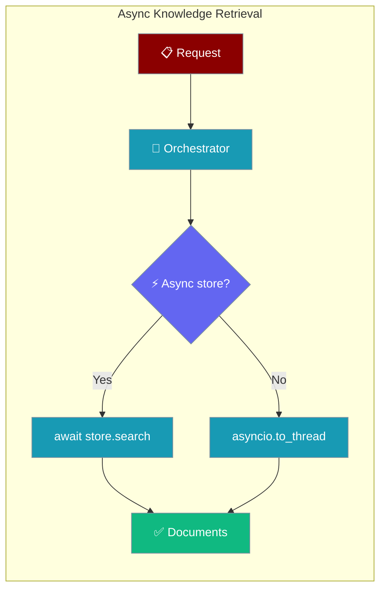
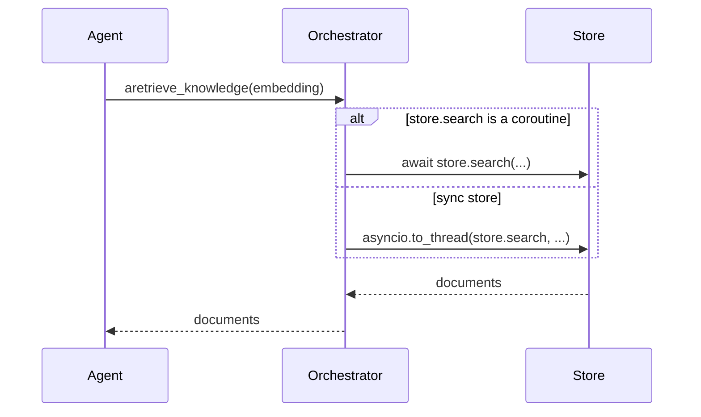
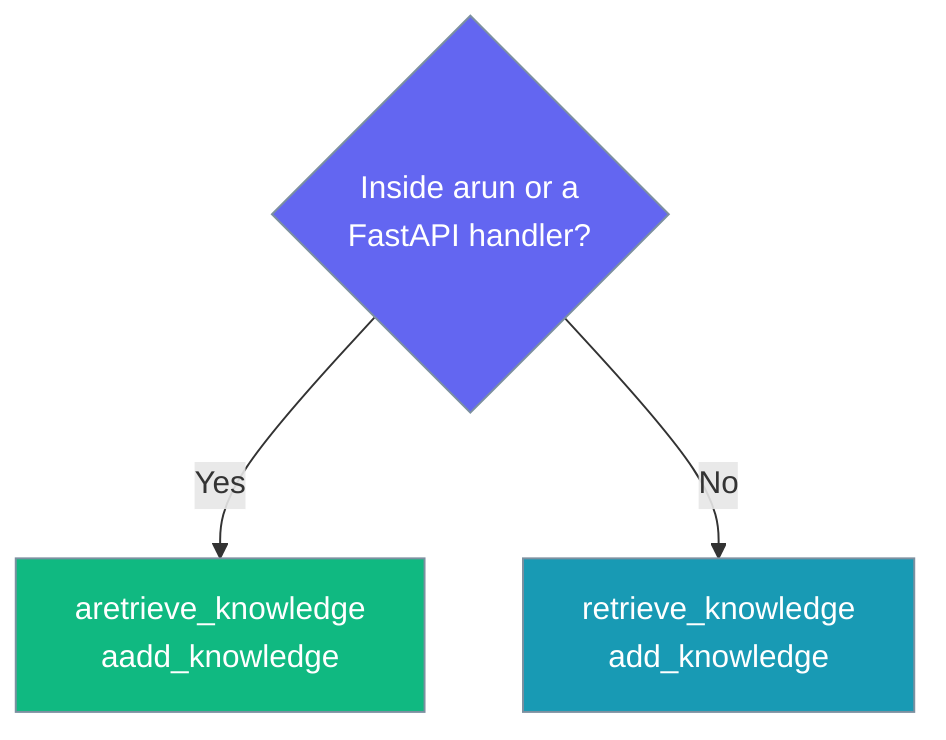

Async-safe RAG for agents running under `arun` or a FastAPI handler — knowledge search never blocks the event loop.



## Quick Start

<Steps>
<Step title="Agent under arun">
An agent that searches knowledge inside `arun()` no longer blocks the event loop — concurrent requests stay responsive.

```python
import asyncio
from praisonaiagents import Agent

agent = Agent(
    name="Research Assistant",
    instructions="Answer questions using the knowledge base.",
    knowledge=["docs/handbook.pdf"],
)

async def main():
    # Two agents run concurrently; each RAG lookup is offloaded,
    # so the loop stays free instead of serialising the round trips.
    await asyncio.gather(
        agent.arun("Summarise the onboarding policy"),
        agent.arun("What is the refund window?"),
    )

asyncio.run(main())
```
</Step>

<Step title="Orchestrator (library authors)">
Call `aretrieve_knowledge` / `aadd_knowledge` directly when you build on the persistence layer.

```python
import asyncio
from praisonai.persistence import PersistenceOrchestrator
from praisonai.persistence.knowledge.base import KnowledgeDocument

orchestrator = PersistenceOrchestrator.from_env()

async def main():
    # Add documents (embeddings already computed)
    await orchestrator.aadd_knowledge(
        documents=[
            KnowledgeDocument(
                id="doc-1",
                content="Refunds are processed within 30 days.",
                embedding=[0.12, 0.85, 0.03],
            )
        ],
        collection="policies",
    )

    # Retrieve without blocking the loop
    docs = await orchestrator.aretrieve_knowledge(
        query_embedding=[0.10, 0.80, 0.05],
        collection="policies",
        limit=3,
    )
    for doc in docs:
        print(doc.content)

asyncio.run(main())
```
</Step>
</Steps>

---

## How It Works

`aretrieve_knowledge` and `aadd_knowledge` inspect the underlying store and pick the right path automatically.



| Store type | Path taken |
|---|---|
| Native async (`search` / `upsert` is a coroutine) | Awaited directly |
| Sync store | Offloaded via `asyncio.to_thread(...)` so the loop stays free |

Every real vector backend issues a network round trip on `search`. From an async agent, the sync `retrieve_knowledge` would block the loop for the whole round trip and serialise every other concurrent request. The `a*` methods align RAG with the existing async conversation hooks (`aon_message`, `aon_agent_start`).

---

## When to Use `a*` vs Sync



Use the `a*` variants whenever an event loop is running. In a plain sync script, the existing `retrieve_knowledge` / `add_knowledge` methods are the right choice.

---

## Configuration Options

`aretrieve_knowledge(query_embedding, collection="default", limit=5, filters=None)`

| Option | Type | Default | Description |
|--------|------|---------|-------------|
| `query_embedding` | `List[float]` | *(required)* | Query vector to search against |
| `collection` | `str` | `"default"` | Collection to search |
| `limit` | `int` | `5` | Max documents to return |
| `filters` | `Optional[Dict[str, Any]]` | `None` | Metadata filters |

`aadd_knowledge(documents, collection="default")`

| Option | Type | Default | Description |
|--------|------|---------|-------------|
| `documents` | `List[KnowledgeDocument]` | *(required)* | Documents with embeddings to upsert |
| `collection` | `str` | `"default"` | Collection to write to |

---

## Best Practices

<AccordionGroup>
<Accordion title="Use a* variants inside arun() or a web handler" icon="bolt">
Any code path that already runs on an event loop — `agent.arun(...)`, a FastAPI route, a background async task — should call `aretrieve_knowledge` / `aadd_knowledge`. The sync methods would block the loop for the full network round trip.
</Accordion>

<Accordion title="Sync stores are still safe" icon="shield-check">
A sync knowledge store plugged into an async agent is not rejected — it is offloaded to a thread via `asyncio.to_thread(...)`. You do not need a native async backend to benefit.
</Accordion>

<Accordion title="Concurrency is real — verify it" icon="stopwatch">
Two concurrent RAG calls against a store with a 0.3 s round trip finish in ~0.3 s, not 0.6 s. Fire two `aretrieve_knowledge` calls with `asyncio.gather` and confirm they overlap.
</Accordion>
</AccordionGroup>

---

## Related

<CardGroup cols={2}>
  <Card title="Async Conversation Store" icon="database" href="/features/async-conversation-store">
    Sibling async hooks (`aon_message`, `aon_agent_start`).
  </Card>
  <Card title="Persistence Overview" icon="hard-drive" href="/persistence/overview">
    Where knowledge stores are configured.
  </Card>
  <Card title="RAG Module" icon="layer-group" href="/rag/module">
    The full RAG pipeline.
  </Card>
</CardGroup>
