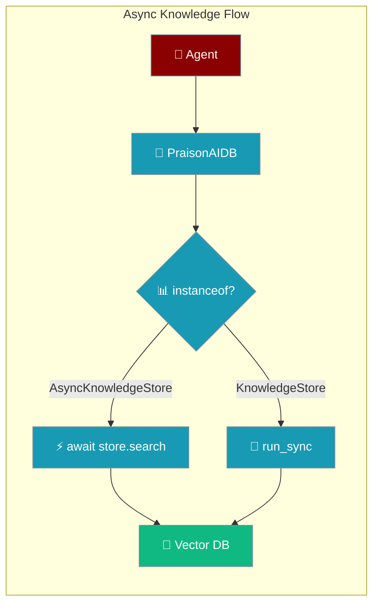
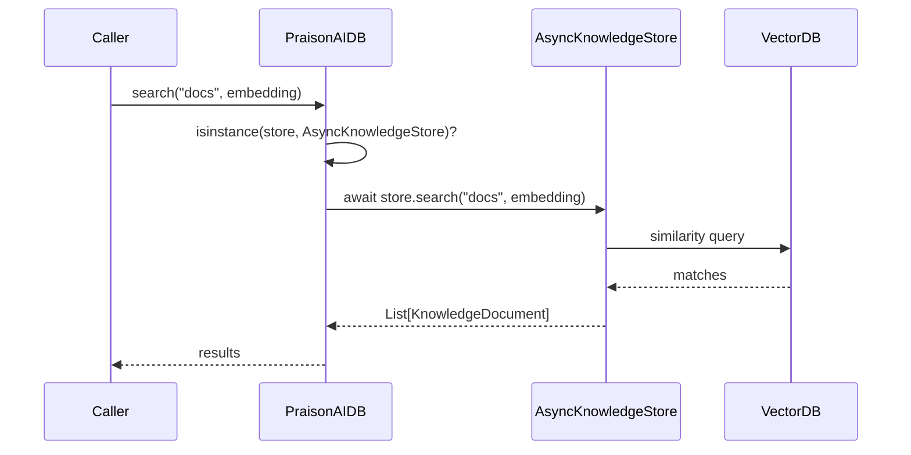

Async knowledge stores provide non-blocking vector storage and semantic search so native-async RAG backends never block the event loop.

```python
from praisonaiagents import Agent

agent = Agent(
    name="Researcher",
    instructions="Answer from the indexed knowledge base.",
)
agent.start("Summarise our onboarding docs.")
```

The agent runs a semantic search; an async knowledge store queries the vector backend without blocking other agents on the same loop.



## Quick Start

<Steps>
<Step title="Subclass AsyncKnowledgeStore">
Implement a native-async vector backend by inheriting from `AsyncKnowledgeStore`:

```python
from praisonai.persistence import AsyncKnowledgeStore
from praisonai.persistence.knowledge import KnowledgeDocument
from typing import Any, Dict, List, Optional

class MyAsyncKnowledgeStore(AsyncKnowledgeStore):
    async def create_collection(self, name, dimension, distance="cosine", metadata=None):
        ...

    async def delete_collection(self, name) -> bool:
        ...

    async def collection_exists(self, name) -> bool:
        ...

    async def list_collections(self) -> List[str]:
        ...

    async def insert(self, collection, documents) -> List[str]:
        ...

    async def upsert(self, collection, documents) -> List[str]:
        ...

    async def search(self, collection, query_embedding, limit=5, filters=None, score_threshold=None):
        ...

    async def get(self, collection, ids) -> List[KnowledgeDocument]:
        ...

    async def delete(self, collection, ids=None, filters=None) -> int:
        ...

    async def count(self, collection) -> int:
        ...

    async def close(self) -> None:
        ...
```
</Step>

<Step title="Wire It Into an Agent">
Pass the store through the persistence config so the agent dispatches async calls natively:

```python
from praisonaiagents import Agent

store = MyAsyncKnowledgeStore()

agent = Agent(
    name="Researcher",
    instructions="Answer from the indexed knowledge base.",
    knowledge_store=store,
)
agent.start("Summarise our onboarding docs.")
```
</Step>
</Steps>

<Note>
These ABCs give third-party native-async backends a formal interface to subclass. Shipped async backends still subclass the sync `KnowledgeStore` and route through `run_sync` wrappers; they will migrate onto the async ABC in a follow-up PR. Dispatch via `PraisonAIDB._dispatch_async` continues to work for both styles.
</Note>

---

## How It Works

A sync caller inside a running loop dispatches to the async store through `PraisonAIDB._dispatch_async`.



| Component | Role |
|-----------|------|
| **Caller** | Agent or application requesting a search |
| **PraisonAIDB** | Routes the call based on store type via `isinstance()` |
| **AsyncKnowledgeStore** | Handles native-async vector operations |
| **VectorDB** | Qdrant, Pinecone, pgvector, or custom storage |

### Abstract Methods

| Method | Signature | Returns |
|--------|-----------|---------|
| `create_collection` | `async def create_collection(self, name: str, dimension: int, distance: str = "cosine", metadata: Optional[Dict[str, Any]] = None)` | `None` |
| `delete_collection` | `async def delete_collection(self, name: str)` | `bool` |
| `collection_exists` | `async def collection_exists(self, name: str)` | `bool` |
| `list_collections` | `async def list_collections(self)` | `List[str]` |
| `insert` | `async def insert(self, collection: str, documents: List[KnowledgeDocument])` | `List[str]` (ids) |
| `upsert` | `async def upsert(self, collection: str, documents: List[KnowledgeDocument])` | `List[str]` (ids) |
| `search` | `async def search(self, collection: str, query_embedding: List[float], limit: int = 5, filters: Optional[Dict[str, Any]] = None, score_threshold: Optional[float] = None)` | `List[KnowledgeDocument]` |
| `get` | `async def get(self, collection: str, ids: List[str])` | `List[KnowledgeDocument]` |
| `delete` | `async def delete(self, collection: str, ids: Optional[List[str]] = None, filters: Optional[Dict[str, Any]] = None)` | `int` (count deleted) |
| `count` | `async def count(self, collection: str)` | `int` |
| `close` | `async def close(self)` | `None` |

The ABC also ships `__aenter__` / `__aexit__` for `async with` usage.

---

## Configuration Options

<Card title="Persistence API Reference" icon="code" href="/sdk/reference/praisonai/modules/persistence">
  Complete method signatures for `AsyncKnowledgeStore` and sibling stores
</Card>

---

## Common Patterns

### Custom Async Backend Inheritance

Subclass `AsyncKnowledgeStore` (not `KnowledgeStore`) when your vector backend is natively async:

```python
from praisonai.persistence import AsyncKnowledgeStore

class QdrantAsyncKnowledgeStore(AsyncKnowledgeStore):
    def __init__(self, client):
        self._client = client

    async def search(self, collection, query_embedding, limit=5, filters=None, score_threshold=None):
        return await self._client.search(collection, query_embedding, limit=limit)

    async def close(self):
        await self._client.close()
    # ... implement the remaining abstract methods
```

### `async with` Context Manager

The ABC defines `__aenter__` / `__aexit__`, so `async with` closes the store automatically:

```python
async with MyAsyncKnowledgeStore() as store:
    await store.create_collection("docs", dimension=1536)
    ids = await store.insert("docs", documents)
```

### Semantic Search

Query by embedding with an optional score threshold and metadata filters:

```python
async with MyAsyncKnowledgeStore() as store:
    results = await store.search(
        "docs",
        query_embedding=embedding,
        limit=5,
        score_threshold=0.75,
    )
```

---

## Best Practices

<AccordionGroup>
<Accordion title="Subclass AsyncKnowledgeStore for Native-Async Backends">
Inherit the async ABC so `isinstance()` dispatch awaits your methods directly:

```python
# ✅ Good - native async dispatch
class MyStore(AsyncKnowledgeStore):
    async def search(self, collection, query_embedding, limit=5, filters=None, score_threshold=None): ...

# ❌ Bad - sync ABC forces run_sync shims
class MyStore(KnowledgeStore):
    def search(self, collection, query_embedding): ...
```
</Accordion>

<Accordion title="Always Close the Store">
Use `async with` or `await store.close()` to release connections:

```python
# ✅ Good - automatic cleanup
async with MyAsyncKnowledgeStore() as store:
    await store.count("docs")

# ❌ Bad - leaked connections
store = MyAsyncKnowledgeStore()
await store.count("docs")
```
</Accordion>

<Accordion title="Don't Mix Sync and Async Methods">
Keep a single store async end-to-end:

```python
# ✅ Good - pure async
async with store:
    await store.insert("docs", documents)

# ❌ Bad - calling an async method without await
store.insert("docs", documents)  # returns an un-awaited coroutine
```
</Accordion>
</AccordionGroup>

---

## Related

<CardGroup cols={2}>
<Card title="Async State Store" icon="database" href="/features/async-state-store">
  Sibling async pattern for key-value state
</Card>
<Card title="Async Conversation Store" icon="comments" href="/features/async-conversation-store">
  Sibling async pattern for conversation sessions
</Card>
</CardGroup>
