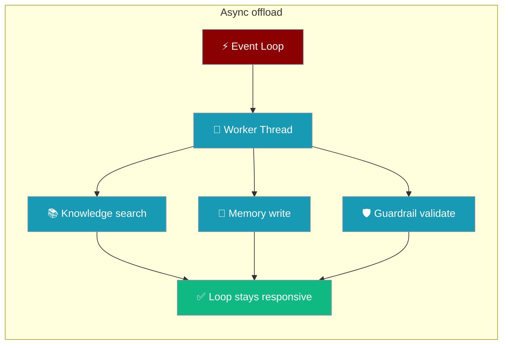

Under async execution, PraisonAI dispatches blocking I/O to worker threads so parallel tasks actually run in parallel, and the built-in in-memory store stays safe under concurrent writes.

```python
import asyncio
from praisonaiagents import Agent

# Two unnamed agents in the same process — skill grants stay scoped per instance.
reviewer = Agent(skills=["./skills/file-reviewer"])
worker   = Agent(instructions="Do a job.")

async def main():
    await reviewer.astart("Review report.pdf")   # knowledge.search runs on a worker thread
    await worker.astart("Summarise the review")  # store_in_memory in the callback also off-loop

asyncio.run(main())
```

Both `knowledge.search(...)` and task-callback memory writes are offloaded automatically — you don't call anything new. What you see is parallel async tasks that share a knowledge base or memory now actually running in parallel.



## Quick Start

<Steps>
<Step title="Parallel agents sharing knowledge">
An `asyncio.gather(...)` of agents that query the same knowledge base runs in parallel — no lookup blocks the loop.

```python
import asyncio
from praisonaiagents import Agent

agent = Agent(
    name="Research Assistant",
    instructions="Answer questions using the knowledge base.",
    knowledge=["handbook.pdf"],
)

async def main():
    await asyncio.gather(
        agent.astart("Summarise the onboarding policy"),
        agent.astart("What is the refund window?"),
    )

asyncio.run(main())
```
</Step>

<Step title="Parallel tasks writing memory">
Task-callback memory writes offload to worker threads, so a fan-out of tasks doesn't stall on one slow write.

```python
import asyncio
from praisonaiagents import Agent, Task, PraisonAIAgents

worker = Agent(name="Worker", instructions="Do the work.", memory=True)

agents = PraisonAIAgents(
    agents=[worker],
    tasks=[
        Task(description="Task A", agent=worker),
        Task(description="Task B", agent=worker),
        Task(description="Task C", agent=worker),
    ],
    process="parallel",
)

asyncio.run(agents.astart())
```
</Step>

<Step title="Parallel agents with guardrails">
An `asyncio.gather(...)` of agents where one carries a string guardrail runs in parallel — the guardrail's validation LLM call offloads to a worker thread instead of stalling the fan-out.

```python
import asyncio
from praisonaiagents import Agent

agent1 = Agent(
    name="Writer",
    instructions="Write a short blurb.",
    guardrail="Ensure the blurb makes no unverifiable claims.",
)
agent2 = Agent(
    name="Summarizer",
    instructions="Summarise the release notes.",
)

async def main():
    await asyncio.gather(
        agent1.astart("Blurb for the new dashboard"),
        agent2.astart("Summarise v2.0 release notes"),
    )

asyncio.run(main())
```
</Step>
</Steps>

---

## How It Works

```mermaid
sequenceDiagram
    participant Loop as Event Loop
    participant Agent
    participant Worker as Worker Thread
    participant Knowledge
    participant Memory

    Agent->>Loop: astart(...)
    Loop->>Worker: to_thread(knowledge.search)
    Worker->>Knowledge: embedding + vector search
    Knowledge-->>Worker: results
    Worker-->>Loop: results (event loop stayed responsive)
    Loop->>Worker: to_thread(store_in_memory)
    Worker->>Memory: embedding + DB write (RLock-guarded)
    Memory-->>Worker: id
    Worker-->>Loop: done
    Loop-->>Agent: continues next coroutine
```

## What runs off the event loop

| Call site | Offloaded via |
|---|---|
| `Knowledge.search` inside `Agent._achat_impl` | `asyncio.to_thread` |
| `Task.store_in_memory` inside `Task.execute_callback` | `asyncio.to_thread` |
| `_validate_with_guardrail` inside `Agent._aapply_guardrail_with_retry` and `_apply_task_guardrail` inside `Agents._aapply_task_guardrail` | `loop.run_in_executor` (with `copy_context_to_callable`) |

Both were synchronous embedding + vector-store / DB calls that previously blocked the event loop for the whole coroutine lifetime. An `asyncio.gather(...)` fan-out would serialise on the slowest lookup or write instead of running concurrently. Offloading them to threads keeps the loop free.

A string / `LLMGuardrail` output guardrail fires a blocking LLM call under the hood to validate the agent's output. On the async path this call is now offloaded via `loop.run_in_executor(...)`, so parallel tasks don't serialise on one task's guardrail round-trip ([PR #4469](https://github.com/MervinPraison/PraisonAI/pull/4469)). Contextvars are preserved across the offload with `copy_context_to_callable`, so trace emission and session context stay intact.

<Note>
This is transparent — there is no user-facing knob to opt out. You do not call anything new; parallel async tasks simply run in parallel.
</Note>

## Thread-safe in-memory adapter

The built-in `InMemoryAdapter` guards its store, search, delete, and reset methods with a re-entrant lock (`RLock`). Once writes move off the event loop, parallel async writes from an `asyncio.gather(...)` fan-out cannot produce duplicate ids or lose entries.

If you [write a custom adapter](/features/custom-memory-adapters) that will be shared across async agents, do the same — guard its mutating methods with a lock.

```python
import threading

class MyAdapter:
    def __init__(self):
        self._lock = threading.RLock()
        self._store = {}

    def store_long_term(self, memory_id, content, **kwargs):
        with self._lock:
            self._store[memory_id] = content
```

---

## Best Practices

<AccordionGroup>
<Accordion title="Fan out with asyncio.gather without fear" icon="bolt">
Knowledge search and memory writes offload to threads, so a `gather(...)` of agents that share a knowledge base or memory runs in parallel instead of serialising on the slowest task.
</Accordion>

<Accordion title="Make custom adapters thread-safe" icon="lock">
Custom memory adapters used from async task callbacks receive writes from multiple worker threads. Guard mutating methods with a lock, as the built-in `InMemoryAdapter` does with an `RLock`.
</Accordion>

<Accordion title="Guardrails don't stall async fan-outs" icon="shield-halved">
String / `LLMGuardrail` output and task guardrails offload their blocking LLM call to a worker thread on the async path, so an `asyncio.gather(...)` of agents that share a guardrail no longer serialises on one task's validation LLM round-trip. Custom guardrail objects that implement synchronous `validate_output` get the same offload for free.
</Accordion>

<Accordion title="Nothing to configure" icon="wand-magic-sparkles">
The offload is automatic and transparent. There is no flag to enable or disable it — the sync path is unchanged and the async path always stays responsive.
</Accordion>
</AccordionGroup>

---

## Related

<CardGroup cols={2}>
  <Card title="Knowledge" icon="book" href="/features/knowledge">
    Add document knowledge with async-safe search
  </Card>
  <Card title="Memory" icon="brain" href="/features/memory">
    Persistent memory with offloaded, thread-safe writes
  </Card>
  <Card title="Async Agents" icon="clock" href="/features/async">
    Run agents and tasks concurrently with asyncio
  </Card>
  <Card title="Custom Memory Adapters" icon="plug" href="/features/custom-memory-adapters">
    Build your own adapter — guard it with a lock for async use
  </Card>
</CardGroup>
