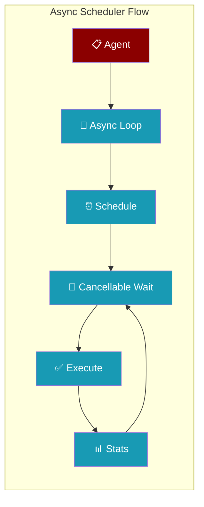
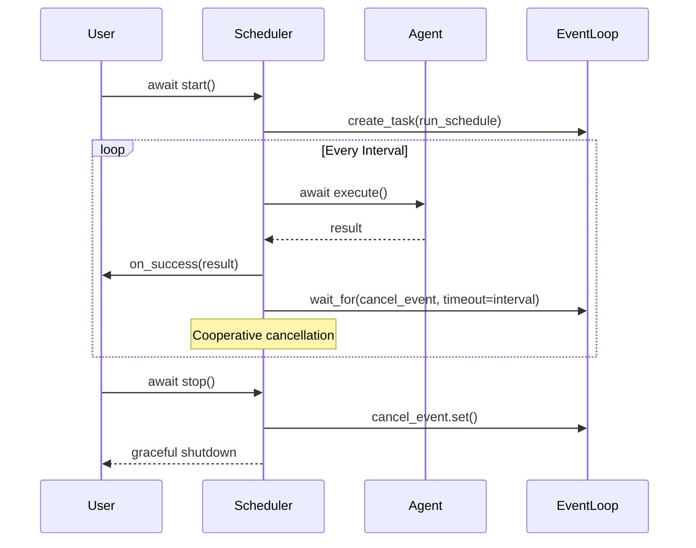
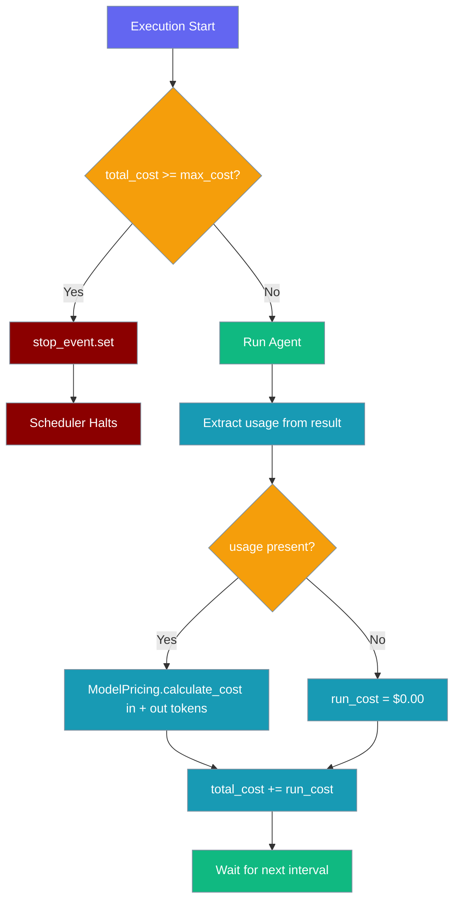

Async-native agent scheduler that replaces daemon threads with proper async execution and cooperative cancellation.

```python
import asyncio
from praisonaiagents import Agent
from praisonai.scheduler import AsyncAgentScheduler

async def main():
    agent = Agent(name="NewsChecker", instructions="Summarise the latest AI news.")
    scheduler = AsyncAgentScheduler(agent=agent, task="Top 3 AI stories")
    await scheduler.start("hourly", run_immediately=True)

asyncio.run(main())
```

The user schedules recurring agent work; the async scheduler runs jobs with cooperative cancellation.




## Quick Start

<Steps>
<Step title="Simple Usage">
Create and start an async scheduler with basic configuration.

```python
import asyncio
from praisonaiagents import Agent
from praisonai.scheduler import AsyncAgentScheduler

async def main():
    agent = Agent(
        name="NewsChecker", 
        instructions="Summarise the latest AI news."
    )
    
    scheduler = AsyncAgentScheduler(
        agent=agent, 
        task="Summarise top 3 AI stories"
    )
    
    await scheduler.start("hourly", max_retries=3, run_immediately=True)
    
    # Let it run for 2 hours
    await asyncio.sleep(3600 * 2)
    await scheduler.stop()

asyncio.run(main())
```
</Step>

<Step title="With Callbacks and Configuration">
Add success/failure callbacks and custom configuration.

```python
import asyncio
from praisonaiagents import Agent
from praisonai.scheduler import AsyncAgentScheduler

def success_callback(result):
    print(f"✅ Success: {result}")

async def async_failure_callback(exception):
    print(f"❌ Async failure: {exception}")

async def main():
    agent = Agent(
        name="DataProcessor",
        instructions="Process and analyze data efficiently."
    )
    
    scheduler = AsyncAgentScheduler(
        agent=agent,
        task="Process latest data batch",
        config={"timeout": 120},
        on_success=success_callback,
        on_failure=async_failure_callback
    )
    
    await scheduler.start("*/30m", max_retries=5)
    
    # Monitor stats
    stats = await scheduler.get_stats_async()
    print(f"Stats: {stats}")
    
    await scheduler.stop()

asyncio.run(main())
```
</Step>

<Step title="With Timeout & Budget Limit">
Control execution time and budget with built-in enforcement.

```python
import asyncio
from praisonaiagents import Agent
from praisonai.scheduler import AsyncAgentScheduler

async def main():
    agent = Agent(
        name="CostAwareAgent",
        instructions="Summarise the latest tech headlines."
    )

    scheduler = AsyncAgentScheduler(
        agent,
        task="Summarise tech news",
        timeout=30,        # stop a single run after 30s
        max_cost=1.00,     # auto-shutdown once $1.00 spent
    )

    await scheduler.start("hourly", run_immediately=True)
    await asyncio.sleep(3600 * 4)
    stats = await scheduler.get_stats_async()
    print(f"Spent ${stats['total_cost_usd']}, remaining ${stats['remaining_budget']}")
    await scheduler.stop()

asyncio.run(main())
```
</Step>
</Steps>

---

## How It Works



| Phase | Description |
|-------|-------------|
| **Initialization** | Creates async primitives lazily on first use |
| **Scheduling** | Runs agent at specified intervals with exponential backoff |
| **Execution** | Uses thread pool for sync agents, direct await for async agents |
| **Cancellation** | Cooperative cancellation via `asyncio.Event` |

---

## Configuration Options

<Card title="AsyncAgentScheduler API Reference" icon="code" href="/docs/sdk/reference/praisonai/classes/AgentScheduler">
  Complete parameter documentation and examples
</Card>

### Constructor Parameters

| Parameter | Type | Default | Description |
|-----------|------|---------|-------------|
| `agent` | `Any` | Required | Agent instance to schedule |
| `task` | `str` | Required | Task description to execute |
| `config` | `Dict[str, Any]` | `{}` | Optional configuration |
| `on_success` | `Callable` | `None` | Success callback (sync or async) |
| `on_failure` | `Callable` | `None` | Failure callback (sync or async) |
| `timeout` | `Optional[int]` | `None` | **NEW** — Maximum execution time per run in seconds. `None` means no limit. Enforced with `asyncio.wait_for()`. |
| `max_cost` | `Optional[float]` | `1.00` | **NEW** — Maximum total cost in USD. Scheduler auto-stops when reached. Set to `None` to disable. Default `$1.00` is a safety guard. |

### Start Parameters

| Parameter | Type | Default | Description |
|-----------|------|---------|-------------|
| `schedule_expr` | `str` | Required | Schedule interval expression |
| `max_retries` | `int` | `3` | Total attempts (1 initial + retries) |
| `run_immediately` | `bool` | `False` | Execute immediately before scheduling |

### Stats Response Format

| Field | Type | Description |
|-------|------|-------------|
| `is_running` | `bool` | Whether scheduler is currently running |
| `total_executions` | `int` | Total number of execution attempts |
| `successful_executions` | `int` | Number of successful executions |
| `failed_executions` | `int` | Number of failed executions |
| `success_rate` | `float` | Success percentage (0-100) |
| `total_cost_usd` | `float` | Running total cost in USD (4 dp) |
| `remaining_budget` | `float \| None` | `max_cost - total_cost_usd`, or `None` if `max_cost` is disabled |
| `runtime_seconds` | `float` | **NEW (PR #1857)** — Seconds since `start()` was called. `0` when scheduler hasn't started. |
| `cost_per_execution` | `float` | **NEW (PR #1857)** — `total_cost_usd / total_executions`, rounded to 4 dp. `0` when no executions yet. |

---

## Common Patterns

### Pattern 1: Event Loop Safety

The scheduler is safe to construct outside an event loop:

```python
# Safe to create in sync code
scheduler = AsyncAgentScheduler(agent, task)

async def run_later():
    # Async primitives created here
    await scheduler.start("hourly")
```

### Pattern 2: FastAPI Integration

```python
from fastapi import FastAPI
from contextlib import asynccontextmanager

scheduler = None

@asynccontextmanager
async def lifespan(app: FastAPI):
    global scheduler
    scheduler = AsyncAgentScheduler(agent, "Background task")
    await scheduler.start("*/10m")
    yield
    await scheduler.stop()

app = FastAPI(lifespan=lifespan)
```

### Pattern 3: Cancellation Handling

```python
async def graceful_shutdown():
    try:
        await scheduler.start("hourly")
    except asyncio.CancelledError:
        print("Scheduler cancelled")
    finally:
        await scheduler.stop()
```

### Pattern 4: Budget-aware Scheduling

```python
import asyncio
from praisonaiagents import Agent
from praisonai.scheduler import AsyncAgentScheduler

async def main():
    agent = Agent(name="ReportAgent", instructions="Generate hourly report")

    # Hard-stop after $5 total spend, 60s per run
    scheduler = AsyncAgentScheduler(
        agent,
        task="Generate report",
        timeout=60,
        max_cost=5.00,
    )

    await scheduler.start("hourly")
    while scheduler.is_running:
        await asyncio.sleep(60)
        stats = await scheduler.get_stats_async()
        if stats["remaining_budget"] is not None and stats["remaining_budget"] < 0.50:
            print(f"⚠️  Budget nearly exhausted: ${stats['remaining_budget']:.4f} left")
    print("Scheduler stopped (budget reached or manual stop)")

asyncio.run(main())
```

<Note>
**Real cost tracking ([PR #2171](https://github.com/MervinPraison/PraisonAI/pull/2171)):** Before #2171, both schedulers added a fixed `$0.0001` to `total_cost` per run, so the default `max_cost=1.00` only tripped after ~10,000 runs regardless of model. The scheduler now pulls `usage` (input/output tokens) and `model` off the agent response and prices it through `praisonai.cli.features.cost_tracker.ModelPricing`. Responses with no `usage` metadata contribute **$0** — the brake errs on the side of running rather than tripping on missing data. Negative token counts are clamped to `0` so they can never bypass the brake.
</Note>



---

## Best Practices

<AccordionGroup>
<Accordion title="Event Loop Safety">
Always create async primitives lazily. The scheduler binds `asyncio.Event` and `asyncio.Lock` to the caller's loop on first async entry, preventing "different loop" errors.

```python
# ✅ Good: Constructor safe in sync code
scheduler = AsyncAgentScheduler(agent, task)

async def later():
    # ✅ Good: Async primitives created here
    await scheduler.start("hourly")
```
</Accordion>

<Accordion title="Callback Best Practices">
Use both sync and async callbacks safely. The `safe_call` utility handles both types automatically.

```python
def sync_callback(result):
    print(f"Sync: {result}")

async def async_callback(result):
    await log_to_database(result)

# ✅ Both work seamlessly
scheduler = AsyncAgentScheduler(
    agent=agent,
    task=task,
    on_success=async_callback,
    on_failure=sync_callback
)
```
</Accordion>

<Accordion title="Retry Strategy">
Use exponential backoff with jitter. Both sync and async schedulers share the same `backoff_delay` algorithm for consistency.

```python
# Delay formula: min(max(30, 2 ** attempt), 300) * jitter
# - Floor: ~27s, Cap: 300s
# - Same behavior as sync AgentScheduler
await scheduler.start("hourly", max_retries=5)
```
</Accordion>

<Accordion title="Graceful Shutdown">
Always await `stop()` for proper cleanup and statistics reporting.

```python
try:
    await scheduler.start("hourly")
    await asyncio.sleep(3600)
finally:
    stats = await scheduler.get_stats()
    await scheduler.stop()
    print(f"Final stats: {stats}")
```
</Accordion>

<Accordion title="Budget Control">
The default `max_cost=1.00` caps unattended cost runaway. Since [PR #2171](https://github.com/MervinPraison/PraisonAI/pull/2171), `total_cost_usd` is the real per-token spend computed from each response's `usage` field — pick a value that matches your approved budget, not a multiple chosen to compensate for an undercount.

```python
# Production with explicit budget
scheduler = AsyncAgentScheduler(agent, task, max_cost=50.00)

# Disable budget (only when external limits enforce it)
scheduler = AsyncAgentScheduler(agent, task, max_cost=None)
```

When the budget triggers, the scheduler logs a warning and calls `stop_event.set()` internally — `stats["is_running"]` flips to `False`.

If your model is missing from `DEFAULT_PRICING`, the run is priced at `$0` and `total_cost_usd` will under-report — register it via the [custom pricing](/docs/cli/cost-tracking#custom-pricing) snippet so the brake stays meaningful.
</Accordion>

<Accordion title="Timeout Configuration">
Set `timeout` to bound the worst-case wall-clock time per run. Internally implemented with `asyncio.wait_for()`, which raises `asyncio.TimeoutError` and triggers the standard retry path.

```python
scheduler = AsyncAgentScheduler(
    agent,
    task,
    timeout=30,        # individual run cannot exceed 30s
    max_cost=1.00,
)
```

`timeout=None` (the default) imposes no limit.
</Accordion>
</AccordionGroup>

---

---

<Note>
**Import paths (PR #1552):**
- **Pending deprecation** (still works, emits `PendingDeprecationWarning` — will move to `praisonai.scheduler.async_agent_scheduler` in a future release): `from praisonai.scheduler import AsyncAgentScheduler`
- **Canonical:** `from praisonai.scheduler import AgentScheduler` (sync scheduler)
- **Deprecated** (still works, emits `DeprecationWarning`): `from praisonai.agent_scheduler import AgentScheduler`

The canonical sync `AgentScheduler` exposes `from_yaml`, `start_from_yaml_config`, and `from_recipe`, which the deprecated top-level shim does not advertise but now re-exports correctly.

**Shared dispatch helper ([PR #2147](https://github.com/MervinPraison/PraisonAI/pull/2147)):** `AsyncPraisonAgentExecutor.execute()` now delegates to the shared `adispatch_agent` helper (`praisonai.scheduler._dispatch`). No behaviour change — the dispatch ladder (`astart` → `to_thread(start)` → `AttributeError`) is unchanged. See also the [sync scheduler note](/docs/cli/scheduler) for the corresponding fix to `AgentScheduler`.
</Note>

---

## Skipping Ticks with a Pre-Run Gate

A pre-run gate runs a cheap shell command before each tick and skips the model turn when the check says there's nothing to do — zero tokens spent on quiet ticks.

See [Scheduler Pre-Run Gate](/docs/features/scheduler-pre-run-gate) for configuration options and examples.

---

## Related

<CardGroup cols={2}>
<Card title="Sync Agent Scheduler" icon="clock" href="/docs/cli/scheduler">
  Thread-based scheduler for sync environments
</Card>
<Card title="Pre-Run Gate" icon="filter" href="/docs/features/scheduler-pre-run-gate">
  Skip ticks when a cheap check says nothing to do
</Card>
<Card title="Shared Scheduler Utilities" icon="gear" href="/docs/features/async-scheduler">
  Common primitives used by both schedulers
</Card>
</CardGroup>