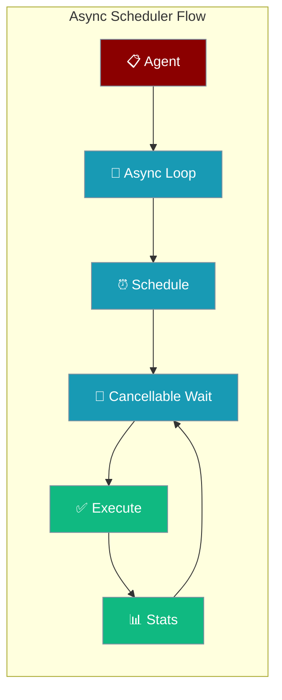
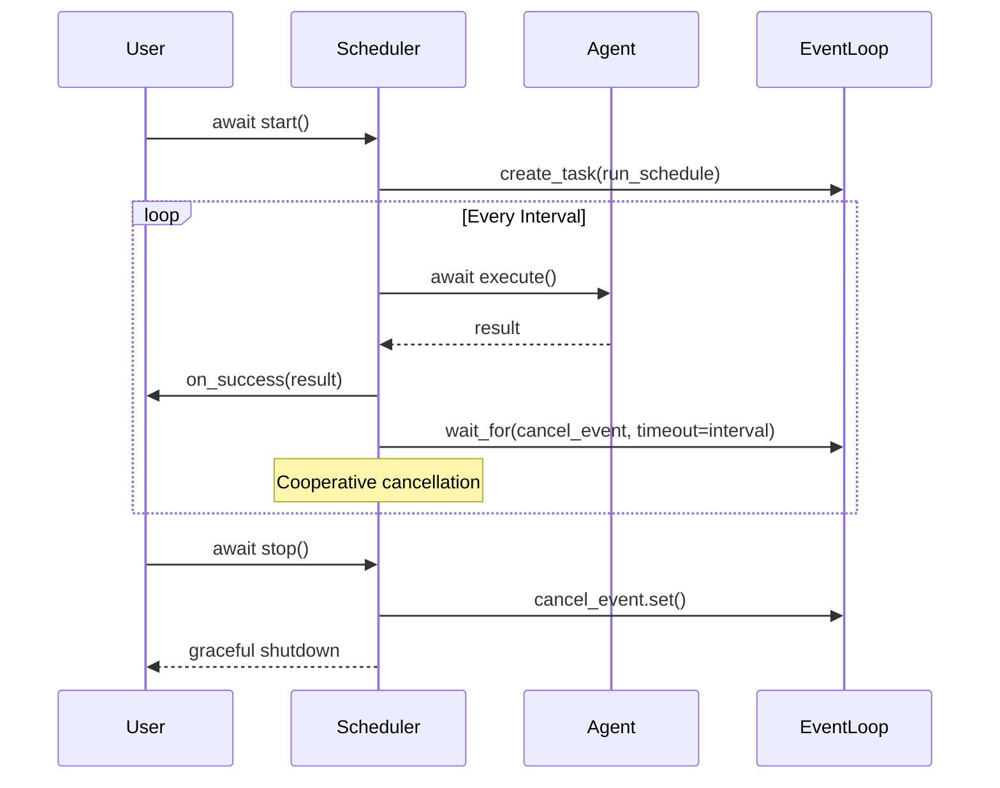

Async-native agent scheduler that replaces daemon threads with proper async execution and cooperative cancellation.



## Quick Start

<Steps>
<Step title="Simple Usage">
Create and start an async scheduler with basic configuration.

```python
import asyncio
from praisonaiagents import Agent
from praisonai.async_agent_scheduler import AsyncAgentScheduler

async def main():
    agent = Agent(
        name="NewsChecker", 
        instructions="Summarise the latest AI news."
    )
    
    scheduler = AsyncAgentScheduler(
        agent=agent, 
        task="Summarise top 3 AI stories"
    )
    
    await scheduler.start("hourly", max_retries=3, run_immediately=True)
    
    # Let it run for 2 hours
    await asyncio.sleep(3600 * 2)
    await scheduler.stop()

asyncio.run(main())
```
</Step>

<Step title="With Callbacks and Configuration">
Add success/failure callbacks and custom configuration.

```python
import asyncio
from praisonaiagents import Agent
from praisonai.async_agent_scheduler import AsyncAgentScheduler

def success_callback(result):
    print(f"✅ Success: {result}")

async def async_failure_callback(exception):
    print(f"❌ Async failure: {exception}")

async def main():
    agent = Agent(
        name="DataProcessor",
        instructions="Process and analyze data efficiently."
    )
    
    scheduler = AsyncAgentScheduler(
        agent=agent,
        task="Process latest data batch",
        config={"timeout": 120},
        on_success=success_callback,
        on_failure=async_failure_callback
    )
    
    await scheduler.start("*/30m", max_retries=5)
    
    # Monitor stats
    stats = scheduler.get_stats()
    print(f"Stats: {stats}")
    
    await scheduler.stop()

asyncio.run(main())
```
</Step>
</Steps>

---

## How It Works



| Phase | Description |
|-------|-------------|
| **Initialization** | Creates async primitives lazily on first use |
| **Scheduling** | Runs agent at specified intervals with exponential backoff |
| **Execution** | Uses thread pool for sync agents, direct await for async agents |
| **Cancellation** | Cooperative cancellation via `asyncio.Event` |

---

## Configuration Options

<Card title="AsyncAgentScheduler API Reference" icon="code" href="/docs/sdk/reference/praisonai/classes/AsyncAgentScheduler">
  Complete parameter documentation and examples
</Card>

### Constructor Parameters

| Parameter | Type | Default | Description |
|-----------|------|---------|-------------|
| `agent` | `Any` | Required | Agent instance to schedule |
| `task` | `str` | Required | Task description to execute |
| `config` | `Dict[str, Any]` | `{}` | Optional configuration |
| `on_success` | `Callable` | `None` | Success callback (sync or async) |
| `on_failure` | `Callable` | `None` | Failure callback (sync or async) |

### Start Parameters

| Parameter | Type | Default | Description |
|-----------|------|---------|-------------|
| `schedule_expr` | `str` | Required | Schedule interval expression |
| `max_retries` | `int` | `3` | Total attempts (1 initial + retries) |
| `run_immediately` | `bool` | `False` | Execute immediately before scheduling |

---

## Common Patterns

### Pattern 1: Event Loop Safety

The scheduler is safe to construct outside an event loop:

```python
# Safe to create in sync code
scheduler = AsyncAgentScheduler(agent, task)

async def run_later():
    # Async primitives created here
    await scheduler.start("hourly")
```

### Pattern 2: FastAPI Integration

```python
from fastapi import FastAPI
from contextlib import asynccontextmanager

scheduler = None

@asynccontextmanager
async def lifespan(app: FastAPI):
    global scheduler
    scheduler = AsyncAgentScheduler(agent, "Background task")
    await scheduler.start("*/10m")
    yield
    await scheduler.stop()

app = FastAPI(lifespan=lifespan)
```

### Pattern 3: Cancellation Handling

```python
async def graceful_shutdown():
    try:
        await scheduler.start("hourly")
    except asyncio.CancelledError:
        print("Scheduler cancelled")
    finally:
        await scheduler.stop()
```

---

## Best Practices

<AccordionGroup>
<Accordion title="Event Loop Safety">
Always create async primitives lazily. The scheduler binds `asyncio.Event` and `asyncio.Lock` to the caller's loop on first async entry, preventing "different loop" errors.

```python
# ✅ Good: Constructor safe in sync code
scheduler = AsyncAgentScheduler(agent, task)

async def later():
    # ✅ Good: Async primitives created here
    await scheduler.start("hourly")
```
</Accordion>

<Accordion title="Callback Best Practices">
Use both sync and async callbacks safely. The `safe_call` utility handles both types automatically.

```python
def sync_callback(result):
    print(f"Sync: {result}")

async def async_callback(result):
    await log_to_database(result)

# ✅ Both work seamlessly
scheduler = AsyncAgentScheduler(
    agent=agent,
    task=task,
    on_success=async_callback,
    on_failure=sync_callback
)
```
</Accordion>

<Accordion title="Retry Strategy">
Use exponential backoff with jitter. Both sync and async schedulers share the same `backoff_delay` algorithm for consistency.

```python
# Delay formula: min(max(30, 2 ** attempt), 300) * jitter
# - Floor: ~27s, Cap: 300s
# - Same behavior as sync AgentScheduler
await scheduler.start("hourly", max_retries=5)
```
</Accordion>

<Accordion title="Graceful Shutdown">
Always await `stop()` for proper cleanup and statistics reporting.

```python
try:
    await scheduler.start("hourly")
    await asyncio.sleep(3600)
finally:
    stats = scheduler.get_stats()
    await scheduler.stop()
    print(f"Final stats: {stats}")
```
</Accordion>

<Accordion title="Reliability and exception safety">
The scheduler guarantees that:

- **`is_running` always reflects reality.** When the internal scheduling loop exits — whether on a clean stop, an unhandled exception, or task cancellation — `is_running` is cleared in a `finally` block.
- **`stop()` never raises.** If the scheduler task crashed in the background, `stop()` logs the error via the standard `logging` module and still returns `True` so your shutdown path stays clean.

This means you can drive the scheduler from a `lifespan` context manager or signal handler without wrapping `stop()` in your own `try/except`:

```python
@asynccontextmanager
async def lifespan(app: FastAPI):
    scheduler = AsyncAgentScheduler(agent, task="…")
    await scheduler.start("hourly")
    yield
    await scheduler.stop()  # always safe, even if the task crashed earlier
```

To surface scheduler crashes in your own monitoring, configure the `praisonai.async_agent_scheduler` logger:

```python
import logging
logging.getLogger("praisonai.async_agent_scheduler").setLevel(logging.ERROR)
```
</Accordion>
</AccordionGroup>

---

## Related

<CardGroup cols={2}>
<Card title="Sync Agent Scheduler" icon="clock" href="/docs/cli/scheduler">
  Thread-based scheduler for sync environments
</Card>
<Card title="Shared Scheduler Utilities" icon="gear" href="/docs/features/scheduler-shared">
  Common primitives used by both schedulers
</Card>
</CardGroup>