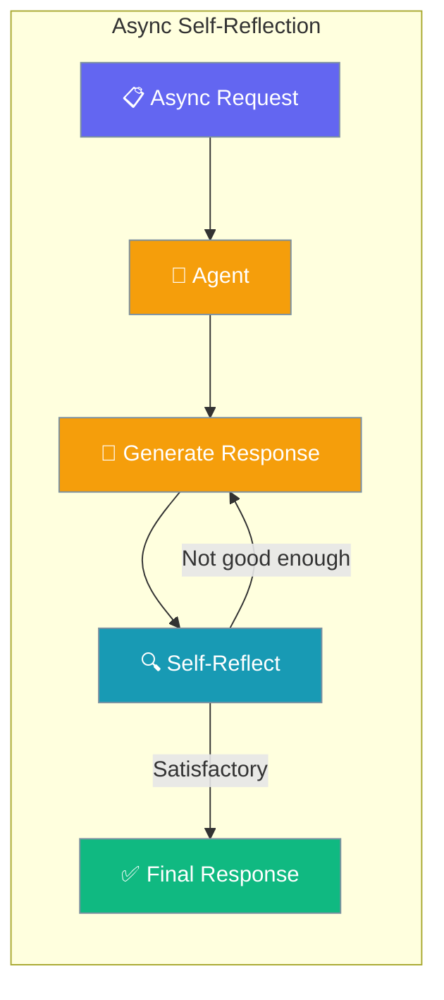
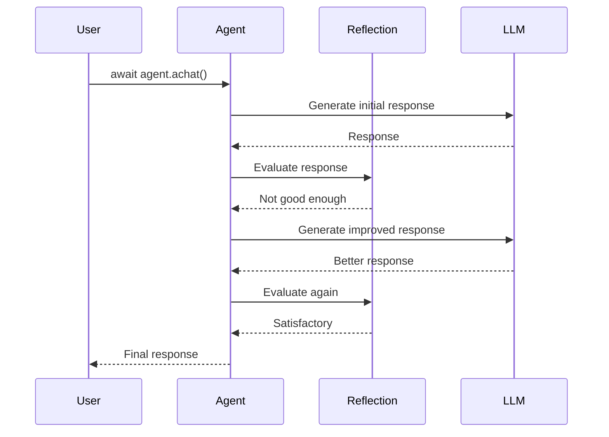

Self-reflection enables agents to evaluate and improve their responses in async execution, bringing full feature parity with sync agents.



## Quick Start

<Steps>
<Step title="Basic Async Reflection">
Enable reflection in async agents with simple boolean flag:

```python
import asyncio
from praisonaiagents import Agent

agent = Agent(
    name="Writer",
    instructions="Write concise product blurbs.",
    self_reflect=True,
    min_reflect=1,
    max_reflect=3,
)

async def main():
    result = await agent.achat("Write a one-line blurb for a smart mug.")
    print(result)

asyncio.run(main())
```
</Step>

<Step title="Custom Reflection Criteria">
Configure reflection with custom criteria for async agents:

```python
import asyncio
from praisonaiagents import Agent, ReflectionConfig

agent = Agent(
    name="Technical Writer",
    instructions="Create technical documentation.",
    self_reflect=ReflectionConfig(
        min_reflect=2,
        max_reflect=5,
        criteria="Is the response clear, accurate, and complete?"
    )
)

async def main():
    result = await agent.achat("Explain async/await in Python.")
    print(result)

asyncio.run(main())
```
</Step>
</Steps>

---

## How It Works

Self-reflection in async agents follows the same process as sync agents:



| Component | Purpose | Async Behavior |
|-----------|---------|----------------|
| Initial Generation | Create first response | Uses `await agent.achat()` |
| Self-Evaluation | Judge response quality | Async LLM call for evaluation |
| Iterative Improvement | Refine based on feedback | Multiple async iterations |
| Final Output | Deliver best response | Returns when criteria met |

---

## Feature Parity

Prior to PR #1704, async agents had limited reflection support:

<Note>
**Before PR #1704**: Only legacy custom-LLM async branch supported reflection; the default OpenAI async path skipped it entirely.

**After PR #1704**: Self-reflection works uniformly in both sync and async agents on all execution paths, including the default unified-dispatch path.
</Note>

| Feature | Sync Agents | Async Agents (Before #1704) | Async Agents (After #1704) |
|---------|-------------|----------------------------|---------------------------|
| Self-reflection | ✅ Full support | ❌ Limited/bypassed | ✅ Full parity |
| Custom criteria | ✅ Supported | ❌ Not available | ✅ Supported |
| Min/max reflect | ✅ Configurable | ❌ Not configurable | ✅ Configurable |
| Unified dispatch | ✅ Works | ❌ Bypassed reflection | ✅ Full support |

---

## Configuration Options

All reflection configuration options work identically in async agents:

| Option | Type | Default | Description |
|--------|------|---------|-------------|
| `self_reflect` | `bool` | `False` | Enable/disable self-reflection |
| `min_reflect` | `int` | `1` | Minimum reflection iterations |
| `max_reflect` | `int` | `3` | Maximum reflection iterations |
| `criteria` | `str` | Auto-generated | Custom evaluation criteria |

---

## Best Practices

<AccordionGroup>
<Accordion title="Choose Appropriate Limits">
Set reasonable `min_reflect` and `max_reflect` values to balance quality with performance. Async reflection still involves multiple LLM calls.
</Accordion>

<Accordion title="Custom Criteria">
Provide specific evaluation criteria for better reflection quality. Generic criteria like "Is this good?" are less effective than specific requirements.
</Accordion>

<Accordion title="Monitor Performance">
Reflection increases response time and token usage. Monitor these metrics in production async applications.
</Accordion>

<Accordion title="Error Handling">
Wrap async reflection calls in try-catch blocks to handle potential timeout or API errors gracefully.
</Accordion>
</AccordionGroup>

---

## Related

<CardGroup cols={2}>
<Card title="Async Agents" icon="clock" href="/docs/features/async">
  Complete guide to async agent execution
</Card>
<Card title="Self-Reflection Concepts" icon="rotate" href="/docs/concepts/reflection">
  Core concepts and architecture
</Card>
</CardGroup>