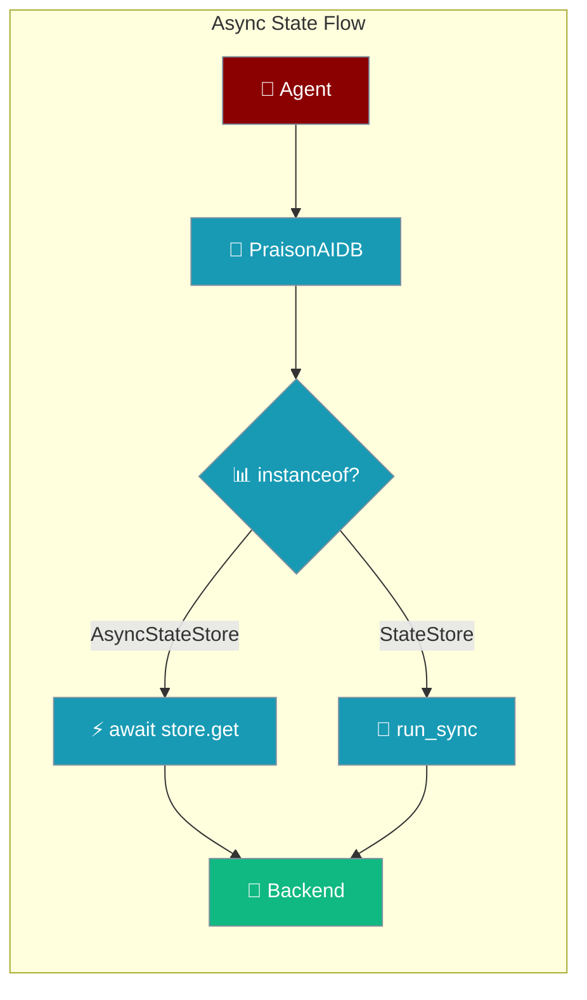
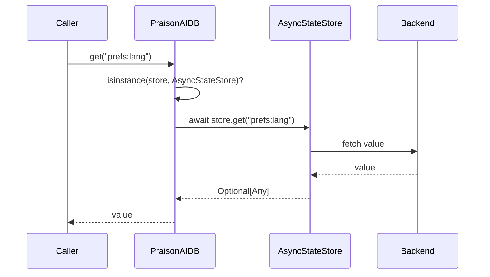

Async state stores provide non-blocking key-value and hash persistence so native-async backends never block the event loop.

```python
from praisonaiagents import Agent

agent = Agent(
    name="Assistant",
    instructions="Remember the user's preferences across turns.",
)
agent.start("What's my preferred language?")
```

The user asks a follow-up; an async state store fetches cached preferences without blocking other agents on the same loop.



## Quick Start

<Steps>
<Step title="Subclass AsyncStateStore">
Implement a native-async backend by inheriting from `AsyncStateStore`:

```python
from praisonai.persistence import AsyncStateStore
from typing import Any, Dict, List, Optional

class MyAsyncStateStore(AsyncStateStore):
    async def get(self, key: str) -> Optional[Any]:
        ...

    async def set(self, key: str, value: Any, ttl: Optional[int] = None) -> None:
        ...

    async def delete(self, key: str) -> bool:
        ...

    async def exists(self, key: str) -> bool:
        ...

    async def keys(self, pattern: str = "*") -> List[str]:
        ...

    async def ttl(self, key: str) -> Optional[int]:
        ...

    async def expire(self, key: str, ttl: int) -> bool:
        ...

    async def hget(self, key: str, field: str) -> Optional[Any]:
        ...

    async def hset(self, key: str, field: str, value: Any) -> None:
        ...

    async def hgetall(self, key: str) -> Dict[str, Any]:
        ...

    async def hdel(self, key: str, *fields: str) -> int:
        ...

    async def close(self) -> None:
        ...
```
</Step>

<Step title="Wire It Into an Agent">
Pass the store through the persistence config so the agent dispatches async calls natively:

```python
from praisonaiagents import Agent

store = MyAsyncStateStore()

agent = Agent(
    name="Assistant",
    instructions="Remember the user's preferences across turns.",
    state_store=store,
)
agent.start("What's my preferred language?")
```
</Step>
</Steps>

<Note>
These ABCs give third-party native-async backends a formal interface to subclass. Shipped async backends (e.g. `AsyncMongoDBStateStore`) still subclass the sync `StateStore` and route through `run_sync` wrappers; they will migrate onto the async ABC in a follow-up PR. Dispatch via `PraisonAIDB._dispatch_async` continues to work for both styles.
</Note>

---

## How It Works

A sync caller inside a running loop dispatches to the async store through `PraisonAIDB._dispatch_async`.



| Component | Role |
|-----------|------|
| **Caller** | Agent or application requesting state |
| **PraisonAIDB** | Routes the call based on store type via `isinstance()` |
| **AsyncStateStore** | Handles native-async key-value / hash operations |
| **Backend** | Redis, MongoDB, or custom storage |

### Abstract Methods

| Method | Signature | Returns |
|--------|-----------|---------|
| `get` | `async def get(self, key: str)` | `Optional[Any]` |
| `set` | `async def set(self, key: str, value: Any, ttl: Optional[int] = None)` | `None` |
| `delete` | `async def delete(self, key: str)` | `bool` |
| `exists` | `async def exists(self, key: str)` | `bool` |
| `keys` | `async def keys(self, pattern: str = "*")` | `List[str]` |
| `ttl` | `async def ttl(self, key: str)` | `Optional[int]` |
| `expire` | `async def expire(self, key: str, ttl: int)` | `bool` |
| `hget` | `async def hget(self, key: str, field: str)` | `Optional[Any]` |
| `hset` | `async def hset(self, key: str, field: str, value: Any)` | `None` |
| `hgetall` | `async def hgetall(self, key: str)` | `Dict[str, Any]` |
| `hdel` | `async def hdel(self, key: str, *fields: str)` | `int` |
| `close` | `async def close(self)` | `None` |

Concrete helpers — `get_json(key)`, `set_json(key, value, ttl=None)`, `__aenter__`, `__aexit__` — ship on the ABC and need no override.

---

## Configuration Options

<Card title="Persistence API Reference" icon="code" href="/sdk/reference/praisonai/modules/persistence">
  Complete method signatures for `AsyncStateStore` and sibling stores
</Card>

---

## Common Patterns

### Custom Async Backend Inheritance

Subclass `AsyncStateStore` (not `StateStore`) when your backend is natively async:

```python
from praisonai.persistence import AsyncStateStore

class RedisAsyncStateStore(AsyncStateStore):
    def __init__(self, client):
        self._client = client

    async def get(self, key):
        return await self._client.get(key)

    async def set(self, key, value, ttl=None):
        await self._client.set(key, value, ex=ttl)

    async def close(self):
        await self._client.aclose()
    # ... implement the remaining abstract methods
```

### `async with` Context Manager

The ABC defines `__aenter__` / `__aexit__`, so `async with` closes the store automatically:

```python
async with MyAsyncStateStore() as store:
    await store.set("prefs:lang", "en", ttl=3600)
    lang = await store.get("prefs:lang")
```

### `get_json` / `set_json` Helpers

The concrete helpers serialize to JSON on write. On read, a stored `str` is parsed with `json.loads`; any non-`str` value is returned as-is:

```python
async with MyAsyncStateStore() as store:
    await store.set_json("prefs", {"lang": "en", "theme": "dark"})
    prefs = await store.get_json("prefs")  # {"lang": "en", "theme": "dark"}
```

---

## Best Practices

<AccordionGroup>
<Accordion title="Subclass AsyncStateStore for Native-Async Backends">
Inherit the async ABC so `isinstance()` dispatch awaits your methods directly:

```python
# ✅ Good - native async dispatch
class MyStore(AsyncStateStore):
    async def get(self, key): ...

# ❌ Bad - sync ABC forces run_sync shims
class MyStore(StateStore):
    def get(self, key): ...
```
</Accordion>

<Accordion title="Always Close the Store">
Use `async with` or `await store.close()` to release connections:

```python
# ✅ Good - automatic cleanup
async with MyAsyncStateStore() as store:
    await store.get("key")

# ❌ Bad - leaked connections
store = MyAsyncStateStore()
await store.get("key")
```
</Accordion>

<Accordion title="Don't Mix Sync and Async Methods">
Keep a single store async end-to-end:

```python
# ✅ Good - pure async
async with store:
    await store.set("key", "value")

# ❌ Bad - calling an async method without await
store.set("key", "value")  # returns an un-awaited coroutine
```
</Accordion>
</AccordionGroup>

---

## Related

<CardGroup cols={2}>
<Card title="Async Conversation Store" icon="comments" href="/features/async-conversation-store">
  Sibling async pattern for conversation sessions
</Card>
<Card title="Persistence Overview" icon="database" href="/persistence/overview">
  Architecture and backend options
</Card>
</CardGroup>
