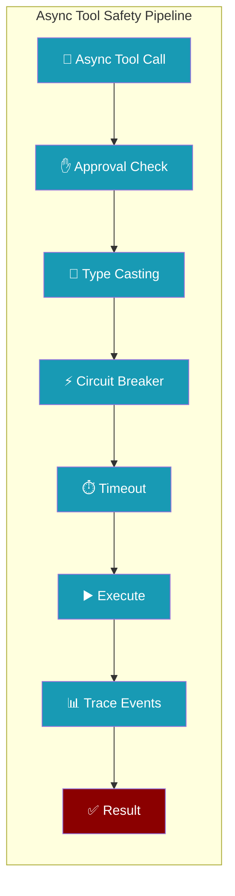
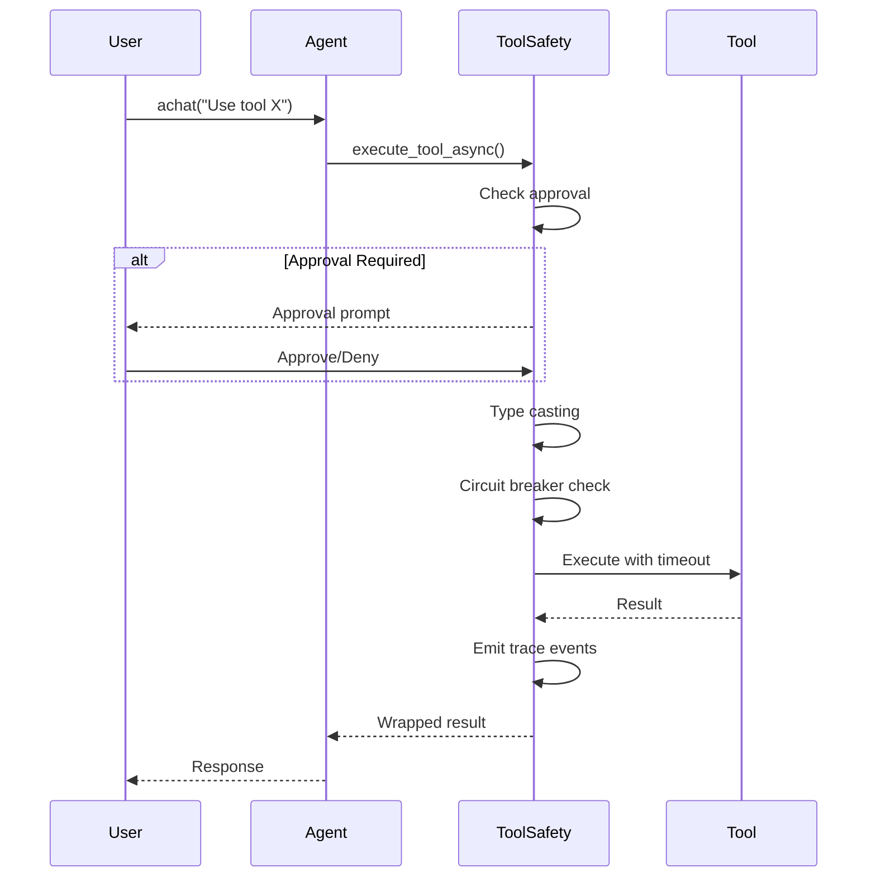
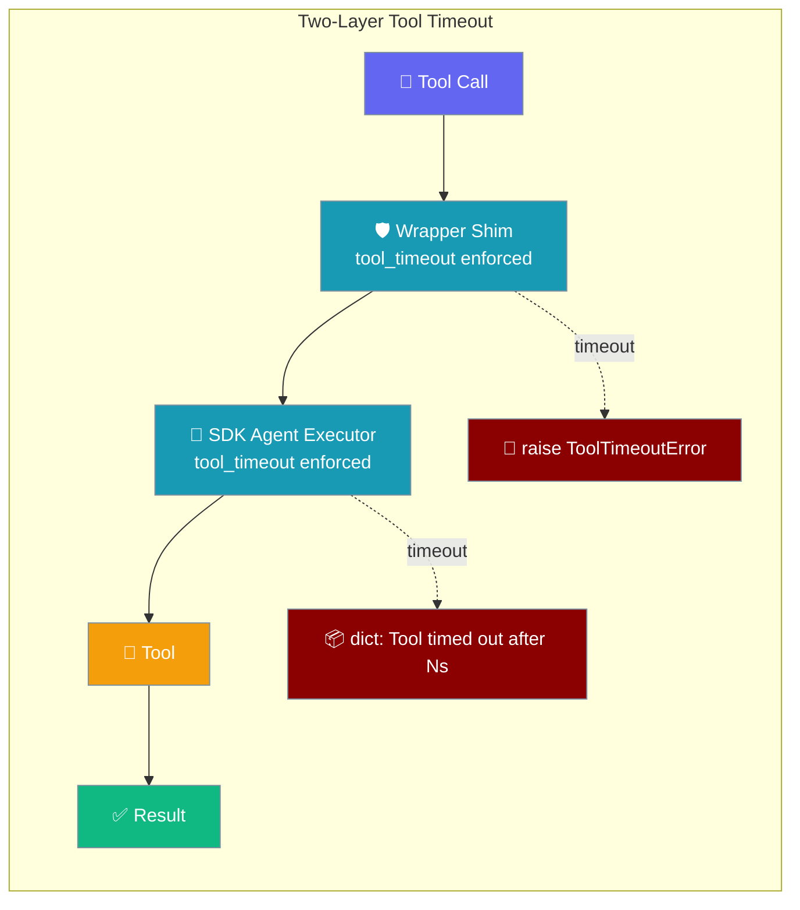

Async tool calls in `agent.achat()` now route through the same safety mechanisms as sync execution, including approval checks, circuit breakers, and timeouts.

```python
from praisonaiagents import Agent

agent = Agent(
    name="assistant",
    instructions="Call tools safely from async runs.",
)
```

The user runs tools via `achat()`; approvals, circuit breakers, and timeouts apply the same way as synchronous execution.




## Quick Start

<Steps>
<Step title="Async Tool with Approval">
```python
from praisonaiagents import Agent

def risky_tool():
    """Tool that requires approval"""
    return "Executed risky operation"

agent = Agent(
    name="Safety Agent",
    instructions="Execute tools safely",
    tools=[risky_tool],
    require_approval=True  # Now works in async mode too
)

# Approval prompt will appear during async execution
response = await agent.achat("Use the risky tool")
```
</Step>

<Step title="Task-Scoped Tools">
```python
from praisonaiagents import Agent, Task

def special_tool():
    return "Special operation completed"

agent = Agent(name="Tool Agent")

# Task-specific tools override agent tools in async mode
task = Task(
    description="Use special tool",
    agent=agent,
    tools=[special_tool]  # Available only for this task
)

# special_tool is available during async chat execution
```
</Step>
</Steps>

---

## How It Works



| Safety Layer | Sync Mode | Async Mode |
|--------------|-----------|------------|
| **Approval checks** | ✅ | ✅ |
| **Argument type casting** | ✅ | ✅ |
| **Circuit breaker** | ✅ | ✅ |
| **Tool timeout** | ✅ | ✅ |
| **Doom-loop tracking** | ✅ | ✅ |
| **Trace events** | ✅ | ✅ |
| **Output truncation** | ✅ | ✅ |
| **Error wrapping** | ✅ | ✅ |

**Architecture**: The unified async dispatcher now calls `execute_tool_async` for tool invocations, so long-running tools no longer block the event loop.

---

## Safety Mechanisms

### Approval Checks
User approval prompts now appear during async tool execution:

```python
from praisonaiagents import Agent

agent = Agent(
    name="Approved Agent",
    tools=[dangerous_operation],
    require_approval=True
)

# Approval workflow works in async mode
async def safe_execution():
    response = await agent.achat("Delete all files")
    # User sees: "Agent wants to use dangerous_operation. Approve? (y/n)"
    return response
```

### Circuit Breaker Protection
Tool failure rates are tracked across async calls:

```python
from praisonaiagents import Agent

agent = Agent(
    name="Circuit Breaker Agent", 
    tools=[unreliable_api],
    # Circuit breaker automatically protects async calls
)

# Failed async calls contribute to circuit breaker state
await agent.achat("Call unreliable API")  # May be blocked if failure rate is high
```

### Timeout Controls
Async tool execution respects timeout settings:

```python
from praisonaiagents import Agent
from praisonaiagents.config.feature_configs import ToolConfig

def slow_tool():
    import time
    time.sleep(10)  # Long operation
    return "Done"

agent = Agent(
    name="Timeout Agent",
    tools=[slow_tool],
    tool_config=ToolConfig(timeout=5)  # 5 second limit applies to async calls
)

# Timeout enforced in async mode
await agent.achat("Use slow tool")  # Will timeout after 5 seconds
```

---

## Wrapper-Level Timeout (YAML / framework: praisonai)

<Warning>
Two `ToolTimeoutError` classes exist in PraisonAI. This section covers **`praisonai.agents_generator.ToolTimeoutError`** — the wrapper-level version raised on YAML/CLI `tool_timeout` (seconds). The SDK tool-call executor has its own **`praisonaiagents.tools.ToolTimeoutError`** (milliseconds, `llm={"tool_timeout_ms": N}`), surfaced as a `ToolResult.error` with `error_kind="timeout"`. See [Tool Call Executor Timeout](/features/tool-call-executor-timeout).
</Warning>

When running through YAML or the CLI, the wrapper wraps every tool with a timeout-enforcing shim **before** handing the agent to the SDK. This provides defense-in-depth timeout enforcement even for pathological tools.

On timeout the wrapper **raises `ToolTimeoutError`** (a `TimeoutError` subclass) instead of returning a JSON dict. This preserves each tool's declared return-type contract — a typed return value is never silently downgraded to a string. Framework adapters catch it and translate it per framework.

The wrapper handles **sync and async tools** differently:
- **Sync tools** run in an instance-owned `ThreadPoolExecutor` (see `_get_tool_timeout_executor` in `agents_generator.py`); on timeout the future is best-effort cancelled. A call that already started cannot be interrupted, so `background_work_may_continue` is `True`.
- **Async tools** are wrapped with `asyncio.wait_for(...)`, which cancels the underlying task cleanly, so `background_work_may_continue` is `False`.



*In Python, configure with `tool_config=ToolConfig(timeout=…)`.*

**Exception raised on wrapper-level timeout:**

```python
from praisonaiagents import Agent
from praisonai.agents_generator import ToolTimeoutError

def slow_lookup(query: str) -> str:
    ...  # a tool that may hang

agent = Agent(
    name="Researcher",
    instructions="Look things up.",
    tools=[slow_lookup],
    tool_config={"timeout": 5},  # ToolConfig(timeout=5) also works
)

try:
    agent.start("Look up X")
except ToolTimeoutError as e:
    print(e.tool_name, e.timeout_seconds, e.background_work_may_continue)
```

To catch the executor-level version instead, use `from praisonaiagents.tools import ToolTimeoutError` — see [Tool Call Executor Timeout](/features/tool-call-executor-timeout).

`ToolTimeoutError` carries three attributes:

| Attribute | Type | Description |
|-----------|------|-------------|
| `tool_name` | `str` | Name of the tool that timed out |
| `timeout_seconds` | `float` | The per-call limit that was exceeded |
| `background_work_may_continue` | `bool` | `True` only when a started sync worker could not be cancelled; async tools cancel cleanly (`False`) |

<Note>
Once half the pool's workers are permanently leaked to stuck sync tools, the pool is automatically recycled: leaked threads continue until their syscall returns, but new tool calls get a fresh pool instead of queueing behind them.
</Note>

See [Tool Configuration](/configuration/tool-config#wrapper-level-tool-timeout) for full details and [Concurrency](/features/concurrency#timeout-return-shape) for shape comparison.

---

## Task-Scoped Tools

The `tools_override` parameter allows tasks to provide their own tool set for async execution:

```python
from praisonaiagents.agent.execution_mixin import execute_tool_async

# Internal usage (SDK implementation detail)
result = await execute_tool_async(
    agent=agent,
    tool_call=tool_call,
    tools_override=task.tools  # Task tools take precedence
)
```

For users, this manifests as task-specific tools being available during async chat:

```python
from praisonaiagents import Agent, Task

def task_specific_tool():
    return "Task-specific result"

agent = Agent(name="Base Agent", tools=[])

task = Task(
    description="Use task tool",
    agent=agent,
    tools=[task_specific_tool]
)

# task_specific_tool is available during task execution
# even though agent has no tools
```

---

## Trace Events

Async tool execution now emits the same trace events as sync execution:

| Event | When | Data |
|-------|------|------|
| `TOOL_CALL_START` | Before execution | tool_name, arguments |
| `TOOL_CALL_RESULT` | After execution | result, duration, errors |

```python
from praisonaiagents import Agent

# Trace events work the same for async calls
agent = Agent(
    name="Traced Agent",
    tools=[my_tool],
    # Observability hooks capture async tool calls
)

# Events emitted during async execution
await agent.achat("Use my tool")
```

---

## Migration Notes

No code changes required - async tool safety is automatically enabled:

**Before:** Async calls bypassed safety mechanisms
```python
# Previously: approval, circuit breaker, etc. were skipped
await agent.achat("Use dangerous tool")  # No approval prompt
```

**After:** Async calls use full safety pipeline
```python 
# Now: full safety pipeline including approval
await agent.achat("Use dangerous tool")  # Approval prompt appears
```

---

## Best Practices

<AccordionGroup>
<Accordion title="Handle Approval in Async Context">
When using approval in async environments, ensure your event loop can handle user input:

```python
import asyncio
from praisonaiagents import Agent

agent = Agent(require_approval=True, tools=[my_tool])

async def safe_async_execution():
    # Approval prompts work in async context
    result = await agent.achat("Use tool")
    return result

# Run with proper event loop
asyncio.run(safe_async_execution())
```
</Accordion>

<Accordion title="Configure Timeouts for Async Tools">
Set appropriate timeouts for async tool execution:

```python
from praisonaiagents import Agent
from praisonaiagents.config.feature_configs import ToolConfig

agent = Agent(
    name="Async Agent",
    tools=[async_api_call],
    tool_config=ToolConfig(timeout=30)  # 30 second limit for async tools
)
```
</Accordion>

<Accordion title="Monitor Circuit Breaker in Async Workflows">
Circuit breaker state affects all calls - monitor in async workflows:

```python
from praisonaiagents import Agent

async def monitored_workflow():
    for i in range(10):
        try:
            result = await agent.achat(f"Process item {i}")
        except ToolExecutionError as e:
            if "circuit breaker" in str(e).lower():
                # Circuit breaker is open, wait before retrying
                await asyncio.sleep(60)
```
</Accordion>

<Accordion title="Task Tools Override Agent Tools">
Design task tools to be self-contained since they override agent tools:

```python
from praisonaiagents import Agent, Task

# Agent tools
def general_tool():
    return "General purpose"

# Task-specific tools (will override agent tools)  
def specialized_tool():
    return "Task-specific operation"

agent = Agent(tools=[general_tool])

task = Task(
    description="Specialized work",
    agent=agent,
    tools=[specialized_tool]  # Only this tool available during task
)
```
</Accordion>
</AccordionGroup>

---

## Safe Defaults

On a fresh interactive session, the runtime now routes dangerous tools through `ConsoleBackend` automatically — no `approval=` kwarg needed. Off-TTY (pipes, CI) keeps deny-by-default. See [Tool Approval → Default Behaviour](/docs/cli/tool-approval#default-behaviour) for the precedence ladder and bypass flags.

---

## Related

<CardGroup cols={2}>
<Card title="Approval" icon="shield-check" href="/docs/features/approval">
  Tool approval configuration
</Card>
<Card title="Tool Circuit Breaker" icon="zap" href="/docs/features/tool-circuit-breaker">
  Tool failure protection
</Card>
<Card title="Tool Approval" icon="shield-check" href="/docs/cli/tool-approval">
  Safe-by-default behaviour, bypass flags, and risk levels
</Card>
</CardGroup>