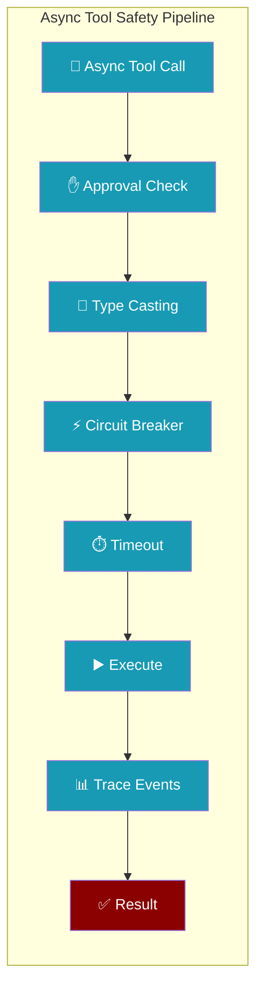
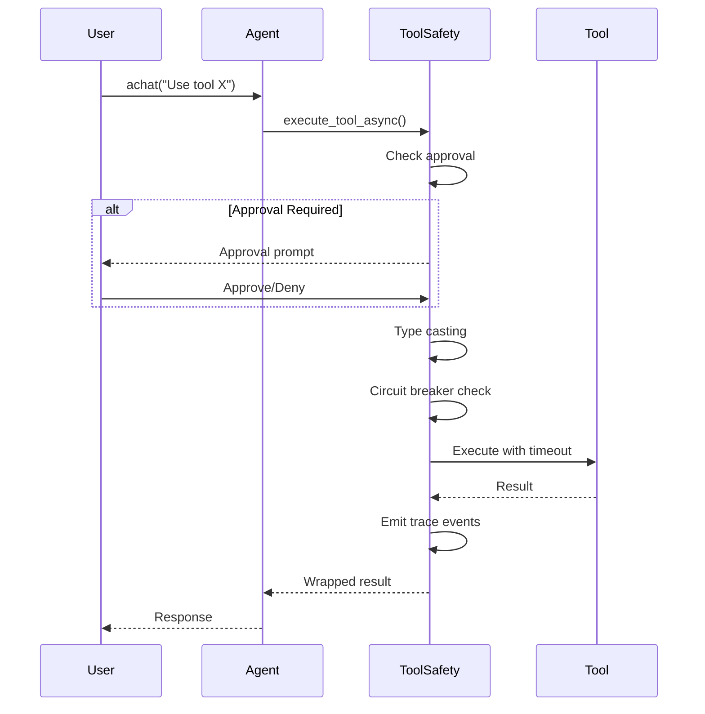
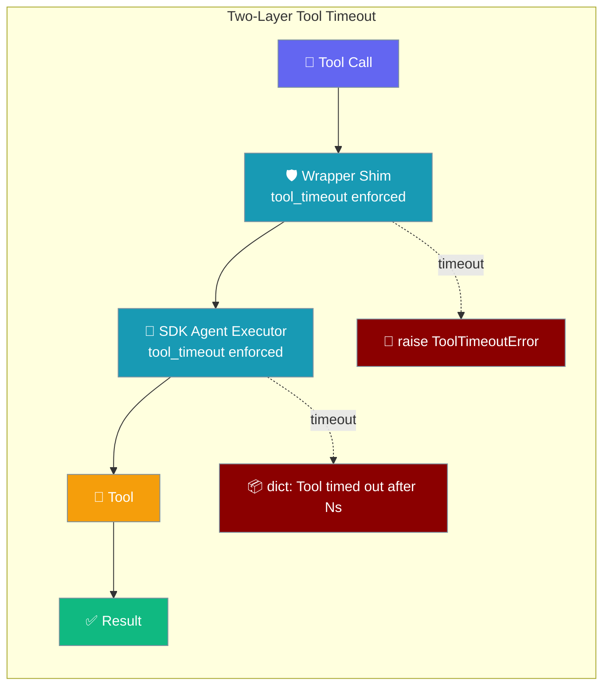

Async tool calls in `agent.achat()` now route through the same safety mechanisms as sync execution, including approval checks, timeouts, and **Loop Guard's doom-loop / no-progress protection** (PR #4005). Each async tool invocation now also runs through `CircuitBreaker.acall(...)` — event-loop safe, using the same per-agent breaker name (`tool_{id(self)}_{function_name}`) and `weakref.finalize` cleanup as the sync path ([PR #4469](https://github.com/MervinPraison/PraisonAI/pull/4469)).

Two more sync/async parity gaps closed in [PR #4634](https://github.com/MervinPraison/PraisonAI/pull/4634):

- **MCP tool resolution** — `MCP` instances passed via `tools=` are now resolved on `achat()`, and MCP transport / timeout failures (`"Error: MCP tool call timed out after Ns"`, `"Error: MCP initialization timed out after Ns"`) are normalized to the same `{"error": …, "timeout": True}` dict shape used on the sync path.
- **Tool-name self-repair** — a case / separator hallucination (e.g. `WebSearch` for `web_search`) is quietly re-matched on `achat()` too. A genuine miss now returns the same corrective error dict with `available_tools` and a closest-match suggestion.

```python
from praisonaiagents import Agent

agent = Agent(
    name="assistant",
    instructions="Call tools safely from async runs.",
)
```

The user runs tools via `achat()`; approvals, circuit breakers, and timeouts apply the same way as synchronous execution.

<Note>
**Sync vs async tool failures:** on `agent.chat()` the sync tool executor raises `ToolExecutionError` directly (fix in PR #4252). The async path returns an error dict to the model instead — except for a Loop Guard `HALT`, which raises `ToolExecutionError(is_retryable=False)`. Both surfaces are documented on the [Error Handling](/features/error-handling#tool-failure-behavior) page.
</Note>


```mermaid
graph LR
    subgraph "Async Tool Safety Pipeline"
        Call[🔄 Async Tool Call] --> Approval[✋ Approval Check]
        Approval --> Cast[🔧 Type Casting]
        Cast --> Breaker[⚡ Circuit Breaker]
        Breaker --> Timeout[⏱️ Timeout]
        Timeout --> Execute[▶️ Execute]
        Execute --> Events[📊 Trace Events]
        Events --> Result[✅ Result]
    end
    
    classDef agent fill:#8B0000,color:#fff
    classDef tool fill:#189AB4,color:#fff
    
    class Result agent
    class Call,Approval,Cast,Breaker,Timeout,Execute,Events tool
```


## Quick Start

<Steps>
<Step title="Async Tool with Approval">
```python
from praisonaiagents import Agent

def risky_tool():
    """Tool that requires approval"""
    return "Executed risky operation"

agent = Agent(
    name="Safety Agent",
    instructions="Execute tools safely",
    tools=[risky_tool],
    require_approval=True  # Now works in async mode too
)

# Approval prompt will appear during async execution
response = await agent.achat("Use the risky tool")
```
</Step>

<Step title="Task-Scoped Tools">
```python
from praisonaiagents import Agent, Task

def special_tool():
    return "Special operation completed"

agent = Agent(name="Tool Agent")

# Task-specific tools override agent tools in async mode
task = Task(
    description="Use special tool",
    agent=agent,
    tools=[special_tool]  # Available only for this task
)

# special_tool is available during async chat execution
```
</Step>
</Steps>

---

## How It Works


```mermaid
sequenceDiagram
    participant User
    participant Agent
    participant ToolSafety
    participant Tool
    
    User->>Agent: achat("Use tool X")
    Agent->>ToolSafety: execute_tool_async()
    ToolSafety->>ToolSafety: Check approval
    alt Approval Required
        ToolSafety-->>User: Approval prompt
        User->>ToolSafety: Approve/Deny
    end
    ToolSafety->>ToolSafety: Type casting
    ToolSafety->>ToolSafety: Circuit breaker check
    ToolSafety->>Tool: Execute with timeout
    Tool-->>ToolSafety: Result
    ToolSafety->>ToolSafety: Emit trace events
    ToolSafety-->>Agent: Wrapped result
    Agent-->>User: Response
```

| Safety Layer | Sync Mode | Async Mode |
|--------------|-----------|------------|
| **Approval checks** | ✅ | ✅ |
| **Argument type casting** | ✅ | ✅ |
| **Circuit breaker** | ✅ | ✅ (parity restored in PR #4469)[^cb-async] |
| **Tool timeout** | ✅ | ✅ |
| **Doom-loop tracking** | ✅ | ✅ |
| **Trace events** | ✅ | ✅ |
| **Output truncation** | ✅ | ✅ |
| **Error wrapping** | ✅ | ✅ |
| **Tool retry policy for raised exceptions** | ✅ | ✅ [^parity] |
| **`restart_safe=False` / `.idempotent = False` veto** | ✅ | ✅ (parity restored in PR #4299) |
| **MCP tool resolution** | ✅ | ✅ (parity restored in PR #4634)[^mcp-async] |
| **MCP timeout normalization** (`{"error": …, "timeout": True}`) | ✅ | ✅ (parity restored in PR #4634)[^mcp-async] |
| **Tool-name self-repair** (`WebSearch` → `web_search`) | ✅ | ✅ (parity restored in PR #4634)[^selfrepair-async] |
| **Corrective error dict with `available_tools` on a miss** | ✅ | ✅ (parity restored in PR #4634)[^selfrepair-async] |

[^parity]: The async column was broken before PR #4141 — a raised exception was retried zero times regardless of `RetryPolicy`. See [Tool Retry Policy → Sync / async parity](/features/tool-retry-policy).

[^cb-async]: The async column was aspirational before [PR #4469](https://github.com/MervinPraison/PraisonAI/pull/4469) — async tool calls bypassed the breaker entirely. The async path now wraps each invocation in `CircuitBreaker.acall(...)`, so five consecutive failures open the breaker just like sync. See [Circuit Breaker Protection](#circuit-breaker-protection).

[^mcp-async]: Before [PR #4634](https://github.com/MervinPraison/PraisonAI/pull/4634) the async path did not consult MCP at all — `MCP` instances in `tools=` hard-failed with `"Function ... not found in tools"` on `achat()`, and MCP transport / timeout failures were handed to the model as bare `"Error: …"` strings that looked like successful results. Both are now at sync parity via the shared `_resolve_mcp_tool_result` / `_normalize_mcp_result` helpers.

[^selfrepair-async]: Before PR #4634 the async path hard-failed on a slightly wrong tool name and returned only `"Function ... not found in tools"`. It now runs the same case / separator-insensitive re-match as the sync path and, on a genuine miss, returns the same corrective error dict (`{"error": "...", "available_tools": [...]}`) so the model can retry with a valid name.

**Architecture**: The unified async dispatcher now calls `execute_tool_async` for tool invocations, so long-running tools no longer block the event loop.

---

## Safety Mechanisms

### Approval Checks
User approval prompts now appear during async tool execution:

```python
from praisonaiagents import Agent

agent = Agent(
    name="Approved Agent",
    tools=[dangerous_operation],
    require_approval=True
)

# Approval workflow works in async mode
async def safe_execution():
    response = await agent.achat("Delete all files")
    # User sees: "Agent wants to use dangerous_operation. Approve? (y/n)"
    return response
```

### Circuit Breaker Protection
Every async tool call runs through `CircuitBreaker.acall(...)` — the same per-agent / per-tool breaker as sync (`tool_{id(self)}_{function_name}`), with the same `failure_threshold=5`, `recovery_timeout=60.0`, and `graceful_degradation=True` defaults ([PR #4469](https://github.com/MervinPraison/PraisonAI/pull/4469)).

```python
from praisonaiagents import Agent

agent = Agent(
    name="Circuit Breaker Agent", 
    tools=[unreliable_api],
    # Circuit breaker automatically protects async calls
)

# Failed async calls contribute to circuit breaker state
await agent.achat("Call unreliable API")  # May be blocked if failure rate is high
```

**Two kinds of failures count toward the breaker on the async path:**

1. A **raised exception** inside the tool.
2. A tool **result dict carrying `error`** — surfaced to the breaker through a `_ToolFailure` sentinel so the dict is preserved.

Approval / permission / policy / guardrail denials **never** count as failures — the async path excludes the same keys the sync `_ToolFailure` wrapper does: `approval_denied`, `permission_denied`, `approval_error`, `policy_denied`, `guardrail_denied`.

When the breaker is open, `CircuitBreaker.acall(...)` raises `CircuitBreakerException` and the async path returns:

```python
{
    "error": "Tool 'X' circuit breaker open - too many recent failures",
    "circuit_open": True,
    "agent_name": "...",
    "session_id": "...",
    "remediation": "Wait for recovery_timeout (60s) or investigate recent tool failures.",
}
```

The `circuit_open: True` flag activates the async retry-skip, so retries stop immediately instead of hammering the open breaker. Loop Guard also records the rejection, so open-circuit rejections still count toward its BLOCK/HALT thresholds.

<Note>
If the `circuit_breaker` module cannot be imported (trimmed builds), the async path falls back to direct invocation — tools still run, just without breaker protection.
</Note>

A repeatedly-failing async tool opens the breaker after 5 failures; the 6th call short-circuits:

```python
import asyncio
from praisonaiagents import Agent, tool

@tool
async def flaky_upstream(query: str) -> str:
    """Async tool that keeps failing on a bad upstream."""
    raise RuntimeError("upstream 503")

agent = Agent(name="Researcher", tools=[flaky_upstream])

async def main():
    # First 5 calls raise and count as failures; the breaker opens.
    # The 6th call short-circuits with {"circuit_open": True}, so the
    # async retry loop terminates immediately instead of retrying.
    result = await agent.achat("Query the upstream repeatedly")
    print(result)

asyncio.run(main())
```

### MCP + Name Self-Repair Parity

MCP tools and hallucinated tool names now resolve identically on `achat()` and `chat()` (PR #4634).

```python
from praisonaiagents import Agent
from praisonaiagents.mcp import MCP

agent = Agent(
    name="MCP Agent",
    instructions="Use the MCP server tools to answer.",
    tools=MCP("npx -y @modelcontextprotocol/server-filesystem /tmp"),
)

# Before PR #4634: hard-failed with "Function read_file not found in tools".
# Now: resolves through the MCP runner and returns the file contents.
result = await agent.achat("What is in /tmp/notes.txt?")
```

```python
# Model emits 'WebSearch' but the tool is named 'web_search'.
# Before PR #4634: async path hard-failed; sync path quietly re-matched.
# Now: async path re-matches too and calls web_search(...) as intended.
await agent.achat("Search the web for the latest fusion news.")
```

## Loop Guard on the async path

Every async tool call in `agent.achat()` now runs through Loop Guard the same way sync calls always did (PR #4005). Repeated identical calls, repeated timeouts, and repeated exceptions all accumulate toward `WARN → BLOCK → HALT` on the current turn.

```python
from praisonaiagents import Agent

agent = Agent(
    name="Async Poller",
    instructions="Poll a status endpoint until it succeeds.",
)

# Identical failing calls escalate through Loop Guard on the async path.
# A HALT propagates as ToolExecutionError(is_retryable=False) — retry
# policies also honour this and will not re-run a HALT'd call.
result = await agent.achat("Watch job-42 until it is done.")
```

**Async-specific details:**

- Async tool **timeouts** (`asyncio.wait_for` firing after `tool_timeout` seconds) are recorded as failures and count toward the BLOCK/HALT thresholds. Previously they early-returned and bypassed the streak.
- Async tool **exceptions** are also recorded as failures — a tool that keeps raising escalates the same way a tool that keeps returning `{"error": …}` does.
- A Loop Guard `HALT` propagates as `ToolExecutionError(is_retryable=False)`. The async retry wrapper honours both `loop_blocked` (in the returned dict) and the exception, so no custom retry policy can re-run a terminally blocked call.

See [Loop Guard](/features/loop-guard) for the full threshold table, tool classification, and configuration options.

### Retry parity on the async path

Raised exceptions on `agent.achat(...)` / `agent.execute_tool_async(...)` are now retried under `ToolConfig(retry_policy=RetryPolicy(...))`, matching the sync path (PR #4141) — programming errors (`ValueError`, `TypeError`, `AttributeError`) and `ToolExecutionError(is_retryable=False)` (including Loop Guard HALT) stay terminal. See [Tool Retry Policy](/features/tool-retry-policy) for the full policy reference.

The reverse direction — **not** retrying when the tool asked not to be retried — is also at parity as of PR [#4299](https://github.com/MervinPraison/PraisonAI/pull/4299). `@tool(restart_safe=False)` / `.idempotent = False` runs exactly once on `agent.achat(...)` / `agent.execute_tool_async(...)`, matching the sync path. See [Tool Retry & Backoff → Retrying Non-Idempotent Tools](/features/tool-retry-backoff#retrying-non-idempotent-tools) for the full veto rules.

### Timeout Controls
Async tool execution respects timeout settings:

```python
from praisonaiagents import Agent
from praisonaiagents.config.feature_configs import ToolConfig

def slow_tool():
    import time
    time.sleep(10)  # Long operation
    return "Done"

agent = Agent(
    name="Timeout Agent",
    tools=[slow_tool],
    tool_config=ToolConfig(timeout=5)  # 5 second limit applies to async calls
)

# Timeout enforced in async mode
await agent.achat("Use slow tool")  # Will timeout after 5 seconds
```

---

## Wrapper-Level Timeout (YAML / framework: praisonai)

<Warning>
Two `ToolTimeoutError` classes exist in PraisonAI. This section covers **`praisonai.agents_generator.ToolTimeoutError`** — the wrapper-level version raised on YAML/CLI `tool_timeout` (seconds). The SDK tool-call executor has its own **`praisonaiagents.tools.ToolTimeoutError`** (milliseconds, `llm={"tool_timeout_ms": N}`), surfaced as a `ToolResult.error` with `error_kind="timeout"`. See [Tool Call Executor Timeout](/features/tool-call-executor-timeout).
</Warning>

When running through YAML or the CLI, the wrapper wraps every tool with a timeout-enforcing shim **before** handing the agent to the SDK. This provides defense-in-depth timeout enforcement even for pathological tools.

On timeout the wrapper **raises `ToolTimeoutError`** (a `TimeoutError` subclass) instead of returning a JSON dict. This preserves each tool's declared return-type contract — a typed return value is never silently downgraded to a string. Framework adapters catch it and translate it per framework.

The wrapper handles **sync and async tools** differently:
- **Sync tools** run in an instance-owned `ThreadPoolExecutor` (see `_get_tool_timeout_executor` in `agents_generator.py`); on timeout the future is best-effort cancelled. A call that already started cannot be interrupted, so `background_work_may_continue` is `True`.
- **Async tools** are wrapped with `asyncio.wait_for(...)`, which cancels the underlying task cleanly, so `background_work_may_continue` is `False`.


```mermaid
graph LR
    subgraph "Two-Layer Tool Timeout"
        Call[🔄 Tool Call] --> WrapShim[🛡️ Wrapper Shim<br/>tool_timeout enforced]
        WrapShim --> SDK[🧠 SDK Agent Executor<br/>tool_timeout enforced]
        SDK --> Tool[🔧 Tool]
        Tool --> Result[✅ Result]
        WrapShim -.->|timeout| Raise1[🚨 raise ToolTimeoutError]
        SDK -.->|timeout| Dict2[📦 dict: Tool timed out after Ns]
    end

    classDef input fill:#6366F1,stroke:#7C90A0,color:#fff
    classDef safety fill:#189AB4,stroke:#7C90A0,color:#fff
    classDef execution fill:#F59E0B,stroke:#7C90A0,color:#fff
    classDef output fill:#10B981,stroke:#7C90A0,color:#fff
    classDef error fill:#8B0000,stroke:#7C90A0,color:#fff

    class Call input
    class WrapShim,SDK safety
    class Tool execution
    class Result output
    class Raise1,Dict2 error
```

*In Python, configure with `tool_config=ToolConfig(timeout=…)`.*

**Exception raised on wrapper-level timeout:**

```python
from praisonaiagents import Agent
from praisonai.agents_generator import ToolTimeoutError

def slow_lookup(query: str) -> str:
    ...  # a tool that may hang

agent = Agent(
    name="Researcher",
    instructions="Look things up.",
    tools=[slow_lookup],
    tool_config={"timeout": 5},  # ToolConfig(timeout=5) also works
)

try:
    agent.start("Look up X")
except ToolTimeoutError as e:
    print(e.tool_name, e.timeout_seconds, e.background_work_may_continue)
```

To catch the executor-level version instead, use `from praisonaiagents.tools import ToolTimeoutError` — see [Tool Call Executor Timeout](/features/tool-call-executor-timeout).

`ToolTimeoutError` carries three attributes:

| Attribute | Type | Description |
|-----------|------|-------------|
| `tool_name` | `str` | Name of the tool that timed out |
| `timeout_seconds` | `float` | The per-call limit that was exceeded |
| `background_work_may_continue` | `bool` | `True` only when a started sync worker could not be cancelled; async tools cancel cleanly (`False`) |

<Note>
Once half the pool's workers are permanently leaked to stuck sync tools, the pool is automatically recycled: leaked threads continue until their syscall returns, but new tool calls get a fresh pool instead of queueing behind them.
</Note>

See [Tool Configuration](/configuration/tool-config#wrapper-level-tool-timeout) for full details and [Concurrency](/features/concurrency#timeout-return-shape) for shape comparison.

---

## Task-Scoped Tools

The `tools_override` parameter allows tasks to provide their own tool set for async execution:

```python
from praisonaiagents.agent.execution_mixin import execute_tool_async

# Internal usage (SDK implementation detail)
result = await execute_tool_async(
    agent=agent,
    tool_call=tool_call,
    tools_override=task.tools  # Task tools take precedence
)
```

For users, this manifests as task-specific tools being available during async chat:

```python
from praisonaiagents import Agent, Task

def task_specific_tool():
    return "Task-specific result"

agent = Agent(name="Base Agent", tools=[])

task = Task(
    description="Use task tool",
    agent=agent,
    tools=[task_specific_tool]
)

# task_specific_tool is available during task execution
# even though agent has no tools
```

---

## Trace Events

Async tool execution now emits the same trace events as sync execution:

| Event | When | Data |
|-------|------|------|
| `TOOL_CALL_START` | Before execution | tool_name, arguments |
| `TOOL_CALL_RESULT` | After execution | result, duration, errors |

```python
from praisonaiagents import Agent

# Trace events work the same for async calls
agent = Agent(
    name="Traced Agent",
    tools=[my_tool],
    # Observability hooks capture async tool calls
)

# Events emitted during async execution
await agent.achat("Use my tool")
```

---

## Migration Notes

No code changes required - async tool safety is automatically enabled:

**Before:** Async calls bypassed safety mechanisms
```python
# Previously: approval, circuit breaker, etc. were skipped
await agent.achat("Use dangerous tool")  # No approval prompt
# Async tool calls bypassed the circuit breaker even after 5 consecutive failures
```

**After:** Async calls use full safety pipeline
```python 
# Now: full safety pipeline including approval
await agent.achat("Use dangerous tool")  # Approval prompt appears
# Async tool calls open the breaker after 5 failures and short-circuit, same as sync (PR #4469)
```

---

## Best Practices

<AccordionGroup>
<Accordion title="Handle Approval in Async Context">
When using approval in async environments, ensure your event loop can handle user input:

```python
import asyncio
from praisonaiagents import Agent

agent = Agent(require_approval=True, tools=[my_tool])

async def safe_async_execution():
    # Approval prompts work in async context
    result = await agent.achat("Use tool")
    return result

# Run with proper event loop
asyncio.run(safe_async_execution())
```
</Accordion>

<Accordion title="Configure Timeouts for Async Tools">
Set appropriate timeouts for async tool execution:

```python
from praisonaiagents import Agent
from praisonaiagents.config.feature_configs import ToolConfig

agent = Agent(
    name="Async Agent",
    tools=[async_api_call],
    tool_config=ToolConfig(timeout=30)  # 30 second limit for async tools
)
```
</Accordion>

<Accordion title="Monitor Circuit Breaker in Async Workflows">
Circuit breaker state affects all calls - monitor in async workflows:

```python
from praisonaiagents import Agent

async def monitored_workflow():
    for i in range(10):
        try:
            result = await agent.achat(f"Process item {i}")
        except ToolExecutionError as e:
            if "circuit breaker" in str(e).lower():
                # Circuit breaker is open, wait before retrying
                await asyncio.sleep(60)
```
</Accordion>

<Accordion title="Task Tools Override Agent Tools">
Design task tools to be self-contained since they override agent tools:

```python
from praisonaiagents import Agent, Task

# Agent tools
def general_tool():
    return "General purpose"

# Task-specific tools (will override agent tools)  
def specialized_tool():
    return "Task-specific operation"

agent = Agent(tools=[general_tool])

task = Task(
    description="Specialized work",
    agent=agent,
    tools=[specialized_tool]  # Only this tool available during task
)
```
</Accordion>
</AccordionGroup>

---

## Safe Defaults

On a fresh interactive session, the runtime now routes dangerous tools through `ConsoleBackend` automatically — no `approval=` kwarg needed. Off-TTY (pipes, CI) keeps deny-by-default. See [Tool Approval → Default Behaviour](/docs/cli/tool-approval#default-behaviour) for the precedence ladder and bypass flags.

---

## Related

<CardGroup cols={3}>
<Card title="Approval" icon="shield-check" href="/features/approval">
  Tool approval configuration
</Card>
<Card title="Tool Circuit Breaker" icon="zap" href="/features/tool-circuit-breaker">
  Tool failure protection
</Card>
<Card title="Tool Approval" icon="shield-check" href="/cli/tool-approval">
  Safe-by-default behaviour, bypass flags, and risk levels
</Card>
<Card title="Loop Guard" icon="shield-halved" href="/features/loop-guard">
  Always-on per-turn tool-call guardrails, now on both sync and async paths
</Card>
</CardGroup>