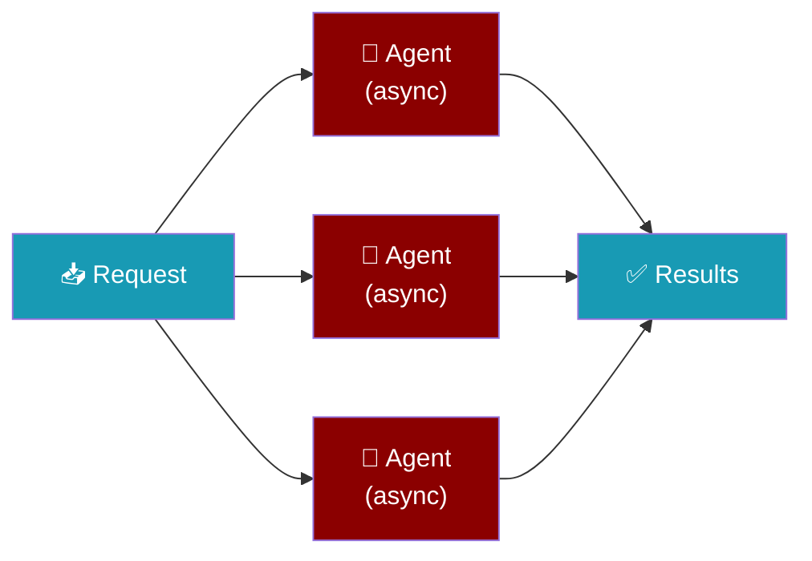
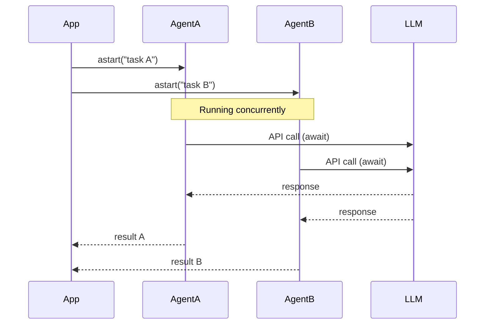

Async agents run non-blocking AI tasks with `await`, letting you process multiple requests in parallel or embed agents inside async web servers.

```python
import asyncio
from praisonaiagents import Agent

async def main():
    agent = Agent(name="helper", instructions="Reply concisely.")
    print(await agent.astart("Hello"))

asyncio.run(main())
```

The user sends concurrent requests; each `astart()` yields on I/O so the server stays responsive under load.



## Quick Start

<Steps>
<Step title="Simple Usage">
Use `astart()` inside an `async` function:

```python
import asyncio
from praisonaiagents import Agent

agent = Agent(
    name="AsyncAgent",
    instructions="You are a helpful assistant."
)

async def main():
    result = await agent.astart("Summarize the benefits of async programming")
    print(result)

asyncio.run(main())
```
</Step>

<Step title="With Configuration">
Run multiple agents in parallel with `asyncio.gather`:

```python
import asyncio
from praisonaiagents import Agent, Task, PraisonAIAgents

research_agent = Agent(name="Researcher", instructions="Research topics deeply")
writer_agent = Agent(name="Writer", instructions="Write clear summaries")

task1 = Task(
    description="Research async patterns in Python",
    agent=research_agent,
    async_execution=True,
    expected_output="Research notes"
)
task2 = Task(
    description="Write a summary of async best practices",
    agent=writer_agent,
    async_execution=True,
    expected_output="Clear summary"
)

async def main():
    agents = PraisonAIAgents(
        agents=[research_agent, writer_agent],
        tasks=[task1, task2],
        process="sequential"
    )
    result = await agents.astart()
    print(result)

asyncio.run(main())
```
</Step>
</Steps>

---

## How It Works



### Sync vs Async Methods

| Sync | Async | Use When |
|------|-------|----------|
| `agent.start()` | `await agent.astart()` | Running an agent |
| `agent.chat()` | `await agent.achat()` | Conversational turn |
| `agents.start()` | `await agents.astart()` | Multi-agent orchestration |

---

## Configuration Options

Set `async_execution=True` on individual tasks to mark them for async execution:

```python
from praisonaiagents import Task

task = Task(
    description="Process this document",
    agent=my_agent,
    async_execution=True,
    expected_output="Processed result",
    callback=my_async_callback,
)
```

| Option | Type | Default | Description |
|--------|------|---------|-------------|
| `async_execution` | `bool` | `False` | Mark task for async execution |
| `callback` | `Callable` | `None` | Sync or async callback on task completion |

---

## Common Patterns

### Parallel Requests

```python
import asyncio
from praisonaiagents import Agent

agent = Agent(
    name="Analyst",
    instructions="Analyze topics concisely."
)

async def main():
    topics = ["Python", "JavaScript", "Rust"]
    tasks = [agent.astart(f"In one sentence, describe {t}") for t in topics]
    results = await asyncio.gather(*tasks)
    for topic, result in zip(topics, results):
        print(f"{topic}: {result}")

asyncio.run(main())
```

### Async Callback

```python
import asyncio
from praisonaiagents import Agent, Task, PraisonAIAgents

async def on_complete(output):
    print(f"Task done: {output.raw[:100]}")

agent = Agent(name="Worker", instructions="Complete assigned tasks")

task = Task(
    description="Summarize the history of the internet",
    agent=agent,
    async_execution=True,
    callback=on_complete,
    expected_output="Brief summary"
)

async def main():
    agents = PraisonAIAgents(agents=[agent], tasks=[task])
    await agents.astart()

asyncio.run(main())
```

### Inside a Web Framework (FastAPI)

```python
from fastapi import FastAPI
from praisonaiagents import Agent

app = FastAPI()
agent = Agent(name="APIAgent", instructions="Answer user questions helpfully.")

@app.get("/ask")
async def ask(question: str):
    result = await agent.astart(question)
    return {"answer": result}
```

### Lifecycle Hooks in Async Workflows

`on_task_start` and `on_task_complete` fire from `astart()` / `arun_task()` exactly as they do from `start()`:

```python
import asyncio
from praisonaiagents import Agent, Task, PraisonAIAgents, MultiAgentHooksConfig

worker = Agent(name="Worker", instructions="Do the work.")
task = Task(description="Process batch #42", agent=worker)

async def on_complete(task, task_output):
    # native awaitable — no run_in_executor needed
    print(f"Notifying downstream: {task.name}")

team = PraisonAIAgents(
    agents=[worker],
    tasks=[task],
    hooks=MultiAgentHooksConfig(on_task_complete=on_complete),
)

asyncio.run(team.astart())
```

`async def` callbacks are awaited; sync callbacks are offloaded to the default executor. See [Multi-Agent Hooks](/docs/features/multi-agent-hooks) for the full contract.

---

## Best Practices

<AccordionGroup>
  <Accordion title="Always use asyncio.run() as the entry point">
    Call `asyncio.run(main())` once at the program entry point. Avoid calling it inside already-running event loops — use `await` there instead.
  </Accordion>
  <Accordion title="Limit concurrency to avoid rate limits">
    Use `asyncio.Semaphore(n)` to cap simultaneous LLM calls: `async with asyncio.Semaphore(5): result = await agent.astart(...)`. Start with `n=5` and tune based on your API limits.
  </Accordion>
  <Accordion title="Handle errors per-task with gather(return_exceptions=True)">
    Pass `return_exceptions=True` to `asyncio.gather()` so one failed task doesn't cancel the others. Check each result for `isinstance(result, Exception)` before using it.
  </Accordion>
  <Accordion title="Use async callbacks for async downstream work">
    Callbacks can be async (`async def callback(output): ...`). The runtime dispatches them safely even when called from within a running event loop.
  </Accordion>
</AccordionGroup>

---

## Related

<CardGroup cols={2}>
  <Card title="Workflows" icon="diagram-project" href="/docs/features/workflows">
    Build parallel and sequential multi-agent workflows
  </Card>
  <Card title="Async Crew Kickoff" icon="rocket" href="/docs/features/async-crew-kickoff">
    Run YAML-defined crews asynchronously
  </Card>
</CardGroup>
