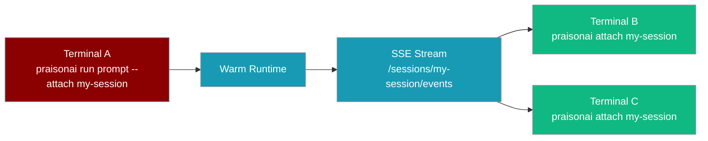
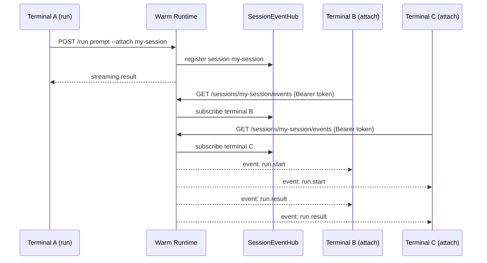

`praisonai attach` subscribes to a live session on the warm local runtime and streams its events in real time — perfect for watching a long-running agent from a second terminal without interrupting it.



## Quick Start

<Steps>
<Step title="Start the warm runtime">
The daemon must be running before you can attach to any session.

```bash
praisonai daemon start --background
```
</Step>

<Step title="Run an agent with a session id (Terminal A)">
Tag the run with a session id so other terminals can observe it.

```bash
praisonai run "research the history of the internet" --attach my-session
```

The agent starts immediately. The `--attach` flag registers the run under `my-session` on the warm runtime.
</Step>

<Step title="Attach from a second terminal (Terminal B)">
Open a new terminal and stream the live events:

```bash
praisonai attach my-session
```

You'll see the run events printed in real time as the agent works — without affecting execution.
</Step>
</Steps>

---

## How It Works



`attach` is **read-only** — detaching (Ctrl-C) never affects execution. Multiple terminals can attach to the same session concurrently and receive the same event stream.

| What attach does | What attach does NOT do |
|---|---|
| Subscribes to live SSE event stream | Start or stop execution |
| Renders human-readable event output | Modify agent state |
| Exits cleanly on Ctrl-C | Affect other attached clients |
| Validates runtime version before subscribing | Work without a running daemon |

---

## Event Reference

Three event types are emitted over the stream:

| Type | Fields | Human render |
|---|---|---|
| `run.start` | `session_id`, `prompt` | `▶ run.start: <prompt>` |
| `run.result` | `session_id`, `ok`, `result` | `✓ run.result` followed by `<result>` on its own line |
| `run.error` | `session_id`, `error` | `✗ run.error: <error>` |

<Tabs>
<Tab title="Human render (default)">
```
▶ run.start: research the history of the internet
✓ run.result
The internet traces its origins to ARPANET in 1969...
```
</Tab>

<Tab title="--json (NDJSON)">
```json
{"type":"run.start","session_id":"my-session","prompt":"research the history of the internet"}
{"type":"run.result","session_id":"my-session","ok":true,"result":"The internet traces its origins to ARPANET in 1969..."}
```
</Tab>
</Tabs>

<Tip>
Events arrive over Server-Sent Events at `GET <base_url>/sessions/{session_id}/events` authenticated with `Bearer <token>` from the runtime descriptor. Session ids containing `/`, `#`, `?`, or spaces are percent-encoded on the wire and round-trip safely. A `: keep-alive` comment is sent every ~15 seconds — the client ignores it. The stream ends when the runtime stops or the client disconnects.
</Tip>

---

## Options

```bash
praisonai attach <session-id> [--json]
```

| Argument / Option | Type | Default | Description |
|---|---|---|---|
| `session_id` | positional `str` | required | Session id to attach to. |
| `--json` | flag | `False` | Emit raw NDJSON events instead of the human-readable render. |

---

## Exit Codes

| Code | Meaning |
|---|---|
| `0` | Clean detach (Ctrl-C). |
| `1` | No compatible warm runtime is running, or the runtime stream was lost mid-attach. |
| `4` | Internal: runtime module not importable. |

---

## Common Patterns

### Watch a long-running agent from a second terminal

```bash
# Terminal A — start the run
praisonai daemon start --background
praisonai run "summarise all PDFs in /docs" --attach pdf-summary

# Terminal B — attach and watch
praisonai attach pdf-summary
```

### Pipe JSON events into `jq` for live filtering

```bash
praisonai attach my-session --json | jq 'select(.type=="run.result")'
```

This emits only the final result event, discarding `run.start` and `run.error`.

### Multiple observers on the same session

```bash
# Terminal B
praisonai attach my-session

# Terminal C (simultaneously)
praisonai attach my-session
```

Both terminals receive every event in real time. Detaching from either terminal does not affect the other observer or the running agent.

---

## Best Practices

<AccordionGroup>
<Accordion title="Start the daemon before running with --attach">
`praisonai attach` requires the warm runtime to be active. Always run `praisonai daemon start` (or `--background`) before issuing `praisonai run ... --attach <id>`. If the runtime is not running, `attach` exits with code `1` immediately.
</Accordion>

<Accordion title="Use simple session ids — special characters are handled safely">
The client percent-encodes session ids on the wire, so ids containing `/`, `#`, `?`, or spaces round-trip correctly. That said, simple alphanumeric ids (e.g. `my-session`, `run-001`) are easier to type and less error-prone in shell scripts.
</Accordion>

<Accordion title="Detaching is always safe — it never stops the run">
Pressing Ctrl-C in any attached terminal sends a clean disconnect to the runtime and exits with code `0`. The running agent continues unaffected, and any other attached terminals remain connected.
</Accordion>

<Accordion title="Resolve version mismatches by restarting the daemon">
`attach` validates that the running runtime speaks a compatible protocol version (major-version match). If you see "No compatible warm runtime is running", the daemon is likely an older version. Fix it with:

```bash
praisonai daemon stop
praisonai daemon start --background
```

Then re-run your agent and re-attach.
</Accordion>
</AccordionGroup>

---

## Related

<CardGroup cols={2}>
<Card title="Run" icon="play" href="/docs/cli/run">
  The `--attach` flag on `praisonai run` — required to create an observable session
</Card>
<Card title="Daemon" icon="bolt" href="/docs/cli/daemon">
  Start and manage the warm local runtime that `attach` connects to
</Card>
</CardGroup>
