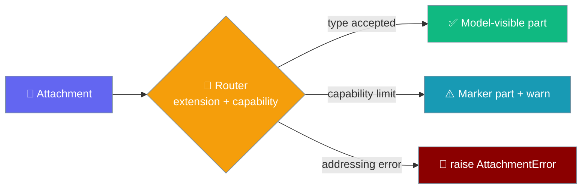
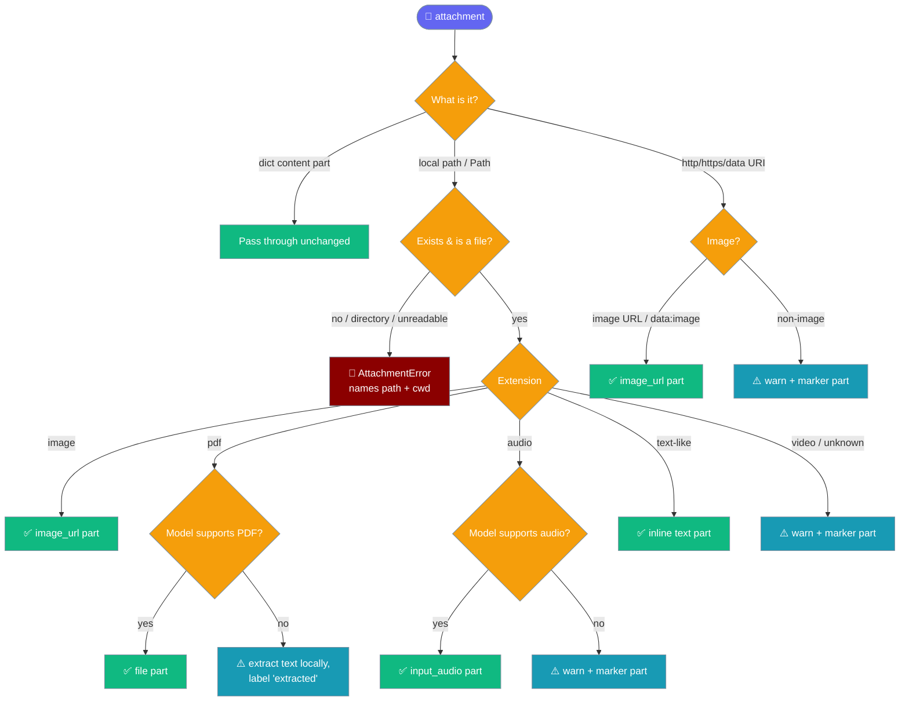

Pass any file — image, PDF, audio, text, video, a URL, a `data:` URI, or a `pathlib.Path` — to `agent.start(...)` and the router turns it into a model-visible part or tells you why it could not.

```python
from praisonaiagents import Agent

agent = Agent(instructions="Describe what you are given.", llm="gpt-4o")
agent.start("What is in this image?", attachments=["photo.png"])
```

An attachment is never dropped silently: it either becomes a content part the model sees, or it raises, or it warns and leaves a marker part in the prompt so the model can say it answered without the file.



## Quick Start

<Steps>
<Step title="Attach an image at start()">
```python
from praisonaiagents import Agent

agent = Agent(instructions="Describe images.", llm="gpt-4o")
agent.start("What landmark is this?", attachments=["photo.png"])
```
</Step>

<Step title="Attach a PDF at chat()">
```python
from praisonaiagents import Agent

agent = Agent(instructions="Summarise documents.", llm="gpt-4o")
agent.chat("Summarise this report.", attachments=["report.pdf"])
```

A PDF-capable model receives the document as a `file` part; a non-PDF model gets locally-extracted text, labelled as extracted.
</Step>

<Step title="Mix file types in one list">
```python
from pathlib import Path
from praisonaiagents import Agent

agent = Agent(instructions="Analyse everything I send.", llm="gpt-4o")
agent.chat(
    "Review these together.",
    attachments=[
        Path("report.pdf"),
        "clip.mp3",
        "https://example.com/photo.png",
    ],
)
```

Each entry is routed independently by its type — a `Path`, a local file, and a URL in the same call.
</Step>
</Steps>

## How the router decides

The router inspects each attachment's extension, checks the target model's capability, and picks one of three outcomes.



## What each file type does

The outcome depends on the file type and the target model's capability.

| File type | Vision model | Non-vision model | Audio-capable | Non-audio-capable | PDF-capable | Non-PDF-capable |
|-----------|--------------|------------------|---------------|-------------------|-------------|-----------------|
| Image (jpg/jpeg/png/gif/webp) | passed as `image_url` | passed as `image_url` (unchanged) | — | — | — | — |
| PDF | — | — | — | — | passed as `file` part | text extracted locally, part labelled "extracted" |
| Audio (mp3/wav/m4a/ogg/opus/flac/aac) | — | — | passed as `input_audio` | warn + marker part injected | — | — |
| Text (`.txt`, `.md`, code, config…) | — | — | — | — | — | inlined as a text part `[Attachment: name] <content>` |
| Video (mp4/mov/…) | — | — | — | warn + marker part injected | — | — |
| URL (image) | `image_url` (URL passed straight through) | `image_url` (unchanged) | — | — | — | — |
| URL (non-image, e.g. `.pdf`) | — | — | — | — | — | warn + marker part (not downloaded) |
| `data:` URI (image) | passed through | passed through | — | — | — | — |
| `data:` URI (non-image) | — | — | — | — | — | warn + marker part |
| `pathlib.Path` | resolved to a path and dispatched by its extension, exactly like a string path | | | | | |

<Note>
Remote non-image files are **not** downloaded — the router performs no network I/O. Download the file and pass its local path instead. Image URLs are passed to the model as-is.
</Note>

## What raises vs what warns

Two failure classes are treated differently on purpose.

<CodeGroup>
```python raises — addressing errors
from praisonaiagents import Agent
from praisonaiagents.agent.attachments import AttachmentError

agent = Agent(instructions="Describe files.", llm="gpt-4o")

# Missing path, a directory, an unreadable file, or an unsupported
# Python type all raise AttachmentError — a caller mistake with no
# useful degraded answer.
try:
    agent.start("Describe it", attachments=["does-not-exist.png"])
except AttachmentError as e:
    print(e)
    # does-not-exist.png: no such file (attachment paths are resolved
    # relative to the current working directory '/home/you/project')
```

```python warns — capability limits
from praisonaiagents import Agent

# gpt-4o cannot accept audio. The file is fine; the model can't ingest it.
# The router logs a warning AND injects a marker part so the model can
# answer and say the audio was withheld — the run still succeeds.
agent = Agent(instructions="Transcribe or describe.", llm="gpt-4o")
agent.start("What does the clip say?", attachments=["clip.mp3"])
# WARNING ... model 'gpt-4o' cannot accept audio input (use an
#   audio-capable model such as gpt-4o-audio-preview or a Gemini model,
#   or transcribe the file first)
# Prompt gains: [Attachment omitted: clip.mp3 - audio was not sent ...]
```
</CodeGroup>

<Note>
Two environment escape hatches flip the defaults: `PRAISONAI_ATTACHMENTS_ON_MISSING=warn` downgrades a missing/unreadable **raise** to a warning + marker part, and `PRAISONAI_ATTACHMENTS_STRICT=1` escalates capability **degrades** to raises for pipelines that would rather fail than get a partial answer.
</Note>

## Capability helpers

Check what a model can ingest before you attach — the same probes the router uses.

```python
from praisonaiagents.llm.model_capabilities import (
    supports_vision,
    supports_pdf_input,
    supports_audio_input,
)

supports_pdf_input("gpt-4o")                  # False
supports_pdf_input("gemini/gemini-1.5-pro")   # True
supports_audio_input("gpt-4o-audio-preview")  # True
supports_vision("gpt-4o")                     # True
```

<Note>
Images are deliberately **not** gated on `supports_vision` — some local/Ollama models are reported conservatively by the underlying provider table but still accept images, so gating them would break those runs. Images are always passed as `image_url` parts, byte-for-byte identical to earlier releases.
</Note>

## Error handling

`AttachmentError` subclasses `ValueError`, so any existing `except ValueError` around `chat()` keeps catching it.

```python
from praisonaiagents import Agent
from praisonaiagents.agent.attachments import AttachmentError

agent = Agent(instructions="Batch describe files.", llm="gpt-4o")

paths = ["a.png", "missing.png", "b.png"]
for path in paths:
    try:
        print(agent.chat("Describe this.", attachments=[path]))
    except AttachmentError as e:
        # Message names the path AND the current working directory:
        #   missing.png: no such file (attachment paths are resolved
        #   relative to the current working directory '/home/you/project')
        print(f"Skipping {path}: {e}")
```

## Best Practices

<AccordionGroup>
<Accordion title="Prefer Path for local files">
Pass `pathlib.Path("report.pdf")` for local files. The router resolves it and dispatches by extension — earlier releases silently dropped `Path` objects because an `isinstance(str)` check was `False`.
</Accordion>

<Accordion title="Let the router pick the encoding">
Pass the raw path or URL — do not pre-encode to a `data:` URI yourself. The router chooses the right part shape (`image_url`, `file`, `input_audio`, or `text`) per file type and model capability.
</Accordion>

<Accordion title="Keep large media out of chat history">
Send big images and documents via `attachments=` rather than embedding them in the prompt string, so their bytes never fill the conversation history.
</Accordion>

<Accordion title="Catch AttachmentError in batch jobs">
Wrap `chat()` / `start()` in `except AttachmentError as e` when processing a list of files, so one bad path does not abort the whole batch.
</Accordion>
</AccordionGroup>

## Related

<CardGroup cols={2}>
<Card title="Multimodal Agents" icon="images" href="./multimodal">
  Attach media to tasks and run vision workflows.
</Card>
<Card title="Multimodal Tool Output" icon="image" href="./multimodal-tool-output">
  Return images and media from tools back to the agent.
</Card>
</CardGroup>
