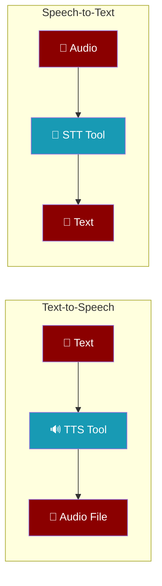

Enable your agents to speak and listen with TTS and STT tools.


```mermaid
graph LR
    subgraph "Text-to-Speech"
        T[📝 Text] --> TTS[🔊 TTS Tool]
        TTS --> A[🎵 Audio File]
    end
    
    subgraph "Speech-to-Text"
        A2[🎵 Audio] --> STT[🎤 STT Tool]
        STT --> T2[📝 Text]
    end
    
    classDef input fill:#8B0000,color:#fff
    classDef tool fill:#189AB4,color:#fff
    classDef output fill:#8B0000,color:#fff
    
    class T,A2 input
    class TTS,STT tool
    class A,T2 output
```

---

## Quick Start


<Steps>
<Step title="Simple Usage">
<Tabs>
<Tab title="Bot CLI">

```bash
# Enable TTS tool for your bot
praisonai bot telegram --token $TOKEN --tts

# Enable both TTS and STT
praisonai bot telegram --token $TOKEN --tts --stt

# Auto-convert all responses to speech
praisonai bot telegram --token $TOKEN --auto-tts
```
</Step>

<Step title="With Configuration">
</Tab>
<Tab title="Python">

```python
from praisonai.tools.audio import create_tts_tool, create_stt_tool
from praisonaiagents import Agent

# Create agent with audio tools
agent = Agent(
    name="voice-assistant",
    instructions="You can speak and listen.",
    tools=[create_tts_tool(), create_stt_tool()]
)

# Agent can now use tts() and stt() tools
response = agent.chat("Say hello in audio format")
```

</Tab>
</Tabs>

---
</Step>
</Steps>


## Best Practices

<AccordionGroup>
  <Accordion title="Start simple">
    Enable the feature with a single parameter before adding configuration. Verify it works, then layer in options.
  </Accordion>
  <Accordion title="Use environment variables for secrets">
    Never hardcode API keys or tokens. Use `os.getenv("KEY_NAME")` to read from environment variables.
  </Accordion>
  <Accordion title="Test with minimal examples first">
    Copy the Quick Start example, run it, then extend it. This confirms your environment is set up correctly.
  </Accordion>
  <Accordion title="Check the logs">
    Set `verbose=True` on your agent to see detailed execution logs when debugging unexpected behavior.
  </Accordion>
</AccordionGroup>

## Related

<CardGroup cols={2}>
  <Card title="Features Overview" icon="grid-2" href="/docs/features">
    Browse all PraisonAI features
  </Card>
  <Card title="Quick Start" icon="rocket" href="/docs/introduction">
    Get started with PraisonAI agents
  </Card>
</CardGroup>
