Enable your agents to speak and listen with TTS and STT tools.

```mermaid
graph LR
    subgraph "Text-to-Speech"
        T[📝 Text] --> TTS[🔊 TTS Tool]
        TTS --> A[🎵 Audio File]
    end
    
    subgraph "Speech-to-Text"
        A2[🎵 Audio] --> STT[🎤 STT Tool]
        STT --> T2[📝 Text]
    end
    
    classDef input fill:#8B0000,color:#fff
    classDef tool fill:#189AB4,color:#fff
    classDef output fill:#8B0000,color:#fff
    
    class T,A2 input
    class TTS,STT tool
    class A,T2 output
```



---

## Quick Start

<Tabs>
<Tab title="Bot CLI">

```bash
# Enable TTS tool for your bot
praisonai bot telegram --token $TOKEN --tts

# Enable both TTS and STT
praisonai bot telegram --token $TOKEN --tts --stt

# Auto-convert all responses to speech
praisonai bot telegram --token $TOKEN --auto-tts
```

</Tab>
<Tab title="Python">

```python
from praisonai.tools.audio import create_tts_tool, create_stt_tool
from praisonaiagents import Agent

# Create agent with audio tools
agent = Agent(
    name="voice-assistant",
    instructions="You can speak and listen.",
    tools=[create_tts_tool(), create_stt_tool()]
)

# Agent can now use tts() and stt() tools
response = agent.chat("Say hello in audio format")
```

</Tab>
</Tabs>

---

## TTS Tool

Convert text to speech and get an audio file.


### Usage

<CodeGroup>
```python Direct Function
from praisonai.tools.audio import tts_tool

result = tts_tool("Hello world!", voice="alloy")

if result["success"]:
    print(result["audio_path"])   # /tmp/tts_abc123.mp3
    print(result["media_line"])   # MEDIA:/tmp/tts_abc123.mp3
```

```python As Agent Tool
from praisonai.tools.audio import create_tts_tool
from praisonaiagents import Agent

agent = Agent(
    name="speaker",
    tools=[create_tts_tool()]
)

# Agent calls tts() tool internally
agent.chat("Convert 'Hello world' to speech")
```
</CodeGroup>

### Options

| Parameter | Type | Default | Description |
|-----------|------|---------|-------------|
| `text` | `str` | required | Text to convert |
| `voice` | `str` | `"alloy"` | Voice: alloy, echo, fable, onyx, nova, shimmer |
| `model` | `str` | `"openai/tts-1"` | TTS model |
| `output_format` | `str` | `"mp3"` | Format: mp3, opus, aac, flac, wav |
| `output_dir` | `str` | temp dir | Directory to save audio |

---

## STT Tool

Transcribe audio files to text.


### Usage

<CodeGroup>
```python Direct Function
from praisonai.tools.audio import stt_tool

result = stt_tool("recording.mp3", language="en")

if result["success"]:
    print(result["text"])  # Transcribed text
```

```python As Agent Tool
from praisonai.tools.audio import create_stt_tool
from praisonaiagents import Agent

agent = Agent(
    name="listener",
    tools=[create_stt_tool()]
)

# Agent calls stt() tool internally
agent.chat("Transcribe the file at /path/to/audio.mp3")
```
</CodeGroup>

### Options

| Parameter | Type | Default | Description |
|-----------|------|---------|-------------|
| `audio_path` | `str` | required | Path to audio file |
| `language` | `str` | auto | Language code (en, es, fr, etc.) |
| `model` | `str` | `"openai/whisper-1"` | STT model |

---

## Bot CLI Options

Enable audio tools when starting bots:

| Option | Description |
|--------|-------------|
| `--tts` | Enable TTS tool |
| `--tts-voice VOICE` | Voice (alloy, echo, fable, onyx, nova, shimmer) |
| `--tts-model MODEL` | TTS model (default: openai/tts-1) |
| `--auto-tts` | Auto-convert all responses to speech |
| `--stt` | Enable STT tool |
| `--stt-model MODEL` | STT model (default: openai/whisper-1) |

### Examples

```bash
# Basic TTS
praisonai bot telegram --token $TOKEN --tts

# Custom voice
praisonai bot telegram --token $TOKEN --tts --tts-voice nova

# Auto-TTS mode (all responses become audio)
praisonai bot telegram --token $TOKEN --auto-tts

# Full audio capabilities
praisonai bot telegram --token $TOKEN --tts --stt --auto-tts
```

---

## Supported Providers

Audio tools use the core `AudioAgent` which supports multiple providers via LiteLLM:

<AccordionGroup>
<Accordion title="TTS Providers">
| Provider | Model | Notes |
|----------|-------|-------|
| OpenAI | `openai/tts-1`, `openai/tts-1-hd` | Default, high quality |
| Azure | `azure/tts-1` | Enterprise |
| ElevenLabs | `elevenlabs/eleven_multilingual_v2` | Premium voices |
| Gemini | `gemini/gemini-2.5-flash-preview-tts` | Google |
</Accordion>

<Accordion title="STT Providers">
| Provider | Model | Notes |
|----------|-------|-------|
| OpenAI | `openai/whisper-1` | Default, accurate |
| Azure | `azure/whisper` | Enterprise |
| Groq | `groq/whisper-large-v3` | Fast |
| Deepgram | `deepgram/nova-2` | Real-time |
</Accordion>
</AccordionGroup>

---

## Voice Options

Available voices for OpenAI TTS:

| Voice | Description |
|-------|-------------|
| `alloy` | Neutral, balanced (default) |
| `echo` | Warm, conversational |
| `fable` | Expressive, storytelling |
| `onyx` | Deep, authoritative |
| `nova` | Friendly, upbeat |
| `shimmer` | Clear, professional |

---

## Architecture


<Note>
Audio tools are in the **wrapper layer** (`praisonai`), not the core SDK. They wrap the core `AudioAgent` for easy use with agents and bots.
</Note>

---

## Related

<CardGroup cols={2}>
  <Card title="Bot CLI" icon="robot" href="/cli/bot">
    Full bot CLI reference
  </Card>
  <Card title="AudioAgent" icon="volume-high" href="/sdk/reference/praisonaiagents/classes/AudioAgent">
    Core AudioAgent class
  </Card>
</CardGroup>
