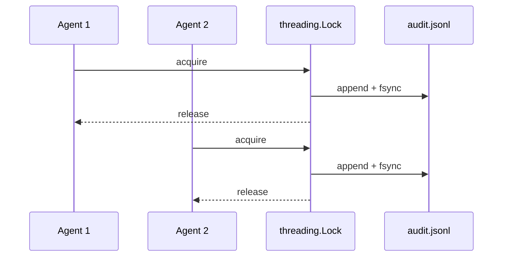

Every tool call can be recorded to an append-only JSONL audit log — thread-safe for concurrent multi-agent writes.



## Quick Start

<Steps>
<Step title="Enable audit logging">

```python
from praisonaiagents import Agent
from praisonai.security import enable_audit_log

enable_audit_log()  # default: ~/.praisonai/audit.jsonl

agent = Agent(
    name="AuditedAgent",
    instructions="Every tool call is logged.",
)
agent.start("Summarise today's PRs")
```

</Step>
<Step title="Close on shutdown">

```python
from praisonai.security import get_audit_log

get_audit_log().close()  # flush and release handle
```

</Step>
</Steps>

---

## What's Logged

Each JSONL line records:

- `timestamp`, `session_id`, `agent_name`
- `tool_name`, `tool_input`, `execution_time_ms`
- Optional `tool_output` (when `include_output=True`)

The hook registers on `after_tool` automatically when you call `enable_audit_log()`.

---

## Configuration

| Option | Type | Default | Description |
|--------|------|---------|-------------|
| `log_path` | `str` | `~/.praisonai/audit.jsonl` | Append-only JSONL path |
| `include_output` | `bool` | `False` | Include truncated tool output |
| `max_output_chars` | `int` | `500` | Max output chars when `include_output=True` |

```python
enable_audit_log(
    log_path="./my-audit.jsonl",
    include_output=True,
    max_output_chars=1000,
)
```

---

## Thread Safety (PR #2062)

- Uses `threading.Lock` for concurrent multi-agent writes
- Keeps a long-lived file handle (reopened lazily if rotated)
- Each write calls `fsync` for crash durability
- Call `get_audit_log().close()` on shutdown to flush and release the handle

---

## Best Practices

<AccordionGroup>
  <Accordion title="Enable early in production">
    Call `enable_audit_log()` before creating agents so every tool invocation is captured from the first turn — retrofitting mid-session misses earlier calls.
  </Accordion>
  <Accordion title="Close on shutdown">
    Call `get_audit_log().close()` in your shutdown handler to flush the file handle. Long-running daemons that skip this may lose the last buffered line on crash.
  </Accordion>
  <Accordion title="Keep output logging selective">
    Leave `include_output=False` unless you need forensic replay. When enabled, tune `max_output_chars` to avoid bloating the JSONL with large tool payloads.
  </Accordion>
  <Accordion title="Rotate and protect log files">
    Store logs outside web-served directories. The audit path is protected by default — do not disable [Protected Paths](/docs/features/protected-paths) on production hosts.
  </Accordion>
</AccordionGroup>

---

## Related

<CardGroup cols={2}>
  <Card title="Security Overview" icon="shield" href="/docs/security">
    Enable audit log with other security features
  </Card>
  <Card title="Protected Paths" icon="lock" href="/docs/features/protected-paths">
    Audit log file is itself protected
  </Card>
</CardGroup>
