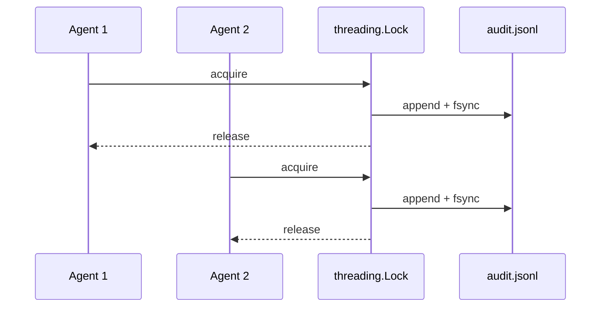

Every tool call can be recorded to an append-only JSONL audit log — thread-safe for concurrent multi-agent writes.



## Quick Start

<Steps>
<Step title="Enable audit logging">

```python
from praisonaiagents import Agent
from praisonai.security import enable_audit_log

enable_audit_log()  # default: ~/.praisonai/audit.jsonl

agent = Agent(
    name="AuditedAgent",
    instructions="Every tool call is logged.",
)
agent.start("Summarise today's PRs")
```

</Step>
<Step title="Close on shutdown">

```python
from praisonai.security import get_audit_log

get_audit_log().close()  # flush and release handle
```

</Step>
</Steps>

---

## What's Logged

Each JSONL line records:

- `timestamp`, `session_id`, `agent_name`
- `tool_name`, `tool_input`, `execution_time_ms`
- Optional `tool_output` (when `include_output=True`)

The hook registers on `after_tool` automatically when you call `enable_audit_log()`.

---

## Configuration

| Option | Type | Default | Description |
|--------|------|---------|-------------|
| `log_path` | `str` | `~/.praisonai/audit.jsonl` | Append-only JSONL path |
| `include_output` | `bool` | `False` | Include truncated tool output |
| `max_output_chars` | `int` | `500` | Max output chars when `include_output=True` |

```python
enable_audit_log(
    log_path="./my-audit.jsonl",
    include_output=True,
    max_output_chars=1000,
)
```

---

## Thread Safety (PR #2062)

- Uses `threading.Lock` for concurrent multi-agent writes
- Keeps a long-lived file handle (reopened lazily if rotated)
- Each write calls `fsync` for crash durability
- Call `get_audit_log().close()` on shutdown to flush and release the handle

---

## Best Practices

<AccordionGroup>
  <Accordion title="Rotate Logs Regularly">
    Set up log rotation for the JSONL file. The logger reopens the handle lazily after rotation, so standard tools like `logrotate` work without restarting the agent.
  </Accordion>
  <Accordion title="Exclude Sensitive Output">
    Keep `include_output=False` (the default) unless debugging. Tool outputs can contain secrets or PII; logging them increases your attack surface.
  </Accordion>
  <Accordion title="Always Call close() on Shutdown">
    Register `get_audit_log().close()` with `atexit` or a signal handler to flush the in-memory buffer and release the file handle cleanly.
  </Accordion>
</AccordionGroup>

---

## Related

<CardGroup cols={2}>
  <Card title="Security Overview" icon="shield" href="/docs/security">
    Enable audit log with other security features
  </Card>
  <Card title="Protected Paths" icon="lock" href="/docs/features/protected-paths">
    Audit log file is itself protected
  </Card>
</CardGroup>
