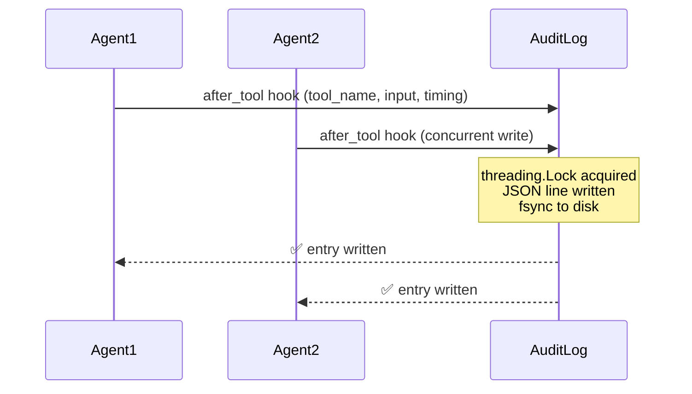
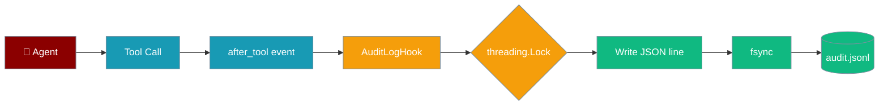

Every tool call your agents make is recorded to an append-only JSONL file — one line, one call, one timestamp.



## Quick Start

<Steps>
<Step title="Enable audit logging">
```python
from praisonai.security import enable_audit_log
from praisonaiagents import Agent

enable_audit_log()

agent = Agent(
    name="AuditedAgent",
    instructions="Research AI news and summarize findings.",
)
agent.start("Summarize today's top AI papers")
```

Logs are written to `~/.praisonai/audit.jsonl` by default.
</Step>

<Step title="Read the log">
```python
import json

with open("/root/.praisonai/audit.jsonl") as f:
    for line in f:
        entry = json.loads(line)
        print(entry["agent_name"], entry["tool_name"], entry["execution_time_ms"], "ms")
```

Each line is a JSON object — easy to stream, parse, or ship to a log aggregator.
</Step>

<Step title="Enable with output capture">
```python
from praisonai.security import enable_audit_log

enable_audit_log(
    log_path="./my-audit.jsonl",
    include_output=True,
)
```
</Step>
</Steps>

---

## Log Entry Format

Each line in the JSONL file contains:

| Field | Type | Description |
|-------|------|-------------|
| `timestamp` | `str` | ISO 8601 UTC timestamp |
| `session_id` | `str` | Agent session identifier |
| `agent_name` | `str` | Name of the agent that called the tool |
| `tool_name` | `str` | Name of the tool called |
| `tool_input` | `dict` | Arguments passed to the tool |
| `execution_time_ms` | `float` | How long the tool took (milliseconds) |
| `error` | `str\|null` | Error string if the tool raised an exception |
| `tool_output` | `str` | Tool output, truncated (only when `include_output=True`) |

**Example entry:**
```json
{
  "timestamp": "2026-06-22T10:15:30.123456+00:00",
  "session_id": "sess_abc123",
  "agent_name": "ResearchAgent",
  "tool_name": "web_search",
  "tool_input": {"query": "latest AI papers June 2026"},
  "execution_time_ms": 342.7,
  "error": null
}
```

---

## Configuration Options

```python
from praisonai.security import enable_audit_log

enable_audit_log(
    log_path="./audit.jsonl",   # Default: ~/.praisonai/audit.jsonl
    include_output=True,         # Default: False — keeps log compact
)
```

| Option | Type | Default | Description |
|--------|------|---------|-------------|
| `log_path` | `str` | `~/.praisonai/audit.jsonl` | Path to the JSONL log file |
| `include_output` | `bool` | `False` | Whether to include tool output in entries |

When `include_output=True`, output is truncated at `max_output_chars` (default 500 characters) to keep log size manageable.

---

## Thread Safety

The audit log is safe to use with concurrent multi-agent setups.

<Note>
The `AuditLogHook` uses a `threading.Lock` so concurrent writes from multiple agents never interleave or corrupt a log line. Each write also calls `fsync` so entries survive a process crash.
</Note>

```python
from praisonaiagents import Agent, PraisonAIAgents
from praisonai.security import enable_audit_log

enable_audit_log()

agent1 = Agent(name="Researcher", instructions="Search for papers.")
agent2 = Agent(name="Summarizer", instructions="Summarize content.")

# Both agents write to the same audit log safely
team = PraisonAIAgents(agents=[agent1, agent2], process="parallel")
team.start()
```

---

## Lifecycle: Closing the Log

<Warning>
In long-running processes (FastAPI apps, test suites), call `get_audit_log().close()` on shutdown to flush and release the file handle. Without this, the final write may not reach disk on some operating systems.
</Warning>

```python
from praisonai.security import enable_audit_log
from praisonai.security.audit import AuditLogHook

enable_audit_log()

# ... run your agents ...

# On shutdown (e.g., FastAPI lifespan, atexit handler)
AuditLogHook.close()
```

**FastAPI lifespan example:**
```python
from contextlib import asynccontextmanager
from fastapi import FastAPI
from praisonai.security import enable_audit_log
from praisonai.security.audit import AuditLogHook

@asynccontextmanager
async def lifespan(app: FastAPI):
    enable_audit_log()
    yield
    AuditLogHook.close()

app = FastAPI(lifespan=lifespan)
```

---

## How It Works

The audit hook registers on the `after_tool` event. Every time an agent finishes calling a tool, the hook fires:



<Note>
The audit log file itself (`audit.jsonl`) is in the [Protected Paths](/features/protected-paths) list — agents cannot modify or delete their own audit trail.
</Note>

---

## Best Practices

<AccordionGroup>
  <Accordion title="Enable audit logging before creating agents" icon="play">
    Call `enable_audit_log()` before instantiating any agents so the hook is registered for all tool calls from the start.

    ```python
    from praisonai.security import enable_audit_log
    enable_audit_log()

    from praisonaiagents import Agent
    agent = Agent(...)
    ```
  </Accordion>

  <Accordion title="Use include_output=False in production (default)" icon="eye-slash">
    Tool outputs can be large and may contain sensitive data. Keep `include_output=False` (the default) unless you specifically need output forensics.
  </Accordion>

  <Accordion title="Rotate logs for long-running services" icon="rotate">
    The audit log appends indefinitely. For production services, set up log rotation (e.g., `logrotate` on Linux) or write to a date-stamped path:
    ```python
    from datetime import date
    enable_audit_log(log_path=f"./audit-{date.today()}.jsonl")
    ```
  </Accordion>

  <Accordion title="Ship to a SIEM or log aggregator" icon="server">
    Because each line is valid JSON, you can tail and ship the file with any log shipper (Filebeat, Fluentd, Vector) to your SIEM or observability platform.
  </Accordion>
</AccordionGroup>

---

## Related

<CardGroup cols={2}>
  <Card title="Security Best Practices" icon="shield" href="/best-practices/security">
    Enable audit logging and injection defense in one call
  </Card>
  <Card title="Protected Paths" icon="lock" href="/features/protected-paths">
    Prevent agents from modifying sensitive files
  </Card>
  <Card title="Prompt Injection Protection" icon="ban" href="/features/prompt-injection-protection">
    Block injection attacks before they reach tools
  </Card>
  <Card title="Hooks" icon="webhook" href="/features/hooks">
    Build custom before/after-tool event handlers
  </Card>
</CardGroup>
