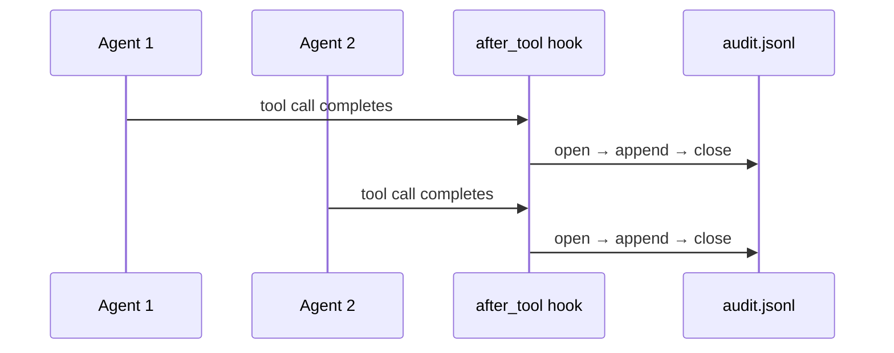

Every tool call can be recorded to an append-only JSONL audit log — thread-safe for concurrent multi-agent writes.



## Quick Start

```python
from praisonaiagents import Agent
from praisonai.security import enable_audit_log

enable_audit_log()  # default: ~/.praisonai/audit.jsonl

agent = Agent(
    name="AuditedAgent",
    instructions="Every tool call is logged.",
)
agent.start("Summarise today's PRs")
```

---

## What's Logged

Each JSONL line records:

- `timestamp`, `session_id`, `agent_name`
- `tool_name`, `tool_input`, `execution_time_ms`
- Optional `tool_output` (when `include_output=True`)

The hook registers on `after_tool` automatically when you call `enable_audit_log()`.

---

## Configuration

`enable_audit_log()` accepts:

| Option | Type | Default | Description |
|--------|------|---------|-------------|
| `log_path` | `str` | `~/.praisonai/audit.jsonl` | Append-only JSONL path |
| `include_output` | `bool` | `False` | Include truncated tool output |

```python
enable_audit_log(
    log_path="./my-audit.jsonl",
    include_output=True,
)
```

For `max_output_chars` control, use `AuditLogHook` directly:

```python
from praisonai.security import AuditLogHook
from praisonaiagents.hooks import add_hook

audit = AuditLogHook(
    log_path="./my-audit.jsonl",
    include_output=True,
    max_output_chars=1000,
)
add_hook("after_tool", audit.create_after_tool_hook())
```

---

## Thread Safety

- Each write opens, appends, and closes the log file atomically
- Safe for concurrent multi-agent use — no shared file handle to corrupt

---

## Related

<CardGroup cols={2}>
  <Card title="Security Overview" icon="shield" href="/docs/security">
    Enable audit log with other security features
  </Card>
  <Card title="Protected Paths" icon="lock" href="/docs/features/protected-paths">
    Audit log file is itself protected
  </Card>
</CardGroup>
