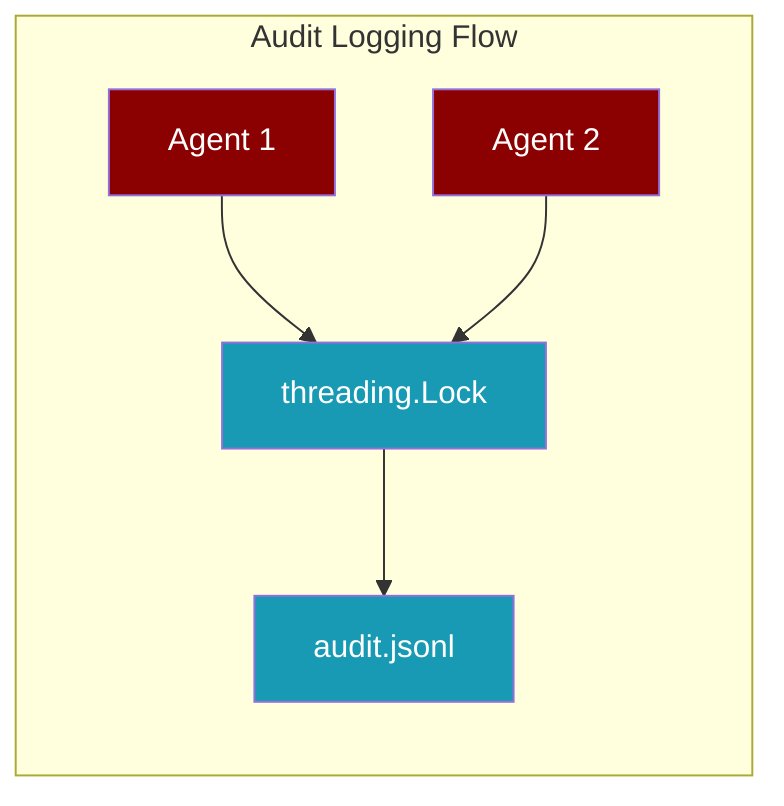
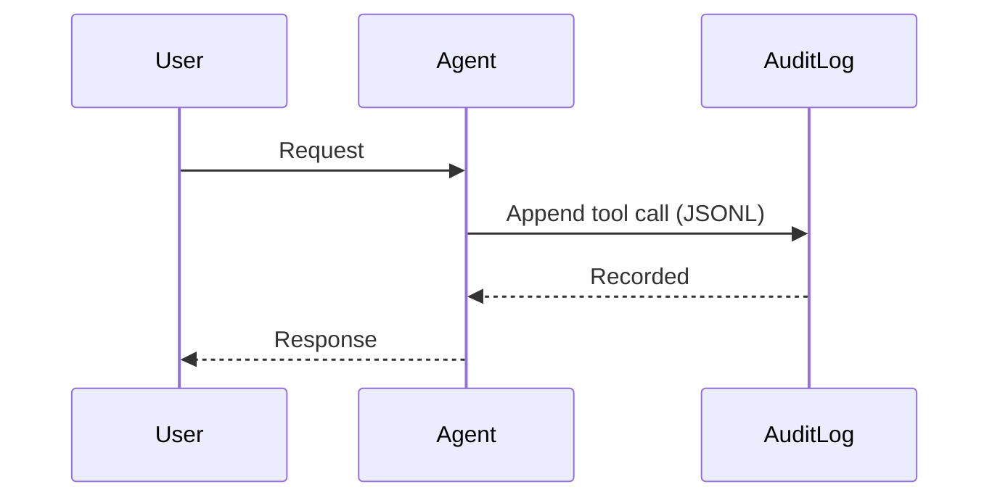
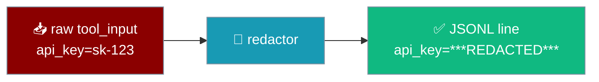

Every tool call can be recorded to an append-only JSONL audit log — thread-safe for concurrent multi-agent writes.

```python
from praisonaiagents import Agent

agent = Agent(name="audited", instructions="Log every tool call for compliance.")
agent.start("List recent deployments.")
```

The user enables audit logging; each tool invocation is appended to JSONL safely even when many agents run in parallel.


```mermaid
graph LR
    subgraph "Audit Logging Flow"
        A1[Agent 1] --> Lock[threading.Lock]
        A2[Agent 2] --> Lock
        Lock --> Log[audit.jsonl]
    end
    
    classDef agent fill:#8B0000,color:#fff
    classDef tool fill:#189AB4,color:#fff
    
    class A1,A2 agent
    class Lock,Log tool
```

## How It Works

Each tool call the agent makes is appended to the audit log before the result returns to the user.


```mermaid
sequenceDiagram
    participant User
    participant Agent
    participant AuditLog

    User->>Agent: Request
    Agent->>AuditLog: Append tool call (JSONL)
    AuditLog-->>Agent: Recorded
    Agent-->>User: Response
```

## Quick Start

<Steps>
<Step title="Enable audit logging">

```python
from praisonaiagents import Agent
from praisonai.security import enable_audit_log

enable_audit_log()  # default: ~/.praisonai/audit.jsonl

agent = Agent(
    name="AuditedAgent",
    instructions="Every tool call is logged.",
)
agent.start("Summarise today's PRs")
```

</Step>
<Step title="Close on shutdown">

```python
from praisonai.security import get_audit_log

get_audit_log().close()  # flush and release handle
```

</Step>
</Steps>

---

## What's Logged

Each JSONL line records:

- `timestamp`, `session_id`, `agent_name`
- `tool_name`, `tool_input`, `execution_time_ms`
- Optional `tool_output` (when `include_output=True`)

The hook registers on `after_tool` automatically when you call `enable_audit_log()`.

---

## Secret Redaction

Sensitive values in `tool_input` are replaced with `***REDACTED***` before the JSONL line is written — on by default, no configuration needed.


```mermaid
graph LR
    Raw[📥 raw tool_input<br/>api_key=sk-123] --> Redact[🧼 redactor]
    Redact --> Line[✅ JSONL line<br/>api_key=***REDACTED***]

    classDef input fill:#8B0000,stroke:#7C90A0,color:#fff
    classDef process fill:#189AB4,stroke:#7C90A0,color:#fff
    classDef output fill:#10B981,stroke:#7C90A0,color:#fff

    class Raw input
    class Redact process
    class Line output
```

Key matching is case-insensitive and recurses through nested dicts, lists, and tuples. The built-in denylist (`_DEFAULT_SENSITIVE_KEYS` in `praisonai/security/audit.py`):

```
api_key, apikey, authorization, auth, password, passwd,
secret, token, access_token, refresh_token, bearer,
x-api-key, openai_api_key, anthropic_api_key, cookie
```

Before / after on disk:

<CodeGroup>
```json Before redaction
{"tool_name": "call_api", "tool_input": {"url": "https://api.example.com", "api_key": "sk-live-abc123", "password": "hunter2"}}
```

```json After redaction (what is written)
{"tool_name": "call_api", "tool_input": {"url": "https://api.example.com", "api_key": "***REDACTED***", "password": "***REDACTED***"}}
```
</CodeGroup>

<Warning>
Redaction runs on `tool_input` only. When `include_output=True`, tool outputs are written verbatim (truncated at `max_output_chars`) with **no** redaction — keep secrets out of tool return values.
</Warning>

<Note>
**File permissions.** The audit file is created with mode `0o600` (owner read/write only) regardless of umask. This is enforced on the first append even if the file already exists.
</Note>

---

## Configuration

| Option | Type | Default | Description |
|--------|------|---------|-------------|
| `log_path` | `str` | `~/.praisonai/audit.jsonl` | Append-only JSONL path |
| `include_output` | `bool` | `False` | Include truncated tool output |
| `max_output_chars` | `int` | `500` | Max output chars when `include_output=True` |
| `redactor` | `Callable[[Any], Any] \| None` | built-in denylist redactor | Applied to `tool_input` before writing. Pass `None` to disable redaction entirely. |
| `sensitive_keys` | `frozenset[str] \| None` | `_DEFAULT_SENSITIVE_KEYS` | Override the denylist. Only takes effect with the default redactor; a custom `redactor` is used exactly as supplied. |

```python
enable_audit_log(
    log_path="./my-audit.jsonl",
    include_output=True,
    max_output_chars=1000,
)
```

<Note>
`enable_audit_log()` and `enable_security()` accept only `log_path` and `include_output` — they do **not** yet forward `redactor` or `sensitive_keys`. To customise redaction, instantiate `AuditLogHook` directly and register it with `add_hook("after_tool", ...)` (see below).
</Note>

---

## Customising Redaction

Instantiate `AuditLogHook` directly for full control over redaction.

Pick the option that fits your situation:


```mermaid
graph TB
    Start{Redaction need?} -->|Defaults are enough| Default[Do nothing<br/>built-in denylist]
    Start -->|Extra key names| Keys[sensitive_keys=frozenset&#40;...&#41;]
    Start -->|Different transform| Custom[redactor=my_fn]
    Start -->|Turn it off| Off[redactor=None]

    classDef q fill:#F59E0B,stroke:#7C90A0,color:#fff
    classDef opt fill:#6366F1,stroke:#7C90A0,color:#fff
    classDef danger fill:#8B0000,stroke:#7C90A0,color:#fff

    class Start q
    class Default,Keys,Custom opt
    class Off danger
```

<CodeGroup>
```python Extend the denylist
from praisonai.security import AuditLogHook
from praisonaiagents.hooks import add_hook

audit = AuditLogHook(
    sensitive_keys=frozenset({
        "api_key", "token", "password",   # keep the important defaults
        "customer_ssn", "internal_secret",  # add your own
    })
)
add_hook("after_tool", audit.create_after_tool_hook())
```

```python Custom redactor
import hashlib
from praisonai.security import AuditLogHook
from praisonaiagents.hooks import add_hook

def hash_redactor(obj):
    # A custom redactor replaces the default entirely — recurse yourself.
    if isinstance(obj, dict):
        return {k: (f"sha256:{hashlib.sha256(str(v).encode()).hexdigest()[:12]}"
                    if k.lower() in {"api_key", "token"} else hash_redactor(v))
                for k, v in obj.items()}
    if isinstance(obj, (list, tuple)):
        return type(obj)(hash_redactor(v) for v in obj)
    return obj

add_hook("after_tool",
         AuditLogHook(redactor=hash_redactor).create_after_tool_hook())
```

```python Disable redaction
from praisonai.security import AuditLogHook
from praisonaiagents.hooks import add_hook

# NOT recommended in production — secrets are written verbatim.
add_hook("after_tool",
         AuditLogHook(redactor=None).create_after_tool_hook())
```
</CodeGroup>

`sensitive_keys` only affects the built-in redactor. A `redactor=` callable you supply is used exactly as given — the class does not merge it with the default.

---

## Thread Safety (PR #2062)

- Uses `threading.Lock` for concurrent multi-agent writes
- Keeps a long-lived file handle (reopened lazily if rotated)
- Each write calls `fsync` for crash durability
- Call `get_audit_log().close()` on shutdown to flush and release the handle

---

## Best Practices

<AccordionGroup>
  <Accordion title="Enable early in production">
    Call `enable_audit_log()` before creating agents so every tool invocation is captured from the first turn — retrofitting mid-session misses earlier calls.
  </Accordion>
  <Accordion title="Close on shutdown">
    Call `get_audit_log().close()` in your shutdown handler to flush the file handle. Long-running daemons that skip this may lose the last buffered line on crash.
  </Accordion>
  <Accordion title="Keep output logging selective">
    Leave `include_output=False` unless you need forensic replay. When enabled, tune `max_output_chars` to avoid bloating the JSONL with large tool payloads. Redaction covers `tool_input` only — outputs are written verbatim.
  </Accordion>
  <Accordion title="Verify redaction after enabling">
    Grep your audit file for known-sensitive strings once, especially if your tools use exotic key names not in the default denylist. If you see leaks, extend `sensitive_keys` or supply a custom `redactor` on a directly-instantiated `AuditLogHook`.
  </Accordion>
  <Accordion title="Rotate and protect log files">
    Store logs outside web-served directories. The file is created `0o600` (owner-only) by default, and the audit path is protected — do not disable [Protected Paths](/features/protected-paths) on production hosts.
  </Accordion>
</AccordionGroup>

---

## Related

<CardGroup cols={2}>
  <Card title="Security Overview" icon="shield" href="/security">
    Enable audit log with other security features
  </Card>
  <Card title="Protected Paths" icon="lock" href="/features/protected-paths">
    Audit log file is itself protected
  </Card>
</CardGroup>
