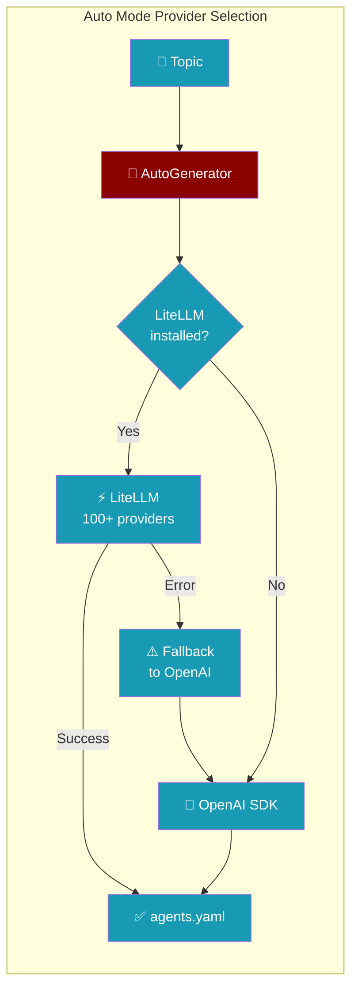
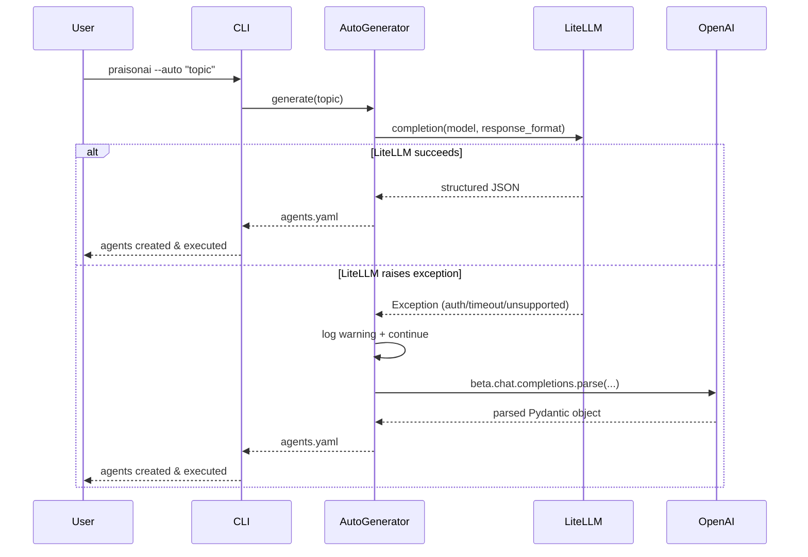
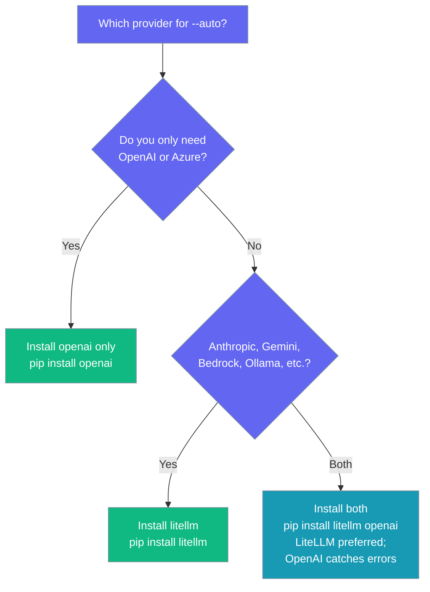

```python
from praisonaiagents import Agent

agent = Agent(name="generator", instructions="Auto-generate content using configured providers.")
agent.start("Generate a product description for a smart speaker.")
```


Auto mode picks a provider for you: LiteLLM first (100+ providers), OpenAI as a safety net.



## Quick Start

<Steps>
<Step title="Default (OpenAI only)">

Install PraisonAI and set your OpenAI key:

```bash
pip install "praisonai-frameworks[crewai]"
```

```bash
export OPENAI_API_KEY=sk-...
```

Run auto mode:

```bash
praisonai --auto "research AI trends"
```

Or programmatically:

```python
from praisonai import AutoGenerator

generator = AutoGenerator(topic="research AI trends")
result = generator.generate()
print(result)
```

</Step>

<Step title="Unlock 100+ Providers with LiteLLM">

Install LiteLLM to use Anthropic, Google, Azure, Bedrock, Ollama, and more:

```bash
pip install litellm
```

Switch to Anthropic Claude:

```bash
export ANTHROPIC_API_KEY=sk-ant-...
export OPENAI_MODEL_NAME=anthropic/claude-sonnet-4
praisonai --auto "research AI trends"
```

Switch to Google Gemini:

```bash
export GEMINI_API_KEY=...
export OPENAI_MODEL_NAME=gemini/gemini-2.0-flash
praisonai --auto "research AI trends"
```

Switch to a local Ollama model:

```bash
export OPENAI_MODEL_NAME=ollama/llama3
praisonai --auto "research AI trends"
```

</Step>

<Step title="Programmatic Use (Sync & Async)">

Both sync and async paths honour the LiteLLM → OpenAI fallback:

```python
from praisonai import AutoGenerator

generator = AutoGenerator(topic="summarise recent AI papers")
agents_yaml = generator.generate()
print(agents_yaml)
```

Async version:

```python
import asyncio
from praisonai import AutoGenerator

async def main():
    generator = AutoGenerator(topic="summarise recent AI papers")
    agents_yaml = await generator.agenerate()
    print(agents_yaml)

asyncio.run(main())
```

</Step>

<Step title="Calling from an existing event loop (FastAPI, Jupyter)">

`AutoGenerator.generate()` can now be called from inside a running event loop — it offloads to a worker thread automatically instead of raising `RuntimeError: This event loop is already running`.

```python
from fastapi import FastAPI
from praisonai import AutoGenerator

app = FastAPI()

@app.get("/generate")
async def generate(topic: str):
    generator = AutoGenerator(topic=topic)
    # Safe to call .generate() here — no RuntimeError
    agents_yaml = generator.generate()
    return {"yaml": agents_yaml}
```

Prefer `await generator.agenerate()` when you are already in an async context — it avoids the thread-offload overhead. The sync `.generate()` form is provided as a safe fallback.

</Step>
</Steps>

---

## How It Works



| Step | What happens |
|------|-------------|
| **1. LiteLLM attempt** | Calls `litellm.completion(model=..., response_format=PydanticModel)` |
| **2. Runtime fallback** | If LiteLLM raises (auth error, timeout, unsupported model), logs a warning and continues |
| **3. OpenAI fallback** | Calls `client.beta.chat.completions.parse(...)` using the OpenAI SDK |
| **4. No providers** | Raises `ImportError` with install instructions |

<Note>
The fallback warning message is: `LiteLLM structured completion failed (...); falling back to OpenAI SDK.`
Watch your logs for this — it means LiteLLM is degrading silently.
</Note>

---

## Which Provider Should I Use?



---

## Install Matrix

| Installed | Auto mode behaviour |
|-----------|---------------------|
| `openai` only | OpenAI SDK used directly via `beta.chat.completions.parse` |
| `litellm` only | LiteLLM used; if it raises, the call fails (no fallback) |
| both | LiteLLM first; on runtime error, falls back to OpenAI with a warning |
| neither | `ImportError: Structured output requires either litellm or openai...` |

---

## Configuration

| Environment variable | What it does |
|---------------------|-------------|
| `OPENAI_API_KEY` | API key used by both LiteLLM and OpenAI paths |
| `OPENAI_MODEL_NAME` | Model passed to whichever provider runs. For LiteLLM use prefixed names: `anthropic/claude-sonnet-4`, `gemini/gemini-2.0-flash`, `ollama/llama3` |
| `OPENAI_API_BASE` | Forwarded as `base_url` to the OpenAI client (overrides default endpoint) |
| `ANTHROPIC_API_KEY` | Required when `OPENAI_MODEL_NAME=anthropic/...` |
| `GEMINI_API_KEY` | Required when `OPENAI_MODEL_NAME=gemini/...` |

<Card title="Auto Module SDK Reference" icon="code" href="/docs/sdk/reference/praisonai/modules/auto">
  Full API reference for AutoGenerator, WorkflowAutoGenerator, and BaseAutoGenerator
</Card>

---

## Common Patterns

**Switch from OpenAI to Anthropic:**

```bash
pip install litellm
export ANTHROPIC_API_KEY=sk-ant-...
export OPENAI_MODEL_NAME=anthropic/claude-sonnet-4
praisonai --auto "write a market analysis report"
```

**Run against a local Ollama model (no cloud keys needed):**

```bash
pip install litellm
# Ollama must be running locally on port 11434
export OPENAI_MODEL_NAME=ollama/llama3
praisonai --auto "summarise today's news"
```

**Belt-and-braces production setup (LiteLLM + OpenAI fallback):**

```bash
pip install litellm openai
export ANTHROPIC_API_KEY=sk-ant-...
export OPENAI_API_KEY=sk-...
export OPENAI_MODEL_NAME=anthropic/claude-sonnet-4
# LiteLLM runs first; transient errors fall back to OpenAI automatically
praisonai --auto "generate a weekly status report"
```

**Async programmatic use:**

```python
import asyncio
from praisonai import AutoGenerator

async def run():
    async with AutoGenerator(topic="competitor analysis") as gen:
        yaml_config = await gen.agenerate()
        print(yaml_config)

asyncio.run(run())
```

---

## Best Practices

<AccordionGroup>
  <Accordion title="Install both litellm and openai in production">
    Install both packages so transient LiteLLM failures (rate limits, network blips, provider outages) don't break agent generation:

    ```bash
    pip install litellm openai
    ```

    LiteLLM runs first; OpenAI silently catches any runtime errors.
  </Accordion>

  <Accordion title="Watch logs for the fallback warning">
    The warning `LiteLLM structured completion failed (...); falling back to OpenAI SDK.` means LiteLLM silently degraded. Check:
    - Is your provider API key set correctly?
    - Does the model support `response_format` (structured output)?
    - Is the provider having an outage?

    Investigate before relying on the fallback long-term.
  </Accordion>

  <Accordion title="Pin model names in config_list for concurrent generators">
    If your code runs multiple `AutoGenerator` instances in parallel, set model names in `config_list` rather than `OPENAI_MODEL_NAME` to avoid environment variable races:

    ```python
    from praisonai import AutoGenerator

    gen = AutoGenerator(
        topic="topic",
        config_list=[{
            "model": "anthropic/claude-sonnet-4",
            "api_key": "sk-ant-...",
        }]
    )
    ```
  </Accordion>

  <Accordion title="Do not import litellm at module scope">
    Lazy loading is on by default — `litellm` is never imported at module load time. Do not add `import litellm` at the top of your files. Let `AutoGenerator` pull it in on demand. This keeps startup fast and avoids import-time side effects.
  </Accordion>
</AccordionGroup>

---

## Related

<CardGroup cols={2}>
  <Card title="Auto Mode CLI" icon="terminal" href="/docs/cli/auto">
    Command-line reference for `praisonai --auto`
  </Card>
  <Card title="AutoAgents" icon="robot" href="/docs/features/autoagents">
    Automatically create and run agents from a prompt
  </Card>
  <Card title="Structured Output" icon="brackets-curly" href="/docs/features/structured">
    Control agent output format with Pydantic models
  </Card>
  <Card title="YAML Workflows" icon="file-code" href="/docs/features/yaml-workflows">
    The agents.yaml format generated by auto mode
  </Card>
</CardGroup>
