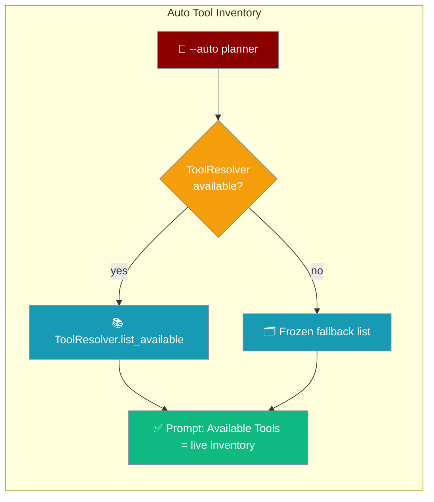
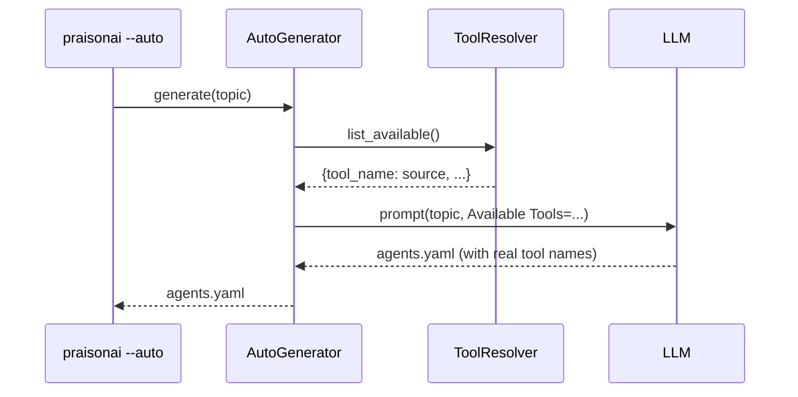

The `--auto` planner sees whatever the [`ToolResolver`](/docs/features/tool-resolver) sees — install more tools and they show up automatically.

```python
from praisonaiagents import Agent

# The --auto planner sees whatever the ToolResolver sees. Install more
# tools and they show up automatically — no config change.
agent = Agent(name="planner", instructions="Plan an --auto run.")
agent.start("Research current AI trends and write a summary.")
```



## Quick Start

<Steps>
<Step title="Run auto mode">
Run `--auto` with your OpenAI key set:

```bash
export OPENAI_API_KEY=sk-...
praisonai --auto "research AI trends and write a summary"
```

The planner's `Available Tools:` list reflects whatever is installed right now.
</Step>

<Step title="Install a tools package">
Add more tools and the planner sees them next run — no config change:

```bash
pip install "praisonai-tools"
```
</Step>

<Step title="Rerun and watch the list grow">
Run the same command again — the planner now advertises the newly installed tools:

```bash
praisonai --auto "research AI trends and write a summary"
```

Confirm what the resolver can see with:

```bash
praisonai tools list
```
</Step>
</Steps>

---

## How It Works

The planner prompt's `Available Tools:` line is filled from the canonical [`ToolResolver`](/docs/features/tool-resolver), so it always matches what your agents can call at run time.



If the resolver is unavailable (import failure or air-gapped environment), the planner falls back to a frozen list so `--auto` still produces a working plan.

| Step | What happens |
|------|-------------|
| **1. Ask the resolver** | `get_available_tools()` calls `ToolResolver.list_available()` |
| **2. Build the prompt** | The real installed tools fill the `Available Tools:` line |
| **3. Plan** | The LLM plans agents that reference tools that actually exist |
| **4. Fallback** | If the resolver can't load, a frozen list keeps `--auto` working |

---

## Configuration Options

The inventory is driven by the resolver — configure it through the `ToolResolver` API rather than a separate setting.

<Card title="Tool Resolver" icon="wrench" href="/docs/features/tool-resolver">
  How PraisonAI discovers and resolves every tool source
</Card>

<Card title="Auto Module SDK Reference" icon="code" href="/docs/sdk/reference/praisonai/modules/auto">
  Full API reference for AutoGenerator and BaseAutoGenerator
</Card>

---

## Common Patterns

**Local `tools.py` picked up by the planner:**

```bash
export PRAISONAI_ALLOW_LOCAL_TOOLS=true
# Drop a tools.py in your working directory, then:
praisonai --auto "summarise today's news"
```

**Register a wrapper `ToolRegistry` function so the planner sees it:**

```python
from praisonai import PraisonAI

def my_search(query: str) -> str:
    """Custom search function."""
    return f"results for {query}"

praison = PraisonAI(agent_file="agents.yaml")
praison.agents_generator.tool_registry.register_function("my_search", my_search)
praison.run()
```

**Inject an explicit resolver for tests or multi-tenant runtimes:**

```python
from praisonai.agents_generator import AgentsGenerator
from praisonai.tool_resolver import ToolResolver

my_resolver = ToolResolver(tools_py_path="tools.py")

gen = AgentsGenerator(
    agent_file="agents.yaml",
    framework="praisonai",
    config_list=[{"model": "gpt-4o", "api_key": "sk-..."}],
    tool_resolver=my_resolver,
)
```

---

## Best Practices

<AccordionGroup>
<Accordion title="Prefer the resolver over the frozen fallback">
The frozen list exists only for offline / broken-import scenarios. In a normal install, let the resolver drive the inventory so the planner and your agents never drift apart.
</Accordion>

<Accordion title="Install praisonai-tools for CrewAI-style tools by name">
When you want CrewAI-style tools referenced by name in `--auto` plans, install the package:

```bash
pip install "praisonai-tools"
```
</Accordion>

<Accordion title="Pass tool_resolver= in tests to isolate">
Inject your own resolver into `AgentsGenerator(tool_resolver=...)` so tests don't share the process-wide default.

```python
from praisonai.tool_resolver import ToolResolver

resolver = ToolResolver(tools_py_path="tools.py")
```
</Accordion>

<Accordion title="Call reset_default_resolver() between tenants">
In multi-tenant runtimes switching working directories, reset the context-local default before each tenant:

```python
from praisonai.tool_resolver import reset_default_resolver

reset_default_resolver()
```
</Accordion>
</AccordionGroup>

---

## Related

<CardGroup cols={2}>
  <Card title="Tool Resolver" icon="wrench" href="/docs/features/tool-resolver">
    Single source of truth for every tool the planner can see
  </Card>
  <Card title="AutoAgents" icon="robot" href="/docs/features/autoagents">
    Automatically create and run agents from a prompt
  </Card>
</CardGroup>
