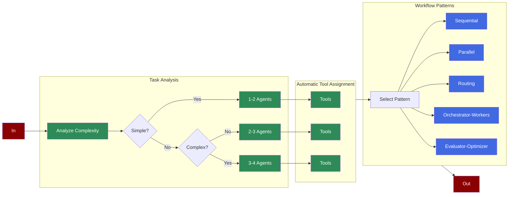

AutoAgents automatically creates and manages AI agents and tasks based on high-level instructions. It now features **dynamic agent count** based on task complexity and supports **multiple workflow patterns** including orchestrator-workers and evaluator-optimizer.

## Quick Start

<Tabs>
  <Tab title="Code">
    <Steps>
        <Step title="Install Package">
            First, install the PraisonAI Agents package:
            ```bash
            pip install praisonaiagents duckduckgo_search
            ```
        </Step>

        <Step title="Set API Key">
            Set your OpenAI API key as an environment variable in your terminal:
            ```bash
            export OPENAI_API_KEY=your_api_key_here
            ```
        </Step>

        <Step title="Create a file">
            Create a new file `app.py` with the basic setup:
            ```python
            from praisonaiagents import AutoAgents
            from praisonaiagents import duckduckgo

            # Create AutoAgents instance
            agents = AutoAgentTeam(
                instructions="Search for information about AI Agents",
                tools=[duckduckgo],
                process="sequential",
                
                max_agents=3  # Maximum number of agents to create
            )

            # Start the agents
            result = agents.start()
            print(result)
            ```
        </Step>

        <Step title="Start AutoAgents">
            Run your AutoAgents:
            ```bash
            python app.py
            ```
        </Step>
    </Steps>

    <Note>
    **Requirements**
    
    - Python 3.10 or higher
    - OpenAI API key. Generate OpenAI API key [here](https://platform.openai.com/api-keys). Use Other models using [this guide](/models).   
    </Note>
    
  </Tab>
  <Tab title="No Code">
    <Steps>
        <Step title="Install Package">
            Install the PraisonAI package:
            ```bash
            pip install praisonai
            ```
        </Step>
        <Step title="Set API Key">
            Set your OpenAI API key as an environment variable in your terminal:
            ```bash
            export OPENAI_API_KEY=your_api_key_here
            ```
        </Step>
        <Step title="Start AutoAgents">
            Run your AutoAgents:
            ```bash
            praisonai --auto "Create a movie script about a robot in Mars"
            ```
        </Step>
    </Steps>
  </Tab>
</Tabs>

## Understanding AutoAgents

<Card title="What are AutoAgents?" icon="question">
  AutoAgents automatically:
  - **Analyzes task complexity** to determine optimal agent count (1-4 agents)
  - Creates appropriate AI agents based on your instructions
  - Assigns relevant tools to each agent
  - **Recommends workflow patterns** (sequential, parallel, routing, orchestrator-workers, evaluator-optimizer)
  - Manages execution flow between agents
  - Handles agent coordination and task delegation
</Card>

## Features

<CardGroup cols={2}>
  <Card title="Dynamic Agent Count" icon="wand-magic-sparkles">
    Analyzes task complexity and creates 1-4 agents as needed. Simple tasks get fewer agents.
  </Card>
  <Card title="Smart Tool Assignment" icon="toolbox">
    Automatically assigns relevant tools to each agent from 17+ available tools.
  </Card>
  <Card title="Workflow Patterns" icon="diagram-project">
    Supports 6 patterns: sequential, parallel, routing, loop, orchestrator-workers, evaluator-optimizer.
  </Card>
  <Card title="Pattern Recommendation" icon="lightbulb">
    Automatically recommends the best workflow pattern based on task characteristics.
  </Card>
</CardGroup>

## Workflow Patterns

<AccordionGroup>
  <Accordion title="Sequential (Default)">
    Agents work one after another, passing output to the next.
    ```bash
    praisonai workflow auto "Research and write a blog post" --pattern sequential
    ```
  </Accordion>

  <Accordion title="Parallel">
    Multiple agents work concurrently on independent subtasks.
    ```bash
    praisonai workflow auto "Research from multiple sources" --pattern parallel
    ```
  </Accordion>

  <Accordion title="Routing">
    A classifier agent routes requests to specialized agents based on input type.
    ```bash
    praisonai workflow auto "Handle different customer requests" --pattern routing
    ```
  </Accordion>

  <Accordion title="Orchestrator-Workers">
    A central orchestrator dynamically delegates tasks to specialized workers.
    ```bash
    praisonai workflow auto "Comprehensive market analysis" --pattern orchestrator-workers
    ```
  </Accordion>

  <Accordion title="Evaluator-Optimizer">
    One agent generates content, another evaluates it in a loop until quality criteria are met.
    ```bash
    praisonai workflow auto "Write and refine a high-quality article" --pattern evaluator-optimizer
    ```
  </Accordion>
</AccordionGroup>

<CodeGroup>
  ```python Basic
  # Basic usage with default settings
  agents = AutoAgentTeam(
      instructions="Your high-level task description",
      tools=[tool1, tool2]
  )
  ```

  ```python Advanced
  # Advanced usage with custom settings
  agents = AutoAgentTeam(
      instructions="Your task description",
      tools=[tool1, tool2],
      max_agents=3,
      process="hierarchical",
      
      memory=True,
      allow_delegation=True
  )
  ```
</CodeGroup>

## Advanced Usage

### Configuration Options

```python

# Create AutoAgents with advanced configuration
agents = AutoAgentTeam(
    instructions="Research and summarize recent AI developments",
    tools=[SerperDevTool, WikipediaTools],
    max_agents=3,  # Maximum number of agents to create
      # Enable detailed logging
    process="hierarchical",  # Use hierarchical process
    memory=True,  # Enable memory for agents
    allow_delegation=True,  # Allow task delegation
    max_rpm=60,  # Maximum requests per minute
    max_execution_time=300,  # Maximum execution time in seconds
    allow_code_execution=True,  # Allow code execution
    code_execution_mode="safe",  # Use safe mode for code execution
    reflection=True,  # Enable agent self-reflection
      # Enable markdown formatting
)
```

### Process Types

<AccordionGroup>
  <Accordion title="Sequential Process">
    ```python
    # Tasks are executed in sequence
    agents = AutoAgentTeam(
        instructions="Your task",
        process="sequential"
    )
    ```
  </Accordion>

  <Accordion title="Hierarchical Process">
    ```python
    # Manager agent coordinates other agents
    agents = AutoAgentTeam(
        instructions="Your task",
        process="hierarchical",
        manager_llm="gpt-4o"  # Specify LLM for manager
    )
    ```
  </Accordion>
</AccordionGroup>

## Best Practices

<AccordionGroup>
  <Accordion title="Clear Instructions">
    ```python
    # Good instruction example
    agents = AutoAgentTeam(
        instructions="""
        Research the latest developments in AI for 2024:
        1. Focus on breakthrough technologies
        2. Include real-world applications
        3. Consider future implications
        """
    )
    ```
  </Accordion>

  <Accordion title="Tool Selection">
    ```python
    # Provide relevant tools for the task
    
    agents = AutoAgentTeam(
        instructions="Research task",
        tools=[
            SerperDevTool,  # For web search
            WikipediaTools,  # For background info
            CustomTool  # Your custom tool
        ]
    )
    ```
  </Accordion>

  <Accordion title="Resource Management">

    ```python
    # Configure resource limits
    agents = AutoAgentTeam(
        instructions="Your task",
        max_rpm=60,  # Rate limiting
        max_execution_time=300,  # Timeout
        max_agents=3  # Agent limit
    )
    ```
  </Accordion>
</AccordionGroup>

## Troubleshooting

<CardGroup cols={2}>
  <Card title="Tool Assignment Issues" icon="triangle-exclamation">
    If tools aren't being assigned correctly:
    - Check tool compatibility
    - Verify tool names
    - Enable verbose mode for debugging
  </Card>

  <Card title="Performance Issues" icon="gauge">
    If execution is slow:
    - Reduce max_agents
    - Adjust max_rpm
    - Consider process type
  </Card>
</CardGroup>

## AutoGenerator API (Python)

For programmatic control over agent generation:

```python
from praisonai.auto import AutoGenerator, WorkflowAutoGenerator

# Generate agents.yaml
generator = AutoGenerator(
    topic="Research AI trends and write a report",
    agent_file="agents.yaml",
    framework="praisonai",  # or "crewai", "autogen"
    pattern="sequential",   # workflow pattern
    single_agent=False      # True for simple tasks
)
path = generator.generate(merge=False)

# Generate workflow.yaml
wf_generator = WorkflowAutoGenerator(
    topic="Build a customer support system",
    workflow_file="workflow.yaml",
    framework="praisonai"
)

# Get pattern recommendation (keyword-based, fast)
pattern = wf_generator.recommend_pattern()

# Get LLM-based recommendation with reasoning
recommendation = wf_generator.recommend_pattern_llm()
print(f"Pattern: {recommendation.pattern}")
print(f"Reasoning: {recommendation.reasoning}")
print(f"Confidence: {recommendation.confidence}")

# Generate with specific pattern
path = wf_generator.generate(pattern="routing", merge=False)
```

### AutoGenerator Parameters

<ResponseField name="topic" type="str" required>
  The task/topic for agent generation
</ResponseField>

<ResponseField name="agent_file" type="str" default="agents.yaml">
  Output YAML file name
</ResponseField>

<ResponseField name="framework" type="str" default="praisonai">
  Framework: "praisonai", "crewai", or "autogen"
</ResponseField>

<ResponseField name="pattern" type="str" default="sequential">
  Workflow pattern: "sequential", "parallel", "routing", "orchestrator-workers", "evaluator-optimizer"
</ResponseField>

<ResponseField name="single_agent" type="bool" default="False">
  If True, generate a single agent instead of a team
</ResponseField>

### WorkflowAutoGenerator Parameters

<ResponseField name="topic" type="str" required>
  The task/topic for workflow generation
</ResponseField>

<ResponseField name="workflow_file" type="str" default="workflow.yaml">
  Output YAML file name
</ResponseField>

<ResponseField name="framework" type="str" default="praisonai">
  Framework: "praisonai", "crewai", or "autogen"
</ResponseField>

<ResponseField name="single_agent" type="bool" default="False">
  If True, generate a single agent workflow
</ResponseField>

### Methods

<ResponseField name="generate(pattern, merge)" type="method">
  Generate the YAML file. `merge=True` merges with existing file.
</ResponseField>

<ResponseField name="recommend_pattern()" type="method">
  Keyword-based pattern recommendation (fast, no API call)
</ResponseField>

<ResponseField name="recommend_pattern_llm()" type="method">
  LLM-based pattern recommendation with reasoning and confidence score
</ResponseField>

## AutoAgents API (Runtime)

### Main Parameters

<ResponseField name="instructions" type="str" required>
  High-level task description for the agents
</ResponseField>

<ResponseField name="tools" type="List[Any]">
  List of tools available to the agents
</ResponseField>

<ResponseField name="max_agents" type="int" default="3">
  Maximum number of agents to create
</ResponseField>

<ResponseField name="process" type="str" default="sequential">
  Process type: "sequential" or "hierarchical"
</ResponseField>

### Optional Parameters

<ResponseField name="verbose" type="bool" default="False">
  Enable detailed logging
</ResponseField>

<ResponseField name="memory" type="bool" default="True">
  Enable agent memory
</ResponseField>

<ResponseField name="allow_delegation" type="bool" default="False">
  Allow agents to delegate tasks
</ResponseField>

### Methods

<ResponseField name="start()" type="method">
  Start the agents synchronously
</ResponseField>

<ResponseField name="astart()" type="method">
  Start the agents asynchronously
</ResponseField>

## Next Steps

<CardGroup cols={2}>
  <Card title="Examples" icon="code" href="./examples">
    Explore more examples in our examples directory
  </Card>
  <Card title="Custom Tools" icon="screwdriver-wrench" href="./tools">
    Learn how to create custom tools for your agents
  </Card>
</CardGroup>

<Note>
  For optimal results, provide clear instructions and appropriate tools for your use case.
</Note>
