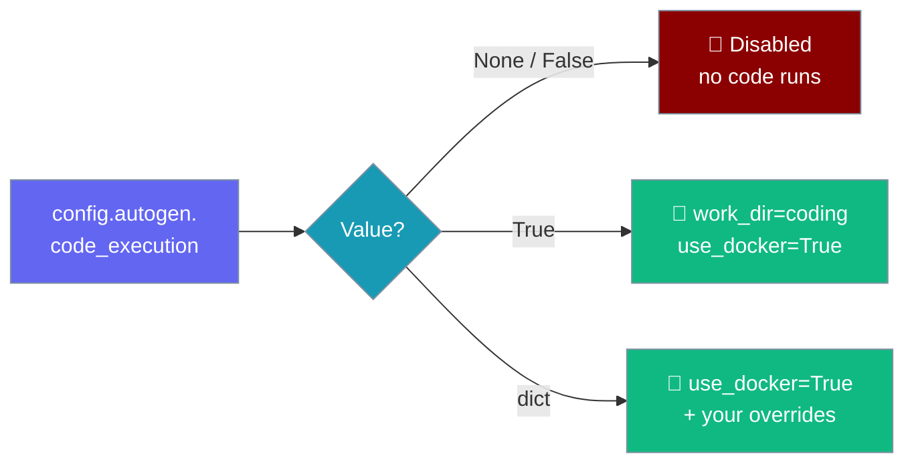
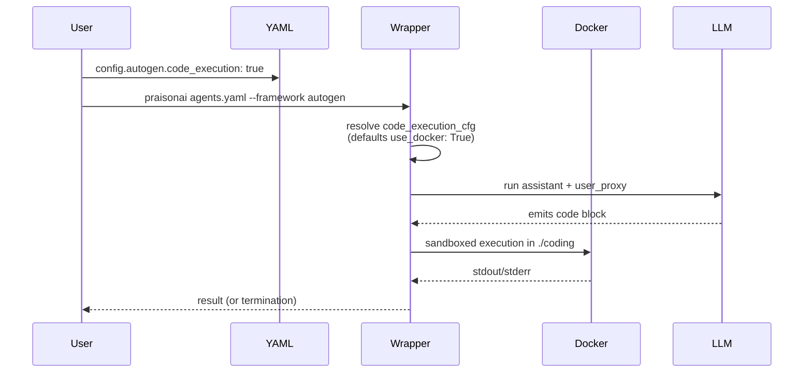

Enable sandboxed local code execution for `framework: autogen` runs via a single YAML flag — off by default so LLM-generated code never runs on your host without consent.



<Warning>
**Breaking change (PR #4477).** Before this fix, `framework: autogen` runs silently executed LLM-generated code blocks on the host with `use_docker: False` and `human_input_mode: NEVER`. Existing YAML that relied on that implicit behaviour must now opt in via `config.autogen.code_execution: true`. The new default is safe — no code executes unless the YAML asks for it.
</Warning>

## Quick Start

<Steps>
<Step title="Simple opt-in (Docker on)">

Set `code_execution: true` — the wrapper defaults `work_dir` to `coding` and `use_docker` to `True`.

```yaml
framework: autogen
topic: Plot a sine wave and save it as sine.png
config:
  autogen:
    code_execution: true
```

```bash
export OPENAI_API_KEY=sk-...
praisonai agents.yaml --framework autogen
```

</Step>

<Step title="Custom work_dir">

Pass a dict to override the sandbox directory — `use_docker` still defaults to `True`.

```yaml
framework: autogen
topic: Analyse sales.csv and print totals
config:
  autogen:
    code_execution:
      work_dir: "sandbox"
      use_docker: true
```

</Step>

<Step title="Local execution (unsafe, dev only)">

Setting `use_docker: false` runs generated code directly on the host and logs a warning.

```yaml
framework: autogen
config:
  autogen:
    code_execution:
      use_docker: false   # LLM code runs on the host — dev only
```

<Warning>
`use_docker: false` removes the sandbox. The wrapper logs a warning and executes LLM-generated code on your host. Keep Docker on outside local development.
</Warning>

</Step>
</Steps>

---

## How It Works

The wrapper resolves `code_execution` into AutoGen's `code_execution_config` before it builds the `UserProxyAgent`.



The `user_proxy` is constructed with the resolved `code_execution_config` and the resolved `human_input_mode`. When the LLM emits a code block, the `user_proxy` runs it in the sandbox path; when nothing is opted in, `code_execution_config` is `False` and no code runs.

---

## Configuration Options

Every option lives under `config.autogen.*` in your team YAML.

| Option (`config.autogen.*`) | Type | Default | Description |
|---|---|---|---|
| `code_execution` | `bool` \| `dict` \| `None` | `None` (disabled) | `False`/`None` → off; `True` → `{work_dir: "coding", use_docker: True}`; `dict` merged with `use_docker: True` default. Unrecognised values log a warning and disable execution. |
| `code_execution.work_dir` | `str` | `"coding"` | Working directory for generated code |
| `code_execution.use_docker` | `bool` | `True` (when opted-in) | Sandbox in Docker. Setting `False` logs a warning and runs on the host. |
| `human_input_mode` | `str` | `"TERMINATE"` | Passed to `UserProxyAgent`. Overrideable per YAML. Previously forced to `"NEVER"`. |

---

## Precedence Ladder

`code_execution` accepts a bool for the common case and a dict for overrides.

```yaml
# Level 1: Bool (simplest — off by default)
framework: autogen
config:
  autogen:
    code_execution: true   # Docker on, work_dir=coding

# Level 2: Dict (custom overrides)
framework: autogen
config:
  autogen:
    code_execution:
      work_dir: "sandbox"
      use_docker: true

# Level 3: Override human_input_mode
framework: autogen
config:
  autogen:
    code_execution: true
    human_input_mode: "ALWAYS"   # or NEVER, TERMINATE (default)
```

---

## Failure Scenario

When `use_docker: false` the wrapper emits this warning before running code on the host:

```
framework=autogen: code_execution is enabled with use_docker=False;
LLM-generated code will run directly on the host.
Set config.autogen.code_execution.use_docker: true to sandbox.
```

<Warning>
Treat this warning as a red flag in any shared or CI environment. Re-enable Docker (`use_docker: true`) so untrusted LLM code stays contained.
</Warning>

---

## Best Practices

<AccordionGroup>
<Accordion title="Keep Docker on for anything shared">
`use_docker: true` (the opt-in default) sandboxes generated code. Only drop to `use_docker: false` on a throwaway local machine, never in CI or on a server.
</Accordion>

<Accordion title="Opt in explicitly after upgrading">
Runs that previously relied on the old implicit host execution now do nothing until you add `config.autogen.code_execution: true`. Add it deliberately so the security posture is visible in the YAML.
</Accordion>

<Accordion title="Use a dedicated work_dir">
Point `work_dir` at a disposable folder (e.g. `sandbox`) so generated files stay isolated and easy to clean up between runs.
</Accordion>

<Accordion title="Choose human_input_mode for your loop">
`TERMINATE` (the new default) lets an operator step in at the end of a turn. Use `NEVER` for fully automated runs or `ALWAYS` for interactive review.
</Accordion>
</AccordionGroup>

---

## Related

<CardGroup cols={2}>
  <Card title="AutoGen with PraisonAI" icon="robot" href="/framework/autogen">
    Run AutoGen v0.2 via the family router
  </Card>
  <Card title="Tool Timeouts" icon="stopwatch" href="/features/tool-timeout">
    Give every tool call a hard deadline
  </Card>
</CardGroup>
