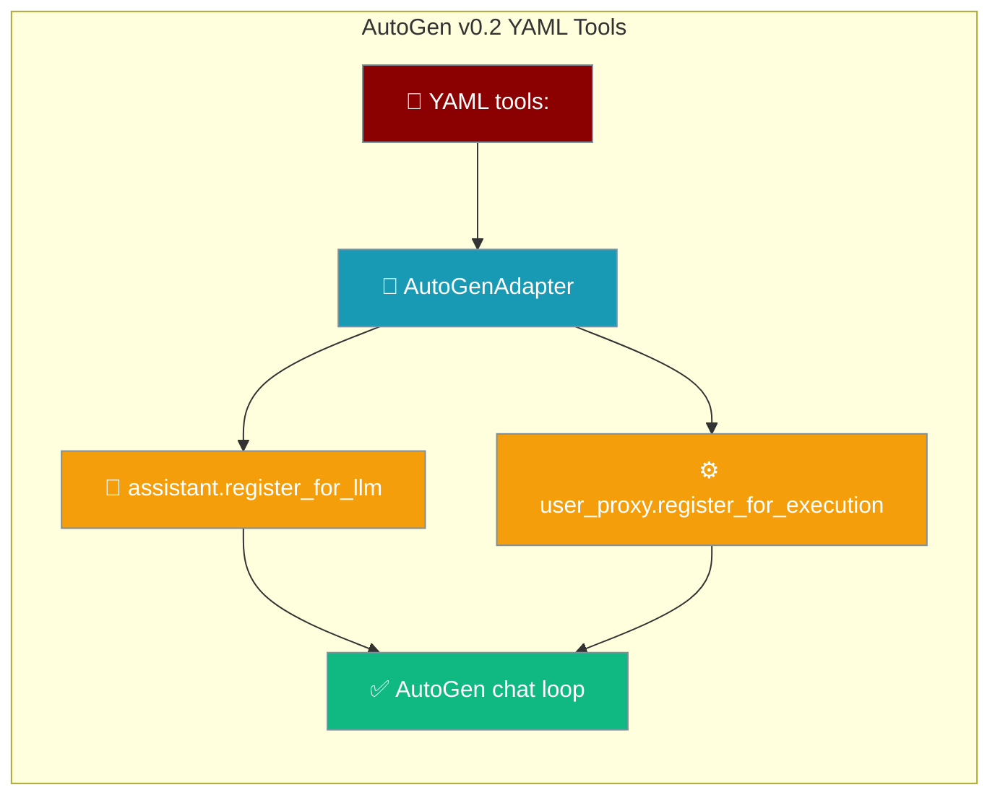
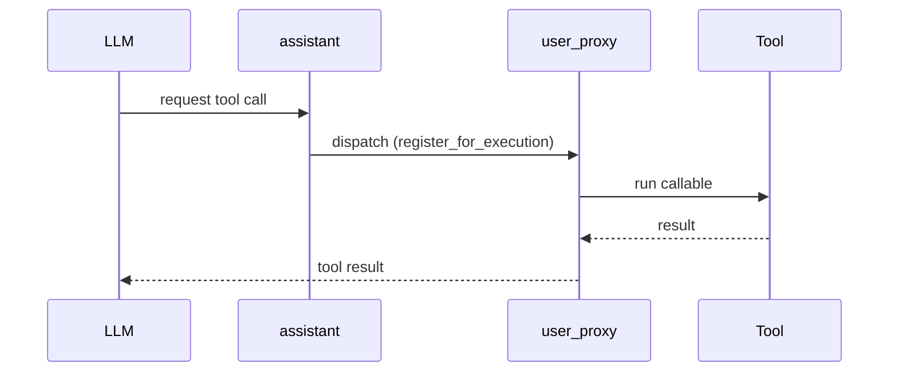

YAML `tools:` under `framework: autogen` (v0.2) are now fully wired into the AutoGen chat — the assistant advertises them to the LLM and the user_proxy executes them.



## Quick Start

<Steps>
<Step title="Declare the tool in YAML">
Reference the tool by name under a role's `tools:` list.

```yaml
framework: autogen
topic: Weather report

roles:
  weather_agent:
    role: Meteorologist
    goal: Report weather for a city
    backstory: Reliability-focused agent.
    tools:
      - get_weather
    tasks:
      report:
        description: Report the weather for {topic}
        expected_output: One paragraph forecast.
```
</Step>

<Step title="Define the tool and run">
Define `get_weather` as a plain callable with a `__name__` and a docstring, then run the YAML.

```python
from praisonai import PraisonAI

def get_weather(city: str) -> str:
    """Return the current weather for a city."""
    return f"It is sunny and 22°C in {city}."

praison = PraisonAI(agent_file="agents.yaml", tools=[get_weather])
praison.run()
```
</Step>
</Steps>

---

## How It Works

The adapter registers each callable on both AutoGen v0.2 agents so the LLM can call it and the user_proxy can run it.



| Step | Method | Purpose |
|------|--------|---------|
| Advertise schema | `assistant.register_for_llm(name, description)` | The LLM learns the tool exists |
| Execute call | `user_proxy.register_for_execution(name)` | The user_proxy runs the callable |
| Description | First line of `__doc__`, else `Tool <name>` | Shown to the LLM |

---

## Skip Rules

Tools that cannot be wired are logged and skipped — never silently dropped.

| Situation | Behaviour |
|-----------|-----------|
| Non-callable tool | Skipped with a warning |
| No resolvable `__name__` / `name` | Skipped with a warning |
| Duplicate tool name on the shared `user_proxy` | First callable kept, duplicate skipped with a warning |

Duplicate handling prevents AutoGen's last-write-wins `_function_map` from silently overwriting an earlier tool when two agents declare a same-named callable.

---

## Timeout Translation

AutoGen v0.2 runs tools inside its chat loop and expects a string to hand back to the LLM. When a per-call tool timeout raises `ToolTimeoutError`, the adapter's `_wrap_tool_for_execution` catches it and returns `"Error: tool '<name>' timed out (…)."` so the conversation keeps moving instead of aborting.

See [Tool Configuration → Wrapper-Level Tool Timeout](/docs/configuration/tool-config#wrapper-level-tool-timeout-yaml-cli-defense-in-depth) for the full timeout contract.

---

## Best Practices

<AccordionGroup>
<Accordion title="Give tools a clear __name__ and docstring">
The tool name comes from `__name__` (or a `name` attribute), and the LLM-facing description is the first line of the docstring. Named functions with a one-line docstring wire cleanly.

```python
def get_weather(city: str) -> str:
    """Return the current weather for a city."""
    return f"Sunny in {city}."
```
</Accordion>

<Accordion title="Don't rely on lambdas">
Lambdas have no `__name__`, so the adapter cannot resolve a name and skips them with a warning. Use `def`.
</Accordion>

<Accordion title="Avoid same-named tools across agents on one run">
Two agents declaring a tool with the same `__name__` share one `user_proxy`; only the first callable is registered for execution. Give each tool a distinct name.
</Accordion>
</AccordionGroup>

---

## Related

<CardGroup cols={2}>
<Card title="AutoGen Tool Registry Migration" icon="arrows-rotate" href="/docs/features/tool-registry-autogen-migration">
  Migrate tool registries into AutoGen
</Card>
<Card title="AutoGen LLM config_list" icon="list" href="/docs/features/llm-autogen-config-list">
  Configure the AutoGen LLM config_list
</Card>
</CardGroup>
