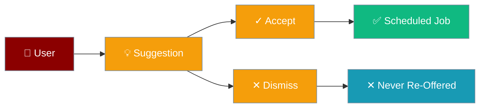
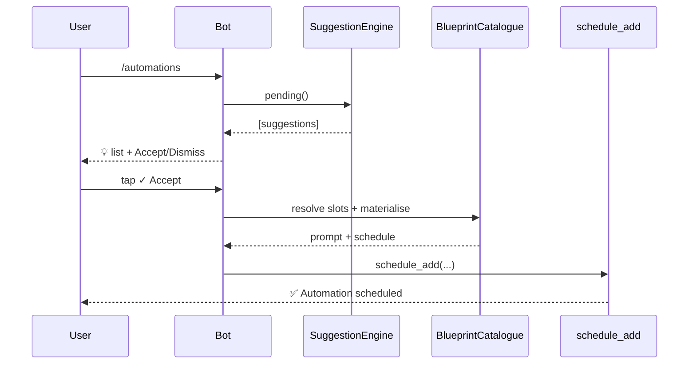

Automation Suggestions turn recurring requests into scheduled jobs — but only when you tap Accept.



## Quick Start

<Steps>
<Step title="See pending suggestions">
Type `/automations` in chat. The bot lists each pending suggestion with its own Accept/Dismiss buttons.
```
/automations
```
</Step>

<Step title="Accept from chat">
Tap the `✓ Accept` button on a suggestion. Exactly one scheduled job is created — nothing runs until you accept.
</Step>

<Step title="Or create from a template">
Skip suggestions and build a job straight from a blueprint:
```
/blueprint morning-brief hour=8 weekdays=mon-fri
```
</Step>
</Steps>

---

## How It Works

Two paths lead to the same result — a scheduled job — but only ever on an explicit accept.



| Path | Command | What happens |
|------|---------|--------------|
| Accept an existing suggestion | `/automations` → `✓ Accept` | Materialises the suggested blueprint into one job and marks the suggestion accepted. |
| Create directly from a template | `/blueprint <name> [slot=value ...]` | Resolves slots against blueprint defaults and schedules the job immediately. |

<Note>
Button taps travel through the shared callback contract: `sug:accept:<id>` accepts a suggestion, `sug:dismiss:<id>` dismisses it. The interactive registry decodes `sug:accept:<id>` as namespace `sug` with the remainder as the payload — a Telegram-side detail you never type by hand.
</Note>

---

## Built-in Blueprints

Three blueprints ship ready to use, straight from `blueprint_catalogue.py`.

| Name | Description | Category | Default deliver | Key slots |
|------|-------------|----------|-----------------|-----------|
| `morning-brief` | Daily morning briefing with news and priorities | `daily` | `telegram` | `hour` (int, `8`), `minute` (int, `0`), `weekdays` (choice, `mon-fri`), `focus` (choice, `general`) |
| `important-mail` | Check for important emails at a regular interval | `monitoring` | `telegram` | `interval_minutes` (int, `30`), `keywords` (str, `"urgent,important,deadline"`) |
| `weekly-review` | End-of-week summary and review | `weekly` | `telegram` | `hour` (int, `17`), `minute` (int, `0`), `weekdays` (choice, `fri`), `focus` (choice, `general`) |

<Note>
If your app already registers a custom `/automations` or `/blueprint` handler via `@bot.on_command`, that handler wins — the built-ins step aside for those two names only. All other built-in commands still take precedence.
</Note>

---

## Custom Blueprints (YAML)

Author your own blueprints under `~/.praisonai/blueprints/<name>/blueprint.yaml`; a custom blueprint overrides a built-in of the same name.

```yaml
name: standup-digest
version: "1.0.0"
description: Team standup digest
category: daily
default_deliver: telegram
prompt_template: "Summarise today's standup for {team}."
schedule_template: "cron:{minute} {hour} * * {weekdays_expression}"
slots:
  - name: hour
    type: int
    default: 9
  - name: minute
    type: int
    default: 30
  - name: weekdays
    type: choice
    default: mon-fri
    choices: [mon-fri, daily, weekends]
  - name: team
    type: str
    default: engineering
```

Discovery scans each `<name>/blueprint.yaml` subdirectory — see `BlueprintCatalogue._load_from_directory` for the exact rule.

---

## Chat Commands

<CardGroup cols={2}>
  <Card title="/automations" icon="wand-magic-sparkles">
    List pending suggestions with inline `✓ Accept` / `✕ Dismiss` buttons. Telegram only today. Full detail in [Bot Chat Commands](/docs/features/bot-commands#automations).
  </Card>
  <Card title="/blueprint" icon="file-code">
    Create an automation from a template: `/blueprint <name> [slot=value ...]`. Telegram only today. Full detail in [Bot Chat Commands](/docs/features/bot-commands#blueprint).
  </Card>
</CardGroup>

---

## CLI Commands

Drive the same engine from the shell — full flags in [Schedule CLI](/docs/cli/schedule#blueprints-suggestions).

| Command | Purpose |
|---------|---------|
| `praisonai schedule blueprint <name>` | Create a job from a blueprint template |
| `praisonai schedule blueprint-list` | List available blueprints (built-in + user YAML) |
| `praisonai schedule suggestions` | List pending automation suggestions |
| `praisonai schedule suggestion-accept <id>` | Accept a suggestion and materialise the job |
| `praisonai schedule suggestion-dismiss <id>` | Dismiss a suggestion |
| `praisonai schedule suggestion-propose <blueprint>` | Manually propose a blueprint as a suggestion |

---

## Python Usage

Propose and accept a suggestion programmatically.

```python
from praisonai.scheduler.suggestion_engine import SuggestionEngine
from praisonai.scheduler.blueprint_catalogue import BlueprintCatalogue

engine = SuggestionEngine()

sug_id = engine.propose(
    "morning-brief",
    slots={"hour": 8, "weekdays": "mon-fri"},
    deliver="telegram",
    reason="Detected daily morning request pattern",
)

if sug_id:
    catalogue = BlueprintCatalogue()
    bp = catalogue.get_blueprint("morning-brief")
    sug = engine.get_suggestion(sug_id)
    resolved = catalogue.resolve_slots(bp, sug.slots)
    prompt = catalogue.materialize_prompt(bp, resolved)
    schedule = catalogue.materialize_schedule(bp, resolved)
    engine.accept(sug_id)
    print(prompt, schedule)
```

`propose()` returns `None` when the pending cap (20) is reached or the same blueprint + slots was suggested within the 24-hour dedup window.

---

## User Interaction Flows

**Flow A — Accept an existing suggestion in chat:**

```
User → /automations
Bot  → "💡 You have 1 pending automation suggestion:"
Bot  → "💡 Detected daily morning request pattern
        morning-brief · hour=8, weekdays=mon-fri"
        [✓ Accept]  [✕ Dismiss]
User → taps ✓ Accept
Bot  → "✅ Automation scheduled. Added job 'morning-brief' (schedule cron:0 8 * * mon,tue,wed,thu,fri)"
```

**Flow B — Create directly from a blueprint:**

```
User → /blueprint
Bot  → "📋 Create an automation from a template:
        • morning-brief — Daily morning briefing with news and priorities
        • important-mail — Check for important emails at a regular interval
        • weekly-review — End-of-week summary and review
        Usage: /blueprint <name> [slot=value ...]
        Example: /blueprint morning-brief hour=8 weekdays=mon-fri"
User → /blueprint morning-brief hour=8 weekdays=mon-fri focus=tech
Bot  → "✅ Automation scheduled from 'morning-brief'. Added job 'morning-brief' (schedule cron:0 8 * * mon,tue,wed,thu,fri)"
```

---

## Safe by Default & Multi-tenancy

<Warning>
The underlying `SuggestionStore` is a single, global, single-tenant store (`~/.praisonai/suggestions.json`) with no per-user field on `Suggestion`. Suggestions are shared across everyone who can reach the gateway — exactly like the `praisonai schedule` CLI. Access is gated by `CommandAccessPolicy` (the `automations` permission is re-checked on every accept/dismiss tap); restrict that policy to admins for multi-user bots. Per-user scoping would require a core data-model change and is out of scope for this wiring.
</Warning>

Nothing is ever auto-created — the engine only materialises a job on an explicit accept. `MAX_PENDING_CAP` (20), the 24-hour dedup window, and the 3-day TTL are all inherited from the store.

---

## Platform Coverage

<Info>
**Telegram-only today.** Discord, Slack, and WhatsApp adapters do not register `/automations` or `/blueprint` yet — parity is tracked in future PRs. The shared helper module keeps the accept/dismiss/blueprint glue in one place so those adapters can wire it later.
</Info>

The commands also degrade gracefully: if the scheduler extra isn't installed, they reply `❌ Automations are not available (scheduler not installed).`

---

## Best Practices

<AccordionGroup>
  <Accordion title="Gate automations behind admins on multi-user bots">
    The suggestion store is single-tenant. Restrict the `automations` and `blueprint` permissions in `CommandAccessPolicy` to admin users so one person's suggestions aren't accepted or dismissed by everyone. See [Command Access Control](/docs/features/bot-command-access-control).
  </Accordion>
  <Accordion title="Prefer accepting a suggestion over re-creating it">
    When a suggestion already exists for a pattern, accept it rather than running `/blueprint` — the dedup key latches on accept and avoids duplicate jobs.
  </Accordion>
  <Accordion title="Author custom YAML blueprints for team workflows">
    Drop a `blueprint.yaml` in `~/.praisonai/blueprints/<name>/` to codify team-specific automations. A custom blueprint overrides a built-in of the same name.
  </Accordion>
  <Accordion title="Skip empty ticks with a pre-run gate">
    For monitoring blueprints like `important-mail`, add a `--pre-run` gate to the resulting job so ticks with no new work spend no tokens. See the [pre-run gate](/docs/cli/schedule) in the Schedule CLI.
  </Accordion>
</AccordionGroup>

---

## Related

<CardGroup cols={2}>
  <Card title="Bot Chat Commands" icon="terminal" href="/docs/features/bot-commands">
    Full `/automations` and `/blueprint` command details.
  </Card>
  <Card title="Schedule CLI" icon="clock" href="/docs/cli/schedule">
    Blueprint and suggestion subcommands with every flag.
  </Card>
  <Card title="Proactive Delivery" icon="paper-plane" href="/docs/features/proactive-delivery">
    Home channels and delivery tokens for scheduled jobs.
  </Card>
  <Card title="Scheduled Run Policy" icon="shield-halved" href="/docs/features/scheduled-run-policy">
    Guardrails and the pre-run gate for unattended runs.
  </Card>
</CardGroup>
