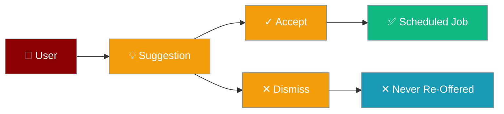
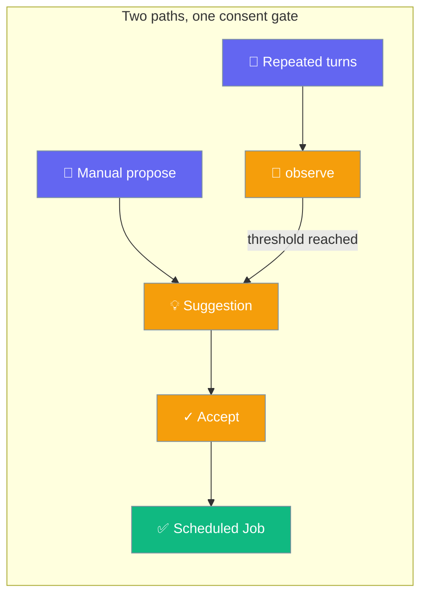
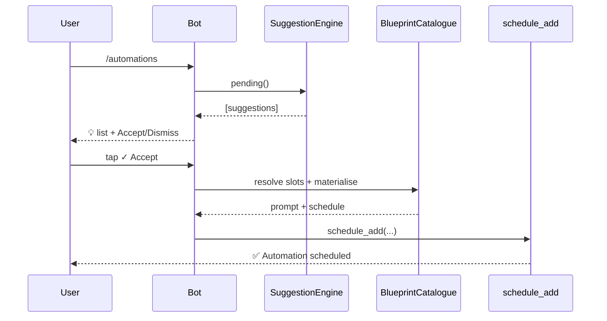
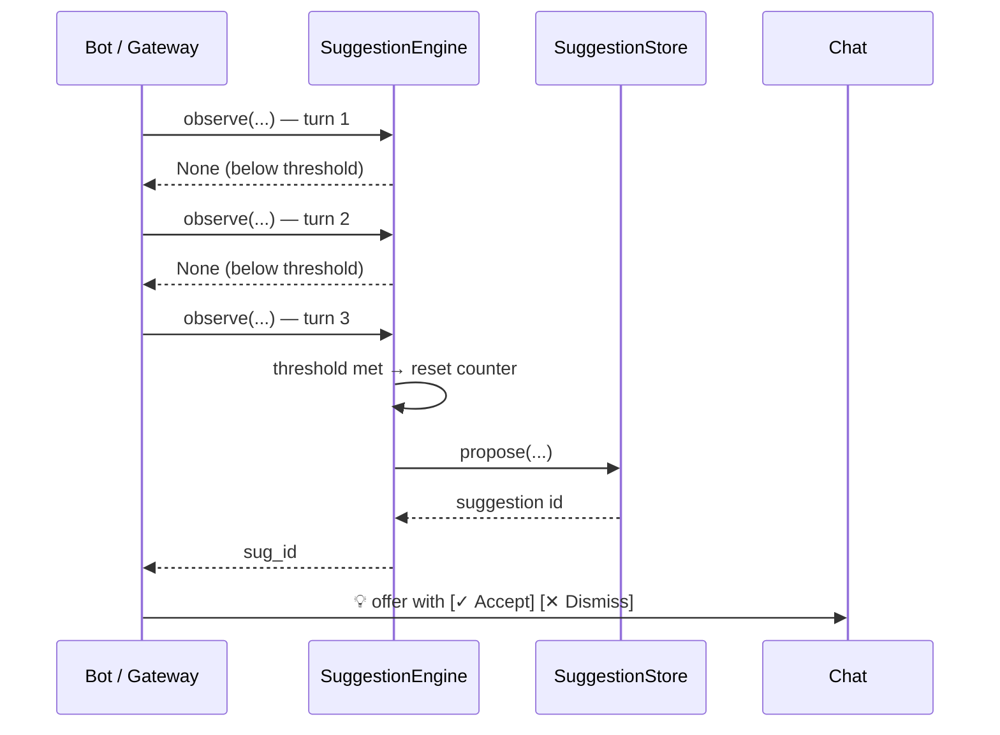
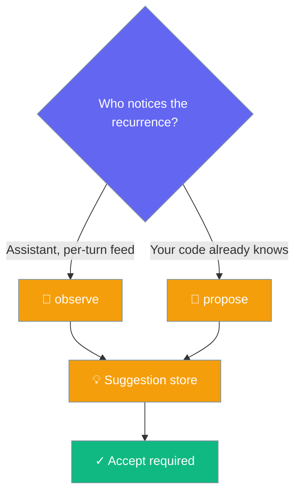
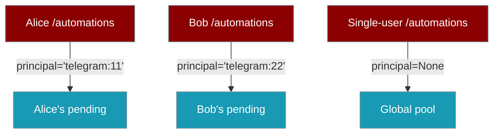
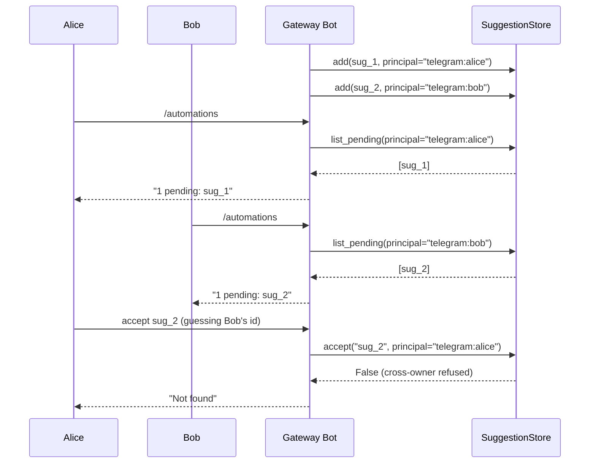

Automation Suggestions turn recurring requests into scheduled jobs — proposed explicitly, or offered automatically when the assistant notices the same intent recurring — but only ever scheduled when you tap Accept.


```mermaid
graph LR
    User[👤 User] --> Suggestion[💡 Suggestion]
    Suggestion --> Accept[✓ Accept]
    Suggestion --> Dismiss[✕ Dismiss]
    Accept --> Job[✅ Scheduled Job]
    Dismiss --> Gone[✕ Never Re-Offered]

    classDef user fill:#8B0000,stroke:#7C90A0,color:#fff
    classDef step fill:#F59E0B,stroke:#7C90A0,color:#fff
    classDef ok fill:#10B981,stroke:#7C90A0,color:#fff
    classDef off fill:#189AB4,stroke:#7C90A0,color:#fff

    class User user
    class Suggestion,Accept,Dismiss step
    class Job ok
    class Gone off
```

Two paths feed one consent gate — a manual `propose()` call, or an automatic `observe()` that fires once a request recurs.


```mermaid
graph LR
    subgraph "Two paths, one consent gate"
        Manual[💬 Manual propose] --> S[💡 Suggestion]
        Turns[🔁 Repeated turns] --> Observe[👀 observe]
        Observe -->|threshold reached| S
        S --> Accept[✓ Accept]
        Accept --> Job[✅ Scheduled Job]
    end

    classDef in fill:#6366F1,stroke:#7C90A0,color:#fff
    classDef proc fill:#F59E0B,stroke:#7C90A0,color:#fff
    classDef ok fill:#10B981,stroke:#7C90A0,color:#fff

    class Manual,Turns in
    class Observe,S,Accept proc
    class Job ok
```

## Quick Start

<Steps>
<Step title="Let the assistant offer it (feed each turn)">
Feed each completed turn's inferred blueprint + slots. After the same intent recurs a few times, the engine offers it — you still tap Accept.

```python
from praisonai.scheduler.suggestion_engine import SuggestionEngine

engine = SuggestionEngine()

# Called from your bot/gateway/CLI after each completed turn:
sug_id = engine.observe(
    "morning-brief",
    slots={"hour": 8, "weekdays": "mon-fri"},
    principal="telegram:12345",  # optional, isolates per user
)

if sug_id:
    print(f"Offered automation as {sug_id} — waiting for user to accept.")
```

Nothing runs until the user taps `✓ Accept`. Below the threshold (default 3), `observe()` just counts and returns `None`.
</Step>

<Step title="See pending suggestions">
Type `/automations` in chat. The bot lists each pending suggestion with its own Accept/Dismiss buttons.
```
/automations
```
</Step>

<Step title="Accept from chat">
Tap the `✓ Accept` button on a suggestion. Exactly one scheduled job is created — nothing runs until you accept.
</Step>

<Step title="Or create from a template">
Skip suggestions and build a job straight from a blueprint:
```
/blueprint morning-brief hour=8 weekdays=mon-fri
```
</Step>
</Steps>

---

## How It Works

Two paths lead to the same result — a scheduled job — but only ever on an explicit accept.


```mermaid
sequenceDiagram
    participant User
    participant Bot
    participant Engine as SuggestionEngine
    participant Catalogue as BlueprintCatalogue
    participant Scheduler as schedule_add

    User->>Bot: /automations
    Bot->>Engine: pending()
    Engine-->>Bot: [suggestions]
    Bot-->>User: 💡 list + Accept/Dismiss
    User->>Bot: tap ✓ Accept
    Bot->>Catalogue: resolve slots + materialise
    Catalogue-->>Bot: prompt + schedule
    Bot->>Scheduler: schedule_add(...)
    Scheduler-->>User: ✅ Automation scheduled
```

| Path | Command | What happens |
|------|---------|--------------|
| Accept an existing suggestion | `/automations` → `✓ Accept` | Materialises the suggested blueprint into one job and marks the suggestion accepted. |
| Create directly from a template | `/blueprint <name> [slot=value ...]` | Resolves slots against blueprint defaults and schedules the job immediately. |
| Auto-offered on recurrence | `engine.observe(...)` (called per turn by your bot/gateway) | Silently counts. Once the intent recurs `threshold` times inside `window_seconds`, calls `propose()` once, resets the counter, and surfaces the same 💡 Accept/Dismiss card. |

<Note>
Button taps travel through the shared callback contract: `sug:accept:<id>` accepts a suggestion, `sug:dismiss:<id>` dismisses it. The interactive registry decodes `sug:accept:<id>` as namespace `sug` with the remainder as the payload — a Telegram-side detail you never type by hand.
</Note>

---

## Auto-generating suggestions with `observe()`

`observe()` is the recurrence generator — a caller feeds every turn's inferred intent, and the engine offers an automation once it recurs.


```mermaid
sequenceDiagram
    participant Bot as Bot / Gateway
    participant Engine as SuggestionEngine
    participant Store as SuggestionStore
    participant Chat

    Bot->>Engine: observe(...) — turn 1
    Engine-->>Bot: None (below threshold)
    Bot->>Engine: observe(...) — turn 2
    Engine-->>Bot: None (below threshold)
    Bot->>Engine: observe(...) — turn 3
    Engine->>Engine: threshold met → reset counter
    Engine->>Store: propose(...)
    Store-->>Engine: suggestion id
    Engine-->>Bot: sug_id
    Bot->>Chat: 💡 offer with [✓ Accept] [✕ Dismiss]
```

Both entry points end in the same store and both require Accept — pick the one that matches who notices the recurrence.


```mermaid
graph TB
    Q{Who notices the recurrence?} -->|Assistant, per-turn feed| OB[👀 observe]
    Q -->|Your code already knows| PR[💬 propose]
    OB --> S[💡 Suggestion store]
    PR --> S
    S --> AC[✓ Accept required]

    classDef q fill:#6366F1,stroke:#7C90A0,color:#fff
    classDef proc fill:#F59E0B,stroke:#7C90A0,color:#fff
    classDef ok fill:#10B981,stroke:#7C90A0,color:#fff

    class Q q
    class OB,PR,S proc
    class AC ok
```

Use `observe()` when the assistant should notice recurrence itself (per-turn feed from a bot/gateway). Use `propose()` when your code already knows an automation is worth offering (manual CLI, dashboard, explicit rule).

`observe()` is deterministic, not ML — a per-intent trailing count keyed on `(principal, blueprint_name, frozen(slots))`. Two module-level constants set its defaults:

| Constant | Type | Value | Purpose |
|----------|------|-------|---------|
| `DEFAULT_RECURRENCE_THRESHOLD` | `int` | `3` | Times the same intent must recur before it is auto-proposed. |
| `DEFAULT_RECURRENCE_WINDOW_SEC` | `float` | `604800` (7 days) | Trailing window in which occurrences count; older observations are pruned. |

### Parameters

| Parameter | Type | Default | Description |
|-----------|------|---------|-------------|
| `blueprint_name` | `str` | — (required) | Blueprint the recurring intent maps to. |
| `slots` | `Optional[Dict[str, Any]]` | `None` | Slot values that identify the specific intent. Same blueprint + different slots = distinct intent. Nested lists/dicts/sets are supported (frozen internally). |
| `deliver` | `str` | `""` | Suggested delivery target, forwarded to `propose()`. |
| `reason` | `str` | `""` | Human-readable explanation. When omitted, a default `"Noticed a recurring '<blueprint>' request (Nx); offering to automate it."` is used. |
| `principal` | `Optional[str]` | `None` | Owning end-user identity on a multi-user gateway. Counts are isolated per principal. |
| `threshold` | `int` | `3` (`DEFAULT_RECURRENCE_THRESHOLD`) | Occurrences required before auto-proposing. |
| `window_seconds` | `float` | 7 days (`DEFAULT_RECURRENCE_WINDOW_SEC`) | Trailing window in which occurrences count. |
| `ttl_seconds` | `float` | 3 days (`DEFAULT_TTL_SEC` from `suggestion_store`) | TTL forwarded to `propose()`. |

### Example

```python
from praisonai.scheduler.suggestion_engine import SuggestionEngine

engine = SuggestionEngine()

# Feed one observation per completed turn.
# 1st and 2nd calls: returns None (below threshold=3).
engine.observe("morning-brief", slots={"hour": 8}, principal="telegram:alice")
engine.observe("morning-brief", slots={"hour": 8}, principal="telegram:alice")

# 3rd call: threshold met — engine.propose() runs, store returns a suggestion id.
sug_id = engine.observe(
    "morning-brief",
    slots={"hour": 8},
    principal="telegram:alice",
    reason="Alice asks for a morning brief around 8am every day.",
)

# Different slots for the same user = distinct intent. This is turn 1 of its own count.
engine.observe("morning-brief", slots={"hour": 9}, principal="telegram:alice")

# Different principal = fully separate count. Bob's first observation is turn 1.
engine.observe("morning-brief", slots={"hour": 8}, principal="telegram:bob")
```

<Note>
`observe()` returns the new suggestion ID **only** when this observation crossed the threshold **and** the store admitted the proposal. It returns `None` in three cases: still below threshold, the store's pending cap is full, or the store's dedup window already holds this identical intent.
</Note>

<Warning>
Counters are per-`(principal, blueprint, slots)`, so one user's recurrence can never trigger another's suggestion. After a fire, the counter resets to empty and the store's dedup window guards the identical intent — Accept-once, Dismiss-forever still holds for auto-proposals.
</Warning>

### Tuning

Adjust `threshold` and `window_seconds` to fit the workflow:

```python
# Fire immediately on the first observation — handy for testing.
engine.observe("morning-brief", slots={"hour": 8}, threshold=1)

# Wait for stronger evidence over a longer window (30 days).
engine.observe(
    "morning-brief",
    slots={"hour": 8},
    threshold=5,
    window_seconds=3600 * 24 * 30,
)

# Nested slots are supported — the recurrence key is frozen recursively.
engine.observe(
    "morning-brief",
    slots={"weekdays": ["mon", "tue"], "opts": {"tz": "UTC"}},
)
```

Immediately after a fire, another observation with the same key is below-threshold again *and* the store dedups the identical intent, so there is no double-offer. `self._observations` is process-local best-effort memory — a restart merely resets counters; the durable state stays in the `SuggestionStore`.

---

## Built-in Blueprints

Three blueprints ship ready to use, straight from `blueprint_catalogue.py`.

| Name | Description | Category | Default deliver | Key slots |
|------|-------------|----------|-----------------|-----------|
| `morning-brief` | Daily morning briefing with news and priorities | `daily` | `telegram` | `hour` (int, `8`), `minute` (int, `0`), `weekdays` (choice, `mon-fri`), `focus` (choice, `general`) |
| `important-mail` | Check for important emails at a regular interval | `monitoring` | `telegram` | `interval_minutes` (int, `30`), `keywords` (str, `"urgent,important,deadline"`) |
| `weekly-review` | End-of-week summary and review | `weekly` | `telegram` | `hour` (int, `17`), `minute` (int, `0`), `weekdays` (choice, `fri`), `focus` (choice, `general`) |

<Note>
If your app already registers a custom `/automations` or `/blueprint` handler via `@bot.on_command`, that handler wins — the built-ins step aside for those two names only. All other built-in commands still take precedence.
</Note>

---

## Custom Blueprints (YAML)

Author your own blueprints under `~/.praisonai/blueprints/<name>/blueprint.yaml`; a custom blueprint overrides a built-in of the same name.

```yaml
name: standup-digest
version: "1.0.0"
description: Team standup digest
category: daily
default_deliver: telegram
prompt_template: "Summarise today's standup for {team}."
schedule_template: "cron:{minute} {hour} * * {weekdays_expression}"
slots:
  - name: hour
    type: int
    default: 9
  - name: minute
    type: int
    default: 30
  - name: weekdays
    type: choice
    default: mon-fri
    choices: [mon-fri, daily, weekends]
  - name: team
    type: str
    default: engineering
```

Discovery scans each `<name>/blueprint.yaml` subdirectory — see `BlueprintCatalogue._load_from_directory` for the exact rule.

---

## Chat Commands

<CardGroup cols={2}>
  <Card title="/automations" icon="wand-magic-sparkles">
    List pending suggestions with inline `✓ Accept` / `✕ Dismiss` buttons. Telegram only today. Full detail in [Bot Chat Commands](/docs/features/bot-commands#automations).
  </Card>
  <Card title="/blueprint" icon="file-code">
    Create an automation from a template: `/blueprint <name> [slot=value ...]`. Telegram only today. Full detail in [Bot Chat Commands](/docs/features/bot-commands#blueprint).
  </Card>
</CardGroup>

---

## CLI Commands

Drive the same engine from the shell — full flags in [Schedule CLI](/docs/cli/schedule#blueprints-suggestions).

| Command | Purpose |
|---------|---------|
| `praisonai schedule blueprint <name>` | Create a job from a blueprint template |
| `praisonai schedule blueprint-list` | List available blueprints (built-in + user YAML) |
| `praisonai schedule suggestions` | List pending automation suggestions |
| `praisonai schedule suggestion-accept <id>` | Accept a suggestion and materialise the job |
| `praisonai schedule suggestion-dismiss <id>` | Dismiss a suggestion |
| `praisonai schedule suggestion-propose <blueprint>` | Manually propose a blueprint as a suggestion |

`observe()` is a Python-level generator called from your bot/gateway; there is no CLI entry point today. Use `praisonai schedule suggestion-propose <blueprint>` for a one-shot manual proposal.

---

## Python Usage

Propose and accept a suggestion programmatically.

```python
from praisonai.scheduler.suggestion_engine import SuggestionEngine
from praisonai.scheduler.blueprint_catalogue import BlueprintCatalogue

engine = SuggestionEngine()

sug_id = engine.propose(
    "morning-brief",
    slots={"hour": 8, "weekdays": "mon-fri"},
    deliver="telegram",
    reason="Detected daily morning request pattern",
)

if sug_id:
    catalogue = BlueprintCatalogue()
    bp = catalogue.get_blueprint("morning-brief")
    sug = engine.get_suggestion(sug_id)
    resolved = catalogue.resolve_slots(bp, sug.slots)
    prompt = catalogue.materialize_prompt(bp, resolved)
    schedule = catalogue.materialize_schedule(bp, resolved)
    engine.accept(sug_id)
    print(prompt, schedule)
```

`propose()` returns `None` when the pending cap (20) is reached or the same blueprint + slots was suggested within the 24-hour dedup window.

On a bot gateway the engine reads `SessionContext.unified_user_id` for you. Pass `principal=` yourself only from a custom script that has no session installed.

<Tabs>
<Tab title="Gateway (automatic)">
```python
from praisonai.scheduler.suggestion_engine import SuggestionEngine

engine = SuggestionEngine()

# Primary generator: feed each completed turn's inferred intent.
# Inside an agent turn on a bot gateway — no principal= needed.
# The engine defaults it from SessionContext.unified_user_id.
sug_id = engine.observe(
    "morning-brief",
    slots={"hour": 8, "weekdays": "mon-fri"},
    deliver="telegram",
)

# Fallback: propose directly when your code already knows to offer.
engine.propose(
    "morning-brief",
    slots={"hour": 8, "weekdays": "mon-fri"},
    deliver="telegram",
    reason="Detected daily morning request pattern",
)

engine.pending()   # → only this user's suggestions
```
</Tab>
<Tab title="Custom script (explicit)">
```python
from praisonai.scheduler.suggestion_engine import SuggestionEngine

engine = SuggestionEngine()

session_user_id = "telegram:12345"

sug_id = engine.propose(
    "morning-brief",
    slots={"hour": 8, "weekdays": "mon-fri"},
    deliver="telegram",
    reason="Detected daily morning request pattern",
    principal=session_user_id,
)

engine.pending(principal=session_user_id)   # → only this user's suggestions
```
</Tab>
</Tabs>

---

## User Interaction Flows

**Flow A — Accept an existing suggestion in chat:**

```
User → /automations
Bot  → "💡 You have 1 pending automation suggestion:"
Bot  → "💡 Detected daily morning request pattern
        morning-brief · hour=8, weekdays=mon-fri"
        [✓ Accept]  [✕ Dismiss]
User → taps ✓ Accept
Bot  → "✅ Automation scheduled. Added job 'morning-brief' (schedule cron:0 8 * * mon,tue,wed,thu,fri)"
```

**Flow B — Create directly from a blueprint:**

```
User → /blueprint
Bot  → "📋 Create an automation from a template:
        • morning-brief — Daily morning briefing with news and priorities
        • important-mail — Check for important emails at a regular interval
        • weekly-review — End-of-week summary and review
        Usage: /blueprint <name> [slot=value ...]
        Example: /blueprint morning-brief hour=8 weekdays=mon-fri"
User → /blueprint morning-brief hour=8 weekdays=mon-fri focus=tech
Bot  → "✅ Automation scheduled from 'morning-brief'. Added job 'morning-brief' (schedule cron:0 8 * * mon,tue,wed,thu,fri)"
```

**Flow D — Auto-offered after a recurring request:**

```
User → "Give me the morning brief"           (turn 1 → observe → below threshold)
User → next day: "morning brief please"      (turn 2 → observe → below threshold)
User → next day: "brief me on the morning"   (turn 3 → observe → threshold met → propose)
Bot  → "💡 Noticed a recurring 'morning-brief' request (3x); offering to automate it."
       morning-brief · hour=8
       [✓ Accept]  [✕ Dismiss]
User → taps ✓ Accept
Bot  → "✅ Automation scheduled. Added job 'morning-brief' ..."
```

Mapping natural-language turns → `blueprint_name` + `slots` is the caller's job (bot/gateway), not something `observe()` infers by itself.

**Flow C — Two users, one bot, no cross-talk (multi-tenant):**

On a bot gateway you don't call this by hand — the gateway installs a `SessionContext` per turn, and `SuggestionEngine.propose(...)` reads it automatically. The pseudo-code below shows what the store sees end-to-end.

```
Alice → DMs the bot: "remind me to file expenses every Friday at 5pm"
Bot   → add(Suggestion(principal="tg:alice", name="weekly-expenses", ...))
Bob   → DMs the same bot: "remind me to file expenses every Friday at 5pm"   (identical text)
Bot   → add(Suggestion(principal="tg:bob", ...))  # admitted — dedup is per-principal
Alice → /automations   → sees only her own pending suggestion
Alice → accepts        → job created with principal="tg:alice"
Bob   → accepts        → his own job created; no name collision, both coexist
```

Before per-principal scoping, Bob's identical proposal was silently blocked by Alice's dedup entry, and either user could accept or dismiss the other's suggestion.

---

## Multi-tenant isolation

Each end-user sees only their own suggestions once the gateway passes their resolved identity as `principal=`. Alice and Bob can share one gateway yet never see or mutate each other's pending queue; a single-user deployment leaves `principal=None` and keeps the global pool.


```mermaid
graph TB
    A[Alice /automations] -->|principal='telegram:11'| S1[Alice's pending]
    B[Bob /automations]   -->|principal='telegram:22'| S2[Bob's pending]
    C[Single-user /automations] -->|principal=None| SG[Global pool]

    classDef user fill:#8B0000,stroke:#7C90A0,color:#fff
    classDef store fill:#189AB4,stroke:#7C90A0,color:#fff

    class A,B,C user
    class S1,S2,SG store
```

`principal` is any stable, opaque string that names the caller — a user id, an email hash, a tenant id. The store never parses or validates it; it only compares it. Leave it unset (`None`) for the global, single-tenant behaviour used by the CLI and single-user deployments.

A gateway handler that already knows who's calling threads that identity through as `principal`:

```python
from praisonaiagents.scheduler import Suggestion, SuggestionStore

store = SuggestionStore()  # ~/.praisonai/suggestions.json

# In a gateway handler that already knows who's calling:
def handle_user_message(user_id: str) -> None:
    store.add(Suggestion(
        id=f"sug_{user_id}_standup",
        blueprint_name="morning-brief",
        slots={"hour": 9, "weekdays": "mon-fri"},
        reason="Detected daily standup request",
        principal=user_id,          # isolate to this caller
    ))                              # pending cap + dedup window scoped per user_id

# Later, when the same user pulls their pending list:
def list_for(user_id: str) -> list[Suggestion]:
    return store.list_pending(principal=user_id)
```

Cross-owner access is rejected, not silently merged:

- `list_pending(principal="alice")` never returns Bob's suggestions.
- `accept(sug_id, principal="alice")` returns `False` if the suggestion is Bob's.
- `dismiss(sug_id, principal="alice")` returns `False` if the suggestion is Bob's.
- The pending cap (`MAX_PENDING_CAP`, 20) and 24-hour dedup window are measured **per principal**, so one tenant can neither exhaust another's slots nor block their identical proposal.

There is no admin bypass — a call passing `principal="bob"` cannot see Alice's items even when the process runs as root. Scoping is enforced only by the `principal` the caller passes.


```mermaid
sequenceDiagram
    participant Alice
    participant Bob
    participant Bot as Gateway Bot
    participant Store as SuggestionStore

    Bot->>Store: add(sug_1, principal="telegram:alice")
    Bot->>Store: add(sug_2, principal="telegram:bob")

    Alice->>Bot: /automations
    Bot->>Store: list_pending(principal="telegram:alice")
    Store-->>Bot: [sug_1]
    Bot-->>Alice: "1 pending: sug_1"

    Bob->>Bot: /automations
    Bot->>Store: list_pending(principal="telegram:bob")
    Store-->>Bot: [sug_2]
    Bot-->>Bob: "1 pending: sug_2"

    Alice->>Bot: accept sug_2 (guessing Bob's id)
    Bot->>Store: accept("sug_2", principal="telegram:alice")
    Store-->>Bot: False (cross-owner refused)
    Bot-->>Alice: "Not found"
```

## Safe by Default

<Warning>
The suggestion store's isolation is **automatic on any bot gateway** — the gateway threads `SessionContext.unified_user_id` through as `principal=` on every read/write call, so one user never sees or mutates another's queue. When you use the store's API directly (custom scripts, no gateway), you own the identity: pass `principal=` yourself, or leave it `None` for the global pool used by CLI / single-user deployments.
</Warning>

Since PR #3507, `Suggestion` carries an optional `principal` owner and the store isolates `list_pending` / `accept` / `dismiss` per owner. See [Per-User Scheduler Isolation](/features/scheduler-multi-tenant) for the full multi-tenant model. Access is still gated by `CommandAccessPolicy` (the `automations` permission is re-checked on every accept/dismiss tap).

Nothing is ever auto-created — the engine only materialises a job on an explicit accept. `MAX_PENDING_CAP` (20), the 24-hour dedup window, and the 3-day TTL are enforced *within* each `principal`, so one tenant cannot exhaust the cap or shadow another's suggestion. Leaving `principal=None` measures them against the global pool.

---

## Platform Coverage

<Info>
**Telegram-only today.** Discord, Slack, and WhatsApp adapters do not register `/automations` or `/blueprint` yet — parity is tracked in future PRs. The shared helper module keeps the accept/dismiss/blueprint glue in one place so those adapters can wire it later.
</Info>

The commands also degrade gracefully: if the scheduler extra isn't installed, they reply `❌ Automations are not available (scheduler not installed).`

---

## Best Practices

<AccordionGroup>
  <Accordion title="Wire observe() on your gateway to generate suggestions on their own">
    Add one `engine.observe(...)` call per completed turn, passing the inferred blueprint + slots. That single line is what makes the assistant offer automations without a manual `propose()`. Thread `principal=` from `SessionContext.unified_user_id` so recurrence counts stay isolated per user.

    ```python
    from praisonai.scheduler.suggestion_engine import SuggestionEngine

    engine = SuggestionEngine()

    # After each completed turn:
    engine.observe(
        "morning-brief",
        slots={"hour": 8, "weekdays": "mon-fri"},
        principal="telegram:12345",
    )
    ```
  </Accordion>
  <Accordion title="Tune threshold and window_seconds to fit the workflow">
    Use `threshold=1` for a fast signal that fires on the first observation (handy for testing). Use `threshold=5, window_seconds=3600 * 24 * 30` when you want stronger evidence over a 30-day window before offering. The recurrence counter is process-local in-memory state, so a restart resets it — only the `SuggestionStore` is durable.
  </Accordion>
  <Accordion title="Isolate suggestions per user on multi-user gateways">
    For multi-user gateways, pass the resolved end-user identity as `principal=` when reading or mutating suggestions — one user's pending queue is then invisible and non-mutable to another's. See [Per-User Scheduler Isolation](/features/scheduler-multi-tenant) for the full multi-tenant model.

    ```python
    from praisonaiagents.scheduler.suggestion_store import SuggestionStore

    store = SuggestionStore()

    # Only this user's pending suggestions
    mine = store.list_pending(principal="telegram:12345")

    # Cross-owner accept / dismiss are refused (returns False)
    store.accept("sug_abc123", principal="telegram:12345")
    store.dismiss("sug_abc123", principal="telegram:12345")
    ```

    Store-level enforcement (per-principal pending cap + dedup window) means one tenant cannot exhaust the queue or shadow another's suggestion. Leaving `principal=None` preserves the pre-scoping global pool for single-user deployments.
  </Accordion>
  <Accordion title="On a bot gateway, isolation is automatic — no admin-only guard needed for that reason">
    As of PR #3786, `list_suggestions` / `accept_suggestion` / `dismiss_suggestion` in `_automations.py` all thread `SessionContext.unified_user_id` as `principal=`, so per-user isolation happens without any wiring on your side. If you still want an admin-only gate on `/automations` for policy reasons — for example, limiting who may create automations at all — configure `CommandAccessPolicy`. That is orthogonal to per-user isolation: it gates *whether* a user may use automations, not *whose* they see. See [Command Access Control](/features/bot-command-access-control) and [Per-User Scheduler Isolation](/features/scheduler-multi-tenant).
  </Accordion>
  <Accordion title="Prefer accepting a suggestion over re-creating it">
    When a suggestion already exists for a pattern, accept it rather than running `/blueprint` — the dedup key latches on accept and avoids duplicate jobs.
  </Accordion>
  <Accordion title="Author custom YAML blueprints for team workflows">
    Drop a `blueprint.yaml` in `~/.praisonai/blueprints/<name>/` to codify team-specific automations. A custom blueprint overrides a built-in of the same name.
  </Accordion>
  <Accordion title="Skip empty ticks with a pre-run gate">
    For monitoring blueprints like `important-mail`, add a `--pre-run` gate to the resulting job so ticks with no new work spend no tokens. See the [pre-run gate](/cli/schedule) in the Schedule CLI.
  </Accordion>
</AccordionGroup>

---

## Related

<CardGroup cols={2}>
  <Card title="Bot Chat Commands" icon="terminal" href="/features/bot-commands">
    Full `/automations` and `/blueprint` command details.
  </Card>
  <Card title="Schedule CLI" icon="clock" href="/cli/schedule">
    Blueprint and suggestion subcommands with every flag.
  </Card>
  <Card title="Async Scheduler" icon="clock" href="/features/async-scheduler">
    Recurring jobs with the same per-owner `principal` isolation.
  </Card>
  <Card title="Proactive Delivery" icon="paper-plane" href="/features/proactive-delivery">
    Home channels and delivery tokens for scheduled jobs.
  </Card>
  <Card title="Scheduled Run Policy" icon="shield-halved" href="/features/scheduled-run-policy">
    Guardrails and the pre-run gate for unattended runs.
  </Card>
</CardGroup>
