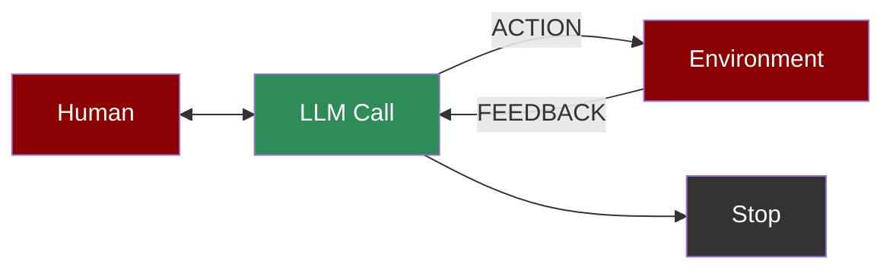

An agent-based workflow where LLMs act autonomously within a loop, interacting with their environment and receiving feedback to refine their actions and decisions.

## Quick Start

<Steps>
    <Step title="Install Package">
        First, install the PraisonAI Agents package:
        ```bash
        pip install praisonaiagents
        ```
    </Step>

    <Step title="Set API Key">
        Set your OpenAI API key as an environment variable in your terminal:
        ```bash
        export OPENAI_API_KEY=your_api_key_here
        ```
    </Step>

    <Step title="Create a file">
        Create a new file `app.py` with the basic setup:
        ```python
        from praisonaiagents import Workflow, WorkflowContext, StepResult
        from praisonaiagents.workflows import route, repeat
        import time

        # Environment state tracker
        class EnvironmentMonitor:
            def __init__(self):
                self.iteration = 0
            
            def check_state(self, ctx: WorkflowContext) -> StepResult:
                """Monitor environment and return state"""
                self.iteration += 1
                states = ["normal", "critical", "optimal"]
                state = states[self.iteration % 3]
                print(f"[{self.iteration}] Environment state: {state}")
                return StepResult(
                    output=f"state: {state}",
                    variables={"state": state, "iteration": self.iteration}
                )

        # Action handlers for different states
        def handle_normal(ctx: WorkflowContext) -> StepResult:
            return StepResult(output="Action: Maintaining current state")

        def handle_critical(ctx: WorkflowContext) -> StepResult:
            return StepResult(output="Action: Fixing critical issue!")

        def handle_optimal(ctx: WorkflowContext) -> StepResult:
            return StepResult(output="Action: Enhancing performance", stop_workflow=True)

        # Feedback processor
        def process_feedback(ctx: WorkflowContext) -> StepResult:
            state = ctx.variables.get("state", "unknown")
            feedback = "positive" if int(time.time()) % 2 == 0 else "negative"
            print(f"Feedback: {feedback}")
            return StepResult(
                output=f"Feedback processed: {feedback}",
                variables={"feedback": feedback}
            )

        # Check if we should continue
        def should_continue(ctx: WorkflowContext) -> bool:
            return ctx.variables.get("iteration", 0) < 5

        # Create monitor instance
        monitor = EnvironmentMonitor()

        # Create autonomous workflow with repeat pattern
        workflow = Workflow(
            steps=[
                repeat(
                    monitor.check_state,
                    until=lambda ctx: ctx.variables.get("state") == "optimal",
                    max_iterations=5
                ),
                route({
                    "normal": [handle_normal],
                    "critical": [handle_critical],
                    "optimal": [handle_optimal]
                }),
                process_feedback
            ]
        )

        print("\nStarting Autonomous Agent Workflow...")
        print("=" * 50)

        result = workflow.start("Monitor environment")
        print(f"\nFinal Result: {result['output']}")
        print(f"Total iterations: {result['variables'].get('iteration', 0)}")
        ```
    </Step>

    <Step title="Start Workflow">
        Type this in your terminal to run your workflow:
        ```bash
        python app.py
        ```
    </Step>
</Steps>

<Note>
  **Requirements**
  - Python 3.10 or higher
  - OpenAI API key. Generate OpenAI API key [here](https://platform.openai.com/api-keys). Use Other models using [this guide](/models).   
  - Basic understanding of Python
</Note>

## Understanding Autonomous Workflow

<Card title="What is Autonomous Workflow?" icon="question">
  Autonomous Workflow enables:
  - Continuous environment monitoring
  - Automated decision-making and action execution
  - Real-time feedback processing
  - Self-adapting behavior based on outcomes
</Card>

## Features

<CardGroup cols={2}>
  <Card title="Environment Monitoring" icon="eye">
    Continuously monitor and analyze environment state.
  </Card>
  <Card title="Adaptive Actions" icon="gears">
    Execute context-aware actions based on state analysis.
  </Card>
  <Card title="Feedback Processing" icon="rotate">
    Process and learn from action outcomes.
  </Card>
  <Card title="Self-Optimization" icon="arrow-trend-up">
    Improve performance through continuous learning.
  </Card>
</CardGroup>

## Configuration Options

```python
# Create a monitor agent
monitor = Agent(
    name="Environment Monitor",
    role="State analyzer",
    goal="Monitor and analyze state",
    tools=[get_environment_state],  # Environment monitoring tools
    verbose=True  # Enable detailed logging
)

# Create an action agent
action = Agent(
    name="Action Executor",
    role="Action performer",
    goal="Execute appropriate actions",
    tools=[perform_action]  # Action execution tools
)

# Create monitoring task
monitor_task = Task(
    name="monitor_environment",
    description="Monitor environment state",
    agent=monitor,
    is_start=True,
    task_type="decision",
    condition={
        "normal": ["execute_action"],
        "critical": ["execute_action"],
        "optimal": "exit"
    }
)

# Create feedback loop task
feedback_task = Task(
    name="process_feedback",
    description="Process and adapt",
    agent=feedback_agent,
    next_tasks=["monitor_environment"],  # Create feedback loop
    context=[monitor_task, action_task]  # Access history
)
```

## Troubleshooting

<CardGroup cols={2}>
  <Card title="Monitoring Issues" icon="triangle-exclamation">
    If monitoring fails:
    - Check environment access
    - Verify state detection
    - Enable verbose mode for debugging
  </Card>

  <Card title="Adaptation Flow" icon="diagram-project">
    If adaptation is incorrect:
    - Review feedback processing
    - Check action outcomes
    - Verify learning loop
  </Card>
</CardGroup>

## Next Steps

<CardGroup cols={2}>
  <Card title="AutoAgents" icon="robot" href="./autoagents">
    Learn about automatically created and managed AI agents
  </Card>
  <Card title="Mini Agents" icon="microchip" href="./mini">
    Explore lightweight, focused AI agents
  </Card>
</CardGroup>

<Note>
  For optimal results, ensure your environment monitoring is reliable and your feedback processing logic is properly configured for effective adaptation.
</Note>
