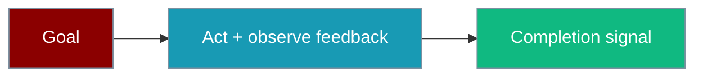
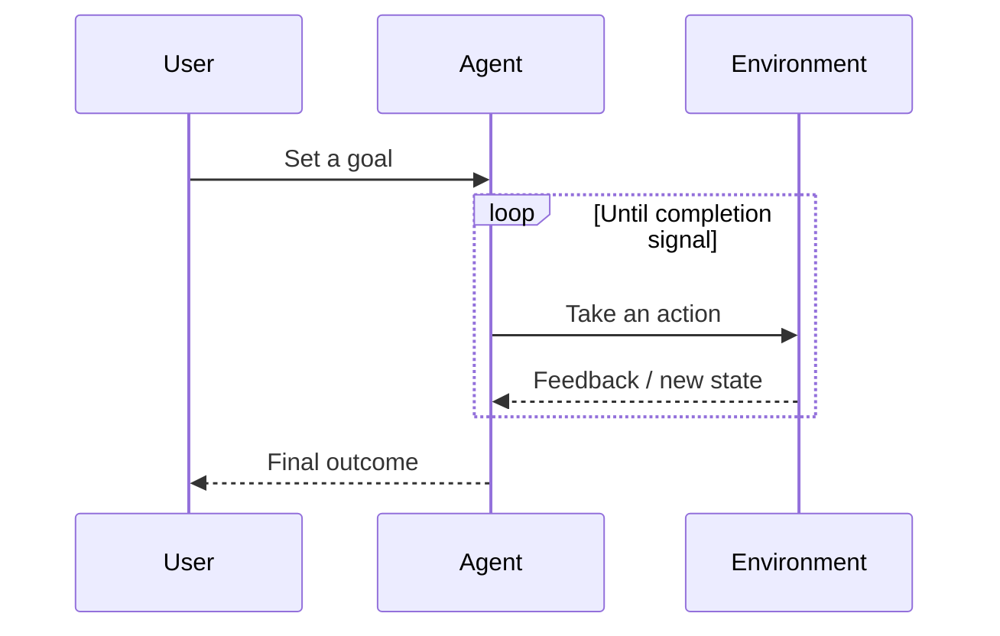
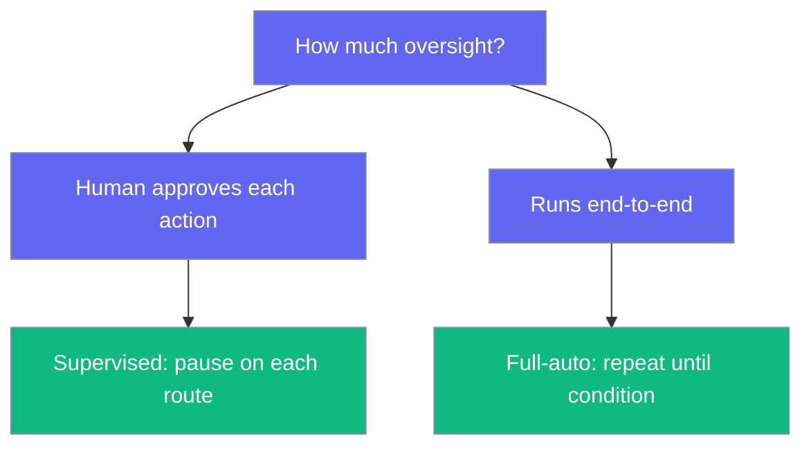

```python
from praisonaiagents import Agent

agent = Agent(name="planner", instructions="Act autonomously until the task is done.")
agent.start("Monitor the queue and clear stuck jobs.")
```

The user sets a goal; the agent loops on environment feedback until it stops or hits a completion signal.


```mermaid
graph LR
    Goal[Goal] --> Loop[Act + observe feedback]
    Loop --> Stop[Completion signal]

    classDef input fill:#8B0000,stroke:#7C90A0,color:#fff
    classDef process fill:#189AB4,stroke:#7C90A0,color:#fff
    classDef output fill:#10B981,stroke:#7C90A0,color:#fff
    class Goal input
    class Loop process
    class Stop output
```

An agent-based workflow where LLMs act autonomously within a loop, interacting with their environment and receiving feedback to refine their actions and decisions.

## Quick Start

<Steps>
    <Step title="Install Package">
        First, install the PraisonAI Agents package:
        ```bash
        pip install praisonaiagents
        ```
    </Step>

    <Step title="Set API Key">
        Set your OpenAI API key as an environment variable in your terminal:
        ```bash
        export OPENAI_API_KEY="${OPENAI_API_KEY:?Set OPENAI_API_KEY in your shell}"
        ```
    </Step>

    <Step title="Create a file">
        Create a new file `app.py` with the basic setup:
        ```python
        from praisonaiagents import Agent, AgentFlow
        from praisonaiagents import route, repeat

        # Create monitor agent that analyzes environment state
        monitor_agent = Agent(
            name="Monitor",
            role="Environment Monitor",
            goal="Monitor and analyze system state",
            instructions="Analyze the current state. Respond with ONLY 'normal', 'critical', or 'optimal'."
        )

        # Create action agents for different states
        maintenance_agent = Agent(
            name="Maintenance",
            role="System Maintainer",
            goal="Maintain normal system operations",
            instructions="Perform routine maintenance tasks. Report what was done."
        )

        emergency_agent = Agent(
            name="Emergency",
            role="Emergency Responder",
            goal="Handle critical situations",
            instructions="Address the critical issue immediately. Provide resolution steps."
        )

        optimization_agent = Agent(
            name="Optimizer",
            role="System Optimizer",
            goal="Optimize system performance",
            instructions="The system is optimal. Suggest further improvements."
        )

        # Create feedback agent
        feedback_agent = Agent(
            name="Feedback",
            role="Feedback Processor",
            goal="Process and learn from feedback",
            instructions="Analyze the action taken and provide feedback for improvement."
        )

        # Check if optimal state reached
        def is_optimal(ctx) -> bool:
            return "optimal" in ctx.previous_result.lower()

        # Create autonomous workflow
        workflow = AgentFlow(
            steps=[
                repeat(
                    monitor_agent,  # Monitor keeps checking state
                    until=is_optimal,
                    max_iterations=3
                ),
                route({
                    "normal": [maintenance_agent],
                    "critical": [emergency_agent],
                    "optimal": [optimization_agent]
                }),
                feedback_agent
            ]
        )

        result = workflow.start("Monitor the AI system health")
        print(f"Result: {result['output'][:500]}...")
        ```
    </Step>

    <Step title="Start Workflow">
        Type this in your terminal to run your workflow:
        ```bash
        python app.py
        ```
    </Step>
</Steps>

<Note>
  **Requirements**
  - Python 3.10 or higher
  - OpenAI API key. Generate OpenAI API key [here](https://platform.openai.com/api-keys). Use Other models using [this guide](/models).   
  - Basic understanding of Python
</Note>

## How It Works


```mermaid
sequenceDiagram
    participant User
    participant Agent
    participant Environment

    User->>Agent: Set a goal
    loop Until completion signal
        Agent->>Environment: Take an action
        Environment-->>Agent: Feedback / new state
    end
    Agent-->>User: Final outcome
```

| Phase | What happens |
|---|---|
| 1. Monitor | The monitor agent reads the current environment state |
| 2. Act | `route()` dispatches the matching action agent |
| 3. Adapt | Feedback feeds back into the loop via `context=` |
| 4. Stop | The loop ends when the `until` condition is met |

## Choosing an Autonomy Level

Decide how much the workflow runs without a human in the loop.


```mermaid
graph TB
    Q[How much oversight?] --> A[Human approves each action]
    Q --> B[Runs end-to-end]
    A --> R1[Supervised: pause on each route]
    B --> R2[Full-auto: repeat until condition]

    classDef decision fill:#6366F1,stroke:#7C90A0,color:#fff
    classDef option fill:#10B981,stroke:#7C90A0,color:#fff
    class Q,A,B decision
    class R1,R2 option
```

## Understanding Autonomous Workflow

<Card title="What is Autonomous Workflow?" icon="question">
  Autonomous Workflow enables:
  - Continuous environment monitoring
  - Automated decision-making and action execution
  - Real-time feedback processing
  - Self-adapting behavior based on outcomes
</Card>

## Features

<CardGroup cols={2}>
  <Card title="Environment Monitoring" icon="eye">
    Continuously monitor and analyze environment state.
  </Card>
  <Card title="Adaptive Actions" icon="gears">
    Execute context-aware actions based on state analysis.
  </Card>
  <Card title="Feedback Processing" icon="rotate">
    Process and learn from action outcomes.
  </Card>
  <Card title="Self-Optimization" icon="arrow-trend-up">
    Improve performance through continuous learning.
  </Card>
</CardGroup>

## Configuration Options

```python
# Create a monitor agent
monitor = Agent(
    name="Environment Monitor",
    role="State analyzer",
    goal="Monitor and analyze state",
    tools=[get_environment_state],  # Environment monitoring tools
      # Enable detailed logging
)

# Create an action agent
action = Agent(
    name="Action Executor",
    role="Action performer",
    goal="Execute appropriate actions",
    tools=[perform_action]  # Action execution tools
)

# Create monitoring task
monitor_task = Task(
    name="monitor_environment",
    description="Monitor environment state",
    agent=monitor,
    is_start=True,
    task_type="decision",
    condition={
        "normal": ["execute_action"],
        "critical": ["execute_action"],
        "optimal": "exit"
    }
)

# Create feedback loop task
feedback_task = Task(
    name="process_feedback",
    description="Process and adapt",
    agent=feedback_agent,
    next_tasks=["monitor_environment"],  # Create feedback loop
    context=[monitor_task, action_task]  # Access history
)
```

## Troubleshooting

<CardGroup cols={2}>
  <Card title="Monitoring Issues" icon="triangle-exclamation">
    If monitoring fails:
    - Check environment access
    - Verify state detection
    - Enable verbose mode for debugging
  </Card>

  <Card title="Adaptation Flow" icon="diagram-project">
    If adaptation is incorrect:
    - Review feedback processing
    - Check action outcomes
    - Verify learning loop
  </Card>
</CardGroup>

## Best Practices

<AccordionGroup>
  <Accordion title="Keep monitor instructions deterministic">
    The monitor agent should return only discrete states (`normal`, `critical`, `optimal`). Vague prose breaks `route()` matching and causes wrong action agents to run.
  </Accordion>
  <Accordion title="Cap repeat iterations">
    Always set `max_iterations` on `repeat()` loops. Without a ceiling, a misconfigured `until` condition can spin indefinitely and burn tokens.
  </Accordion>
  <Accordion title="Wire feedback into the loop">
    Pass prior task outputs via `context=[...]` on the feedback step so the agent learns from outcomes rather than re-analysing from scratch each cycle.
  </Accordion>
  <Accordion title="Start with verbose logging">
    Enable verbose output while tuning routes and exit conditions. Once the workflow stabilises, reduce logging for production runs.
  </Accordion>
</AccordionGroup>

## Next Steps

<CardGroup cols={2}>
  <Card title="AutoAgents" icon="robot" href="./autoagents">
    Learn about automatically created and managed AI agents
  </Card>
  <Card title="Mini Agents" icon="microchip" href="./mini">
    Explore lightweight, focused AI agents
  </Card>
</CardGroup>

<Note>
  For optimal results, ensure your environment monitoring is reliable and your feedback processing logic is properly configured for effective adaptation.
</Note>

## Related

<CardGroup cols={2}>
  <Card icon="rotate" href="/features/autonomy-loop">
    Run agents in iterative self-referential loops with completion signals.
  </Card>
  <Card icon="robot" href="/features/autoagents">
    Auto-create and manage agents and tasks from high-level instructions.
  </Card>
</CardGroup>
