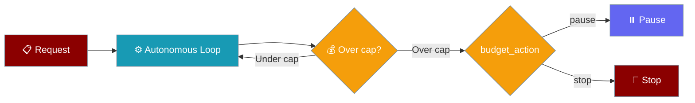

Autonomy budgets cap how much money and how many tokens an autonomous run can spend, pausing or stopping the loop when a cap is hit.

```python
from praisonaiagents import Agent, AutonomyConfig

agent = Agent(
    name="Repo Cleaner",
    instructions="Tidy the repo, run tests, open a PR.",
    autonomy=AutonomyConfig(
        max_budget_usd=0.50,      # stop after 50 cents of spend
        max_tokens=100_000,       # or 100k tokens, whichever first
        budget_action="pause",    # recoverable pause (default)
    ),
)

result = agent.run_autonomous("Clean up the repo and open a PR.")

if result.completion_reason == "budget_exhausted":
    print(f"Paused at ${result.metadata['spend_usd']:.4f} / {result.metadata['tokens']} tokens.")
```

The user caps the spend on an autonomous task; the loop checks cumulative cost after each iteration and pauses (or stops) the moment a cap is reached.



## Quick Start

<Steps>
<Step title="USD cap">

Cap spend in dollars — the run pauses once cumulative cost passes the cap.

```python
from praisonaiagents import Agent, AutonomyConfig

agent = Agent(
    name="Worker",
    instructions="Complete the task autonomously.",
    autonomy=AutonomyConfig(max_budget_usd=0.50),
)

result = agent.run_autonomous("Refactor the auth module.")
```

</Step>

<Step title="Token cap">

Cap total tokens (input + output) instead of — or alongside — dollars.

```python
from praisonaiagents import Agent, AutonomyConfig

agent = Agent(
    name="Worker",
    instructions="Complete the task autonomously.",
    autonomy=AutonomyConfig(max_tokens=100_000),
)

result = agent.run_autonomous("Refactor the auth module.")
```

</Step>

<Step title="Pause and resume">

With `budget_action="pause"` (the default), inspect the spend, raise the cap, and re-invoke to continue.

```python
from praisonaiagents import Agent, AutonomyConfig

agent = Agent(
    name="Worker",
    instructions="Complete the task autonomously.",
    autonomy=AutonomyConfig(
        max_budget_usd=0.50,
        budget_action="pause",
    ),
)

result = agent.run_autonomous("Clean up the repo and open a PR.")

if result.completion_reason == "budget_exhausted":
    print(f"Paused at ${result.metadata['spend_usd']:.4f}")
    # Raise the cap and resume:
    agent.autonomy.max_budget_usd = 1.00
    result = agent.run_autonomous("Continue where you left off.")
```

</Step>
</Steps>

---

## How It Works

The loop reads per-run spend after each iteration, subtracts the spend recorded at loop start (so a reused agent's prior lifetime cost isn't counted), and returns `budget_exhausted` the moment a cap is crossed.

```mermaid
sequenceDiagram
    participant User
    participant Agent
    participant Loop as Autonomous Loop

    User->>Agent: run_autonomous(task)
    Note over Loop: snapshot spend baseline at start
    loop Each iteration
        Loop->>Agent: execute turn
        Agent-->>Loop: response + cost/tokens
        Loop->>Loop: cumulative = current - baseline
        alt cumulative over cap
            Loop-->>User: AutonomyResult(budget_exhausted)
        else under cap
            Loop->>Loop: continue
        end
    end
```

| Step | What happens |
|---|---|
| 1. Baseline | Spend and tokens are snapshotted at loop start |
| 2. Execute | The agent runs one iteration |
| 3. Check | Cumulative spend (current − baseline) is compared to the caps |
| 4. Decide | Over a cap → `budget_exhausted`; `budget_action` sets pause vs stop |

<Note>
The baseline subtraction means caps are **per run**, not per agent lifetime. Reusing the same `Agent` across runs starts each run's budget from zero.
</Note>

---

## Configuration Options

| Option | Type | Default | Description |
|--------|------|---------|-------------|
| `max_budget_usd` | `Optional[float]` | `None` | Cumulative USD spend cap for the run. `None` = unlimited. |
| `max_tokens` | `Optional[int]` | `None` | Cumulative token cap (input + output). `None` = unlimited. |
| `budget_action` | `str` | `"pause"` | `"pause"` (recoverable) or `"stop"` (terminal) when a cap is hit. |

Unset caps default to unlimited — adding these fields to an existing config changes nothing until you set a value.

---

## Completion outcome

On `budget_exhausted`, `AutonomyResult` returns the partial output and a populated `metadata` dict.

```python
AutonomyResult(
    success=False,
    output="<partial output so far>",
    completion_reason="budget_exhausted",
    iterations=7,
    stage="direct",
    actions=[...],
    metadata={
        "spend_usd": 0.4231,     # USD spent this run
        "tokens": 12345,         # tokens used this run
        "max_budget_usd": 0.50,  # the configured USD cap (or None)
        "max_tokens": None,      # the configured token cap (or None)
        "status": "paused",      # "paused" if budget_action="pause", else "stopped"
    },
)
```

| `metadata` key | Meaning |
|---|---|
| `spend_usd` | USD spent during this run |
| `tokens` | Tokens used during this run |
| `max_budget_usd` | The configured USD cap (or `None`) |
| `max_tokens` | The configured token cap (or `None`) |
| `status` | `"paused"` (resumable) or `"stopped"` (terminal) |

---

## `TerminationReason` and `RunStatus`

`completion_reason` is typed by the public `TerminationReason` enum — string values are unchanged, so existing string comparisons keep working.

```python
from praisonaiagents import TerminationReason, termination_to_run_status

TerminationReason.BUDGET_EXHAUSTED        # == "budget_exhausted"
termination_to_run_status(TerminationReason.BUDGET_EXHAUSTED)  # "failure"
```

`termination_to_run_status(...)` maps a termination reason onto the shared `RunStatus` vocabulary. `budget_exhausted` maps to `failure`, so it's caught by any generic failure handling.

---

## Common Patterns

### Pause and resume with a raised cap

```python
from praisonaiagents import Agent, AutonomyConfig

agent = Agent(
    name="Worker",
    instructions="Complete the task autonomously.",
    autonomy=AutonomyConfig(max_budget_usd=0.50, budget_action="pause"),
)

result = agent.run_autonomous("Do the work.")
while result.completion_reason == "budget_exhausted":
    agent.autonomy.max_budget_usd += 0.50   # grant more budget
    result = agent.run_autonomous("Continue where you left off.")
```

### Hard stop for CI-only runs

```python
from praisonaiagents import Agent, AutonomyConfig

agent = Agent(
    name="CI Agent",
    instructions="Run the checks and stop.",
    autonomy=AutonomyConfig(max_budget_usd=0.25, budget_action="stop"),
)

result = agent.run_autonomous("Run the test suite and report failures.")
```

### Combined USD + token caps

```python
from praisonaiagents import Agent, AutonomyConfig

agent = Agent(
    name="Worker",
    instructions="Complete the task autonomously.",
    autonomy=AutonomyConfig(
        max_budget_usd=1.00,   # billing safety
        max_tokens=200_000,    # latency safety
    ),
)

result = agent.run_autonomous("Do the work.")  # whichever cap triggers first
```

### Async parity

```python
import asyncio
from praisonaiagents import Agent, AutonomyConfig

async def main():
    agent = Agent(
        name="Async Worker",
        instructions="Complete the task autonomously.",
        autonomy=AutonomyConfig(max_budget_usd=0.50),
    )
    result = await agent.run_autonomous_async("Do the work.")
    print(result.completion_reason)

asyncio.run(main())
```

---

## Best Practices

<AccordionGroup>
<Accordion title="Pick pause for interactive flows, stop for CI">
Use `budget_action="pause"` when a human can raise the cap and resume. Use `"stop"` as a hard kill-switch in CI or unattended jobs where no resume is expected.
</Accordion>

<Accordion title="Set both caps">
`max_budget_usd` is your billing safety net; `max_tokens` is your latency safety net. Setting both stops on whichever triggers first.
</Accordion>

<Accordion title="Reused agents are capped per run">
The loop subtracts a baseline taken at start, so caps apply to the current run only — prior lifetime spend on a reused `Agent` isn't counted.
</Accordion>

<Accordion title="Validate cost accounting for local models">
USD accounting depends on the LLM returning cost data. For local or self-hosted models that report no cost, lean on `max_tokens` instead of `max_budget_usd`.
</Accordion>
</AccordionGroup>

---

## Related

<CardGroup cols={2}>
  <Card title="Autonomy Loop" icon="rotate" href="/docs/features/autonomy-loop">
    Iterative autonomous loops and completion reasons
  </Card>
  <Card title="Agent Max Budget" icon="wallet" href="/docs/features/agent-max-budget">
    The `ExecutionConfig`-based budget for any run
  </Card>
</CardGroup>
