Autonomous loops let agents work iteratively on complex tasks, automatically stopping when they signal completion or reach limits.

```mermaid
flowchart LR
    A[Start Loop] --> B[Execute Task]
    B --> S[Auto-Save Session]
    S --> C{Check Completion}
    C -->|Promise Found| D[✅ Success]
    C -->|Max Iterations| E[⚠️ Limit Reached]
    C -->|Doom Loop| F[🛑 Stopped]
    C -->|Continue| G[Clear Context?]
    G -->|Yes| H[Reset Memory]
    G -->|No| B
    H --> B
    
    style A fill:#8B0000,color:#fff
    style S fill:#F59E0B,color:#fff
    style D fill:#189AB4,color:#fff
    style E fill:#189AB4,color:#fff
    style F fill:#189AB4,color:#fff
```



## Quick Start

<CodeGroup>
```python Simplest (Unified API)
from praisonaiagents import Agent

# Just set autonomy=True and call start() - that's it!
agent = Agent(
    name="builder",
    instructions="Build the requested feature",
    autonomy=True
)

result = agent.start("Create a REST API with user authentication")

print(f"Success: {result.success}")
print(f"Iterations: {result.iterations}")
```

```python With Config
from praisonaiagents import Agent

agent = Agent(
    name="builder",
    instructions="""Build the feature. When done, output:
    <promise>DONE</promise>""",
    autonomy={
        "max_iterations": 20,
        "completion_promise": "DONE",
    }
)

# start() automatically uses the autonomous loop!
result = agent.start("Create a calculator module")
```

```python With Context Clearing
from praisonaiagents import Agent

agent = Agent(
    name="builder",
    instructions="Work on the task. Use files for state.",
    autonomy={
        "max_iterations": 15,
        "completion_promise": "COMPLETE",
        "clear_context": True,  # Fresh memory each iteration
    }
)

result = agent.start("Refactor the auth module")
```
</CodeGroup>

<Tip>
**Unified API**: When `autonomy=True`, `agent.start()` automatically runs the autonomous loop. No need to call `run_autonomous()` separately!
</Tip>

## How It Works

```mermaid
sequenceDiagram
    participant U as User
    participant A as Agent
    participant L as LLM
    participant S as State
    
    U->>A: agent.start(prompt)
    Note over A: autonomy=True detected
    A->>A: Route to autonomous loop
    loop Each Iteration
        A->>L: Send prompt
        L->>A: Response
        A->>A: Check for promise tag
        alt Promise found
            A->>U: ✅ Success
        else Max iterations
            A->>U: ⚠️ Limit reached
        else Doom loop
            A->>U: 🛑 Stopped
        else Continue
            A->>S: Clear context (optional)
            A->>A: Next iteration
        end
    end
    
    style U fill:#8B0000,color:#fff
    style A fill:#8B0000,color:#fff
    style L fill:#189AB4,color:#fff
    style S fill:#189AB4,color:#fff
```

## Key Features

<CardGroup cols={2}>
  <Card title="Completion Promise" icon="flag-checkered">
    Agent signals "done" with a promise tag containing TEXT
  </Card>
  <Card title="Context Clearing" icon="eraser">
    Fresh memory each iteration forces file-based state
  </Card>
  <Card title="Doom Loop Detection" icon="shield">
    Automatically stops on repeated identical actions
  </Card>
  <Card title="Iteration Limits" icon="stopwatch">
    Prevents runaway execution with configurable max
  </Card>
</CardGroup>

## Configuration

### AutonomyConfig Options

| Option | Type | Default | Description |
|--------|------|---------|-------------|
| `max_iterations` | int | 20 | Maximum loop iterations |
| `completion_promise` | str | None | Text to detect in promise tags |
| `clear_context` | bool | False | Clear chat history between iterations |
| `doom_loop_threshold` | int | 3 | Repeated actions before stopping |
| `level` | str | `"suggest"` | Autonomy level: `suggest`, `auto_edit`, `full_auto` |
| `auto_escalate` | bool | True | Automatically escalate task complexity |
| `observe` | bool | False | Emit observability events |

### Using Config Dict

```python
agent = Agent(
    name="worker",
    instructions="Complete the task",
    autonomy={
        "max_iterations": 30,
        "completion_promise": "FINISHED",
        "clear_context": True,
        "doom_loop_threshold": 5
    }
)
```

## CLI Usage

<Tabs>
  <Tab title="Basic">
    ```bash
    praisonai loop "Build a REST API" -n 5
    ```
  </Tab>
  <Tab title="With Promise">
    ```bash
    praisonai loop "Refactor auth module" -p DONE -v
    ```
  </Tab>
  <Tab title="With Context Clearing">
    ```bash
    praisonai loop "Implement feature X" -p COMPLETE -c -n 20
    ```
  </Tab>
  <Tab title="With Timeout">
    ```bash
    praisonai loop "Debug the issue" -t 300 -v
    ```
  </Tab>
</Tabs>

### CLI Options

| Flag | Description |
|------|-------------|
| `-n, --max-iterations` | Maximum iterations (default: 10) |
| `-p, --completion-promise` | Promise text to signal completion |
| `-c, --clear-context` | Clear chat history between iterations |
| `-t, --timeout` | Timeout in seconds |
| `-m, --model` | LLM model to use |
| `-v, --verbose` | Show verbose output |

## Result Object

```python
result = agent.start(prompt)  # when autonomy=True

# Available fields
result.success          # bool - Task completed successfully
result.output           # str - Final response
result.completion_reason # str - "promise", "goal", "max_iterations", "doom_loop", "timeout", "error"
result.iterations       # int - Number of iterations executed
result.duration_seconds # float - Total execution time
result.started_at       # str - ISO 8601 timestamp when execution started
result.actions          # list - Actions taken each iteration
result.error            # str | None - Error message if failed
```

## Completion Reasons

<AccordionGroup>
  <Accordion title="promise">
    Agent output contained a promise tag with TEXT matching the configured promise.
  </Accordion>
  <Accordion title="goal">
    Agent output contained completion keywords like "task completed" or "done".
  </Accordion>
  <Accordion title="max_iterations">
    Reached the maximum iteration limit without completion signal.
  </Accordion>
  <Accordion title="doom_loop">
    Detected repeated identical actions (agent stuck in a loop).
  </Accordion>
  <Accordion title="timeout">
    Execution exceeded the configured timeout.
  </Accordion>
  <Accordion title="needs_help">
    Doom loop recovery exhausted — task needs human guidance.
  </Accordion>
  <Accordion title="error">
    An error occurred during execution.
  </Accordion>
</AccordionGroup>

## Best Practices

<Steps>
  <Step title="Use Completion Promises">
    Always set a `completion_promise` for reliable termination instead of relying on keyword detection.
  </Step>
  <Step title="Enable Context Clearing for Long Tasks">
    Use `clear_context=True` for tasks that should rely on file state rather than conversation memory.
  </Step>
  <Step title="Set Reasonable Limits">
    Configure `max_iterations` based on task complexity. Start low and increase if needed.
  </Step>
  <Step title="Include Promise in Instructions">
    Tell the agent to output the promise tag when done:
    ```python
    instructions="When finished, output DONE in a promise tag"
    ```
  </Step>
</Steps>

## Async Execution

Run autonomous loops asynchronously for concurrent agent execution:


<CodeGroup>
```python Single Async Agent (Unified API)
import asyncio
from praisonaiagents import Agent

async def main():
    agent = Agent(
        name="async_worker",
        instructions="Complete the task. Output <promise>DONE</promise> when finished.",
        autonomy={
            "max_iterations": 10,
            "completion_promise": "DONE",
        }
    )
    
    # astart() automatically uses autonomous loop when autonomy=True
    result = await agent.astart("Build a calculator")
    
    print(f"Success: {result.success}")
    print(f"Started: {result.started_at}")

asyncio.run(main())
```

```python Concurrent Agents
import asyncio
from praisonaiagents import Agent

async def main():
    agent1 = Agent(
        name="researcher", 
        instructions="Research the topic", 
        autonomy={"completion_promise": "DONE"}
    )
    agent2 = Agent(
        name="writer", 
        instructions="Write content", 
        autonomy={"completion_promise": "DONE"}
    )
    
    # Run both agents concurrently with unified API
    results = await asyncio.gather(
        agent1.astart("Research AI trends"),
        agent2.astart("Write a blog post")
    )
    
    for i, result in enumerate(results):
        print(f"Agent {i+1}: {result.completion_reason}")

asyncio.run(main())
```
</CodeGroup>

<Note>
When `autonomy=True`, `astart()` automatically routes to the async autonomous loop, enabling true concurrent execution of multiple agents.
</Note>

## Memory Integration

Autonomous loops automatically save sessions between iterations when memory is enabled. This ensures progress is persisted even if the loop is interrupted.

```mermaid
sequenceDiagram
    participant A as Agent
    participant L as LLM
    participant M as Memory/Session
    
    loop Each Iteration
        A->>L: Send prompt
        L->>A: Response
        A->>M: _auto_save_session()
        A->>A: Check completion
    end
    
    style A fill:#8B0000,color:#fff
    style L fill:#189AB4,color:#fff
    style M fill:#F59E0B,color:#fff
```

```python
from praisonaiagents import Agent

agent = Agent(
    name="persistent_worker",
    instructions="Work on the task. Output <promise>DONE</promise> when finished.",
    autonomy={
        "completion_promise": "DONE",
        "max_iterations": 20,
    },
    memory=True,
    auto_save="project_session",
)

# Unified API — start() handles everything!
result = agent.start("Refactor the auth module")
# Session is auto-saved after every iteration
```

<Note>
`_auto_save_session()` is a no-op when memory or auto_save is not configured, so there is zero overhead for agents without memory.
</Note>

## Example: Self-Improving Code

```python
from praisonaiagents import Agent

agent = Agent(
    name="improver",
    instructions="""You are a code improvement agent.
    
    1. Read the current code
    2. Identify one improvement
    3. Make the change
    4. Verify it works
    5. If no more improvements needed, output <promise>OPTIMIZED</promise>
    """,
    autonomy={
        "max_iterations": 10,
        "completion_promise": "OPTIMIZED",
        "clear_context": True,
    },
    tools=[read_file, write_file, run_tests]
)

# Just call start() - autonomy config handles everything!
result = agent.start("Optimize the performance of src/utils.py")

if result.success:
    print(f"Code optimized in {result.iterations} iterations")
    print(f"Started: {result.started_at}")
else:
    print(f"Stopped: {result.completion_reason}")
```

## Related

<CardGroup cols={2}>
  <Card title="Autonomy Concepts" icon="robot" href="/concepts/autonomy">
    Core autonomy configuration
  </Card>
  <Card title="Background Tasks" icon="clock" href="/features/background-tasks">
    Run agents in the background
  </Card>
</CardGroup>
