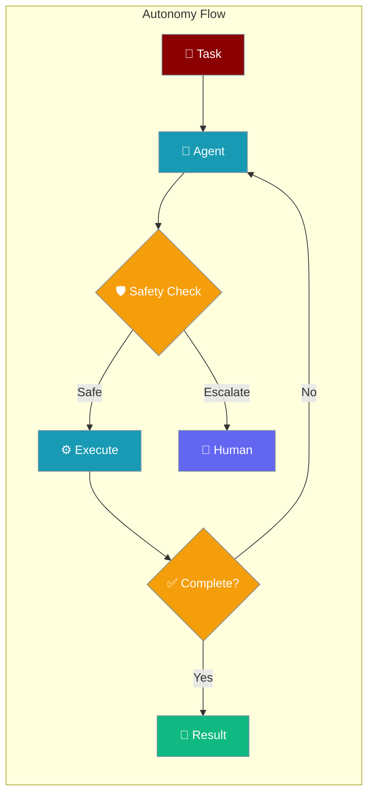
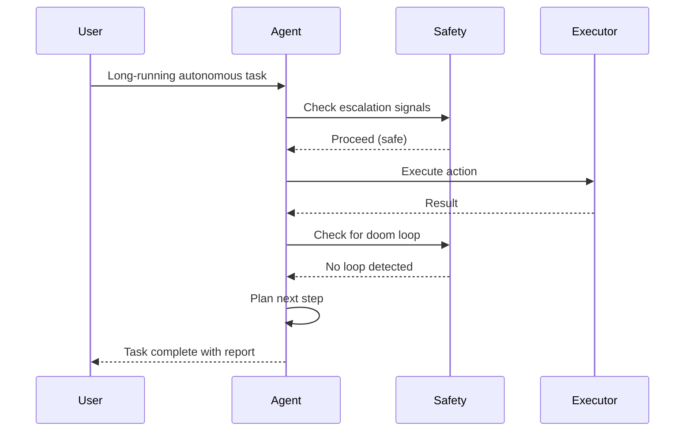
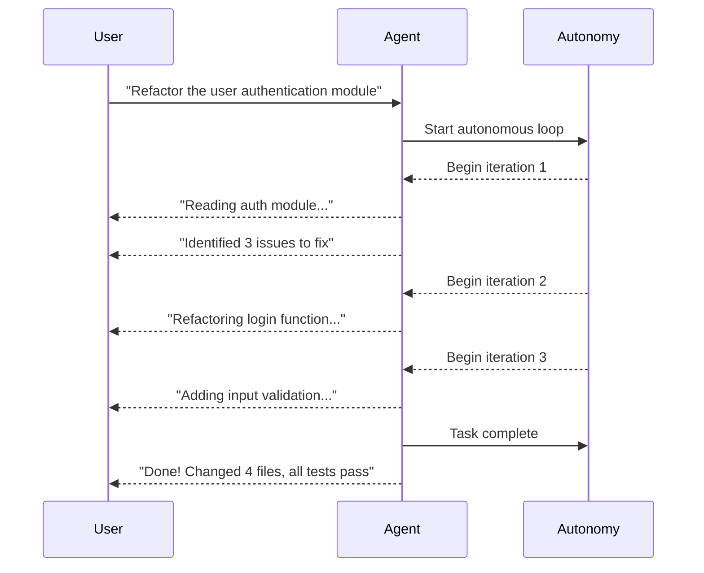
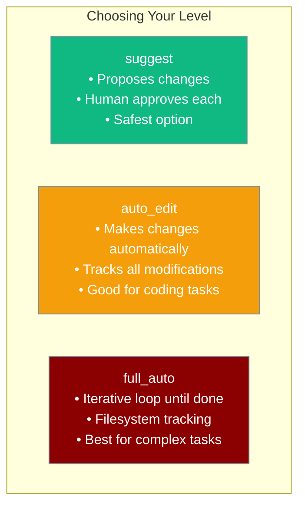

Autonomy gives agents the ability to run complex, multi-step tasks independently with built-in safety rails.



## Quick Start

<Steps>
<Step title="Enable Autonomy">
Add `autonomy=True` to activate autonomous mode with safe defaults:

```python
from praisonaiagents import Agent

agent = Agent(
    name="Code Agent",
    instructions="Analyse and improve the given code",
    autonomy=True
)

result = agent.start("Refactor the authentication module for better security")
```
</Step>

<Step title="With Autonomy Level">
Choose the autonomy level that matches your trust requirements:

```python
from praisonaiagents import Agent

# Suggest only — agent proposes changes, human approves
agent = Agent(autonomy="suggest", instructions="Review the codebase")

# Auto-edit — agent makes changes automatically
agent = Agent(autonomy="auto_edit", instructions="Fix all linting errors")

# Full auto — iterative loop until task is complete
agent = Agent(autonomy="full_auto", instructions="Build the feature end-to-end")
```
</Step>

<Step title="With Full Configuration">
Fine-tune every aspect of autonomous operation:

```python
from praisonaiagents import Agent, AutonomyConfig

agent = Agent(
    name="Dev Agent",
    instructions="Implement the requested feature",
    autonomy=AutonomyConfig(
        level="auto_edit",
        max_iterations=30,
        doom_loop_threshold=5,
        auto_escalate=True,
        track_changes=True,
    )
)

result = agent.start("Add input validation to the signup form")
print(result)
```
</Step>
</Steps>

---

## How It Works



| Stage | What happens |
|-------|-------------|
| **Receive** | Agent receives a complex, open-ended task |
| **Plan** | Agent determines the sequence of actions needed |
| **Safety check** | Escalation and doom loop detection run before each action |
| **Execute** | Agent performs the action (edit file, run command, call API) |
| **Iterate** | Agent reviews result and plans the next step |
| **Complete** | Agent stops when done or when `max_iterations` is reached |

---

## User Interaction Flow



---

## Autonomy Levels



---

## Configuration Options

| Option | Type | Default | Description |
|--------|------|---------|-------------|
| `level` | `str` | `"suggest"` | Autonomy level: `suggest`, `auto_edit`, `full_auto` |
| `mode` | `str` | `None` | Execution mode: `caller` or `iterative` (auto-selected based on level) |
| `max_iterations` | `int` | `20` | Maximum iterations before stopping |
| `doom_loop_threshold` | `int` | `3` | Repeated actions before doom loop is detected |
| `auto_escalate` | `bool` | `True` | Automatically escalate complex/ambiguous situations |
| `observe` | `bool` | `False` | Emit observability events for monitoring |
| `completion_promise` | `str` | `None` | Signal word that indicates task completion |
| `clear_context` | `bool` | `False` | Clear chat history between iterations |
| `track_changes` | `bool` | `None` | Track filesystem changes (auto-enabled for `full_auto`) |
| `snapshot_dir` | `str` | `None` | Directory for storing snapshots (default: `~/.praisonai/snapshots`) |

### Precedence Ladder

```python
# Level 1: Bool (suggest mode)
agent = Agent(autonomy=True)

# Level 2: String (specific level)
agent = Agent(autonomy="full_auto")

# Level 3: Dict
agent = Agent(autonomy={"level": "auto_edit", "max_iterations": 30})

# Level 4: Config class (full control)
agent = Agent(autonomy=AutonomyConfig(
    level="full_auto",
    max_iterations=50,
    doom_loop_threshold=5,
))
```

---

## Common Patterns

### Suggest Mode for Code Reviews

```python
from praisonaiagents import Agent

agent = Agent(
    name="Code Reviewer",
    instructions="Review this code and suggest improvements with explanations",
    autonomy="suggest"
)

agent.start("Review the payment processing module")
```

### Auto-Edit for CI/CD Pipelines

```python
from praisonaiagents import Agent, AutonomyConfig

agent = Agent(
    name="CI Agent",
    instructions="Fix all failing tests automatically",
    autonomy=AutonomyConfig(
        level="auto_edit",
        max_iterations=20,
        auto_escalate=True,
        track_changes=True,
    )
)

agent.start("Fix the failing unit tests in the auth module")
```

### Full Auto with Safety Limits

```python
from praisonaiagents import Agent, AutonomyConfig

agent = Agent(
    name="Dev Agent",
    instructions="Implement the feature described in the issue",
    autonomy=AutonomyConfig(
        level="full_auto",
        max_iterations=50,
        doom_loop_threshold=5,
        completion_promise="IMPLEMENTATION_COMPLETE",
    )
)

result = agent.start("Issue #42: Add two-factor authentication support")
print(result)
```

---

## Best Practices

<AccordionGroup>
<Accordion title="Start with suggest mode, escalate as needed">
Begin with `autonomy="suggest"` to understand how the agent behaves, then upgrade to `auto_edit` or `full_auto` once you're confident.

```python
# Start here
agent = Agent(autonomy="suggest")

# Upgrade when ready
agent = Agent(autonomy="full_auto")
```
</Accordion>

<Accordion title="Set realistic max_iterations">
Too few iterations may leave tasks incomplete. Too many wastes tokens. Start with 20 and tune based on task complexity.

```python
# Simple tasks
agent = Agent(autonomy=AutonomyConfig(max_iterations=10))

# Complex refactoring
agent = Agent(autonomy=AutonomyConfig(max_iterations=50))
```
</Accordion>

<Accordion title="Enable track_changes for reversibility">
With `track_changes=True`, every file modification is tracked. You can undo changes if something goes wrong.

```python
agent = Agent(autonomy=AutonomyConfig(
    level="auto_edit",
    track_changes=True,
))
```
</Accordion>

<Accordion title="Use completion_promise for reliable termination">
Without a completion signal, agents may continue iterating. Set a `completion_promise` to give the agent a clear exit condition.

```python
agent = Agent(
    autonomy=AutonomyConfig(
        level="full_auto",
        completion_promise="TASK_DONE",
    ),
    instructions="... When finished, write 'TASK_DONE' in your response"
)
```
</Accordion>
</AccordionGroup>

---

## Related

<CardGroup cols={2}>
<Card title="Planning" icon="list-check" href="/docs/features/planning">
  Break tasks into steps before executing
</Card>
<Card title="Doom Loop Detection" icon="shield" href="/docs/features/doom-loop-detection">
  Detect and break out of infinite loops
</Card>
<Card title="Approval" icon="check-circle" href="/docs/features/approval">
  Human-in-the-loop approval workflows
</Card>
<Card title="Escalation Pipeline" icon="alert-triangle" href="/docs/features/escalation-pipeline">
  Escalate complex tasks to humans automatically
</Card>
</CardGroup>
