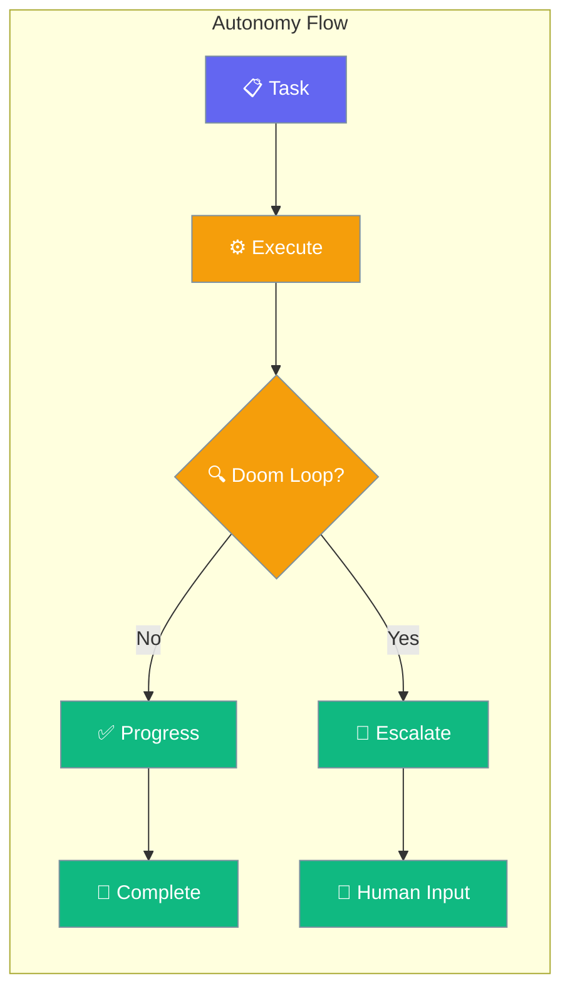
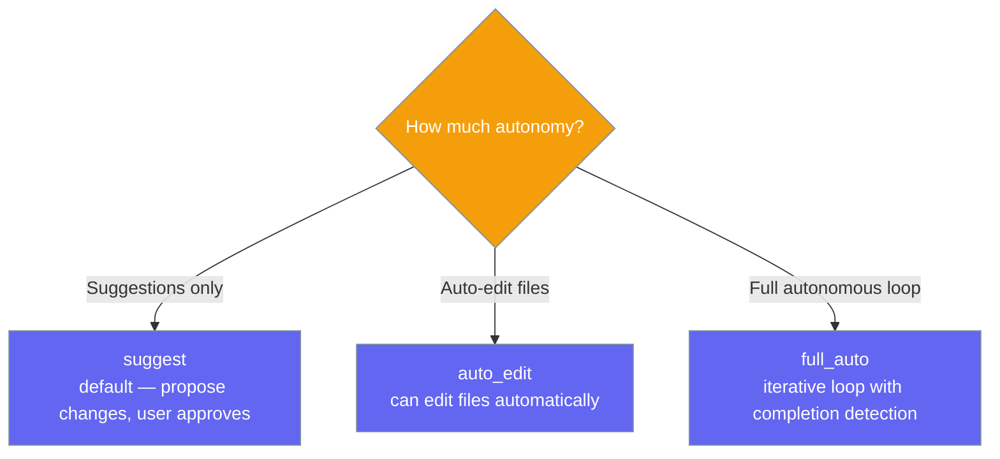
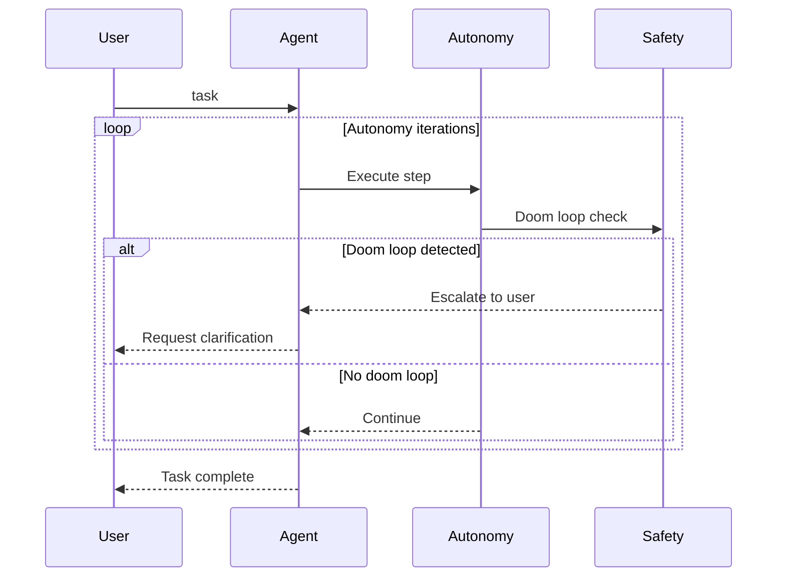
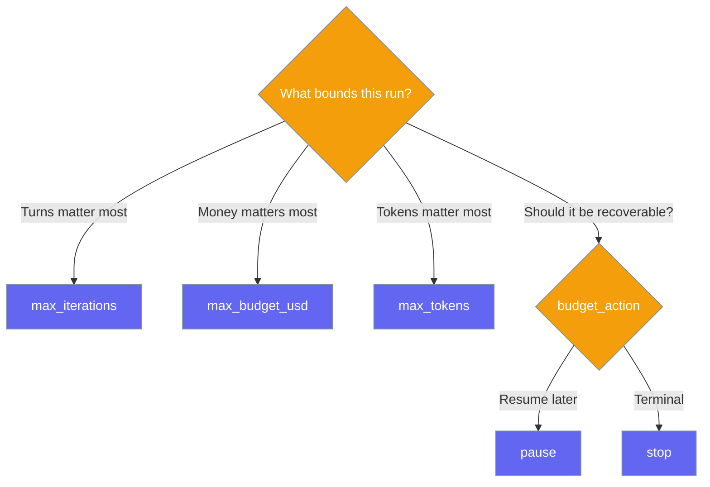
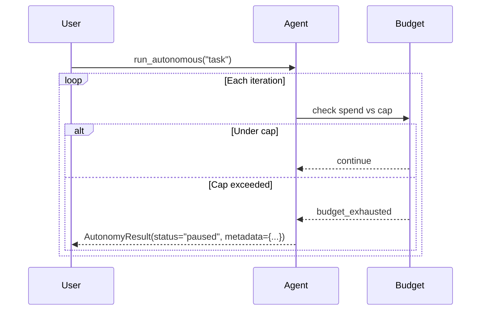

Autonomy lets agents operate independently — detecting doom loops, escalating when stuck, and optionally running in a full-auto iterative mode.

```python
from praisonaiagents import Agent

agent = Agent(
    name="Assistant",
    instructions="You are an autonomous coding assistant.",
    autonomy=True,
)

agent.start("Refactor the authentication module to use JWT tokens.")
```
The user delegates a coding task; the agent works independently, detects doom loops, and escalates to a human when stuck.




## Quick Start

<Steps>
<Step title="Level 1 — Bool (simplest)">

Turn on autonomy with a single flag — defaults to the safe `suggest` level.

```python
from praisonaiagents import Agent

agent = Agent(
    name="Coder",
    instructions="You are an autonomous task-completion agent.",
    autonomy=True,
)
agent.start("Write and test a Python function to merge sorted arrays.")
```
</Step>

<Step title="Level 2 — String (pick a level)">

Pass a level name to unlock more independence.

```python
from praisonaiagents import Agent

agent = Agent(
    name="Coder",
    instructions="You are an autonomous coding agent.",
    autonomy="full_auto",
)
agent.start("Build a REST API endpoint for user authentication.")
```
</Step>

<Step title="Level 3 — Config class (full control)">

Use `AutonomyConfig` to tune iteration caps, doom-loop detection, and escalation.

```python
from praisonaiagents import Agent, AutonomyConfig

agent = Agent(
    name="Coder",
    instructions="You are a precise autonomous agent.",
    autonomy=AutonomyConfig(
        level="auto_edit",
        max_iterations=30,
        doom_loop_threshold=5,
        auto_escalate=True,
    ),
)
agent.start("Review and improve the test coverage for the payment module.")
```
</Step>
</Steps>

---

## Autonomy Levels



---

## How It Works



| Phase | What happens |
|---|---|
| 1. Execute | Agent takes action toward the goal |
| 2. Safety check | Doom loop tracker monitors for repeated identical actions |
| 3. Escalate | If stuck, agent asks user for guidance instead of looping |
| 4. Complete | Iterative mode detects task completion signal |

---

## Configuration Options

<Card icon="code" href="/docs/sdk/reference/python/AutonomyConfig">
  Full list of options, types, and defaults — `AutonomyConfig`
</Card>

The most common options at a glance:

| Option | Type | Default | Description |
|---|---|---|---|
| `level` | `str` | `"suggest"` | `"suggest"`, `"auto_edit"`, or `"full_auto"` |
| `max_iterations` | `int` | `20` | Max iterations before stopping |
| `doom_loop_threshold` | `int` | `3` | Repeated actions before doom loop detection |
| `auto_escalate` | `bool` | `True` | Automatically escalate when stuck |
| `completion_promise` | `str \| None` | `None` | Signal text that marks task completion |
| `max_budget_usd` | `float \| None` | `None` | Hard USD cap for this run. `None` = unlimited |
| `max_tokens` | `int \| None` | `None` | Hard token cap (in + out) for this run. `None` = unlimited |
| `budget_action` | `str` | `"pause"` | `"pause"` (recoverable) or `"stop"` (terminal) when a cap is hit |

---

## Common Patterns

### Pattern 1 — Auto-edit mode for coding tasks
```python
from praisonaiagents import Agent, AutonomyConfig

agent = Agent(
    instructions="You are a senior software engineer.",
    autonomy=AutonomyConfig(
        level="auto_edit",
        max_iterations=15,
        doom_loop_threshold=3,
    ),
)
response = agent.start("Add input validation to all API endpoints in the users module.")
print(response)
```

### Pattern 2 — Full-auto iterative mode
```python
from praisonaiagents import Agent, AutonomyConfig

agent = Agent(
    instructions="You are an autonomous DevOps agent.",
    autonomy=AutonomyConfig(
        level="full_auto",
        completion_promise="DEPLOYMENT_COMPLETE",
        max_iterations=50,
    ),
)
agent.start("Deploy the application to staging and run smoke tests.")
```

### Pattern 3 — Budget-bounded autonomous runs
Cap an unattended run by money or tokens so it can't burn dollars silently.
```python
from praisonaiagents import Agent, AutonomyConfig

agent = Agent(
    instructions="You are an autonomous research agent.",
    autonomy=AutonomyConfig(
        level="full_auto",
        max_iterations=50,
        max_budget_usd=2.00,     # stop if this run crosses $2
        max_tokens=500_000,      # or 500k tokens, whichever trips first
        budget_action="pause",   # keep the partial result so we can resume
    ),
)

result = agent.run_autonomous("Research and summarise recent LLM safety papers.")

if result.completion_reason == "budget_exhausted":
    print(f"Paused at ${result.metadata['spend_usd']:.2f}")
    print("Partial output:", result.output)
```

Caps are measured from a loop-start baseline, so reusing the same agent across runs never carries prior spend into a new run's cap.

---

## Choosing a Cap

Pick the cap that matches what you care about most for the run.



---

## Handling `budget_exhausted`

When a cap trips, the run stops with `completion_reason="budget_exhausted"` and a `metadata` payload describing the spend.



The `metadata` dict carries the actual spend, the configured caps, and the status:

```python
result = agent.run_autonomous("...")

if result.completion_reason == "budget_exhausted":
    print("Status:", result.metadata["status"])       # "paused" or "stopped"
    print("Spent USD:", result.metadata["spend_usd"])
    print("Spent tokens:", result.metadata["tokens"])
    print("Partial output so far:", result.output)

    # Pause is recoverable — raise the cap and re-run:
    agent.autonomy_config["max_budget_usd"] = 5.0
    result = agent.run_autonomous("...")
```

| Key | Type | Description |
|---|---|---|
| `spend_usd` | `float` | Actual USD spent this run (baseline-adjusted) |
| `tokens` | `int` | Actual tokens spent this run |
| `max_budget_usd` | `float \| None` | The configured USD cap |
| `max_tokens` | `int \| None` | The configured token cap |
| `status` | `str` | `"paused"` (recoverable) or `"stopped"` (terminal) |

<Note>
`budget_action="pause"` returns `status="paused"` and preserves the partial `output` so you can raise the cap and continue. `budget_action="stop"` returns `status="stopped"` — the run is killed unconditionally.
</Note>

---

## Best Practices

<AccordionGroup>
<Accordion title="Start with suggest level">
Start with `autonomy=True` (level `suggest`) to see what the agent proposes before giving it permission to edit files or run in a full loop. Graduate to `auto_edit` or `full_auto` when you trust the agent's behavior.
</Accordion>

<Accordion title="Set doom_loop_threshold conservatively">
The default threshold of 3 means 3 identical actions trigger escalation. Lower this to 2 for high-stakes tasks, or raise it to 5 for tasks where retrying the same action is expected behavior (like polling).
</Accordion>

<Accordion title="Use completion_promise for iterative mode">
In `full_auto` mode, the agent loops until it detects completion. Set `completion_promise="TASK_COMPLETE"` and instruct the agent to output this signal when done, giving you clean loop termination.
</Accordion>

<Accordion title="Cap unattended runs with max_budget_usd">
For `full_auto` mode running unattended (nightly jobs, background workers), set `max_budget_usd` as a hard ceiling. Combine with `budget_action="pause"` so a hit cap preserves the partial output and lets you raise the cap and resume rather than restart from zero.
</Accordion>

<Accordion title="Pick pause vs stop deliberately">
`budget_action="pause"` returns a recoverable result — the partial `output` is preserved and `metadata["status"]` is `"paused"`. `budget_action="stop"` marks it terminal (`status="stopped"`). Pick `pause` when a human might raise the cap and continue; pick `stop` when the run should be killed unconditionally.
</Accordion>
</AccordionGroup>

---

## Related

<CardGroup cols={2}>
<Card icon="robot" href="/docs/features/autonomy-loop">
  Autonomy Loop — deep dive into iterative autonomy mode
</Card>
<Card icon="list-check" href="/docs/features/planning">
  Planning — plan before acting on complex requests
</Card>
</CardGroup>
