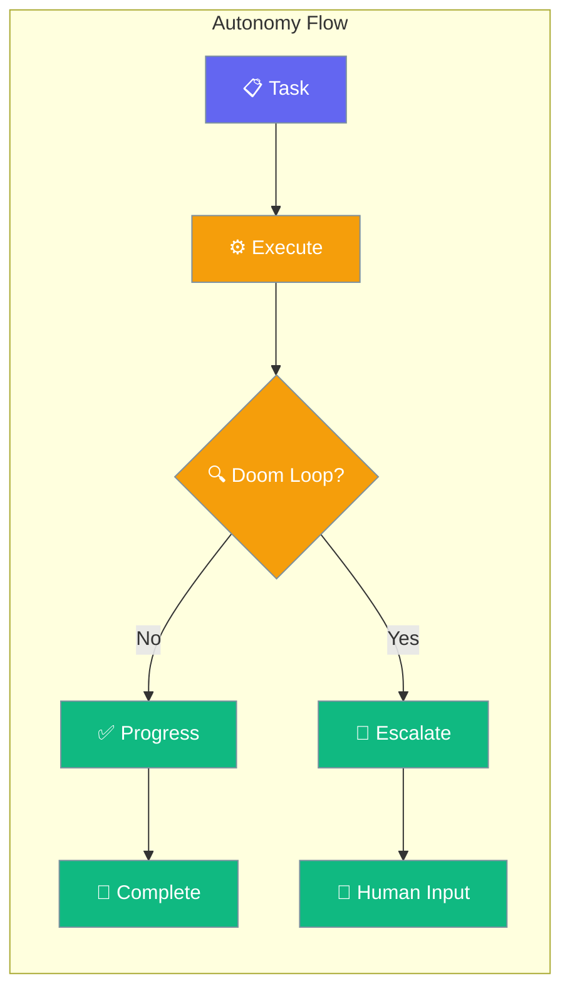
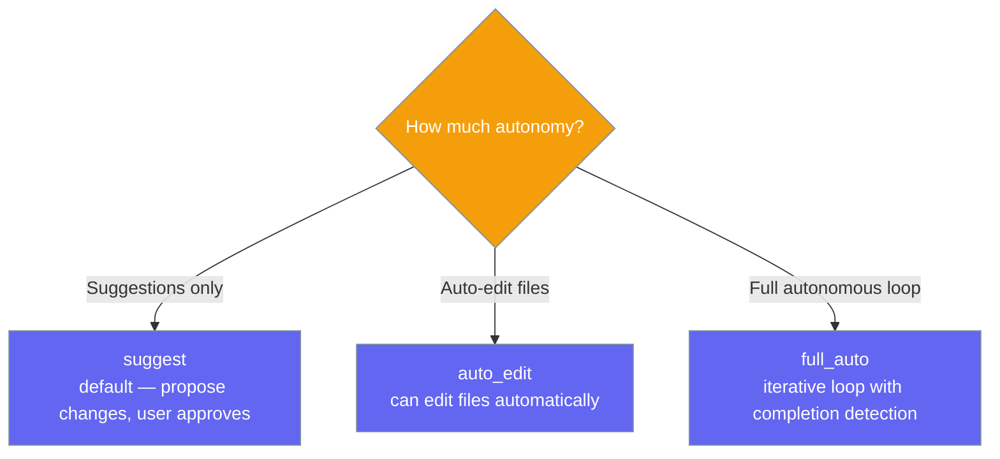
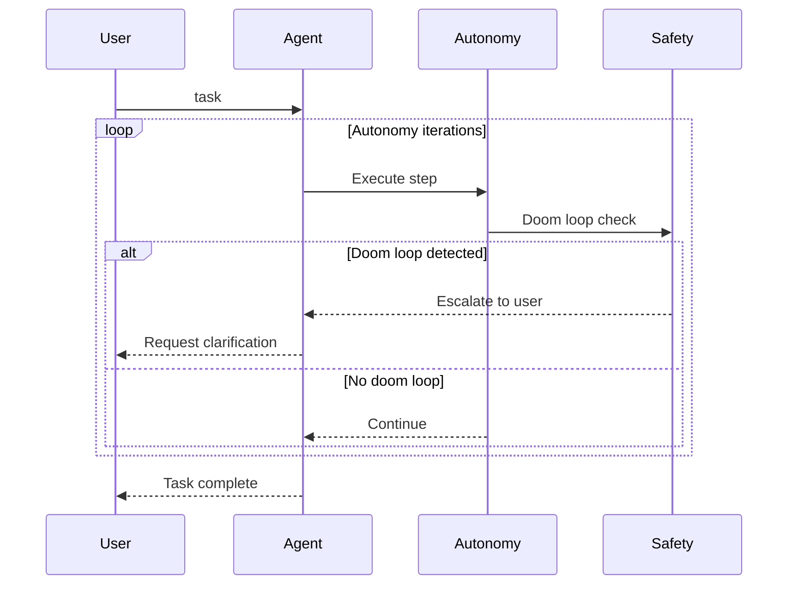

Autonomy lets agents operate independently — detecting doom loops, escalating when stuck, and optionally running in a full-auto iterative mode.

```python
from praisonaiagents import Agent

agent = Agent(
    name="Assistant",
    instructions="You are an autonomous coding assistant.",
    autonomy=True,
)

agent.start("Refactor the authentication module to use JWT tokens.")
```
The user delegates a coding task; the agent works independently, detects doom loops, and escalates to a human when stuck.




## Quick Start

<Steps>
<Step title="Level 1 — Bool (simplest)">

Turn on autonomy with a single flag — defaults to the safe `suggest` level.

```python
from praisonaiagents import Agent

agent = Agent(
    name="Coder",
    instructions="You are an autonomous task-completion agent.",
    autonomy=True,
)
agent.start("Write and test a Python function to merge sorted arrays.")
```
</Step>

<Step title="Level 2 — String (pick a level)">

Pass a level name to unlock more independence.

```python
from praisonaiagents import Agent

agent = Agent(
    name="Coder",
    instructions="You are an autonomous coding agent.",
    autonomy="full_auto",
)
agent.start("Build a REST API endpoint for user authentication.")
```
</Step>

<Step title="Level 3 — Config class (full control)">

Use `AutonomyConfig` to tune iteration caps, doom-loop detection, and escalation.

```python
from praisonaiagents import Agent, AutonomyConfig

agent = Agent(
    name="Coder",
    instructions="You are a precise autonomous agent.",
    autonomy=AutonomyConfig(
        level="auto_edit",
        max_iterations=30,
        doom_loop_threshold=5,
        auto_escalate=True,
    ),
)
agent.start("Review and improve the test coverage for the payment module.")
```
</Step>
</Steps>

---

## Autonomy Levels



---

## How It Works



| Phase | What happens |
|---|---|
| 1. Execute | Agent takes action toward the goal |
| 2. Safety check | Doom loop tracker monitors for repeated identical actions |
| 3. Escalate | If stuck, agent asks user for guidance instead of looping |
| 4. Complete | Iterative mode detects task completion signal |

### Completion Signals

The loop can stop on several signals — ranked by how reliably they mean "really done".

| Completion Signal | How It Works | Reliability |
|---|---|---|
| **Goal judge** (`run_goal`) | Independent judge evaluates acceptance criteria after each iteration | ⭐⭐⭐⭐ Most reliable — explicit contract |
| Tool completion | Model stops calling tools after a substantive response | ⭐⭐⭐ Good for tool-driven tasks |
| Completion promise | Model emits the configured `completion_promise` signal text | ⭐⭐ Depends on the model following instructions |
| Keyword heuristic | Words like "done"/"finished" or 2 no-tool turns | ⭐ Prone to false positives |

<Tip>
When you have a real acceptance criterion for "done" (e.g. "a PR exists"), use [`agent.run_goal(...)`](/docs/features/goal-loop) instead of the heuristics — it gates completion on an independent judge instead of guessing from keywords.
</Tip>

---

## Configuration Options

<Card icon="code" href="/docs/sdk/reference/python/AutonomyConfig">
  Full list of options, types, and defaults — `AutonomyConfig`
</Card>

The most common options at a glance:

| Option | Type | Default | Description |
|---|---|---|---|
| `level` | `str` | `"suggest"` | `"suggest"`, `"auto_edit"`, or `"full_auto"` |
| `max_iterations` | `int` | `20` | Max iterations before stopping |
| `doom_loop_threshold` | `int` | `3` | Repeated actions before doom loop detection |
| `auto_escalate` | `bool` | `True` | Automatically escalate when stuck |
| `completion_promise` | `str \| None` | `None` | Signal text that marks task completion |

---

## Common Patterns

### Pattern 1 — Auto-edit mode for coding tasks
```python
from praisonaiagents import Agent, AutonomyConfig

agent = Agent(
    instructions="You are a senior software engineer.",
    autonomy=AutonomyConfig(
        level="auto_edit",
        max_iterations=15,
        doom_loop_threshold=3,
    ),
)
response = agent.start("Add input validation to all API endpoints in the users module.")
print(response)
```

### Pattern 2 — Full-auto iterative mode
```python
from praisonaiagents import Agent, AutonomyConfig

agent = Agent(
    instructions="You are an autonomous DevOps agent.",
    autonomy=AutonomyConfig(
        level="full_auto",
        completion_promise="DEPLOYMENT_COMPLETE",
        max_iterations=50,
    ),
)
agent.start("Deploy the application to staging and run smoke tests.")
```

---

## Best Practices

<AccordionGroup>
<Accordion title="Start with suggest level">
Start with `autonomy=True` (level `suggest`) to see what the agent proposes before giving it permission to edit files or run in a full loop. Graduate to `auto_edit` or `full_auto` when you trust the agent's behavior.
</Accordion>

<Accordion title="Set doom_loop_threshold conservatively">
The default threshold of 3 means 3 identical actions trigger escalation. Lower this to 2 for high-stakes tasks, or raise it to 5 for tasks where retrying the same action is expected behavior (like polling).
</Accordion>

<Accordion title="Use completion_promise for iterative mode">
In `full_auto` mode, the agent loops until it detects completion. Set `completion_promise="TASK_COMPLETE"` and instruct the agent to output this signal when done, giving you clean loop termination.
</Accordion>
</AccordionGroup>

---

## Related

<CardGroup cols={2}>
<Card icon="robot" href="/docs/features/autonomy-loop">
  Autonomy Loop — deep dive into iterative autonomy mode
</Card>
<Card icon="list-check" href="/docs/features/planning">
  Planning — plan before acting on complex requests
</Card>
<Card icon="bullseye-arrow" href="/docs/features/goal-loop">
  Gate the autonomous loop on an independent acceptance-criteria judge
</Card>
</CardGroup>
