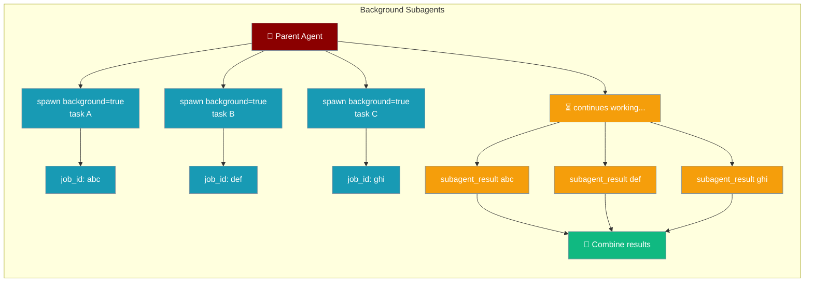
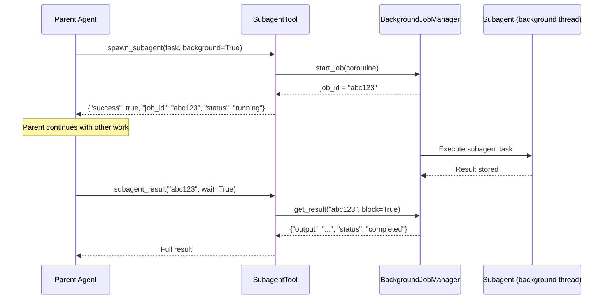

A parent agent can fire off one or more subagents and continue working. Each background subagent returns a `job_id` immediately; poll or await results whenever you need them.

```python
from praisonaiagents import Agent
from praisonaiagents.tools.subagent_tool import create_subagent_tools

subagent_tools = create_subagent_tools()

coordinator = Agent(
    name="Coordinator",
    instructions="Spawn background research tasks and collect results when ready.",
    tools=subagent_tools,
)

coordinator.start(
    "Spawn three background subagents to research Python, Rust, and Go "
    "concurrently. Collect all results when done and write a comparison."
)
```



## Quick Start

<Steps>
<Step title="Spawn a background subagent">

Call `spawn_subagent` with `background=True`. The parent gets a `job_id` and keeps running:

```python
from praisonaiagents import Agent
from praisonaiagents.tools.subagent_tool import create_subagent_tools

tools = create_subagent_tools()

agent = Agent(
    name="Boss",
    instructions=(
        "Use spawn_subagent with background=true to start the research task. "
        "Then do other work. Finally call subagent_result with the job_id to get the answer."
    ),
    tools=tools,
)

agent.start("Research the latest Python 3.13 features in the background, "
            "then write a haiku while waiting, then fetch the research result.")
```
</Step>

<Step title="Fan out and collect all results">

Spawn multiple subagents in parallel and wait for all of them:

```python
from praisonaiagents import Agent
from praisonaiagents.tools.subagent_tool import create_subagent_tools

tools = create_subagent_tools()

orchestrator = Agent(
    name="Orchestrator",
    instructions=(
        "1. Spawn three background subagents — one for Python news, one for Rust news, "
        "one for Go news. 2. Record all three job IDs. "
        "3. Call subagent_result(job_id, wait=true) for each to collect results. "
        "4. Write a short comparative summary."
    ),
    tools=tools,
)

orchestrator.start("Compare the latest language news for Python, Rust, and Go")
```
</Step>

<Step title="Check status without blocking">

Poll a job without waiting — useful when you want to check periodically:

```python
agent = Agent(
    name="Checker",
    instructions=(
        "Spawn a slow background task. Then check its status with "
        "subagent_result(job_id, wait=false) every few steps until it's done."
    ),
    tools=create_subagent_tools(),
)
agent.start("Run a background analysis and poll for its completion")
```
</Step>
</Steps>

---

## How It Works



Background subagents run on a shared thread pool managed by `BackgroundJobManager`. Job IDs are 8-character random strings. Results are kept in memory until retrieved.

---

## Tool Parameters

### `spawn_subagent`

| Parameter | Type | Default | Description |
|-----------|------|---------|-------------|
| `task` | `str` | required | The task or prompt for the subagent |
| `agent_name` | `str` | `"subagent"` | Name for the spawned agent |
| `model` | `str` | `None` | LLM model override |
| `tools` | `list` | `[]` | Tools to give the subagent |
| `background` | `bool` | `False` | When `True`, return immediately with a `job_id` |

**Returns (foreground):** Full result dict with `output`, `success`, `error`.

**Returns (background):** `{"success": True, "job_id": "...", "status": "running"}`.

### `subagent_result`

| Parameter | Type | Default | Description |
|-----------|------|---------|-------------|
| `job_id` | `str` | required | The `job_id` returned by `spawn_subagent(background=True)` |
| `wait` | `bool` | `False` | When `True`, block until the job completes |

**Returns:**
- Job still running (`wait=False`): `{"success": True, "job_id": "...", "status": "running"}`
- Job done: `{"success": True, "job_id": "...", "status": "completed", "result": {...}}`
- Job failed: `{"success": False, "job_id": "...", "error": "..."}`

---

## Best Practices

<AccordionGroup>
<Accordion title="Don't background trivially fast tasks">

Background subagents have overhead (thread scheduling, job management). For tasks that complete in under a second, use foreground subagents (`background=False`, the default) — they're simpler and return results immediately.
</Accordion>

<Accordion title="Always capture job IDs">

The parent agent should record job IDs in its working memory or output immediately after spawning. If a job ID is lost, there is no way to retrieve the result.
</Accordion>

<Accordion title="Set a concurrency budget">

The `BackgroundJobManager` runs on a thread pool. Avoid spawning hundreds of concurrent subagents without throttling — each subagent holds a connection and context window while running.
</Accordion>

<Accordion title="Use wait=True for final collection">

When you need a result to proceed, always use `subagent_result(job_id, wait=True)` rather than polling in a loop. The `wait=True` mode blocks the calling thread efficiently without spinning.
</Accordion>
</AccordionGroup>

---

## Related

<CardGroup cols={2}>
<Card title="Subagent Tool" icon="robot" href="/docs/features/subagent-tool">
  Full documentation on the subagent tool, including foreground usage
</Card>
<Card title="Background Tasks" icon="clock" href="/docs/features/background-tasks">
  Other background task patterns for long-running work
</Card>
</CardGroup>
