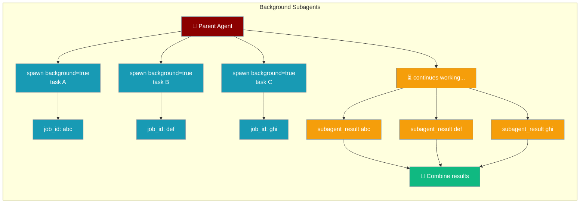
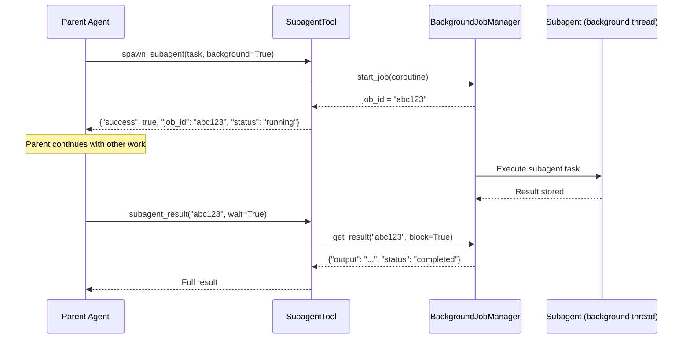
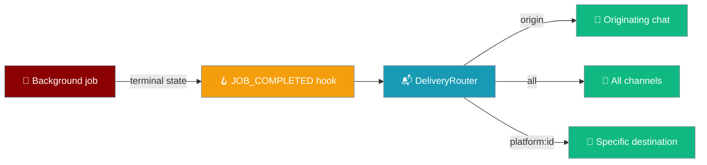

A parent agent can fire off one or more subagents and continue working. Each background subagent returns a `job_id` immediately — results can be pulled on demand or delivered automatically back to the originating chat.

```python
from praisonaiagents import Agent
from praisonaiagents.tools.subagent_tool import create_subagent_tools

coordinator = Agent(
    name="Coordinator",
    instructions="Spawn background research tasks and collect results when ready.",
    tools=create_subagent_tools(),
)

coordinator.start(
    "Spawn three background subagents to research Python, Rust, and Go "
    "concurrently. Collect all results when done and write a comparison."
)
```

The user asks for parallel research; background subagents return job IDs while the parent keeps working.





```mermaid
sequenceDiagram
    participant U as User (chat)
    participant B as BotOS
    participant A as Agent
    participant BG as BackgroundJobManager
    U->>B: research X in the background
    B->>A: turn
    A->>BG: spawn_subagent(..., background=True, deliver="origin")
    BG-->>A: job_id
    A-->>B: Started; I will ping you when done
    B-->>U: reply (turn ends)
    Note over BG: job runs...
    BG->>B: on_background_job_complete(job_info)  JOB_COMPLETED
    B-->>U: result delivered (no active turn)
```

## Quick Start

<Steps>
<Step title="Spawn a background subagent">

Call `spawn_subagent` with `background=True`. The parent gets a `job_id` and keeps running:

```python
from praisonaiagents import Agent
from praisonaiagents.tools.subagent_tool import create_subagent_tools

tools = create_subagent_tools()

agent = Agent(
    name="Boss",
    instructions=(
        "Use spawn_subagent with background=true to start the research task. "
        "Then do other work. Finally call subagent_result with the job_id to get the answer."
    ),
    tools=tools,
)

agent.start("Research the latest Python 3.13 features in the background, "
            "then write a haiku while waiting, then fetch the research result.")
```
</Step>

<Step title="Deliver result back to chat automatically">

Pass `deliver="origin"` when running behind `BotOS` — the finished result is sent back to the same chat without polling:

```python
from praisonaiagents import Agent
from praisonaiagents.tools.subagent_tool import create_subagent_tools

agent = Agent(
    name="Researcher",
    instructions=(
        "When the user asks for research, spawn a background subagent with "
        "deliver='origin' so the finished result is delivered back to this chat "
        "automatically. Tell the user you'll ping them when it's ready."
    ),
    tools=create_subagent_tools(),
)
```

<Note>`deliver="origin"` only works when the agent is running behind `BotOS` — the wrapper injects `platform`/`chat_id`/`thread_id`/`session_id` automatically. In a bare `Agent`, use `deliver="telegram:12345"` or leave it empty (pull-only).</Note>
</Step>

<Step title="Fan out and collect all results">

Spawn multiple subagents in parallel and wait for all of them:

```python
from praisonaiagents import Agent
from praisonaiagents.tools.subagent_tool import create_subagent_tools

tools = create_subagent_tools()

orchestrator = Agent(
    name="Orchestrator",
    instructions=(
        "1. Spawn three background subagents — one for Python news, one for Rust news, "
        "one for Go news. 2. Record all three job IDs. "
        "3. Call subagent_result(job_id, wait=true) for each to collect results. "
        "4. Write a short comparative summary."
    ),
    tools=tools,
)

orchestrator.start("Compare the latest language news for Python, Rust, and Go")
```
</Step>

<Step title="Check status without blocking">

Poll a job without waiting — useful when you want to check periodically:

```python
from praisonaiagents import Agent
from praisonaiagents.tools.subagent_tool import create_subagent_tools

agent = Agent(
    name="Checker",
    instructions=(
        "Spawn a slow background task. Then check its status with "
        "subagent_result(job_id, wait=false) every few steps until it's done."
    ),
    tools=create_subagent_tools(),
)
agent.start("Run a background analysis and poll for its completion")
```
</Step>

<Step title="Deliver result to chat when done">

Set `deliver='origin'` to push the result back to the originating chat automatically — no polling needed:

```python
from praisonaiagents import Agent
from praisonaiagents.tools.subagent_tool import create_subagent_tools

agent = Agent(
    name="Boss",
    instructions=(
        "Kick off a long research task in the background and deliver the "
        "result back to this chat when done. Use spawn_subagent with "
        "background=true and deliver='origin'."
    ),
    tools=create_subagent_tools(),
)

agent.start("Research the latest Python 3.13 features and let me know when done")
```
</Step>
</Steps>

---

## Chat-Back Delivery Flow

When running inside `BotOS`, a background job can deliver itself back to the originating chat when it finishes — no polling required.

```mermaid
sequenceDiagram
    participant U as User (chat)
    participant B as BotOS
    participant A as Agent
    participant BG as BackgroundJobManager
    U->>B: "research X in the background"
    B->>A: turn
    A->>BG: spawn_subagent(..., background=True, deliver="origin")
    BG-->>A: job_id
    A-->>B: "Started; I'll ping you when done"
    B-->>U: reply (turn ends)
    Note over BG: job runs...
    BG->>B: on_background_job_complete(job_info) [JOB_COMPLETED]
    B-->>U: 📬 Result delivered (no active turn)
```

Results are delivered using the same `DeliveryRouter` the scheduler uses for scheduled messages — no extra configuration needed beyond the `deliver` parameter.

<Note>By default the deliver-back is lost if the process restarts mid-job. Wire a `BackgroundJobStore` and call `reconcile_on_start()` at boot to survive restarts — see [Background Tasks → Durability](/docs/features/background-tasks#durability-survive-a-restart).</Note>

<Note>`deliver="origin"` only works when the agent is running behind `BotOS` — the wrapper injects `platform`, `chat_id`, `thread_id`, and `session_id` automatically. In a bare `Agent`, use `deliver="telegram:12345"` or leave it empty (pull-only).</Note>

---

## How It Works (Pull Mode)



Background subagents run on a shared thread pool managed by `BackgroundJobManager`. Job IDs are 8-character random strings. Results are kept in memory until retrieved.

---

## How Delivery is Wired

When `deliver` is set, the job pushes its result when it reaches a terminal state — no polling needed.



**Core layer (`praisonaiagents`)** — lightweight signal:
- `HookEvent.JOB_COMPLETED` fires when a job reaches a terminal state (completed or failed).
- `BackgroundJobManager.start_job(..., on_complete=None, origin=None)` — accepts an optional completion callback; a raising callback never crashes the worker.
- `spawn_subagent` captures origin context into the job and wires the injected `on_job_complete`.

**Wrapper layer (`praisonai`)** — delivery orchestration:
- `BotOS.on_background_job_complete(job_info)` resolves the `deliver` target and routes the success summary or failure notice through the same `DeliveryRouter` the scheduler uses.
- With a `BackgroundJobStore` configured, `on_complete` may be re-fired once on the next boot for any job that completed-but-was-not-delivered before a crash — `reconcile_on_start()` replays the interrupted deliver-back. Keep the handler idempotent. See [Durable Background Jobs](/docs/features/durable-background-jobs).

---

## Delivery Tokens

| Token | Meaning |
|-------|---------|
| `""` (empty) | Pull-only via `subagent_result` (unchanged legacy behaviour) |
| `"origin"` | Deliver back to the platform/chat id captured at spawn |
| `"all"` | Broadcast to all registered channels |
| `"platform:chat_id"` | Deliver to a specific channel (e.g. `"telegram:12345"`) |
| `"platform:chat_id:thread_id"` | Deliver to a specific thread or reply context |

<Warning>**Failure delivery:** On failure, a short notice is delivered to the same target instead of the full result. `HookEvent.JOB_COMPLETED` fires for both terminal states. The internal `on_complete` callback and hook handlers are best-effort — a raised exception is swallowed and logged at DEBUG so the worker never crashes.</Warning>

### Subscribe to `JOB_COMPLETED`

For observability or custom side effects when a background job finishes, register on `HookEvent.JOB_COMPLETED` (see [Hook Events](/docs/features/hook-events)):

```python
from praisonaiagents.hooks import HookEvent, register_hook

@register_hook(HookEvent.JOB_COMPLETED)
def log_completion(input):
    print(f"job {input.job_info.job_id} → {input.job_info.status.value}")
```


---

## Tool Parameters

### `spawn_subagent`

| Parameter | Type | Default | Description |
|-----------|------|---------|-------------|
| `task` | `str` | required | The task or prompt for the subagent |
| `agent_name` | `str` | `"subagent"` | Name for the spawned agent |
| `llm` | `str` | `None` | LLM model override |
| `permission_mode` | `str` | `None` | Permission mode for the subagent |
| `tools` | `list` | `[]` | Tools to give the subagent |
| `background` | `bool` | `False` | When `True`, return immediately with a `job_id` |
| `deliver` | `str` | `""` | Delivery token: `"origin"`, `"all"`, `"platform:chat_id[:thread_id]"`, or `""` (pull-only) |
| `platform` | `str` | `""` | Origin platform (e.g. `"telegram"`, `"slack"`). Injected automatically by `BotOS`; required for `deliver="origin"` outside BotOS. |
| `chat_id` | `str` | `""` | Origin chat/channel id. Required for `deliver="origin"` outside BotOS. |
| `thread_id` | `str` | `""` | Optional origin thread id. |
| `session_id` | `str` | `""` | Optional origin session id to preserve context. |

**Returns (foreground):** Full result dict with `output`, `success`, `error`.

**Returns (background):** `{"success": True, "job_id": "...", "status": "running"}`.

### `subagent_result`

| Parameter | Type | Default | Description |
|-----------|------|---------|-------------|
| `job_id` | `str` | required | The `job_id` returned by `spawn_subagent(background=True)` |
| `wait` | `bool` | `False` | When `True`, block until the job completes |

**Returns:**
- Job still running (`wait=False`): `{"success": True, "job_id": "...", "status": "running"}`
- Job done: `{"success": True, "job_id": "...", "status": "completed", "result": {...}}`
- Job failed: `{"success": False, "job_id": "...", "error": "..."}`

---

<Note>
**Backward compatibility:** With no `deliver` target, behaviour is byte-for-byte as before — pull-only via `subagent_result`. The delivery path is purely additive.
</Note>

## Delivery Tokens

| Token | Meaning |
|-------|---------|
| `""` (empty) | Pull-only via `subagent_result` (unchanged legacy behaviour) |
| `"origin"` | Deliver back to the platform/chat_id captured at spawn |
| `"all"` | Broadcast to all registered channels |
| `"platform:chat_id"` | Deliver to a specific channel (e.g. `"telegram:12345"`) |
| `"platform:chat_id:thread_id"` | Deliver to a specific thread/reply-context |

---

## Subscribe to Job Completion

Use `JOB_COMPLETED` hook for observability — fires on both success and failure after the completion callback runs:

```python
from praisonaiagents.hooks import HookEvent, register_hook

@register_hook(HookEvent.JOB_COMPLETED)
def log_completion(input):
    print(f"job {input.job_info.job_id} → {input.job_info.status.value}")
```

See [Hook Events](/docs/features/hook-events) for the full reference.

---

## Best Practices

<AccordionGroup>
<Accordion title="Don't background trivially fast tasks">

Background subagents have overhead (thread scheduling, job management). For tasks that complete in under a second, use foreground subagents (`background=False`, the default) — they're simpler and return results immediately.
</Accordion>

<Accordion title="Always capture job IDs">

The parent agent should record job IDs in its working memory or output immediately after spawning. If a job ID is lost, there is no way to retrieve the result.
</Accordion>

<Accordion title="Set a concurrency budget">

The `BackgroundJobManager` runs on a thread pool. Avoid spawning hundreds of concurrent subagents without throttling — each subagent holds a connection and context window while running.
</Accordion>

<Accordion title="Use wait=True for final collection">

When you need a result to proceed, always use `subagent_result(job_id, wait=True)` rather than polling in a loop. The `wait=True` mode blocks the calling thread efficiently without spinning.
</Accordion>

<Accordion title="Use deliver='origin' instead of polling for chat bots">

In a bot context, `deliver='origin'` is simpler than polling: the parent can close its turn immediately and the result arrives as a new message when ready — no held connections.
</Accordion>

<Accordion title="Failure delivery behaviour">

On failure, a short notice is delivered to the same target instead of the result. The `JOB_COMPLETED` hook fires for both terminal states (`COMPLETED` and `FAILED`). Any exception raised inside `on_complete` is swallowed and logged at DEBUG level so the worker is never crashed by a handler error.
</Accordion>
</AccordionGroup>

---

## Related

<CardGroup cols={2}>
<Card title="Named Subagents" icon="users" href="/docs/features/named-subagents">
  Delegate to your own named agents by name mid-run — no Python
</Card>
<Card title="Hook Events" icon="webhook" href="/docs/features/hook-events">
  Subscribe to JOB_COMPLETED and other lifecycle events
</Card>
<Card title="Background Tasks" icon="clock" href="/docs/features/background-tasks">
  Other background task patterns for long-running work
</Card>
<Card title="Proactive Delivery" icon="bell" href="/docs/features/proactive-delivery">
  Push messages to users outside of a turn
</Card>
<Card title="Channels Gateway" icon="tower-broadcast" href="/docs/features/channels-gateway">
  Configure BotOS for multi-platform bot deployments
</Card>
<Card title="Gateway Reliability" icon="shield-check" href="/docs/features/gateway-reliability">
  Production reliability presets for the gateway
</Card>
</CardGroup>
