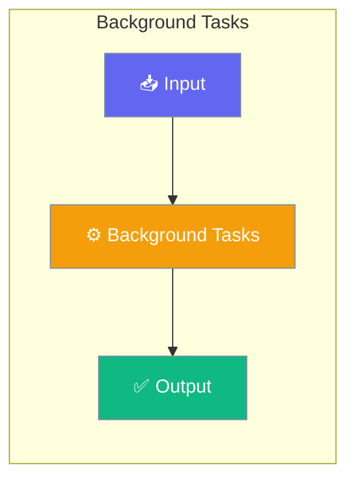

# Background Tasks

Execute agent tasks and recipes asynchronously without blocking the main thread. Monitor progress, cancel running tasks, and manage concurrent execution.




## Quick Start


<Steps>
<Step title="Simple Usage">
### Agent-Centric Usage

```python
import asyncio
from praisonaiagents import Agent
from praisonaiagents.background import BackgroundRunner, BackgroundConfig

async def main():
    # Create background runner
    runner = BackgroundRunner(config=BackgroundConfig(max_concurrent_tasks=3))
    
    # Agent with background task support
    agent = Agent(
        name="AsyncAssistant",
        instructions="You are a research assistant.",
        background=runner
    )
    
    # Submit agent task to run in background
    task = await agent.background.submit_agent(
        agent=agent,
        prompt="Research AI trends in 2025",
        name="research_task"
    )
    
    # Continue with other work while task runs...
    await task.wait(timeout=60.0)
    print(task.result)

asyncio.run(main())
```
</Step>

<Step title="With Configuration">
### Using Recipe Operations

```python
from praisonai import recipe

# Submit recipe as background task
task = recipe.run_background(
    "my-recipe",
    input={"query": "What is AI?"},
    config={"max_tokens": 1000},
    session_id="session_123",
    timeout_sec=300,
)

print(f"Task ID: {task.task_id}")

# Check status
status = await task.status()

# Wait for completion
result = await task.wait(timeout=600)
print(f"Result: {result}")

# Cancel if needed
await task.cancel()
```
</Step>
</Steps>


## Best Practices

<AccordionGroup>
  <Accordion title="Start simple">
    Enable the feature with a single parameter before adding configuration. Verify it works, then layer in options.
  </Accordion>
  <Accordion title="Use environment variables for secrets">
    Never hardcode API keys or tokens. Use `os.getenv("KEY_NAME")` to read from environment variables.
  </Accordion>
  <Accordion title="Test with minimal examples first">
    Copy the Quick Start example, run it, then extend it. This confirms your environment is set up correctly.
  </Accordion>
  <Accordion title="Check the logs">
    Set `verbose=True` on your agent to see detailed execution logs when debugging unexpected behavior.
  </Accordion>
</AccordionGroup>

## Related

<CardGroup cols={2}>
  <Card title="Features Overview" icon="grid-2" href="/docs/features">
    Browse all PraisonAI features
  </Card>
  <Card title="Quick Start" icon="rocket" href="/docs/introduction">
    Get started with PraisonAI agents
  </Card>
</CardGroup>
