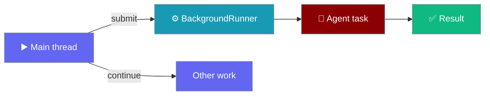
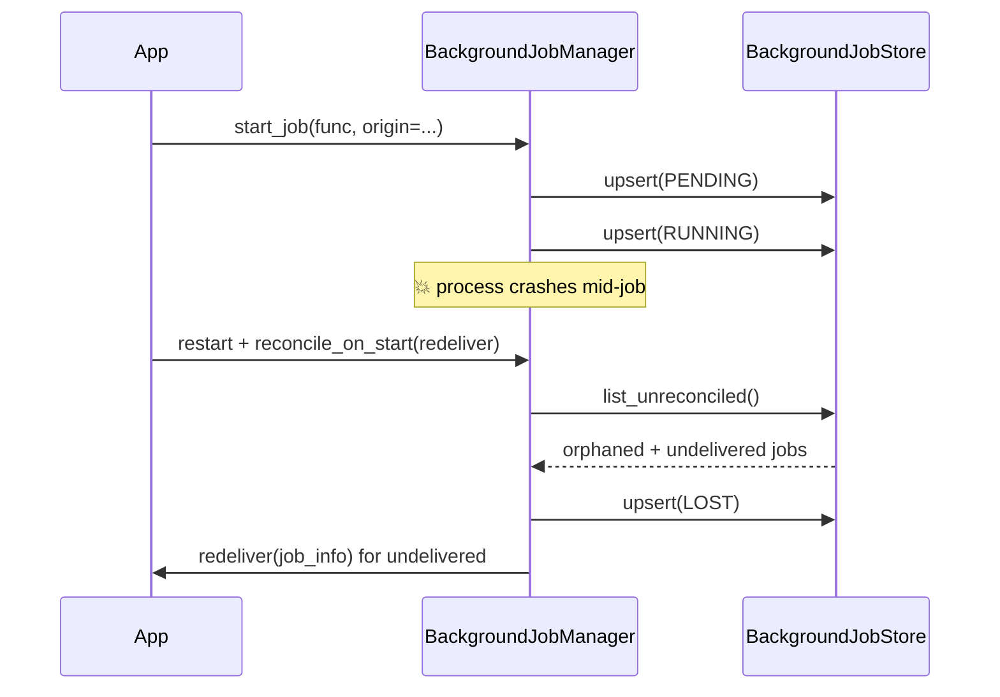
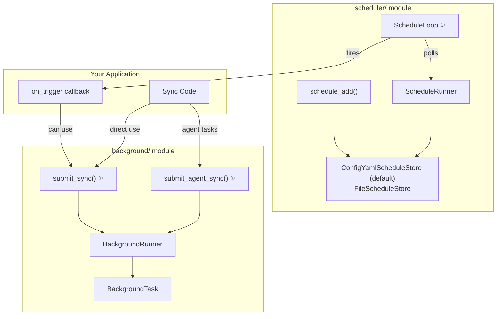

Run agent tasks and recipes in the background without blocking your main thread.

```python
from praisonaiagents import Agent

agent = Agent(
    name="AsyncAssistant",
    instructions="Research in the background while the user keeps working.",
    background=True,
)
agent.start("Summarise today's news.")
```

The user submits long-running work; the background runner executes it concurrently while the main thread continues.



## Quick Start

<Steps>
<Step title="Agent with background runner">

```python
import asyncio
from praisonaiagents import Agent
from praisonaiagents.background import BackgroundRunner, BackgroundConfig

async def main():
    runner = BackgroundRunner(config=BackgroundConfig(max_concurrent_tasks=3))
    agent = Agent(
        name="AsyncAssistant",
        instructions="You are a research assistant.",
        background=runner,
    )
    task = await agent.background.submit_agent(
        agent=agent,
        prompt="Research AI trends in 2025",
        name="research_task",
    )
    await task.wait(timeout=60.0)
    print(task.result)

asyncio.run(main())
```

</Step>
<Step title="Recipe in the background">

```python
from praisonai import recipe

task = recipe.run_background(
    "my-recipe",
    input={"query": "What is AI?"},
    config={"max_tokens": 1000},
    session_id="session_123",
    timeout_sec=300,
)
print(f"Task ID: {task.task_id}")
task.wait()
```

</Step>
</Steps>

## Features

- **Async Execution**: Run tasks without blocking
- **Concurrency Control**: Limit concurrent tasks
- **Progress Tracking**: Monitor task status
- **Timeout Support**: Set execution time limits
- **Cancellation**: Cancel running tasks

## Configuration

```python
from praisonaiagents.background import BackgroundConfig

config = BackgroundConfig(
    max_concurrent_tasks=5,    # Max parallel tasks
    default_timeout=300.0,     # 5 minute default timeout
    auto_cleanup=True          # Auto-remove completed tasks
)
```

## Task Status

```python
from praisonaiagents.background import TaskStatus

# Check status
if task.status == TaskStatus.COMPLETED:
    print(f"Result: {task.result}")
elif task.status == TaskStatus.FAILED:
    print(f"Error: {task.error}")
elif task.status == TaskStatus.RUNNING:
    print("Still running...")
```

## CLI Usage

```bash
# Submit a recipe as background task
praisonai background submit --recipe my-recipe

# List tasks
praisonai background list

# Check status
praisonai background status <task_id>

# Cancel task
praisonai background cancel <task_id>

# Clear completed
praisonai background clear
```

## Safe Defaults

| Setting | Default | Description |
|---------|---------|-------------|
| `timeout_sec` | 300 | Maximum execution time (5 minutes) |
| `max_concurrent` | 5 | Maximum concurrent tasks |
| `cleanup_delay_sec` | 3600 | Time before completed tasks are cleaned up |

---

## Low-level API Reference

### BackgroundRunner Direct Usage

```python
import asyncio
from praisonaiagents.background import BackgroundRunner, BackgroundConfig

async def main():
    # Create runner with config
    config = BackgroundConfig(max_concurrent_tasks=3)
    runner = BackgroundRunner(config=config)
    
    # Define a task
    async def my_task(name: str) -> str:
        await asyncio.sleep(2)
        return f"Task {name} completed"
    
    # Submit task
    task = await runner.submit(my_task, args=("example",), name="my_task")
    print(f"Submitted: {task.id[:8]}")
    
    # Wait for completion
    await task.wait(timeout=10.0)
    print(f"Result: {task.result}")

asyncio.run(main())
```

### Submitting Tasks

```python
# Submit async function
task = await runner.submit(
    func=my_async_function,
    args=(arg1, arg2),
    kwargs={"key": "value"},
    name="descriptive_name",
    timeout=60.0
)

# Submit sync function (runs in thread pool)
task = await runner.submit(
    func=my_sync_function,
    args=(arg1,),
    name="sync_task"
)
```

### Task Management

```python
# List all tasks
for task in runner.tasks:
    print(f"{task.name}: {task.status.value}")

# Get running tasks
running = runner.running_tasks

# Get pending tasks
pending = runner.pending_tasks

# Clear completed tasks
runner.clear_completed()
```

### Synchronous Job Manager

For simpler use cases, use `BackgroundJobManager` for synchronous job management:

```python
from praisonaiagents.background.job_manager import BackgroundJobManager, JobStatus

# Create manager with auto-background threshold
manager = BackgroundJobManager(auto_background_threshold=5.0)

# Start a job
job_id = manager.start_job(lambda: expensive_computation())

# Check status
status = manager.get_status(job_id)
if status == JobStatus.COMPLETED:
    result = manager.get_result(job_id)
elif status == JobStatus.FAILED:
    error = manager.get_error(job_id)

# List all jobs
for job_id, info in manager.list_jobs().items():
    print(f"{job_id}: {info.status}")

# Cancel a running job
manager.cancel_job(job_id)
```

<Tip>Need jobs to survive a process restart? Pass a `store=` and call `reconcile_on_start()` — see [Durability](#durability-survive-a-restart) below.</Tip>

## Durability — survive a restart

An in-memory-only runner drops every in-flight job on a restart, including the promised deliver-back — pass a `store=` to persist jobs and recover them on boot.

Durability is opt-in: omit `store=` and behaviour is byte-for-byte as before (pure in-memory, zero overhead); supply a store and every state transition is persisted.



<Steps>
<Step title="Enable persistence (opt-in)">

```python
from praisonaiagents.background.job_manager import BackgroundJobManager

# Your app supplies a store that implements the BackgroundJobStore protocol
manager = BackgroundJobManager(store=my_store)
```
</Step>
<Step title="Reconcile once at startup">

Call `reconcile_on_start()` once at boot, after wiring the deliver-back handler:

```python
counts = manager.reconcile_on_start(redeliver=on_job_complete)
# {"lost": 0, "redelivered": 0, "rehydrated": 0} on a clean start
```
</Step>
</Steps>

### New API surface

| Symbol | Kind | Purpose |
|--------|------|---------|
| `BackgroundJobStore` | Protocol | Implement this to plug in your own durable store |
| `store=` | `BackgroundJobManager.__init__` kwarg | Enable persistence (opt-in, keyword-only) |
| `reconcile_on_start(redeliver)` | method | Reconcile orphans + replay undelivered on startup |
| `JobStatus.LOST` | enum value | Terminal state for `RUNNING`/`PENDING` jobs interrupted by a crash |
| `JobInfo.delivered` | field (`bool`, default `False`) | Whether the deliver-back has fired |

`reconcile_on_start(redeliver)` passes the persisted `JobInfo` to your `redeliver` callback — make it idempotent, since a raised exception means "retry on the next restart" (the job is left undelivered, never lost).

<Note>`LOST` jobs are age-evictable by `cleanup_completed(max_age=...)`, so reconciled orphans don't leak across restarts.</Note>

## Architecture

The sync wrappers and `ScheduleLoop` bridge the gap between disconnected modules:



- **`submit_sync()` / `submit_agent_sync()`** — let sync code submit background tasks without asyncio boilerplate
- **`ScheduleLoop`** — polls for due jobs on a daemon thread and fires your callback

## Sync Wrappers

For sync code (scripts, bot handlers, `Agent.start()` callbacks), use the sync-friendly methods that handle asyncio automatically:

### submit_sync()

Submit any callable from synchronous code. A daemon event loop thread is created lazily on first call.

```python
from praisonaiagents.background.runner import BackgroundRunner
import time

runner = BackgroundRunner()

def heavy_computation(data):
    time.sleep(10)
    return {"result": sum(data)}

# Non-blocking — returns immediately
task = runner.submit_sync(
    func=heavy_computation,
    args=([1, 2, 3, 4, 5],),
    name="compute"
)

print(task.status)  # "running"

# Check later
while not task.is_completed:
    time.sleep(1)
print(f"Result: {task.result}")  # {'result': 15}
```

### submit_agent_sync()

Submit an Agent task from synchronous code. Resolves the agent's callable (`start` → `chat` → `run`) automatically.

```python
from praisonaiagents import Agent
from praisonaiagents.background.runner import BackgroundRunner

agent = Agent(name="researcher", instructions="Research AI trends")
runner = BackgroundRunner()

task = runner.submit_agent_sync(
    agent=agent,
    prompt="What are the top AI trends in 2026?",
    name="research-task"
)
# task.result will contain the agent's response when done
```

| Parameter | Type | Required | Description |
|-----------|------|----------|-------------|
| `func` / `agent` | Callable / Agent | Yes | Function or Agent to execute |
| `args` | tuple | No | Positional arguments (submit_sync only) |
| `prompt` | str | Yes | Agent prompt (submit_agent_sync only) |
| `name` | str | No | Human-readable task name |
| `timeout` | float | No | Timeout in seconds |
| `on_complete` | Callable | No | Callback when task completes |

---

## ScheduleLoop

`ScheduleLoop` bridges scheduled jobs to actual execution. It runs a daemon thread that polls `get_due_jobs()` and fires your callback. To skip ticks cheaply before the model turn runs, see [`pre_run` in Schedule Tools](/docs/tools/schedule-tools#pre-run-condition-gate).

```python
from praisonaiagents.scheduler import ScheduleLoop

def handle_job(job):
    print(f"🔔 Firing: {job.name} — {job.message}")

loop = ScheduleLoop(
    on_trigger=handle_job,
    tick_seconds=30,  # check every 30 seconds
)
loop.start()   # daemon thread — won't block
# loop.stop()  # clean shutdown when needed
```

### Combined Example: Scheduler + Background

```python
from praisonaiagents import Agent
from praisonaiagents.tools import schedule_add, schedule_list, schedule_remove
from praisonaiagents.scheduler import ScheduleLoop
from praisonaiagents.background.runner import BackgroundRunner

agent = Agent(
    name="assistant",
    instructions="You can set reminders and schedules.",
    tools=[schedule_add, schedule_list, schedule_remove],
)

runner = BackgroundRunner()

def on_schedule_fire(job):
    task = runner.submit_agent_sync(agent, job.message, name=f"schedule-{job.name}")
    print(f"→ Background task {task.id} started for '{job.name}'")

loop = ScheduleLoop(on_trigger=on_schedule_fire, tick_seconds=30)
loop.start()

# Agent creates schedules that now actually fire!
agent.start("Remind me to check email every morning at 7am")
```

| Parameter | Type | Default | Description |
|-----------|------|---------|-------------|
| `on_trigger` | Callable | *required* | Called with each due `ScheduleJob` |
| `store` | ScheduleStoreProtocol | `ConfigYamlScheduleStore()` | Schedule store to poll. Auto-created when omitted |
| `tick_seconds` | float | `30.0` | Poll interval in seconds |

| Method | Description |
|--------|-------------|
| `loop.start(on_due=None, store=None)` | Start polling (no-op if already running). Optional `on_due` callback replaces the internal claim+fire path — lets an external caller drive *when* firing happens. Optional `store` overrides the configured store before starting. Zero-arg call is unchanged. |
| `loop.fire_due()` | Claim + fire one tick's worth of due jobs **without** starting the daemon thread. Use from external providers (webhook, cron, systemd). Serialized under a per-instance lock. |
| `loop.stop(timeout=5.0)` | Signal stop and wait for thread exit |
| `loop.is_running` | Whether the daemon thread is alive |

<Note>
**`ScheduleLoop` is the default `SchedulerProviderProtocol`** — the in-process poll thread, also exported as `InProcessScheduleProvider`. For event-driven / serverless firing (webhook, systemd timer, cron, K8s CronJob), see [Scheduler Providers](/docs/features/scheduler-providers).
</Note>

<Info>
**Error handling:** If `on_trigger()` raises an exception, it's logged but not propagated — the loop continues with remaining jobs and future ticks.
</Info>

---

## Zero Performance Impact

The background module uses lazy loading — no overhead when not used:

```python
# Only loads when accessed
from praisonaiagents.background import BackgroundRunner

# Sync loop thread only created on first submit_sync() call
import praisonaiagents.background.runner as br
assert br._bg_loop is None  # Not created until needed
```

---

## Best Practices

<AccordionGroup>
  <Accordion title="Cap concurrent tasks">
    Set `BackgroundConfig(max_concurrent_tasks=...)` to match CPU and API rate limits — unbounded parallelism can exhaust tokens or file handles.
  </Accordion>
  <Accordion title="Always await task.wait with a timeout">
    Background work can hang on tool calls; pass `timeout=` so your main loop can cancel or retry instead of blocking forever.
  </Accordion>
  <Accordion title="Pair with ScheduleLoop for cron-style work">
    Fire scheduled jobs into `BackgroundRunner.submit_agent_sync` so reminders run without blocking the scheduler thread.
  </Accordion>
  <Accordion title="Use async-jobs for HTTP clients">
    When callers are external services, prefer the [Async Jobs](/features/async-jobs) server instead of embedding `BackgroundRunner` in app code.
  </Accordion>
</AccordionGroup>

---

## Related

<CardGroup cols={2}>
  <Card icon="rocket" href="/features/async-jobs" title="Async Jobs">
    HTTP API for submitting and polling long-running agent jobs.
  </Card>
  <Card icon="calendar" href="/docs/tools/schedule-tools" title="Schedule Tools">
    Let agents create reminders that trigger background runs.
  </Card>
</CardGroup>
