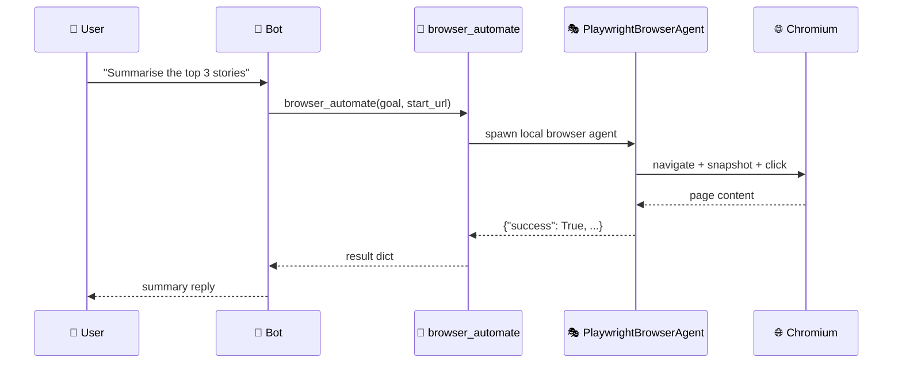
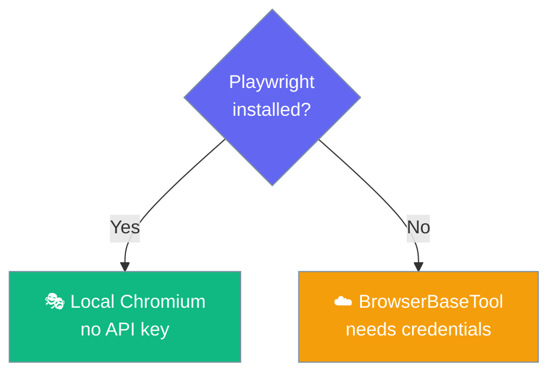

`--browser` gives your bot a `browser_automate` tool that drives a real local Chromium — no cloud API key required.

```mermaid
graph LR
    User[💬 User] --> Bot[🤖 Bot Agent]
    Bot --> Tool[🔧 browser_automate]
    Tool --> PW[🎭 PlaywrightBrowserAgent]
    PW --> Chrome[🌐 Chromium]
    Chrome --> Result[✅ Result]

    classDef user fill:#8B0000,stroke:#7C90A0,color:#fff
    classDef agent fill:#8B0000,stroke:#7C90A0,color:#fff
    classDef tool fill:#189AB4,stroke:#7C90A0,color:#fff
    classDef play fill:#F59E0B,stroke:#7C90A0,color:#fff
    classDef result fill:#10B981,stroke:#7C90A0,color:#fff

    class User,Bot agent
    class Tool,PW tool
    class Chrome play
    class Result result
```



## Quick Start

<Steps>
<Step title="Install the local browser">
```bash
pip install "praisonai-browser[playwright]"
playwright install chromium
```
</Step>

<Step title="Enable on a bot">
```bash
# Headed — a visible Chromium window opens
praisonai bot telegram --token $TELEGRAM_BOT_TOKEN --browser

# Headless — Chromium runs invisibly (recommended for servers)
praisonai bot telegram --token $TELEGRAM_BOT_TOKEN --browser --browser-headless
```
</Step>

<Step title="Try it from your chat">
Message the bot from Telegram, Slack, or Discord:

> Go to news.ycombinator.com and tell me the top 3 stories.

The agent calls `browser_automate(goal="Get the top 3 stories", start_url="https://news.ycombinator.com")`, the local Chromium opens (or stays headless), and the bot replies with the summary.
</Step>
</Steps>

---

## How It Works

`--browser` prefers local Playwright automation and falls back to the cloud tool only when the local browser is unavailable.



| Piece | What it does |
|-------|--------------|
| `browser_available()` | Returns `True` only when **both** `praisonai_browser` and `playwright` import. Guards against selecting local automation that would fail at launch. |
| `create_browser_tool(...)` | Builds the `browser_automate` callable the agent sees, passing through `model`, `headless`, and `profile`. |
| `BrowserBaseTool` (fallback) | Cloud scraping tool used when the local browser is missing. Requires BrowserBase credentials. |

---

## Configuration Options

| Option | Type | Default | Description |
|--------|------|---------|-------------|
| `--browser` | flag | off | Turn the tool on. Off by default so bots stay lightweight. |
| `--browser-headless` | flag | off | Run Chromium without a visible window. Recommended for servers. |
| `--browser-profile NAME` | `str` | `"default"` | Currently accepted but **not yet applied** — the local Playwright agent opens a fresh ephemeral context each session. |
| `--model MODEL` | `str` | `gpt-4o-mini` | Same flag as the bot's own model. Also drives the browser tool's internal LLM. |
| `browser_automate(goal, start_url)` | callable | `start_url="https://www.google.com"` | The tool the agent sees. `goal` is required; `start_url` defaults to Google. |

---

## Common Patterns

### Choosing local vs cloud

Use local Playwright for zero-credential dev boxes and personal automation; use the cloud fallback for serverless or no-Playwright environments.



### Combining with `--web`

```bash
praisonai bot slack --browser --browser-headless --web --memory
```

`--web` adds a search tool, `--browser` adds a real browser, and `--memory` lets the agent remember what it saw between messages.

---

## Best Practices

<AccordionGroup>
<Accordion title="Use --browser-headless on servers">
Headed mode requires a display; on a headless server or Docker container the launch will fail. On a display-less host, wrap the command with `xvfb-run` to provide a virtual display.
</Accordion>

<Accordion title="Confirm which tool loaded from the startup log">
Three exact log lines tell you which mode you landed in:

- `Local browser automation enabled (headless=…, profile=…)` — local Playwright is running.
- `Browser tool enabled via BrowserBaseTool (cloud fallback). Install praisonai-browser for local automation.` — cloud fallback path.
- `Browser tool not available. Install praisonai-browser (local) or praisonai-tools (cloud).` — `--browser` was a no-op; the agent has no browser tool.
</Accordion>

<Accordion title="Named profiles aren't yet honoured">
`--browser-profile` is accepted for forward-compatibility, but the current release always uses a fresh Chromium context. For a persistent profile, watch `praisonai-browser` upstream and use the CDP mode from [Browser Agent → Deep Dive](/docs/features/browser-agent-deep-dive) in the meantime.
</Accordion>

<Accordion title="Failures reach the agent, not the process">
`browser_automate` returns `{"success": False, "error": "…"}` on Playwright errors instead of raising — the agent can retry, apologise, or fall back to `search_web`. This differs from `BrowserBaseTool`, which fails at construction if the API key is absent.
</Accordion>
</AccordionGroup>

---

## Related

<CardGroup cols={2}>
<Card title="Bot CLI" icon="robot" href="/docs/cli/bot">
  All `praisonai bot` flags and platforms
</Card>
<Card title="Bot Default Tools" icon="toolbox" href="/docs/features/bot-default-tools">
  The tools every bot gets automatically
</Card>
<Card title="Browser Agent (standalone)" icon="globe" href="/docs/features/browser-agent">
  The standalone browser agent this wraps
</Card>
<Card title="praisonai-browser Package" icon="box" href="/docs/features/praisonai-browser-package">
  Install matrix and Chromium extras
</Card>
</CardGroup>
