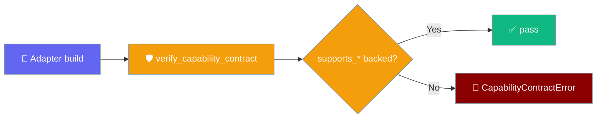
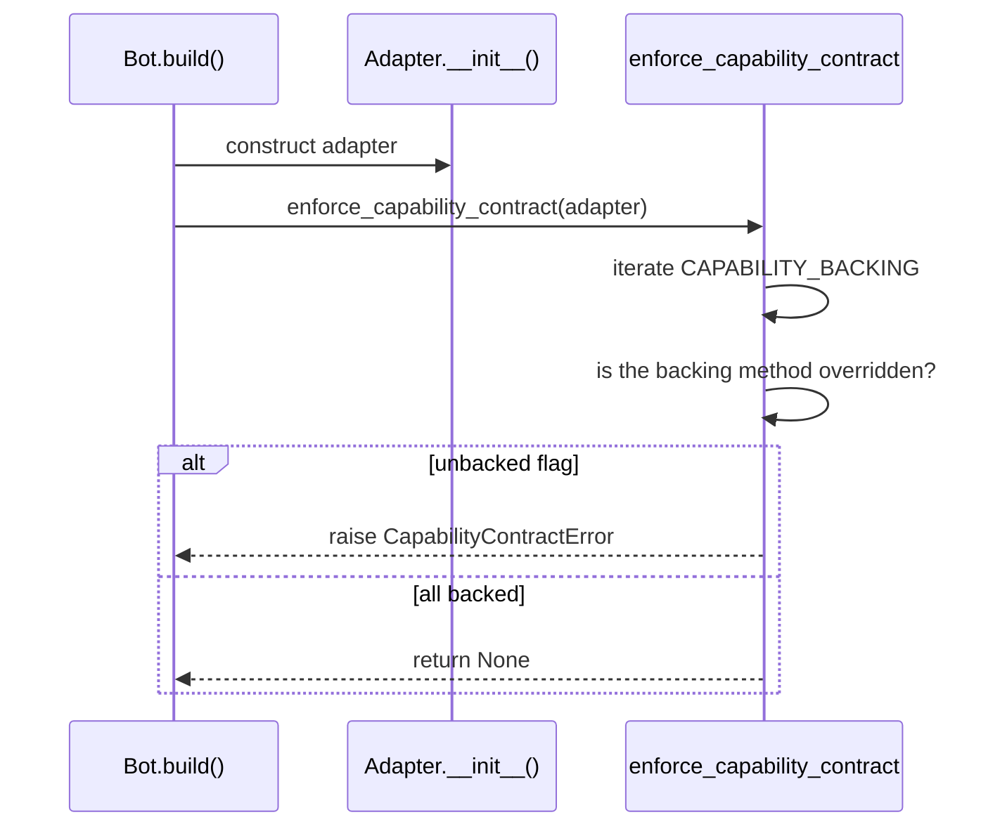

A declared `supports_*` capability is verified once, at adapter build time — an unbacked flag fails loudly before any turn instead of raising mid-conversation.



An agent runs behind a `Bot`; when you build that bot with a custom adapter, the contract catches a broken declaration before the first message.

```python
from praisonaiagents import Agent, BasePlatformAdapter, SendResult
from praisonaiagents.bots import PlatformCapabilities

agent = Agent(name="assistant", instructions="Be helpful")


class MyBot(BasePlatformAdapter):
    capabilities = PlatformCapabilities(supports_edit=True)  # unbacked → caught at build

    async def connect(self, *, is_reconnect: bool = False) -> bool:
        return True

    async def disconnect(self) -> None:
        ...

    async def send(self, chat_id, content, *, reply_to=None, metadata=None) -> SendResult:
        return SendResult(ok=True, chat_id=chat_id)

    async def get_chat_info(self, chat_id):
        return {"id": chat_id}


# from praisonai_bot.bots import Bot
# Bot("mybot", agent=agent)
# -> CapabilityContractError: MyBot declares supports_edit=True but does not
#    override edit_message with a callable implementation
```

## Quick Start

<Steps>
<Step title="Declare what you support truthfully">

Set `supports_edit=True` **and** override `edit_message` — the adapter passes verification.

```python
from praisonaiagents import BasePlatformAdapter, SendResult
from praisonaiagents.bots import PlatformCapabilities, verify_capability_contract


class MyBot(BasePlatformAdapter):
    capabilities = PlatformCapabilities(supports_edit=True)

    async def connect(self, *, is_reconnect: bool = False) -> bool:
        return True

    async def disconnect(self) -> None:
        ...

    async def send(self, chat_id, content, *, reply_to=None, metadata=None) -> SendResult:
        return SendResult(ok=True, chat_id=chat_id)

    async def get_chat_info(self, chat_id):
        return {"id": chat_id}

    async def edit_message(self, chat_id, message_id, content) -> SendResult:
        await acme_api.edit(chat_id, message_id, content)
        return SendResult(ok=True, message_id=message_id, chat_id=chat_id)


print(verify_capability_contract(MyBot()))  # []  — contract holds
```

</Step>

<Step title="The verifier catches a broken promise">

Remove the override and the same declaration fails at build time — not mid-turn.

```python
from praisonaiagents import BasePlatformAdapter, SendResult
from praisonaiagents.bots import PlatformCapabilities, enforce_capability_contract


class MyBot(BasePlatformAdapter):
    capabilities = PlatformCapabilities(supports_edit=True)  # no edit_message override

    async def connect(self, *, is_reconnect: bool = False) -> bool:
        return True

    async def disconnect(self) -> None:
        ...

    async def send(self, chat_id, content, *, reply_to=None, metadata=None) -> SendResult:
        return SendResult(ok=True, chat_id=chat_id)

    async def get_chat_info(self, chat_id):
        return {"id": chat_id}


enforce_capability_contract(MyBot())
# -> CapabilityContractError: MyBot declares supports_edit=True but does not
#    override edit_message with a callable implementation
```

</Step>
</Steps>

---

## How It Works

The check iterates `CAPABILITY_BACKING` and asks, per declared flag, whether the backing method is overridden.



| Capability flag | Backing method | Behaviour when declared but unbacked |
|---|---|---|
| `supports_edit` | `edit_message` | `CapabilityContractError` at build; `NotImplementedError` if the check is skipped and the method is called |
| `supports_delete` | `delete_message` | Same |

---

## The two check entry points

Two functions read the same contract; one reports, one raises.

`verify_capability_contract(adapter) -> list[str]` returns a list of human-readable violation strings — empty when the contract holds — and **never raises**. Use it to log a warning without failing startup.

```python
from praisonaiagents.bots import verify_capability_contract

for violation in verify_capability_contract(adapter):
    logger.warning(violation)
```

`enforce_capability_contract(adapter) -> None` raises a single `CapabilityContractError` naming every violation (joined by `"; "`), or does nothing. It is called automatically by `Bot._build_adapter` and by the gateway's `_build_channel_adapter`.

```python
from praisonaiagents.bots import enforce_capability_contract

enforce_capability_contract(adapter)  # raises on any violation
```

---

## Where the check runs automatically

Both build paths enforce the contract for you — there is no flag or environment variable to opt in.

When you build a `Bot(...)` with a wrapper adapter (`praisonai-bot`), the contract is verified right after adapter construction, guarded by a lazy import so an older core release simply skips the check. On the gateway construction path (`gateway/server.py::_build_channel_adapter`), a violation is caught the same way and the channel is recorded as **degraded** — visible in gateway status — rather than surfacing later inside a live turn.

---

## Backward compatibility

Built-in adapters already honour the contract, so nothing needs to change.

All built-in adapters that declare `supports_edit=True` (Slack, Telegram, Discord) already override `edit_message`. No built-in adapter declares `supports_delete=True`, so no built-in adapter trips the contract. Capabilities left `False` continue to degrade cleanly, unchanged.

<Note>
`_resolve_capabilities` prefers the typed `platform_capabilities` property; a legacy dict-shaped `capabilities` attribute is ignored so it is never misread as the transport descriptor. This is what makes wrapper bots like Slack / Telegram / Discord verify correctly.
</Note>

---

## Adding a new capability flag

Extend the contract by pairing a new flag with a base method that has a default.

<Steps>
<Step title="Add the supports_* field">
Add the field to `PlatformCapabilities` (dataclass plus `to_dict` / `from_dict`).
</Step>
<Step title="Pick a backing method">
Choose a method the base class provides a *default* for.
</Step>
<Step title="Add the pair to CAPABILITY_BACKING">
Register `"supports_new": "new_method"` in the fail-closed map.
</Step>
<Step title="Gate the base default (optional)">
If the base default should raise on a declared-but-unbacked call (parity with `edit_message`), gate the default on the flag and raise `NotImplementedError` otherwise.
</Step>
</Steps>

---

## Best Practices

<AccordionGroup>
<Accordion title="Declare only what your platform actually does">
A lie in `PlatformCapabilities` is now caught immediately at build time. Declare `supports_edit` or `supports_delete` only when a real implementation backs them.
</Accordion>

<Accordion title="Prefer enforce_ in production, verify_ in dev tooling">
`enforce_capability_contract` fails startup loudly. `verify_capability_contract` returns violations without raising, so dev tooling can log a warning and keep going.
</Accordion>

<Accordion title="New flag → new backing method entry">
Every entry in `CAPABILITY_BACKING` is a fail-closed guard. Adding a flag with its backing method keeps future regressions from advertising an unimplemented capability.
</Accordion>
</AccordionGroup>

---

## Related

<CardGroup cols={2}>
<Card title="Bot Platform Capabilities" icon="sliders" href="/features/bot-platform-capabilities">
  The `PlatformCapabilities` descriptor whose flags this contract verifies.
</Card>
<Card title="Bot Platform Adapter" icon="puzzle-piece" href="/features/bot-platform-adapter">
  Build a channel — declare capabilities and back them honestly.
</Card>
<Card title="Bot Platform Plugins" icon="puzzle-piece" href="/features/bot-platform-plugins">
  Runtime registration and discovery of platform adapters.
</Card>
<Card title="Custom Gateway Channel (Zero-Code)" icon="plug" href="/features/gateway-custom-channel">
  The gateway construction path that records a violation as a degraded channel.
</Card>
</CardGroup>
