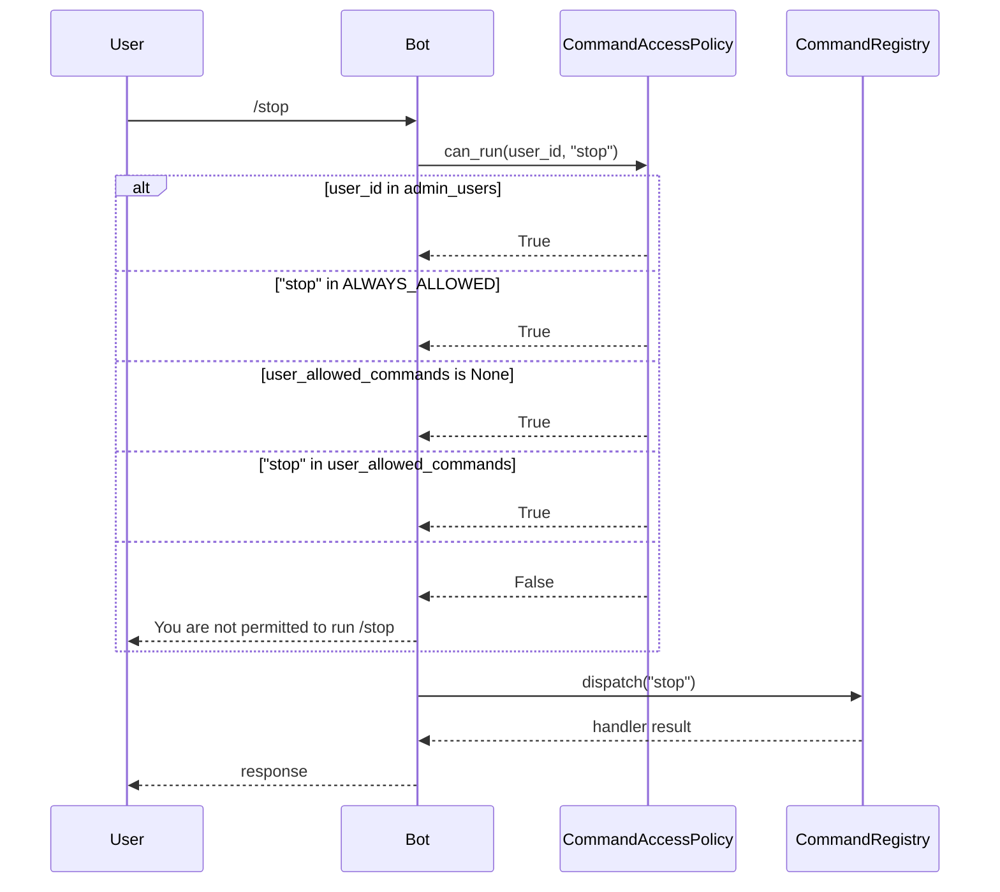
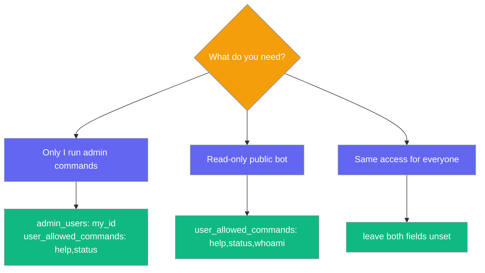

Per-command access control layers on top of user allowlists — admins run any command, regular users only run commands you explicitly permit.

```mermaid
graph LR
    subgraph "Command Access Control"
        User[User] --> Cmd[/command]
        Cmd --> Policy{Policy Check}
        Policy -->|Admin| Run[Run]
        Policy -->|Allowed| Run
        Policy -->|Denied| Block[Denied]
    end

    classDef input fill:#6366F1,stroke:#7C90A0,color:#fff
    classDef process fill:#F59E0B,stroke:#7C90A0,color:#fff
    classDef allow fill:#10B981,stroke:#7C90A0,color:#fff
    classDef deny fill:#8B0000,stroke:#7C90A0,color:#fff

    class User,Cmd input
    class Policy process
    class Run allow
    class Block deny
```

## Quick Start

<Steps>
<Step title="Restrict regular users in YAML">

```yaml
channels:
  telegram:
    token: ${TELEGRAM_BOT_TOKEN}
    allowed_users: "123,456"
    admin_users: "123"
    user_allowed_commands: "help,status"
```

User `123` is admin (all commands). User `456` may only run `help`, `status`, and `whoami`.

</Step>

<Step title="Same setup in Python">

```python
from praisonaiagents import Agent
from praisonaiagents.bots import BotConfig
from praisonai.bots import TelegramBot

agent = Agent(name="assistant", instructions="Be helpful")
bot = TelegramBot(
    token="YOUR_TOKEN",
    agent=agent,
    config=BotConfig(
        allowed_users="123,456",
        admin_users="123",
        user_allowed_commands="help,status",
    ),
)
```

</Step>

<Step title="User checks permissions with /whoami">

```
/whoami

User Information
User ID: 456
Username: alice
Role: User
Allowed commands: help, status, whoami
```

</Step>
</Steps>

## How It Works



## Built-in Commands

| Command | Description | Always allowed? |
|---------|-------------|-----------------|
| `/help` | Show help (filtered to caller's permissions) | Yes |
| `/whoami` | User ID, username, role, allowed commands | Yes |
| `/status` | Agent name, model, platform, uptime | No |
| `/new` | Reset the conversation session | No |
| `/stop` | Cancel the current agent task | No |

`ALWAYS_ALLOWED = {"help", "whoami"}` — these cannot be locked away from any user.

## Configuration

| Option | Type | Default | Description |
|--------|------|---------|-------------|
| `admin_users` | `str` | `None` | Comma-separated user IDs who can run any command |
| `user_allowed_commands` | `str` | `None` | Comma-separated commands regular users may run. `None` = no restrictions |

When both are unset, behaviour matches pre-PR #2029 (fully open for allowed users).

## Choosing a Setup



## Best Practices

<AccordionGroup>
<Accordion title="Pair with allowed_users">
Per-command access layers on top of user allowlists — it does not replace them.
</Accordion>

<Accordion title="Reserve /new and /stop for admins in production">
Both have side effects: resetting state and cancelling tasks.
</Accordion>

<Accordion title="Use /whoami when debugging permissions">
Shows the exact allow list resolved for the caller.
</Accordion>

<Accordion title="Add custom commands to user_allowed_commands">
Register with `bot.register_command("ping", handler)` then include `"ping"` in the allowlist for non-admins.
</Accordion>
</AccordionGroup>

## Related

<CardGroup cols={2}>
  <Card title="Bot Chat Commands" icon="terminal" href="/docs/features/bot-commands">
    Built-in and custom commands
  </Card>
  <Card title="Bot Security" icon="shield" href="/docs/best-practices/bot-security">
    DM policy and safe defaults
  </Card>
</CardGroup>
