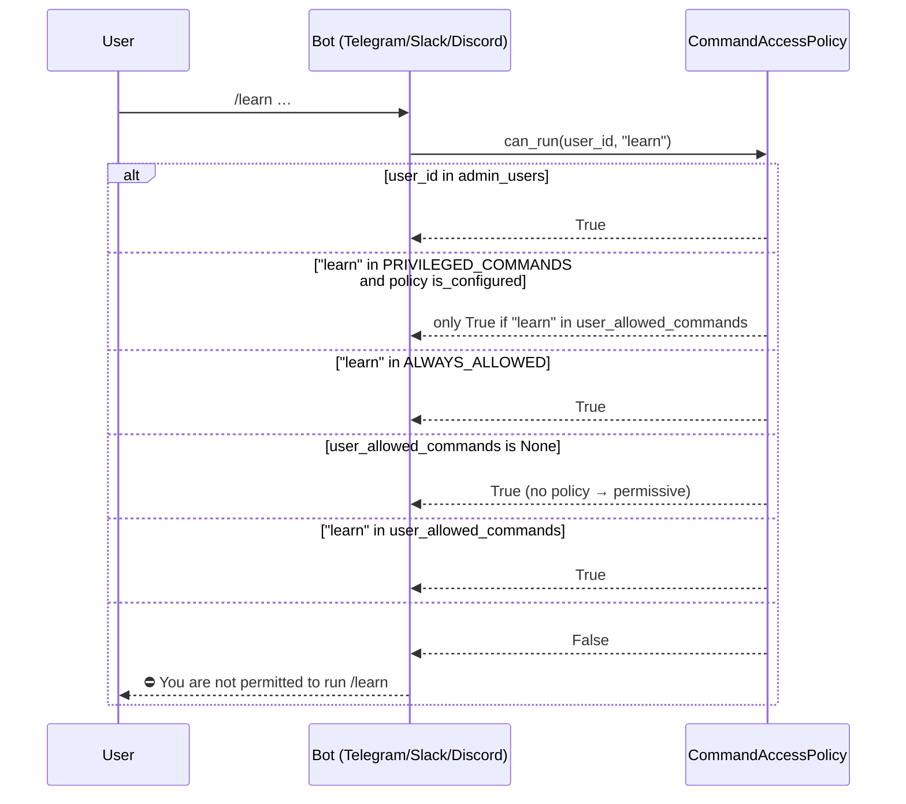
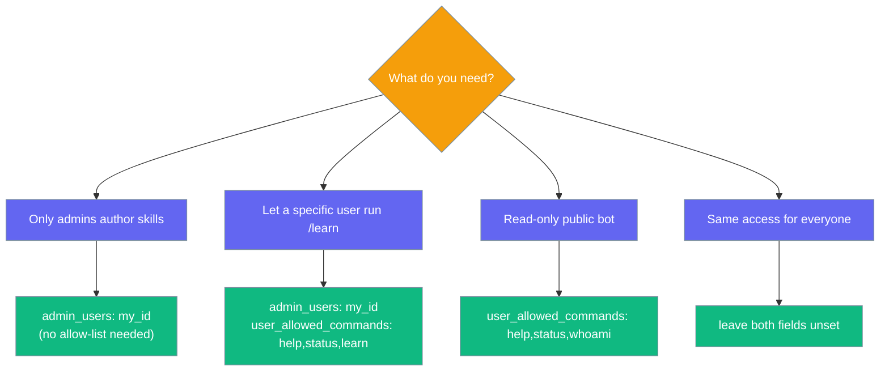

```python
from praisonaiagents import Agent, BotConfig

agent = Agent(name="assistant", instructions="You are a helpful assistant.")
config = BotConfig(admin_users="123456789", user_allowed_commands={})
agent.start("Restrict /learn to admins only")
```

The user sends a restricted slash command; admins pass the policy check while other users only run commands on their allowlist.

Per-command access control layers on top of user allowlists — admins run any command, regular users only run commands you explicitly permit. `CommandAccessPolicy` applies uniformly to **Telegram, Slack, and Discord** bots via the shared `CommandRegistry`.

```mermaid
graph LR
    subgraph "Command Access Control"
        T[Telegram]
        S[Slack]
        D[Discord]
        T --> Cmd[/command]
        S --> Cmd
        D --> Cmd
        Cmd --> Policy{Policy Check}
        Policy -->|Admin| Run[Run]
        Policy -->|Allowed| Run
        Policy -->|Denied| Block[⛔ Denied]
    end

    classDef agent fill:#8B0000,color:#fff
    classDef tool fill:#189AB4,color:#fff

    class Run agent
    class T,S,D,Cmd,Policy,Block tool
```

## Privileged Commands

**Privileged commands** (`/learn` today) are admin-only by default whenever any policy is configured. They stay open when neither `admin_users` nor `user_allowed_commands` is set, so existing deployments are unaffected. To grant a regular user a privileged command, add it explicitly to `user_allowed_commands`.

The conversation-control commands (`/undo`, `/sessions`, `/resume`, `/retry`, `/reasoning`) are **not** privileged — they follow the same rules as `/stop`, `/model`, and `/usage`. Regular users can run them whenever the policy allows non-privileged commands.

| Group | What's allowed by default when a policy is configured |
|---|---|
| **Admins** (`admin_users`) | Every command, always. |
| **Regular users** with no `user_allowed_commands` | Everything **except** privileged commands. |
| **Regular users** with `user_allowed_commands` set | Only commands on the allow-list (plus `ALWAYS_ALLOWED`). |
| **Anyone** when no policy is configured | Every command (legacy permissive default). |

## Quick Start

<Steps>
<Step title="Set admin_users in YAML">

```yaml
channels:
  telegram:
    token: ${TELEGRAM_BOT_TOKEN}
    admin_users: "123"
  slack:
    bot_token: ${SLACK_BOT_TOKEN}
    app_token: ${SLACK_APP_TOKEN}
    admin_users: "U01ABCDEF"
  discord:
    token: ${DISCORD_BOT_TOKEN}
    admin_users: "555000000000000000"
```

Once `admin_users` is set, `/learn` is admin-only on every channel. No allow-list needed for the privileged guard to activate.

</Step>

<Step title="Or configure in Python">

<Tabs>
  <Tab title="Telegram">
    ```python
    from praisonaiagents import Agent
    from praisonaiagents.bots import BotConfig
    from praisonai.bots import TelegramBot

    bot = TelegramBot(
        token="YOUR_TOKEN",
        agent=Agent(name="assistant"),
        config=BotConfig(admin_users="123"),
    )
    ```
  </Tab>
  <Tab title="Slack">
    ```python
    from praisonaiagents import Agent
    from praisonaiagents.bots import BotConfig
    from praisonai.bots import SlackBot

    bot = SlackBot(
        agent=Agent(name="assistant"),
        config=BotConfig(admin_users="U01ABCDEF"),
    )
    ```
  </Tab>
  <Tab title="Discord">
    ```python
    from praisonaiagents import Agent
    from praisonaiagents.bots import BotConfig
    from praisonai.bots import DiscordBot

    bot = DiscordBot(
        agent=Agent(name="assistant"),
        config=BotConfig(admin_users="555000000000000000"),
    )
    ```
  </Tab>
</Tabs>

</Step>

<Step title="Grant /learn to a specific regular user">

```yaml
admin_users: "123"
user_allowed_commands: "help,status,learn"
```

User `123` is admin (everything). Regular users can also run `/learn`, `/status`, and `/help`.

</Step>
</Steps>

## How It Works



**Policy truth table** (from the SDK test suite):

| Setup | Result |
|---|---|
| No policy configured | All commands allowed for everyone (legacy permissive default). |
| `admin_users` set, no allow-list | Admins run anything; regular users run everything **except** `PRIVILEGED_COMMANDS`. |
| `user_allowed_commands={"learn","status"}` | Regular users can run `/learn` and `/status`; `ALWAYS_ALLOWED` also apply. |
| `user_allowed_commands={"status"}` (no `learn`) | `/learn` is denied for regular users; admins still bypass. |
| `admin_users` **and** `user_allowed_commands={"learn","status"}` | Admins run anything; regular users run only what's on the explicit allow-list. |
| `user_allowed_commands=""` (empty string) | Deliberate "allow nothing extra" — regular users can only run `ALWAYS_ALLOWED`. |

## Built-in Commands

| Command | Description | Always allowed? | Privileged? |
|---------|-------------|-----------------|-------------|
| `/help` | Show help (filtered to caller's permissions) | Yes | No |
| `/whoami` | User ID, username, role, allowed commands | Yes | No |
| `/status` | Agent name, model, platform, uptime | No | No |
| `/new` | Reset the conversation session | No | No |
| `/stop` | Cancel the current agent task | No | No |
| `/model` | Switch LLM for this conversation | No | No |
| `/usage` | Show token usage and cost | No | No |
| `/compress` | Compress conversation history | No | No |
| `/queue` | Queue a follow-up message | No | No |
| `/learn` | Author a grounded SKILL.md from sources | No | **Yes** — admin-only by default once a policy is configured |

`ALWAYS_ALLOWED = {"help", "whoami"}` — these cannot be locked away from any user.

`PRIVILEGED_COMMANDS = {"learn"}` — admin-only whenever a policy is configured (`admin_users` or `user_allowed_commands` set). Available to all users when no policy is configured (backward-compatible).

## Configuration

| Option | Type | Default | Description |
|--------|------|---------|-------------|
| `admin_users` | `str` | `None` | Comma-separated user IDs who can run any command. Setting this **activates** the privileged-command guard. |
| `user_allowed_commands` | `str` | `None` | Comma-separated commands regular users may run. `None` = no allow-list (regular users get everything except privileged commands when a policy is active). Empty string `""` is a deliberate "allow nothing extra" — `ALWAYS_ALLOWED` still apply. |

A policy is "configured" if either `admin_users` is non-empty **or** `user_allowed_commands` is not `None` (even if empty). Once configured, the privileged-command guard is active.

## Choosing a Setup



## Best Practices

<AccordionGroup>
<Accordion title="admin_users alone is enough to lock down /learn">
You don't need `user_allowed_commands` to restrict `/learn`. Setting `admin_users` alone is enough — regular users lose `/learn` automatically. Add `learn` to `user_allowed_commands` only if you want a specific non-admin to keep access.
</Accordion>

<Accordion title="Pair with allowed_users">
Per-command access layers on top of user allowlists — it does not replace them.
</Accordion>

<Accordion title="Reserve /new and /stop for admins in production">
Both have side effects: resetting state and cancelling tasks.
</Accordion>

<Accordion title="Use /whoami when debugging permissions">
Shows the exact allow list resolved for the caller, including which commands are blocked.
</Accordion>

<Accordion title="Add custom commands to user_allowed_commands">
Register with `bot.register_command("ping", handler)` then include `"ping"` in the allowlist for non-admins.
</Accordion>
</AccordionGroup>

## Related

<CardGroup cols={2}>
  <Card title="Bot Chat Commands" icon="terminal" href="/docs/features/bot-commands">
    Built-in and custom commands
  </Card>
  <Card title="Bot Security" icon="shield" href="/docs/best-practices/bot-security">
    DM policy and safe defaults
  </Card>
  <Card title="Learn Skill" icon="graduation-cap" href="/docs/features/learn-skill">
    The privileged /learn command — authors a grounded SKILL.md from sources
  </Card>
</CardGroup>
